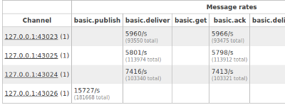

For a long time the management and monitoring capabilities built into RabbitMQ have consisted of rabbitmqctl. While it's a reasonable tool for management (assuming you like the command line), rabbitmqctl has never been very powerful as a monitoring tool. So we're going to build something better.

<!-- truncate -->

Of course, plenty of people don't like command line tools and so several people have built alternate means of managing RabbitMQ. [Alice / Wonderland](http://willcodeforfoo.com/2009/07/13/announcing-alice/) and [Spring AMQP](http://www.springsource.org/spring-amqp) are two that leap to mind. However there isn't much standardisation, and people don't always find it very convenient to talk to Rabbit via epmd. So we're going to build something easier.

With that in mind, I'd like to announce the existence of [RabbitMQ Management](http://hg.rabbitmq.com/rabbitmq-management/). This is a plugin to provide management and monitoring via a RESTful interface, with a web GUI. Think of it as being like a super-Alice, and also an integration point for any other tools that people want to build.

So RabbitMQ Management will allow easier management and better monitoring. How better? Well, as part of the upcoming rabbit release we've added a statistics gathering feature to the broker. This can count messages as they're published, routed, delivered and acked, on a per channel / queue / exchange basis, so we can determine things like which channels are publishing fast or consuming slowly, which queues are being published to from which exchanges, which connections and hosts are busiest, and so on.

Of course, doing all this extra bookkeeping comes at a cost; when statistics gathering is turned on the server can run around 10% slower (assuming it's CPU-bound; which usually means handling transient messages. If it's IO bound the performance impact will likely be less). At the moment statistics gathering is turned on automatically when the management plugin is installed but we'll make it configurable.

With that, I'd like to add a warning: it's currently at a **very** early stage of development, and really should not be trusted for anything other than experimentation and playing with. The REST API will change, the UI will change, the plugin might crash your server, and the [TODO](http://hg.rabbitmq.com/rabbitmq-management/file/250292c41ff7/TODO) is currently almost hilariously long. But hopefully this gives you an idea of what we're going to do.
