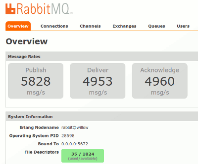
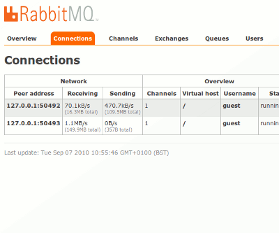
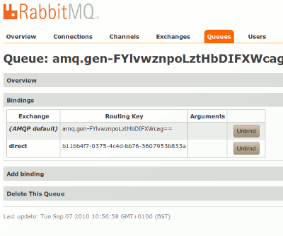

The [previously mentioned](/blog/2010/08/06/management-monitoring-and-statistics) management plugin is now in a state where it's worth looking at and testing. In order to make this easy, I've made a special once-only binary release just for the management plugin (in future we'll make binary releases of it just like the other plugins). Download all the .ez files from [here](https://www.rabbitmq.com/releases/plugins/v2.0.0-management-preview/) and install them as described [here](/docs/plugins), then let us know what you think. (Update 2010-09-22: Note that the plugins referenced in this blog post are for version 2.0.0 of RabbitMQ. We've now released 2.1.0 - for this and subsequent versions you can get the management plugin from [here](/docs/plugins)).

<!-- truncate -->

After installation, point your browser at http://*server-name*:55672/mgmt/. You will need to authenticate as a RabbitMQ user (on a fresh installation the user "guest" is created with password "guest"). From here you can manage exchanges, queues, bindings, virtual hosts, users and permissions. Hopefully the UI is fairly self-explanatory.

The management UI is implemented as a single static HTML page which makes background queries to the HTTP API. As such it makes heavy use of Javascript. It has been tested with recent versions of Firefox, Chromium and Safari, and with versions of Microsoft Internet Explorer back to 6.0. Lynx users should use the HTTP API directly :smiley:

The management plugin will create an HTTP-based API at http://*server-name*:55672/api/. Browse to that location for more information on the API. For convenience the documentation can also be obtained [from our Mercurial server](http://hg.rabbitmq.com/rabbitmq-management/raw-file/3646dee55e02/priv/www-api/help.html).

**WARNING:** *The management plugin is still at an early stage of development*. You should be aware of the following limitations:

* Permissions are only enforced sporadically. If a user can authenticate with the HTTP API, they can do anything.
* Installing the management plugin will turn on fine-grained statistics in the server. This can slow a CPU-bound server by 5-10%.
* All sorts of other features may be missing or buggy. See the [TODO](http://hg.rabbitmq.com/rabbitmq-management/file/3646dee55e02/TODO) file for more information.

Note: if you want to build the plugin yourself, you should be aware that right now the Erlang client does not work in the default branch, so you need a mix of versions. The following commands should work:

```shell
hg clone http://hg.rabbitmq.com/rabbitmq-public-umbrella
cd rabbitmq-public-umbrella
make checkout
hg update -r rabbitmq_v2_0_0 -R rabbitmq-server
hg update -r rabbitmq_v2_0_0 -R rabbitmq-codegen
hg update -r rabbitmq_v2_0_0 -R rabbitmq-erlang-client
hg clone http://hg.rabbitmq.com/rabbitmq-management
make
cd rabbitmq-management
make
```

Of course this will be fixed soon.
(Ignore the above, this is fixed.)

Finally, this post would not be complete without some screenshots...






