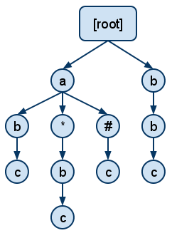
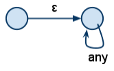
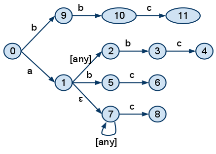

Among other things, lately we have been preoccupied with improving RabbitMQ's routing performance. In particular we have looked into speeding up topic exchanges by using a few well-known algorithms as well as some other tricks. We were able to reach solutions many times faster than our current implementation.

<!-- truncate -->

First, a little about the problem we are trying to solve. Here is a quote from the AMQP 0-9-1 spec:

The topic exchange type works as follows:

1. A message queue binds to the exchange using a routing pattern, P.
1. A publisher sends the exchange a message with the routing key R.
1. The message is passed to the message queue if R matches P.

*The routing key used for a topic exchange MUST consist of zero or more words delimited by dots. Each word may contain the letters A-Z and a-z and digits 0-9.*

*The routing pattern follows the same rules as the routing key with the addition that * matches a single word, and # matches zero or more words. Thus the routing pattern *.stock.# matches the routing keys usd.stock and eur.stock.db but not stock.nasdaq.*
Our goal is to match messages (routing keys) against bindings (patterns) in a fast and scalable manner.

Here is a list of approaches that we tried out:

1. **Caching messages' topics on a per-word basis**. This is what the AMQP spec suggests and there are some studies on this already.
2. **Indexing patterns on a per-word basis**. This is similar with 1, except we prepare the patterns beforehand, rather than preparing for topic keys that have been previously sent.
3. **Trie implementation**. Arrange the words in the patterns in a trie structure and follow a route down the trie to see if a particular topic matches.
4. **A deterministic finite automate (DFA) implementation**. This is a well-known approach for string matching, in general.

Each of these approaches have pros and cons. We generally aimed for:

* good complexity in both space and time, to make it scalable
* ease of implementation
* good performance for the commonly used situations
* good worst-case performance
* making it quick in the simple cases (where scalability in number of bindings is not a concern)

From the start, we were able to beat the current implementation by a factor of 3 times (in all cases) just by being more careful when splitting the keys into words (not repeating splitting both the pattern and the topic for each pattern, every time).

We found approaches 1 and 2 to be particularly unfit for the needs. They were the slowest, they do not have a good complexity, because they involve intersecting sets for each level, and they can not be adapted to include functionality for "#". Thus, we concentrated our attention on approaches 3 and 4.

**The trie**

Here is an example of a trie structure, if we were to add patterns "a.b.c", "a.*.b.c", "a.#.c", "b.b.c":

In order to match a pattern (say for example "a.d.d.d.c"), we start at root and follow the topic string down the tree word by word. We can go deeper either through an exact match, a "*" or a "#". In the case of the "#" we can go deeper with all the versions of the tail of the topic. For our example, we would go through "#" with "d.d.d.c", "d.d.c", "d.c", "c" and "".

The trie implementation has a number of advantages: good size complexity; adding a new binding is cheap; and it is the easiest to implement; but, also the disadvantage that it backtracks for "*" and "#", in order to find all possible matches.

**The DFA**

This approach is based on constructing an NFA that accepts the patterns of the bindings, and from it constructing the equivalent DFA and using it instead. Since we are also interested in which pattern matches and not only if it matches or not, we cannot merge the tails of the patterns in the NFA.

To construct the DFA, we modeled the behaviour of "#" like this:

For example, the patterns "a.b.c", "a.*.b.c", "a.#.c", "b.b.c" would be represented in an NFA like this:

The nodes 11, 4, 6 and 8 would have information attached to them which would point to the respective bindings.

In order to convert the NFA to a DFA, we tried various approaches and went as far as generating source code for the structures behind the graphs, to make it as fast as possible. The best solution we ended up with was building the DFA on the fly, the same way it is built in good regular expressions compilers (see for example [this article](http://swtch.com/~rsc/regexp/regexp3.html)).

The advantage of the DFA approach is that there is no need to backtrack, once the DFA has been built. On the other hand, there are quite a number of disadvantages: it occupies significantly more memory than the trie; there is a significant cost for adding new bindings, since the entire DFA has to be dropped and rebuilt; and it is more complex and therefore harder to implement and maintain.

In the following articles we will present more details about the two structures, how they performed in benchmarks, their space and time complexities and the details behind the DFA optimizations that we have tried.

To be continued.
