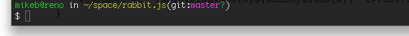

I am setting up my old MacBook, reclaimed from my housemate, to be usable for the programmings.

<!-- truncate -->

The first step was to [install homebrew](http://github.com/mxcl/homebrew/wiki/installation). I'm finding it a bit friendlier than macports, which seems to be irretrievably broken on the other MacBook.

After a few more steps (git, mercurial, node, rabbitmq of course), I found myself missing my pretty [hg-prompt](http://stevelosh.com/projects/hg-prompt/) bash prompt. But I'm working with git much more these days, so I wondered if there was something that could do both.

There is: vcprompt, and what do you know it's in homebrew.

```shell
$ brew install vcprompt
```

To get the pretty prompt, I more or less transcribed what I had from hg-prompt.  In `.bashrc`:

```shell
D=$'\e[37;40m'
PINK=$'\e[35;40m'
GREEN=$'\e[32;40m'
ORANGE=$'\e[33;40m'

vc_ps1() {
    vcprompt -f "(%n:${PINK}%b${D}${GREEN}%u%m${D})" 2>/dev/null
}

export PS1='${GREEN}\u@\h${D} in ${ORANGE}\w${D}$(vc_ps1)\n$ '
```

By the way, if like me you forget which of `.bashrc` and `.bash_profile` is for what, this post explains it[http://www.joshstaiger.org/archives/2005/07/bash_profile_vs.html].

If you want to get fancy, there's a guide to customising the bash prompt on the [Arch Linux wiki](http://wiki.archlinux.org/index.php/Color_Bash_Prompt).
