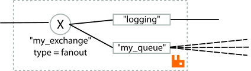
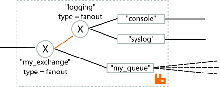
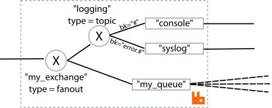
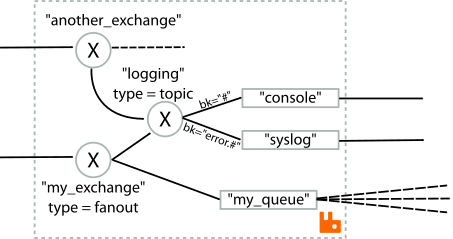
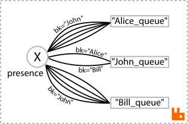
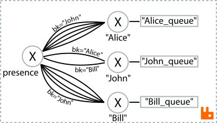

Arriving in RabbitMQ 2.1.1, is support for bindings between exchanges. This is an extension of the AMQP specification and making use of this feature will (currently) result in your application only functioning with RabbitMQ, and not the myriad of other AMQP 0-9-1 broker implementations out there. However, this extension brings a massive increase to the expressivity and flexibility of routing topologies, and solves some scalability issues at the same time.

Normal bindings allow exchanges to be bound to queues: messages published to an exchange will, provided the various criteria  of the exchange and its bindings are met, pass through the various bindings and be appended to the queue at the end of each binding. That's fine for a lot of use cases, but there's very little flexibility there: it's always just one hop -- the message being published to one exchange, with one set of bindings, and consequently one possible set of destinations. If you need something more flexible then you'd have to resort to publishing the same message multiple times. With exchange-to-exchange bindings, a message published once, can flow through any number of exchanges, with different types, and vastly more sophisticated routing topologies than previously possible.

<!-- truncate -->

## Example: Logging

Imagine a generic logging scenario: you want to "tap" into various parts of your message flows within RabbitMQ to check on the stream of messages that is flowing through that particular exchange. You can't do this to a queue, so the most obvious solution is to add a fresh queue which is going to be your logging queue, and to bind it to the exchange you're interested in. Now depending on the type of exchange and your binding key, you may receive none, some or all of the messages going through that exchange. This could be represented by the following diagram:

However, what about if you have multiple logging queues -- you might have one for syslog, one for the console, one for some third party management software. It would be much simpler to be able to treat all of these as single entity: thus requiring the addition of one binding, as above, to wire all of these to the same source exchange. With exchange-to-exchange bindings, you can now do this:

Now, we have our existing logging exchange with a couple of queues receiving all messages from it, and we just need to add one new binding (the one in *RabbitMQ-orange*) between the exchange we're interested in, and our logging exchange. Whilst both exchanges here are fanout, there's no need for this to be the case: we might have different logging queues which are interested in only subsets of the messages that are flowing through the logging exchange. So that exchange could well be a topic exchange:

So now we have that *syslog* is only going to receive errors (i.e. messages with a routing key prefixed by `error.`), whilst the *console* receives all messages. But in both cases, this behaviour applies regardless of the source of the messages: the logging exchange can be bound to zero, one, or many exchanges as necessary:

## Usage

The existing `queue.bind` AMQP method suggests, by its naming, that the action you're performing is to *bind a queue to an exchange*. This is slightly confusing because the messages are actually flowing from the exchange, through the binding, and to the queue. However, the easy part is that the method has a field for the `queue` name, the `exchange` name, and the binding key.

We have introduced `exchange.bind` and `exchange.unbind` AMQP methods. Sadly, because both of the end-points of such bindings are exchanges, and we can't have two fields both called `exchange`, we've had to come up with a different naming scheme. We've chosen here to reflect the flow of messages. Thus the field `source` indicates the name of the exchange from which messages enter the binding, and the field `destination` indicates the name of the exchange to which messages are passed.

We have added support for exchange-to-exchange bindings in our Java, .Net and Erlang clients. We hope other community-contributed clients will add support soon.

The binding created by `exchange.bind` is semantically identical to `queue.bind` bindings: unidirectional, binding keys and exchange types operate as normal, but both endpoints (the source and destination) of the binding are exchanges.

Just like with `queue.bind`, multiple distinct bindings can be created between the same binding-endpoints. We detect and eliminate cycles during message delivery, and ensure that transitively, over any routing topology, for every queue to which a given message is routed, each queue will receive exactly one copy of that message. Exchanges which are declared as `auto-delete` will still be removed when all the bindings for which that exchange is the source are removed, regardless of whether the destination of those bindings are to queues or exchanges. Note that an auto-delete exchange will only be deleted when all bindings for which the exchange is the *source* are removed: if you add exchange-to-exchange bindings for which the given exchange is the *destination* then that exchange will not be auto-deleted on removal of those bindings. This mirrors the fact that an `auto-delete` queue is not deleted when bindings to that queue are removed.

## Example 2: Presence

Imagine a chat system. Every user is going to have a queue, which holds all of the messages sent to that user. That queue also should be sent presence notifications: the events that indicate whether the person's friend is coming online or going offline.

Our imaginary person is called John. When John comes online, he's going to publish a message to the exchange `presence` saying that he's online and available for chat. The `presence` exchange will thus be a `direct` exchange, and John will publish his presence to that exchange with a `routing key` of "John". Thus all of John's friends need to be subscribed to the `presence` exchange (i.e. they need to have a binding to their own queue from that exchange), with a binding key of "John". When logging in, John himself needs to bind his queue to the `presence` exchange, with one binding per friend: each binding carrying a different `binding key` (e.g. a binding with key of `Alice`, `Bill` etc). The overall system (just for presence) might look a bit like this:

Here we see John is friends with Alice and Bill (thus he binds to his queue from the presence exchange with routing keys of `Alice` and `Bill`). Alice and Bill are not friends with each other, but each of them have several other friends, each including John.

Thus when each person comes online, they must create their queue, and they must create bindings to that queue for each of their friends. In a large chat system, the average number of friends might be about 20, and there may be hundreds if not thousands of people coming online or going offline every minute. At this point, the churn rate in the bindings may become a severe performance bottleneck. With exchange-to-exchange bindings, this problem can be solved. The trick is to allow the friendship relations to be expressed solely by exchange-to-exchange bindings, which can be left in place even when users go offline. When the user comes online, they then need only to create their queue and a single binding:

As usual, messages that are routed to exchanges with no bindings just vanish, so there is no buffering going on if John is offline, so `John_queue` doesn't exist: the exchange `John` discards all the messages sent to it in this case. Thus as a result, the exchange-to-exchange binding mesh only needs modifying when people add friends or remove friends, and the loading induced by friends coming online or going offline is vastly reduced.

And this is merely the start: *far* more complex routing topologies are now possible with exchange-to-exchange bindings...
