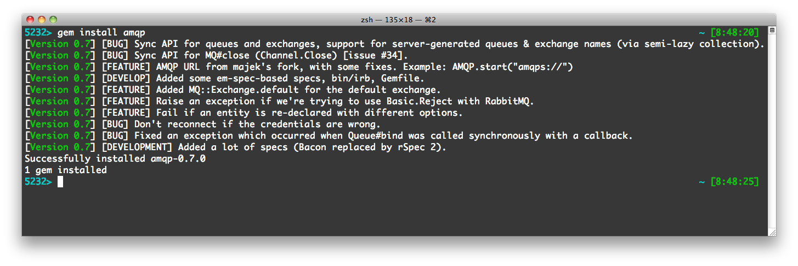

I'm happy to announce that the AMQP 0.7 is released, as I promised in the [previous blog post](/blog/2011/01/12/ruby-amqp-gem-intro). So what are the changes?

<!-- truncate -->



*When you install the AMQP gem, you'll see changes of the current version. (How did I do that? With [changelog gem](http://github.com/botanicus/changelog) and a bit of [gemspec magic](https://github.com/ruby-amqp/amqp/blob/master/amqp.gemspec#L29).)*

## Callback for MQ#queue

Synchronous API for `Queue.Declare`/`Queue.Declare-Ok` request/response was exposed via asynchronous callback:

```ruby
channel = MQ.new
fanout  = channel.fanout(:task_fanout)
channel.queue(:tasks) do |queue, message_count, consumer_count|
  puts "Queue #{queue.name} declared!"
  puts "Message count: #{message_count}"
  puts "Consumer count: #{consumer_count}"
end
```

## Auto-named queues &amp; not rewritting of anonymous entities in MQ#queues and MQ#exchanges

If a queue is declared with an empty name, the broker is supposed to generate random name. In previous versions of the Ruby AMQP this wasn't supported, because the synchronous API (waiting for `Queue.Declare-Ok` was missing). Not anymore:

```ruby
channel = MQ.new
channel.queue("") do |queue|
  puts "Queue with name #{queue.name} declared!"
end

# OUTPUT: Queue with name amq.gen-PfCGdyBA4Sr4rkZg3IN3Kw== declared!
```

The same should apply for exchanges, but this isn't supported by the current version of RabbitMQ.

Also, in the previous AMQP versions, the `MQ#queues`, `MQ#exchanges` and similar was just a hash, hence if given entity was anonymous (the name was `nil`), and if the collection already included another anonymous instance, then the one which was already in the collection was rewritten.

## Callback for MQ::Queue#bind

`MQ::Queue#bind` can take a callback, as well as `MQ#queue` now can:

```ruby
channel = MQ.new
fanout  = channel.fanout(:task_fanout)
channel.queue(:tasks).bind(fanout) do |queue|
  puts "Queue #{queue.name} was bound!"
end
```

## AMQP URL

Thanks to [majek](http://github.com/majek), author of the [Puka](http://github.com/majek/puka) AMQP client for Python, you can use URL instead of option hash as an argument for `AMQP.connect` and `AMQP.start`:

```ruby
AMQP.start("amqps:/")

# Will resolve to: {vhost: "/", port: 5671, ssl: true}

AMQP.start("amqp://botanicus@localhost:1111/")

# Will resolve to: {user: "botanicus", vhost: "/", host: "localhost", port: 1111, ssl: false}
```

## MQ::Exchange.default

The default exchange is a direct exchange with an empty name where all the queues are automatically bound (and you can't bind there anything manually). Do not confuse the default exchange with `amq.direct` which is only a predefined direct exchange without any "magic" abilities).

## Fail if an entity is re-declared with different options

Rather than wait for the server, than if possible we let this fail on the client, so the user gets more descriptive error message:

```ruby
channel = MQ.new
channel.queue(:tasks, auto_delete: true)
channel.queue(:tasks, auto_delete: false)

# Exception: There is already an instance called tasks with options

{:queue => :tasks, :nowait => true, :auto_delete => true},
you can't define the same instance with different options ({:queue => :tasks,
:nowait => true, :auto_delete => false})! (MQ::IncompatibleOptionsError)
```

## Don't reconnect if the credentials are invalid

AMQP reconnects automatically if the connection failed. It did try to reconnect even on an error like providing invalid credentials. I changed it to register the reconnect hook after the connection is actually established, so if for whatever reason the connection fails, it won't try to reconnect.

## rSpec 2 specs

This is still work in progress, you can check [the spec/ directory](https://github.com/ruby-amqp/amqp-spec). Huge thanks to [arvicco](https://github.com/arvicco/) and [michaelklishin](https://github.com/michaelklishin) for their work on this!

## Issues

We closed nearly all issues at [tmm1/amqp](https://github.com/tmm1/amqp/issues) repository. Please do not report any further bugs there, use [ruby-amqp/amqp](https://github.com/ruby-amqp/amqp/issues) instead.

## Friendlier environment for contributors

We use bundler now, so if you want to contribute or just run the tests, just clone the repo, run `bundle install` and voila, that's it! There's also `bin/irb` for easier debugging.

Speaking about them, **I'd really want to thank all the contributors**, their work really helped to get the AMQP gem where it is now. Since the beginning 22 people contributed to the project, and 5 of them have more than 5 commits. Check the [CONTRIBUTORS](https://github.com/ruby-amqp/amqp/blob/0.7.x-stable/CONTRIBUTORS) file for more details!

## Plans for AMQP 0.8

The next 0.8 release will bring some major API changes: there won't be two separate constants `MQ` and `AMQP`, but only the second one. The `MQ` class will become `AMQP::Channel`, so we will be compliant with the official AMQP terminology and we also want to introduce **support for AMQP 0.9.1** via the [AMQ-Protocol gem](https://github.com/ruby-amqp/amq-protocol).

## Links

* [RDoc API Documentation](http://rubydoc.info/github/ruby-amqp/amqp)
* [GitHub repository](http://github.com/amqp-dev/amqp)
* [GitHub issues](https://github.com/ruby-amqp/amqp/issues)
* [Ruby AMQP Google Group](http://groups.google.com/group/ruby-amqp)

Any comments, ideas? You're always welcome to drop by at Jabber MUC **amqp-dev@conf.netlab.cz**, and tell us what do you think!
