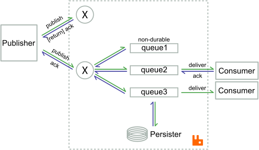

In many messaging scenarios, you must not lose messages.  Since AMQP gives few guarantees regarding message persistence/handling, the traditional way to do this is with transactions, which can be unacceptably slow.  To remedy this problem, we introduce an extension to AMQP in the form of Lightweight Publisher Confirms.

<!-- truncate -->

## Guaranteed Delivery with Tx

In RabbitMQ, a persistent message is one that *should* survive a broker restart.  The operative word here is *should*, since the message can still be lost if broker goes down before it's had a chance to write the message to disk.  In some cases, this is not enough and the publisher needs to know whether a message was handled correctly or not.  The straightforward solution is to use transactions, i.e. to commit every message.

The publisher would use something like:

```java
ch.txSelect();
for (int i = 0; i < MSG_COUNT; ++i) {
        ch.basicPublish("", QUEUE_NAME,
                            MessageProperties.PERSISTENT_BASIC,
                            "nop".getBytes());
        ch.txCommit();
}
```

And the consumer would do something like:

```java
QueueingConsumer qc = new QueueingConsumer(ch);
ch.basicConsume(QUEUE_NAME, true, qc);
for (int i = 0; i < MSG_COUNT; ++i) {
        qc.nextDelivery();
        System.out.printf("Consumed %d\n", i);
}
```

The complete program including some timing code is available [here](http://gist.github.com/613157).  It takes a bit more than 4 minutes to publish 10000 messages.

## Streaming Lightweight Publisher Confirms

There are two problems with using transactions in this case.  The first is that they are blocking: the publisher has to wait for the broker to process each message.  Knowing that all the messages with the possible exception of the last one were successfully processed is, usually, too strong a guarantee; it would be enough if the publisher knew which messages had not yet been processed when the broker died.  The second problem is that transactions are needlessly heavy: every commit requires a fsync(), which takes a lot of time to complete.

Enter Confirms: once a channel is put into confirm mode, the broker will confirm messages as it processes them.  Since this is done asynchronously, the producer can stream publishes and not wait for the broker and the broker can batch disk writes effectively.

Here is the above example, but using confirms:

```java
private volatile SortedSet<Long> unconfirmedSet =
    Collections.synchronizedSortedSet(new TreeSet());

...

ch.setConfirmListener(new ConfirmListener() {
    public void handleAck(long seqNo, boolean multiple) {
        if (multiple) {
            unconfirmedSet.headSet(seqNo+1).clear();
        } else {
            unconfirmedSet.remove(seqNo);
        }
    }
    public void handleNack(long seqNo, boolean multiple) {
        // handle the lost messages somehow
    }
});
ch.confirmSelect();
for (long i = 0; i < MSG_COUNT; ++i) {
     unconfirmedSet.add(ch.getNextPublishSeqNo());
     ch.basicPublish("", QUEUE_NAME, MessageProperties.PERSISTENT_BASIC,
                       "nop".getBytes());
 }
while (unconfirmedSet.size() > 0)
     Thread.sleep(10);
```

The full code is available [here](http://hg.rabbitmq.com/rabbitmq-java-client/file/default/test/src/com/rabbitmq/examples/ConfirmDontLoseMessages.java).  Before going on, it is worth mentioning that running this takes around 2 seconds.  It is more than 100 times faster than the transactional code.

What does the code do?  It starts by declaring a set which will hold the ids of the so-far unconfirmed messages.  Then, it sets the channel into confirm mode and attaches an AckListener to the channel.  As it publishes messages, it adds them to the set; at the same time, the AckListener removes messages from the set as it receives confirms.  Finally, the producer waits for all the messages to be confirmed.  The set always holds the messages which need to be retransmitted in case of a failure.

## How Confirms Work

Confirms extend standard AMQP by adding the confirm class.  This class contains only two methods, *confirm.select* and *confirm.select-ok*.  In addition, the *basic.ack* method can be sent to clients.

The *confirm.select* method enables publisher confirms on a channel.  Note that a transactional channel cannot be put into confirm mode and a confirm mode channel cannot be made transactional.

When the *confirm.select* method is sent/received, the publisher/broker begins numbering publishes (the first publish after the *confirm.select* is 1).  Once a channel is in confirm mode, the publisher should expect to receive *basic.ack* methods.  The *delivery-tag* field indicates the number of the confirmed message.

When the broker acknowledges a message, it assumes responsibility for it and informs the publisher that it has been handled successfully; what "handled successfully" means is context-dependent.

The basic rules are as follows:

* an un-routable mandatory or immediate message is confirmed right after the *basic.return*;
* otherwise, a transient message is confirmed the moment it is enqueued; and,
* a persistent message is confirmed when it is persisted to disk or when it is consumed on every queue.



Note that for a persistent message to be confirmed, it must be written to disk or ack'd **on all the queues** it was delivered to.  With regard to confirms, persistent messages delivered to non-durable queues behave like transient messages.  Queue deletion, queue purge and [basic.reject](/blog/2010/08/03/well-ill-let-you-go-basicreject-in-rabbitmq)&lcub;requeue=false} simulate a consumer acknowledgement.  With respect to [per-queue ttl](/docs/ttl#queue-ttl), message expiry simulates a consumer acknowledgement.

If more than one of these conditions are met, only the first causes a confirm to be sent.  Every published message will be confirmed sooner or later and no message will be confirmed more than once.   Since the *basic.return* is sent before the *basic.ack*, once a publisher receives a *basic.ack*, it knows that it will never hear of that message again.

The broker may always set the *multiple* bit in the *basic.ack*s.  A *basic.ack* with multiple set means that all messages up-to-and-including *delivery-tag* are acknowledged.

There are some gotchas regarding confirms.  Firstly, the broker makes no guarantees as to when a message will be confirmed, only that it will be confirmed.  Secondly, message processing slows down as un-confirmed messages pile up: the broker does several *O(log(number-of-unconfirmed-messages))* operations for each confirm-mode publish.  Thirdly, if the connection between the publisher and broker drops with outstanding confirms, it does not necessarily mean that the messages were lost, so republishing may result in duplicate messages.  Lastly, if something bad should happen inside the broker and cause it to lose messages, it will *basic.nack* those messages (hence, the *handleNack()* in *ConfirmHandler*).

In summary, Confirms give clients a lightweight way of keeping track of which messages have been processed by the broker and which would need re-publishing in case of broker shutdown or network failure.
