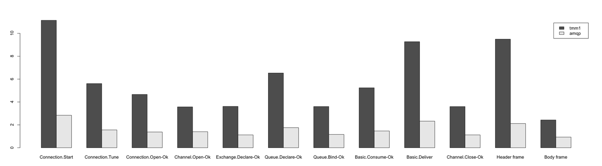
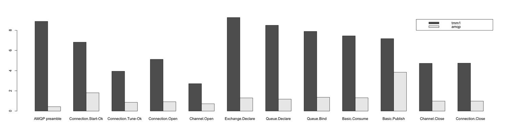
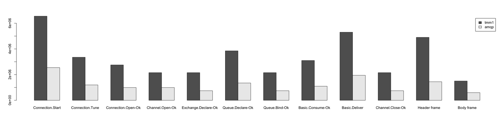

I decided to run some [benchmarks](https://github.com/ruby-amqp/amqp-benchmarks) of my AMQP encoder/decoder ([AMQ Protocol](https://github.com/ruby-amqp/amq-protocol) gem) against the old one in the [AMQP](https://github.com/ruby-amqp/amqp) gem to see whether it performs better or not. So far I did only the most basic optimisations like storing reusable values in constants, nothing special (yet).

I did two sets of benchmarks: CPU time benchmarking using [my fork of RBench](https://github.com/botanicus/rbench) with support for custom formatters (like writing results into a YAML file) and memory benchmarking using `Object.count_objects` (Ruby 1.9).

<!-- truncate -->

I'm not going to write about technical details of these benchmarks, get [the sources](https://github.com/ruby-amqp/amqp-benchmarks) and take a look yourself. I run every example 50,000 times, except of the example for the AMQP preamble which I run 200,000 times.

Here are the results from CPU time benchmarking (tmm1 means the old encoder/decoder, amqp the new one, the first graph is for decoding, the second one for encoding):

As you can see, the results are very cheerful, **the new encoder/decoder is always significantly faster, on average it's 4.875x faster then the old one**. (Obviously not all the metrics have the same relevance: regardless how fast is decoding of `Connection.Open`, you call it only once per connection, which in most cases means once per one run of the client.)

And that's not all, I have actually even better results for the memory consumption: **the new encoder/decoder needs 5.417x less objects**! This definitely can influence the performance as well, because the Ruby GC is fairly weak.

On average **decoding works only 3.449x faster and needs 2.083x less memory whereas encoding works 6.300x faster and needs 8.75x less memory**.

Actually these benchmarks aren't really fair, because AMQ Protocol encoder/decoder do much more than the one in the AMQP gem: it's way more granular and it always takes care about errors, whereas the old one quite often just silently fails. This flexibility and extra functionality obviously has some overhead (and yet it's significantly faster!).

What's next? Well, the next big thing on my TODO list is to **integrate AMQ Protocol to the AMQP gem, so you can benefit from these new changes in the next 0.8 release**! Then, if I'll have some time (my contract's running out), I'd love to do some further optimisation for the methods which matters in performance impact.
