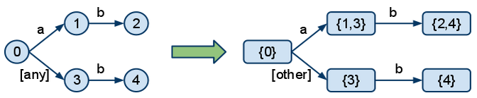
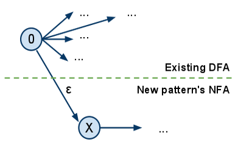
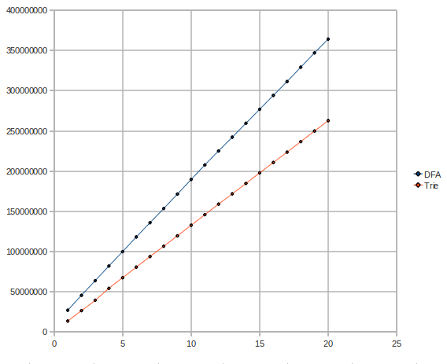
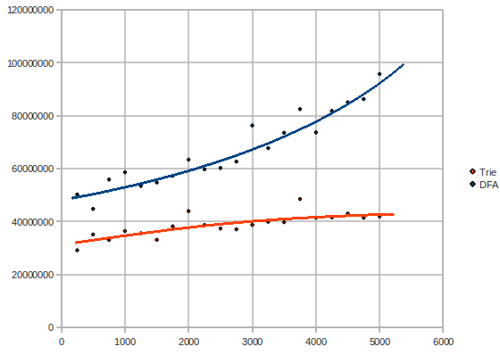
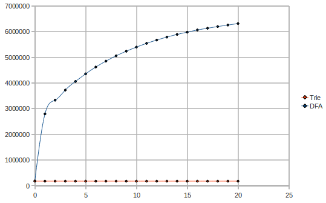
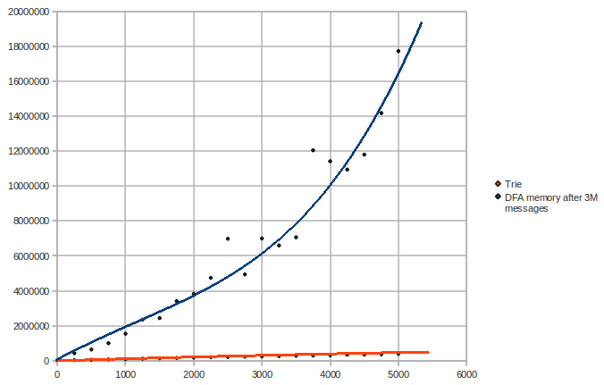
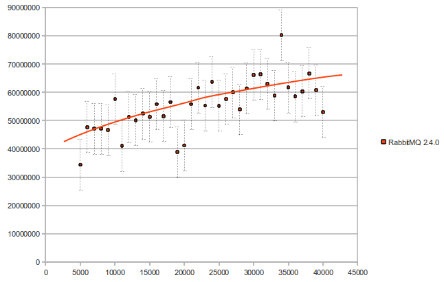
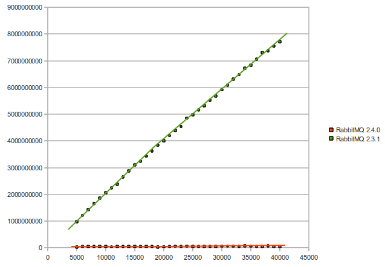

In our [previous blog post](/blog/2010/09/14/very-fast-and-scalable-topic-routing-part-1) we talked about a few approaches to topic routing optimization and described the two more important of these in brief. In this post, we will talk about a few things we tried when implementing the DFA, as well as some performance benchmarking we have done on the trie and the DFA.

<!-- truncate -->

## Implementing the DFA

In order to be able to build the DFA, we first need to build the NFA from the patterns. The main difference between the DFA and the NFA is that, in the DFA, at any point, you don't have to choose (backtrack); you only get one precise route that you follow down the graph. For example, here is how we would turn patterns "a.b" and "*.b" into a DFA:



We can see that in the NFA, state 0 has a choice, if the topic starts with "a". It can either go through 1 or through 3. This causes backtracking. In the DFA, the two branches got merged together for the case when the topic starts with "a" and turned the "any" into "other", leaving only one, clear choice for each case.

There are a few options to turn to when converting an NFA into a DFA:

* **Using the powerset construction algorithm**. This is approach is generally used to construct the entire DFA from the start.
* **Using the NFA algorithm**. This is the same complexity as backtracking, but it is modelled with set operations.
* **Pure backtracking**. Basically the same thing as the trie approach mentioned in the previous article.

The main problems of the conversion are the size of the DFA and the complexity of the algorithms. Although not obvious, in the example above, the DFA can get significantly bigger than the NFA, when using "#" in patterns. In some cases, a "#" can cause a node to link to all other nodes in the graph. For this reason, it would be useless to try to build the whole DFA from the start, and then rebuild it entirely whenever a new binding is added.

To overcome this problem we thought of a way of patching the DFA with a new pattern when a new binding is created. How? Construct the NFA for the new pattern and link it to the existing DFA like this:



where 0 is the start node of the existing DFA and X is the start node of the new pattern to be added.

The result would be a new NFA. Then, we would use the powerset construction method to rebuild the DFA, but when encountering a node which contains a singleton set, whose element belonged to the previous DFA, we can stop and link it as it was previously in the DFA.

For patterns that do not contain "#"', in most cases you would barely touch the existing DFA and keep it entirely, while attaching the new pattern. In these cases, the cost of adding a new binding would be very low.

The problem is... the "#". If the new pattern contains a "#" at the beginning, you end up traversing the whole DFA again and renewing all nodes to reconstruct it. For this reason and because the DFA has a big size complexity anyway, we decided that building the whole DFA and then patching it was not such a good idea after all.

Good regex compilers nowadays don't store the DFA entirely, because it can get huge. Instead they build it on the fly, as needed, with the NFA algorithm, and cache it. You can think of it as having it in a lazy evaluation form - new nodes are only produces when needed. When the cache gets too big, they drop it entirely and start over. We ended up using this approach in our problem.

## Testing the trie and the DFA and attempts to improve the DFA

We wrote a benchmarking test for the purpose of comparing the performances of the two. We tried to make the tests mimic as much as possible the way a topic exchange is commonly used. In the following, "x times faster" refers to the benchmark test times, in general compared with the naive implementation, which does not do the unnecessary splitting mentioned in the previous post. The benchmark consists of matching 1M topics against 2000 patterns. We ran it on a 2.3 GHz machine. The patterns contain a concentration of 0.1 of "*"'s and 0.01 of "#"'s.

The trie finished our benchmark in *11.7 seconds*, which made it *15 times* faster than the naïve implementation.

We then benchmarked the NFA algorithm, but without the caching of the DFA, using Erlang's digraph module for graphs. Its complexity is about the same as the trie's, so we expected a similar time. The result? It was very very slow! It was of the order of hundreds of seconds.

We needed to write our own graph implementation, since digraph gave really poor performance. So we wrote a specialized finite automata graph, based on Erlang dicts. We got *37 seconds* for just NFA (without caching DFA). Four times slower than the trie. Still not as fast. But it is probably due to the cost of walking a graph rather than a tree and doing some extra set operations.

We then implemented the caching of the DFA. Result? *Slower* than the trie! We got *26.7 seconds* in our benchmark. We tried it for even more messages (perhaps the DFA wasn't build entirely). Still... slower.

Here is a graph of the tests, when varying the number of messages (2000 patterns, millions of messages vs time microseconds - lower is better):



That was quite unexpected. We should have seen the DFA grow in a logarithmic manner at some point. What's wrong? Maybe we need a faster graph. It is known that the dict implementation in Erlang is not very quick. Our graph implementation was based on Erlang's dict. We needed a way to optimize that.

We came up with the idea of generating source code for the dictionaries, on the fly. For example, if you have a dictionary with the entries `[{k1, v1}, {k2, v2}, {k3, v3}]` we would generate a function

```
mydict(k1) -> {ok, v1};

mydict(k2) -> {ok, v2};

mydict(k3) -> {ok, v3};

mydict(_) -> error.
```

It would thus behave like the dict:find/2 function, except it only takes one parameter. We used Yariv Sadan's [smerl](http://code.google.com/p/erlyweb/source/browse/trunk/src/smerl/smerl.erl) module for the job.

We first tested the new graph with just NFA, without caching the DFA. We got *21.9 seconds* on our benchmark test. That's great! Almost twice as fast that the previous 37 seconds result.

Let's now try to cache the DFA and compile the dictionaries to functions every 5 seconds. Complete failure! The generated function has hundreds of thousands of clauses, because of the high number of edges in the graph. Compiling such a thing takes ages! It's useless.

Using compiled dict only for the NFA and not for the cached DFA, we got *15.2 seconds* in our benchmark - our fastest DFA attempt.

## Further testing

Let us have a closer look at the complexities of the trie and the DFA. Maybe we get a clue of what's wrong with the DFA. Here is a graph of the tests if varying the number of patterns (3M messages, number of patterns vs time in microseconds):



Surprise! The DFA has a rather exponential/quadratic complexity, while the trie keeps pretty linear or rather logarithmic.

What could the explanation be? The DFA uses a lot of memory. The reason the DFA is much slower could only be because the processor needs to grab bits of the DFA from the memory very often, instead of being able to keep the DFA in the processor's cache. The trie uses significantly less memory and probably fits better in the cache.

Let's see the memory usage, when varying the number of messages (2000 patterns, millions of messages vs words used):



Obviously, the trie does not vary in size while the messages flow. We can see that the DFA uses up *40 times* more memory than the trie, in this scenario. Indeed the theory that the DFA does not fit in the cache is confirmed. The trie uses 1-2MB, while the DFA uses almost 50MB.

Now let us vary the number of patterns and keep the number of messages constant (3M messages, number of patterns vs words used):



We can see here that the DFA has an exponential space complexity.

## So...

Caching messages' topics and indexing the patterns on a per-level basis are clearly inferior to the trie and DFA approaches.

The DFA uses a lot more memory and optimizing it is limited by a number of obstacles. Even with a specialized graph implementation, the DFA fails to achieve linear time complexity due to the high usage of memory, falling towards an exponential space and time complexity. It is significantly worse than the trie approach, even though it is the trie backtracks and would have had an exponential complexity if the number of words per pattern would have been greater in common use.

The trie approach is simpler and thus easier to implement and maintain than the DFA; it uses many times less memory, thus being able to fit in the processor's cache; and exhibits a linear-logarithmic complexity in both space and time, making it the fittest approach.

We implemented the trie approach in the new RabbitMQ version 2.4.0. Here is what we got, when we tested Rabbit itself, with the new implementation (number of bindings vs time in microseconds):



And finally, here is a performance comparison between version 2.3.1 and version 2.4.0 (number of bindings vs time in microseconds) - the performance improvement in this graph varies from 25 to 145 times faster:


