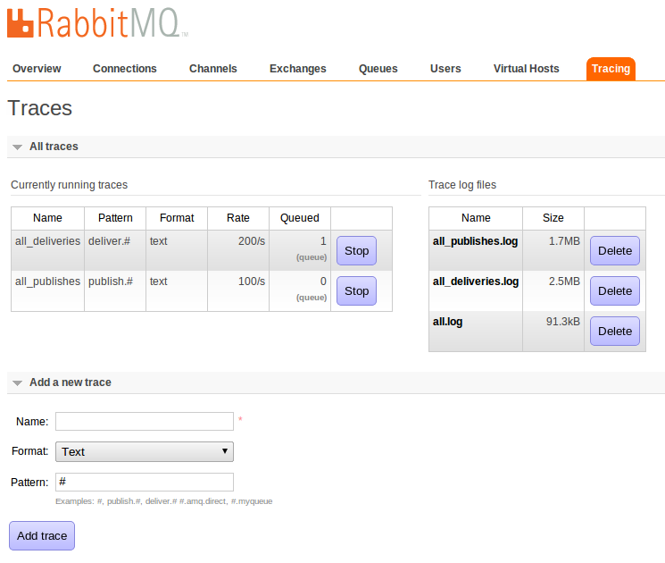

While the [firehose](/docs/firehose) is quite a cool feature, I always thought that it was a shame we didn't have a simple GUI to go on top and make it accessible to system administrators. So I wrote one. You can download it [here](https://www.rabbitmq.com/releases/plugins/v2.6.1-tracing-preview/rabbitmq_tracing-2.6.1.ez).

<!-- truncate -->



It's an extension to the management plugin, and requires 2.6.0 / 2.6.1. Once you've installed it and restarted Rabbit, you should see another tab labelled "Tracing" in management. (**Edit:** as of RabbitMQ 3.0.0, "Tracing" is under the "Admin" tab.) From here you can start and stop tracing, and download or delete log files. Hopefully the interface is fairly obvious.

Currently rabbitmq-tracing supports two log formats: **text** and **json**. **text** is designed to be human-readable, and looks like this:

```
================================================================================
2011-9-9 10:57:24: Message published

Node:         rabbit@smacmullen
Exchange:     direct
Routing keys: [<<"5d07bff4-1708-4a5d-87f9-a14177d6681b">>]
Properties:   []
Payload: 
Hello world

================================================================================
2011-9-9 10:57:24: Message received

Node:         rabbit@smacmullen
Exchange:     direct
Queue:        amq.gen-PJfnaKdg7AmsWmYTUeuApw==
Routing keys: [<<"5d07bff4-1708-4a5d-87f9-a14177d6681b">>]
Properties:   []
Payload: 
Hello world

================================================================================
```

**json** is designed to be machine readable and consists of a file with one JSON structure per line. Note that this means the entire file is *not* itself a JSON structure, you need to split it by line first. (The reason for this is so that we can treat it like a normal log file and just append to it.)

There are two configuration options:

* "directory". This controls where the log files go. It defaults to "/var/tmp/rabbitmq-tracing".
* "username". The name of a user as which to create the tracing queues and bindings.

A complete configuration might look like:

```erlang
[{rabbitmq_tracing, [{directory, "/my/log/file/location"},
                     {username,  "guest"}]}].
```

As with any new plugin there are of course a couple of caveats. On my workstation, rabbitmq-tracing can write about 2000 msg/s to a log file. You should be careful using rabbitmq-tracing if you think you're going to capture more messages than this. Of course, any messages that can't be logged are queued until they can be.

Also, the code to serve up the log files over HTTP is pretty dumb: it loads the whole log into memory (unfortunately webmachine doesn't really let us stream files). If you have large log files you may wish to transfer them off the server in some other way.

So, what do you think? Is this useful to you? How could it be extended?
