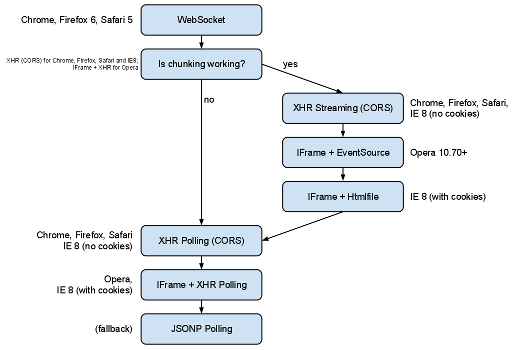

WebSocket technology is catching up, but it will take a while before
all browsers support it.
In the meantime there are loads of projects that aim to substitute for
WebSockets and enable 'realtime' capabilities for web apps. But all
attempts solve only a part of the general problem, and there isn't any
single solution that works, is scalable and doesn't require special
deployment tricks.

<!-- truncate -->

That's why a new project
[was born](https://github.com/sockjs/sockjs-client/wiki/%5BBlog%5D-SockJS:-web-messaging-ain%E2%80%99t-easy):
[SockJS](https://github.com/sockjs/sockjs-client) - yet another
WebSocket emulation library, but this time done right.
SockJS has ambitious goals:

* Simple browser-side and server-side APIs, as close to WebSocket API
   as possible.
* Well documented scaling and load balancing techniques.
* Transports must fully support cross-domain communication.
* Transports must fall back gracefully in case of restrictive proxies.
* Connection establishment should be fast.
* No Flash on the client side, Javascript only.
* Client-side Javascript must be reasonably well tested.
* Additionally the server side code should be simple, in order to
   lower the cost of writing servers for different languages.

## Simple APIs

It may sound obvious, but the
[WebSocket API](http://dev.w3.org/html5/websockets/) is actually quite
good. It's an effect of a tremendous effort led by Ian Hickson and
others. It's shouldn't be forgotten that there were earlier, less
successful attempts to
[achieve a similar thing](http://dev.w3.org/html5/eventsource/) -
the WebSockets API wasn't developed in the void.

Yet, I haven't seen any Javascript library that tries to emulate this
API closely. Early
[Socket.io](https://github.com/learnboost/socket.io) attempted that,
but it has evolved quite far away by now.

WebSocket doesn't define a server side API, but it's easy to come up
with a scheme with similar ideology and abstractions as the client
side.

## Deployment story

SockJS does support cross-domain communication out of the box. You
can, and should, isolate SockJS server and host it on a different
domain than your main web site. There are multiple advantages of this
approach and, frankly speaking, it's just the only sane deployment
strategy.

## Load balancing story

Single SockJS server capacity is finite. If you are anticipating that
a single server will not be enough for your needs - take a look at the
scaling scenarios below.

### Use multiple domains for SockJS servers

The simplest solution is just to put every SockJS server under a
different domain name, for example `sockjs1.example.com` and
`sockjs2.example.com`, and allow clients to pick a server randomly.

### Use a WebSocket-capable load balancer

You can choose to host all the SockJS traffic under one domain and use
a decent WebSocket-capable load balancer to split the traffic. There
is
[a sample HAProxy configuration file](https://github.com/sockjs/sockjs-node/blob/master/examples/haproxy.cfg)
which can be a good starting point.

### Use almost any load balancer

This is not a preferred solution, but it's possible to run scalable
SockJS even in environments where the load balancer doesn't support
WebSockets. Shared hosting providers are like that - for example
[CloudFoundry](http://cloudfoundry.com). In order to make connection
establishment faster you can disable WebSocket protocol both on the
client and server side.
In such an environment load balancer must forward all requests for a
single SockJS session to a single SockJS server - the load balancer
must support sticky sessions (session affinity) in one of two
variants:

* Prefix-based sticky sessions. All requests to SockJS are prefixed
   with a session id. Good loadbalancers may use that as a clue for
   session-affinity algorithms (for example HAProxy can do it).
* `JSESSIONID` cookie sticky sessions. By default SockJS server sets
   this cookie. Some load balancers understand that cookie and
   enable session stickyness (for example this is the case for
   CloudFoundry).

## Robust transport protocols

Apart from native WebSockets, SockJS comes with the support for few
carefully chosen transport protocols, and all of them support
cross-domain communication.
The basic idea is that there should be a decent streaming and polling
protocol for every browser. The polling ones must work work in
environments with restrictive proxies and support old browsers. There
are three ways every browser can establish connection:

### Native WebSocket

WebSocket is the fastest and best transport protocol, it supports
cross-domain connections out of the box. Unfortunately it is not yet
widely supported by browsers. Also, some browsers may have problems
with proxies (for example, Firefox WebSocket implementation won't work
through the majority of the proxies). It's going to take some time
before the browser vendors agree on the protocol and proxy handling.

### Streaming protocol

Streaming protocols supported by SockJS are based on http 1.1 chunking - it 
allows browser to receive a single http response in many parts.
A great example of streaming protocol is
[EventSource](http://dev.w3.org/html5/eventsource/) or streaming over
XHR (ajax). Messages sent from the browser are posted using another
XHR request.

Every browser supports a different set of streaming protocols and they
usually can't do cross-domain communication. Fortunately SockJS is
able to work around that limitation by using an Iframe and
communicating with it using an Html5 PostMessage API. This is quite
complex, but fortunately it is supported by the majority of the
browsers (with the exception of IE7).

### Polling transport

SockJS supports few good-old polling protocols for ancient browsers
(including IE7). Unfortunately these techniques are quite slow, but
there is not much that can done about it.

Polling transports can also be used in situations where proxy on the
client side doesn't support WebSockets nor http chunking- it is required for the streaming protocols.

## Connection establishment should be fast

Opening SockJS connection should be fast, in some deployments it may
be necessary to establish a SockJS connection on every http page the
user visits.

If the browser supports it SockJS first tries to open a native WebSocket
connection. Depending on a network and server setup it may work or
fail. The failure should happen quite fast, unless the client is
behind a badly misbehaving proxy - in such case it can take up to 5
seconds to timeout.

After WebSocket transport is ruled out, SockJS opens XHR request that
intends to check if chunking is supported by the proxy. It's not that
unusual to meet proxies that don't support http chunking. Running
streaming protocol in such environment will fail with a timeout.
If chunking is working fine, SockJS chooses the best streaming
protocol supported by the browser. In the other case, polling
transports are used.

All that, depending on the browser, can take between 3 or 4 round trip
times from the browser to the server, plus a DNS request. Unless
you're behind a broken proxy or live in Antarctica it should be quite
fast.

This is one of the reasons why SockJS avoids using Flash transports -
Flash connection can take
[at least to 3 seconds](http://www.adobe.com/devnet/flashplayer/articles/fplayer9_security.html)
if port 843 is blocked.

## Client-side Javascript must be reasonably tested

SockJS is quite young and testing is not yet done properly. That said,
we have multiple end-to-end QUnit tests. At the moment are deployed in
few places:

* [http://sockjs.popcnt.org/](http://sockjs.popcnt.org/) (hosted in Europe)
* [http://sockjs.cloudfoundry.com/](http://sockjs.cloudfoundry.com/) (CloudFoundry, websockets disabled, loadbalanced)
* [https://sockjs.cloudfoundry.com/](http://sockjs.cloudfoundry.com/) (CloudFoundry SSL, websockets disabled, loadbalanced)
* [http://sockjs.herokuapp.com/](http://sockjs.herokuapp.com/) (Heroku, websockets disabled)

## Server side code should be simple

At that point SockJS-node implementation is using about 1200 lines of
code in CoffeeScript. About 340 are used by WebSocket protocol, 220 by
a simple http abstractions and only around 230 are used by core SockJS
logic.

The SockJS protocol used between the browser and the server is already
quite simple and we're working on making it even more obvious.

We do intend to support at least Node and Erlang servers and we would
be pleased to see Python and Ruby implementations as well. SockJS is
intended to be polyglot.

## Summary

SockJS is quite young and there is loads of work remaining to be done,
but we believe it is stable enough for real applications. If you're
planning on doing realtime web apps, give it a try!
(Article also published on [github pages](https://github.com/sockjs/sockjs-client/wiki/%5BArticle%5D-SockJS:-WebSocket-emulation-done-right))
