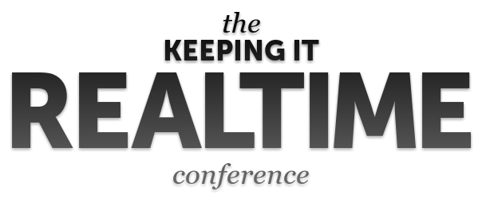

There's a lot of hot stuff happening in the web technology lately.
JavaScript seems to be bearing the torch, both
browser-side and server-side.
At the RabbitMQ HQ we're interested in developments in the wide world of
messaging, and we're particularly excited about the JavaScript angle on
messaging - namely WebSockets and related technologies.

<!-- truncate -->

The good news is - there will be a conference dedicated to these topics:

* [Keeping It Realtime Conference](http://krtconf.com/)

The conference will take two days on Nov 7 and 8 in Portland, OR.
I'm delighted to announce that I'll be giving a talk there. I'll speak
about our view on messaging in the web environment, our attempt (and
failure) to build a generic web-messaging service, and finally I'll
describe what we came up after all this - the [SockJS project](http://sockjs.org). (Which is a simple WebSocket emulation layer, but it took us a while to understand why this is the best approach to do web-messaging.)
I'll be hanging around there for the two days - feel free to talk to me
about SockJS, RabbitMQ, AMQP or just messaging in general in any flavour.
See you in Portland!
