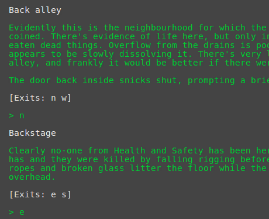
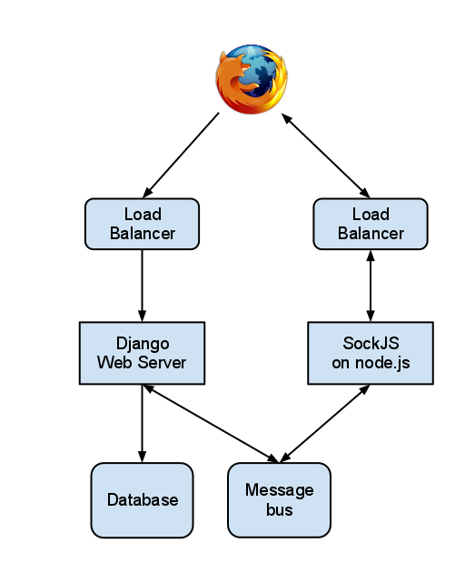

We were wondering how to present SockJS and its possibilities to a
wider audience. Having a working demo is worth much more than
explaining [dry theory](/blog/2011/09/13/sockjs-websocket-emulation),
but what can you present if you are just a boring technologist, with
no design skills whatsoever?

With questions like that it's always good to open a history book
and review previous generation of computer geeks with no artistic
skills. What were they doing? On consoles with green letters
they were playing geeky computer games,
[MUDs (Multi User Dungeons)](http://en.wikipedia.org/wiki/MUD) were
especially popular.

Hey, we can do that!

<!-- truncate -->

So here it is, a rough and dirty, hacked together in an afternoon MUD!
But it aint a normal MUD, it's a unique one:

* The world isn't exactly large, with five locations and 6 commands
   in total.
* But it's an in-browser game, using [SockJS](http://sockjs.org) underneath.
* It's built using Django, and the state is handled using Django ORM.

So, forget the 21st century and dive into an ancient world of dragons,
at least for a few minutes:

* [http://mud.sockjs.org](http://mud.sockjs.org)

If you're interested in technology feel free
[to take a look at the sources](https://github.com/sockjs/sockjs-mud). Also,
as the project is using Django ORM you can add new locations using
[Django Admin](http://mud.sockjs.org/admin) (user: guest, pass:
guest). Unleash your creativity! Unfortunately there isn't a simple
way of restricting Django Admin users, so you can't see what you
added. You may also want to take a look at the
[initial database fixture](https://github.com/sockjs/sockjs-mud/blob/master/mud/initial_data.json).

Here's a diagram illustrating the architecture of this demo:

As you can see it's quite simple, and it follows one of the
recommended SockJS deployment models. It should be possible to
scale it horizontally, although this game is only a toy and we haven't
really tested that.
