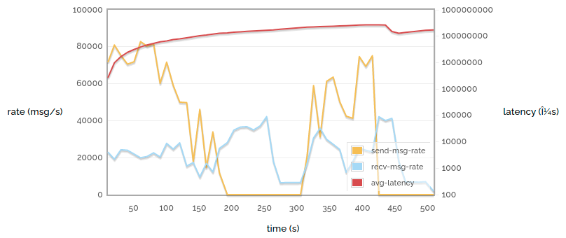
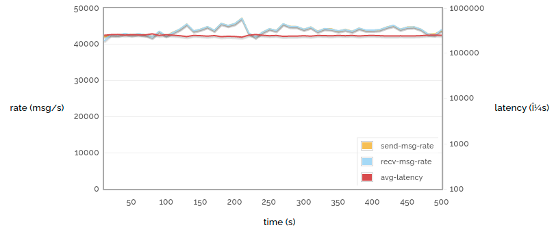

So today I would like to talk about some aspects of RabbitMQ's
performance. There are a huge number of variables that feed into
the overall level of performance you can get from a RabbitMQ
server, and today we're going to try tweaking some of them and
seeing what we can see.

<!-- truncate -->

The aim of this piece is not to try to convince you that
RabbitMQ is the fastest message broker in the world - it often
isn't (although we like to think we're still pretty decent) -
but to give you some ideas about what sort of performance you
can expect in different situations.

All the charts and statistics shown were measured on a PowerEdge
R610 with dual Xeon E5530s and 40GB RAM. Largely because it was
the fastest machine we had lying around. One major thing that's
not ideal is we ran the clients on the same machine as the
server - just due to the limited hardware we had available. We used
RabbitMQ 2.8.1 (in most cases) and Erlang R15B with HiPE compilation
enabled.

By the way, the code to produce all these statistics
is available in branch bug24527 of rabbitmq-java-client
(although it's currently rather rough) Eventually it will get
merged to default, and also become easier to work with. We hope.

## Flow control in RabbitMQ 2.8.0+

But first of all I need to introduce a new feature in RabbitMQ
2.8.0+ - internal flow control. RabbitMQ is internally made up of
a number of Erlang processes which pass messages to each
other. Each process has a *mailbox* which contains
messages it has received and not yet handled. And these
mailboxes can grow to an unbounded size.

What this means is that unless the first process to receive data
off a network socket is the slowest in the chain, (it's not)
then when you have a heavily-loaded RabbitMQ server messages can
build up in process mailboxes forever. Or rather, until we run
out of memory. Or rather, until the memory alarm goes off. At
which point the server will stop accepting new messages while it
sorts itself out.

The trouble is, this can take some time. The following chart
(the only one in this post made against RabbitMQ 2.7.1) shows a
simple process that publishes small messages into the broker as
fast as possible, and also consumes them as fast as possible,
with acknowledgement, confirms, persistence and so on all
switched off. We plot the sending rate, the receiving rate, and
the latency (time taken for a sent message to be received), over
time. Note that the latency is a logarithmic scale.

### Simple 1 -> 1 autoack (2.7.1)

Ouch! That's rather unpleasant. Several things should be obvious:

* The send rate and receive rate fluctuate quite a lot.
* The send rate drops to zero for two minutes (this is the
first time the memory alarm went off). In fact the memory alarm
goes off again at the end.
* The latency increases steadily (and look at the scale - we
show microseconds, but we could just as easily measure it in
minutes).

(The small drop in latency around 440s is due to all the
messages published before 200s being consumed, and the long gap
afterwards.)

Of course, this is only the sort of behaviour you would expect
when stressing a server to the limit. But we're benchmarking -
we want to do that. And anyway, servers get stressed in
production too.

So now let's look at the same experiment conducted against a
RabbitMQ 2.8.1 server:

### Simple 1 -> 1 autoack (2.8.1)

That looks like a much calmer experience! The send rate, receive
rate and latency are all near-constant. The reason is internal
flow control. The latency is around 400ms (which is still quite
high compared to a less loaded server for reasons I'll discuss
in a minute).

These charts don't show memory consumption, but the story is the
same - in this circumstance 2.7.1 will eat lots of memory and
bounce off the memory alarm threshold, and 2.8.1 will use a
fairly constant, fairly low quantity of memory.

Each process in the chain issues *credit* to the
processes that can send messages to it. Processes consume credit
as they send messages, and issue more credit as they receive
them. When a process runs out of credit it will stop issuing
more to its upstream processes. Eventually we reach the process
which is reading bytes off a network
socket. When **that** process runs out of credit,
it stops reading until it gets more. This is the same as when
the memory alarm goes off for the 2.7.1 broker, except that it
happens many times per second rather than taking minutes, and we
control memory use a lot more.

So where does that 400ms latency come from? Well, there are
still messages queueing up at each stage in the pipeline, so it
takes a while for a message to get from the beginning to the
end. That accounts for some of the latency. However, most of it
comes from an invisible "mailbox" in front of the entire server
- the TCP buffers provided by the operating system. On Linux
the OS will allow up to 8MB of messages to back up in the TCP
stack. 8MB doesn't sound like a lot of course, but we're dealing
with tiny messages (and each one needs routing decisions,
permissions check and so on to be made).

But it's important to remember that we tend to see the worst
latency when running at the limit of what we can do. So here's
one final chart for this week:

### 1 -> 1 sending rate attempted vs latency

Note that the horizontal axis is no longer time. We're now
showing the results of many runs like the ones above, with each
point representing one run.

In the charts above we were running as fast as we can, but here
we limit the rate at varying points up to the maximum rate we
can achieve. So the yellow line shows rate attempted vs rate
achieved - see that it goes most of the way purely 1:1 linearly
(when we have spare capacity and so if we try to publish faster
we will succeed) and then stops growing as we reach the limit of
what we can do.

But look at the latency! With low publishing rates we have
latency of considerably less than a millisecond. But this drifts
up as the server gets busier. As we stop being able to publish
any faster, we hit a wall of latency - the TCP buffers start to
fill up and soon messages are taking hundreds of milliseconds to
get through them.

So hopefully we've shown how RabbitMQ 2.8.1 offers much more
reliable performance when heavily loaded than previous versions,
and shown how latency can reach for the skies when your message
broker is overloaded. Tune in next time to see how some
different ways of using messaging affect performance!
