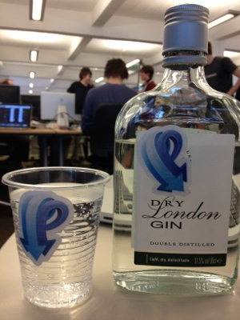

Over the weekend, RabbitMQ co-sponsored [London Realtime](http://londonrealtime.co.uk), two nights and two days of unadulterated hackery. It was all put on by the apparently indefatigable[*](http://www.youtube.com/watch?v=p2EE7acJv1o&feature=player_embedded#t=120s) crew at [GoSquared](http://www.gosquared.com/), a very impressive debut effort.

As a co-sponsor we had one of the iPad prizes to award. We decided to allow hacks that used one or more of [RabbitMQ](/), [SockJS](http://www.sockjs.org/), or [Cloud Foundry](http://www.cloudfoundry.com). This meant that about half of the twenty-seven hacks were eligible when it came to judging, making the choice rather difficult.

<!-- truncate -->

In the end we chose **[YouChoose](http://youchoose.cloudfoundry.com)**, which uses **SockJS** and is hosted on **CloudFoundry**. The idea was nifty, and the hack complete and well-executed; and it let one of the judges, who shall remain unnamed, subject the audience to the Titanic theme (until they worked out how to collectively vote it off). Empowering stuff.

All the hacks were imaginative and almost all made it to a working demo stage -- which was pretty amazing (or perhaps explained by) considering the lack of sleep some people were suffering on Sunday.

Among our favourites were: **Err**, microgames with location-based matchmaking (one of the games is "run away as fast as you can"); **The Worm**, a live popularity chart with optional rageface meter; and **Support Net**, a site and mobile app for people quitting smoking.

Full coverage of the event is over on [GoSquared's blog](http://www.gosquared.com/liquidicity/archives/2873), including video footage and interviews.

