Welcome back! [Last time](/blog/2012/04/16/rabbitmq-performance-measurements-part-1) we talked about flow control and
latency; today let's talk about how different features affect
the performance we see. Here are some simple scenarios. As
before, they're all variations on the theme of one publisher and
one consumer publishing as fast as they can.

<!-- truncate -->

## Some Simple Scenarios

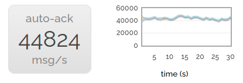

This first scenario is the simplest - just one producer and
one consumer. So we have a baseline.

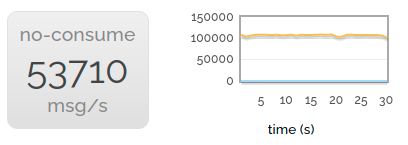

Of course we want to produce impressive figures. So we can go
a bit faster than that - if we don't consume anything then we
can publish faster.

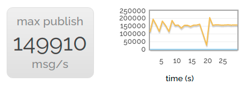

This uses a couple of the cores on our server - but not all of
them. So for the best headline-grabbing rate, we start a
number of parallel producers, all publishing into nothing.

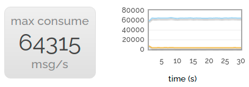

Of course, consuming is rather important! So for the headline
consuming rate, we publish to a large number of consumers in
parallel.

Of course to some extent this quest for large numbers is a bit
silly, we're more interested in relative performance. So let's
revert to one producer and one consumer.

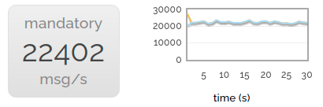

Now let's try publishing with the mandatory flag set. We drop
to about 40% of the non-mandatory rate. The reason for this is
that the channel we're publishing to can't just asynchronously
stream messages at queues any more; it synchronously checks
with the queues to make sure they're still there. (Yes, we
could probably make mandatory publishing faster, but it's not
very heavily used.)

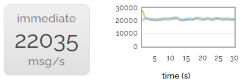

The immediate flag gives us almost exactly the same drop in
performance. This isn't hugely surprising - it has to make the
same synchronous check with the queue.

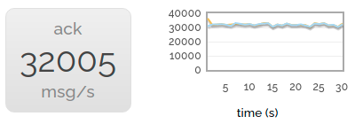

Scrapping the rarely-used mandatory and immediate flags, let's
try turning on acknowledgements for delivered messages. We still
see a performance drop compared to delivering without
acknowledgements (the server has to do more bookkeeping after
all) but it's less noticeable.

Now we turn on publish confirms as well. Performance drops a
little more but we're still at over 60% the speed of neither
acks nor confirms.

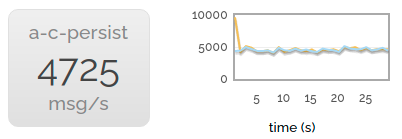

Finally, we enable message persistence. The rate becomes much
lower, since we're throwing all those messages at the disk as
well.

## Message Sizes

Notably, all the messages we've been sending until now have only
been a few bytes long. There are a couple of reasons for this:

* Quite a lot of the work done by RabbitMQ is per-message, not
    per-byte-of-message.
* It's always nice to look at big numbers.

But in the real world we will often want to send bigger
messages. So let's look at the next chart:

### 1 -> 1 sending rate message sizes

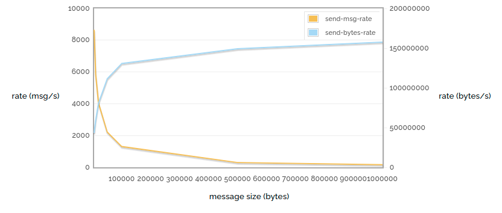

Here (again) we're sending unacked / unconfirmed messages as
fast as possible, but this time we vary the message size. We
can see that (of course) the message rate drops further as the
size increases, but the actual number of bytes sent increases as
we have less and less routing overhead.

So how does the message size affect horizontal scaling? Let's
vary the number of producers with different message sizes. Just
for a change, in this test we're not going to have any consumers
ar all.

### n -> 0 sending msg rate vs number of producers, for various message sizes

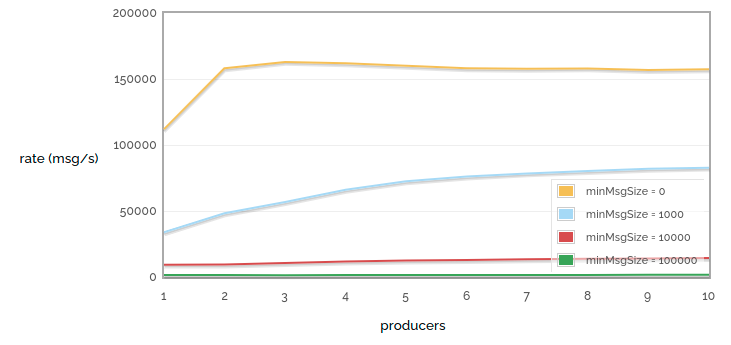

### n -> 0 sending bytes rate vs number of producers, for various message sizes

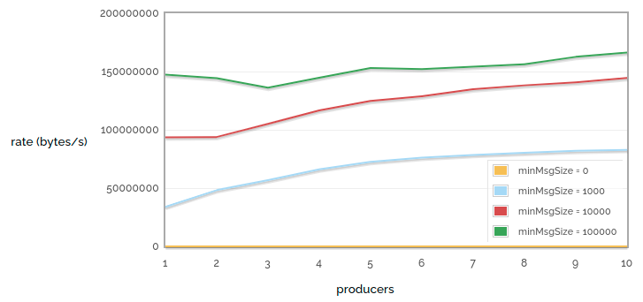

In these tests we can see that for small messages it only takes
a couple of producers to reach an upper bound on how many
messages we can publish, but that for larger messages we need
more producers to use the available bandwidth.

Another frequently confusing issue is performance around
consumers with a prefetch count. RabbitMQ (well, AMQP) defaults
to sending all the messages it can to any consumer that looks
ready to accept them. The maximum number of these unacknowledged
messages per channel can be limited by setting the prefetch
count. However, small prefetch counts can hurt performance
(since we can be waiting for acks to arrive before sending out
more messages).

So let's have a look at prefetch count and, while we're there,
also consider the number of consumers consuming from a single
queue. This chart contains some deliberately absurd extremes.

### 1 -> n receiving rate vs consumer count / prefetch count

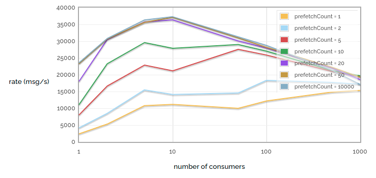

The first thing to notice is that tiny prefetch counts really
hurt performance. Note the large difference in performance
between prefetch = 1 and prefetch = 2! But we also get into
diminishing returns - notice that the difference between
prefetch = 20 and prefetch = 50 is hard to see, and the
difference between prefetch = 50 and prefetch = 10000 is almost
invisible. Of course, this is because for our particular network
link prefetch = 50 already ensures that we never starve the
consumer while waiting for acks. Of course, this test was run
over a low latency link - more latent links will benefit from a
higher prefetch count.

The second thing to notice is that when we have a small number
of consumers, adding one more will increase performance (we get
more parallellism). And with a tiny prefetch count, increasing
consumers even up to a large number has benefits (since each
individual consumer spends much of its time starved). But when
we have a larger prefetch count, increasing the number of
consumers is not so helpful, since even a small number can kept
busy enough to max out our queue, but the more consumers we have
the more work RabbitMQ has to do to keep track of all of them.

## Large queues

All the examples we've looked at so far have one thing in
common: very few messages actually get queued. In general we've
looked at scenarios where messages get consumed as quickly as
they get produced, and thus each queue has an average length of
0.

So what happens whe queues get big? When queues are small(ish)
they will reside entirely within memory. Persistent messages
will also get written to disc, but they will only get read again
if the broker restarts.

But when queues get larger, they will get paged to disc,
persistent or not. In this case performance can take a hit as
suddenly we need to access the disc to send messages to
consumers. So let's run a test: publish a lot of non-persistent
messages to a queue, and then consume them all.

### Queue load / drain 500k messages

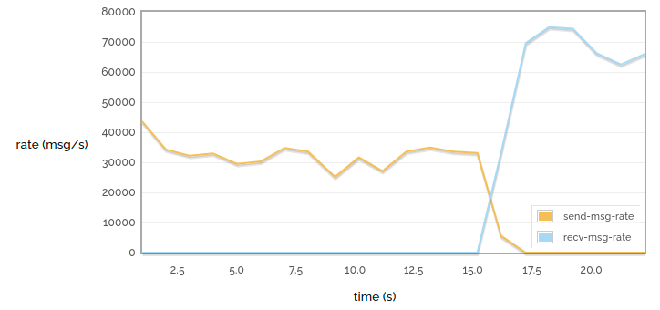

In this small case we can see fairly consistent performance:
the messages go into the queue fairly quickly and then come out
even more quickly.

### Queue load / drain 10M messages

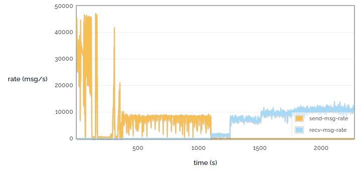

But when we have a larger queue we see that the performance
varies a lot more. We see that when loading the queue we
initially get a very high throughput, then a pause while some of
the queue is paged out to disc, then a more consistent lower
throughput. Similarly when draining the queue we see a much
lower rate when pulling the messages from disc.

Performance of disc-bound queues is a complex topic -
see [Matthew's
blog post on the subject](/blog/2011/10/27/performance-of-queues-when-less-is-more) for some more talk on the subject.

## Learn More

* Webinar: [What's new in RabbitMQ 3.8?](https://content.pivotal.io/webinars/may-23-what-s-new-in-rabbitmq-3-8-webinar?utm_campaign=rabbitmq-blog-3.8-webinar-q319&utm_source=rabbitmq&utm_medium=website)
* Webinar: [10 Things Every Developer Using RabbitMQ Should Know](https://content.pivotal.io/webinars/dec-12-10-things-every-developer-using-rabbitmq-should-know-webinar?utm_campaign=rabbitmq-blog-10-things-q319&utm_source=rabbitmq&utm_medium=website)
