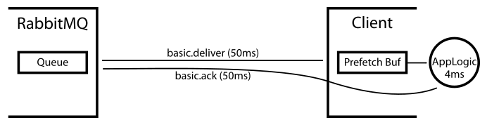

You have a queue in Rabbit. You have some clients consuming from that
queue. If you don't set a QoS setting at all (`basic.qos`), then
Rabbit will push all the queue's messages to the clients as fast as
the network and the clients will allow. The consumers will balloon in
memory as they buffer all the messages in their own RAM. The queue may
appear empty if you ask Rabbit, but there may be millions of messages
unacknowledged as they sit in the clients, ready for processing by the
client application. If you add a new consumer, there are no messages
left in the queue to be sent to the new consumer. Messages are just
being buffered in the existing clients, and may be there for a long
time, even if there are other consumers that become available to
process such messages sooner. This is rather sub optimal.

So, the default QoS `prefetch` setting gives clients an _unlimited_
buffer, and that can result in poor behaviour and performance. But
what should you set the QoS `prefetch` buffer size to? The goal is to
keep the consumers saturated with work, but to minimise the client's
buffer size so that more messages stay in Rabbit's queue and are thus
available for new consumers or to just be sent out to consumers as
they become free.

<!-- truncate -->

Let's say it takes 50ms for Rabbit to take a message from this queue,
put it on the network and for it to arrive at the consumer. It takes
4ms for the client to process the message. Once the consumer has
processed the message, it sends an `ack` back to Rabbit, which takes a
further 50ms to be sent to and processed by Rabbit. So we have a total
round trip time of 104ms. If we have a QoS `prefetch` setting of 1
message then Rabbit won't sent out the next message until after this
round trip completes. Thus the client will be busy for only 4ms of
every 104ms, or 3.8% of the time. We want it to be busy 100% of the
time.

If we do _total round trip time_ / _processing time on the client for
each message_, we get `104 / 4 = 26`. If we have a QoS `prefetch` of
26 messages this solves our problem: assume that the client has 26
messages buffered, ready and waiting for processing. (This is a
sensible assumption: once you set `basic.qos` and then `consume` from
a queue, Rabbit will send as many messages as it can from the queue
you've subscribed to to the client, up to the QoS limit. If you assume
messages aren't very big and bandwidth is high, it's likely Rabbit
will be able to send messages to your consuming client faster than
your client can process them. Thus it's reasonable (and simpler) to do
all the maths from the assumption of a full client-side buffer.) If
each message takes 4ms of processing to deal with then it'll take a
total of `26 * 4 = 104ms` to deal with the entire buffer. The first
4ms is the client processing of the first message. The client then
issues an `ack` and goes on to process the next message from the
buffer. That ack takes 50ms to get to the broker. The broker than
issues a new message to the client, which takes 50ms to get there, so
by the time 104ms has passed and the client has finished processing
its buffer, the next message from the broker has already arrived and
is ready and waiting for the client to process it. Thus the client
remains busy all the time: having a bigger QoS `prefetch` will not
make it go faster; but we minimise the buffer size and thus latency of
messages in the client: messages are buffered by the client for no
longer than they need to be in order to keep the client saturated with
work. In fact, the client is able to fully drain the buffer before the
next message arrives, thus the buffer actually stays empty.

This solution is absolutely fine, provided processing time and network
behaviour remains the same. But consider what happens if suddenly the
network halves in speed: your `prefetch` buffer is no longer big
enough and now the client will sit idle, waiting for new messages to
arrive as the client is able to process messages faster than Rabbit
can supply fresh messages.

To address this problem, we might just decide to double (or nearly
double) the QoS `prefetch` size. If we push it to 51 from 26, then if
the client processing remains at 4ms per message, we now have `51 * 4
= 204ms` of messages in the buffer, of which 4ms will be spent
processing a message, leaving 200ms for the sending an ack back to
Rabbit and receiving the next message. Thus we can now cope with the
network halving in speed.

But if the network's performing normally, doubling our QoS `prefetch`
now means each message will sit in the client side buffer for a while,
instead of being processed immediately upon arrival at the
client. Again, starting from a full buffer of now 51 messages we know
that new messages will start appearing at the client 100ms after the
client finishes processing the first message. But in those 100ms, the
client will have processed `100 / 4 = 25` messages out of the 50
available. Which means as a new message arrives at the client, it'll
be added to the end of the buffer as the client removes from the head
of the buffer. The buffer will thus always stay `50 - 25 = 25`
messages long and every message will thus sit in the buffer for `25 *
4 = 100ms`, increasing the latency between Rabbit sending it to the
client and the client starting to process it from 50ms to 150ms.

Thus we see that increasing the `prefetch` buffer so that the client
can cope with deteriorated network performance whilst keeping the
client busy, substantially increases the latency when the network is
performing normally.

Equally, rather than the network's performance deteriorating, what
happens if the client starts taking 40ms to process each message
rather than 4ms? If the queue in Rabbit was previously at a steady
length (i.e. ingress and egress rates were the same), it'll now start
growing rapidly, as the egress rate has dropped to a tenth of what it
was. You might decide to try and work through this growing backlog by
adding more consumers, but there are messages now being buffered by
the existing clients. Assuming the original buffer size of 26
messages, the client will spend 40ms processing the first message,
will then send the ack back to Rabbit and move onto the next
message. The ack still takes 50ms to get to Rabbit and a further 50ms
for Rabbit to send out a new message, but in that 100ms, the client
has only worked through `100 / 40 = 2.5` further messages rather than
the remaining 25 messages. Thus the buffer is at this point `25 - 3 =
22` messages long. The new message arriving from Rabbit, rather than
being processed immediately, now sits in 23rd place, behind 22 other
messages still waiting to be processed, and will not be touched by the
client for a further `22 * 40 = 880ms`. Given the network delay from
Rabbit to the client is only 50ms, this additional 880ms delay is now
95% of the latency (`880 / (880 + 50) = 0.946`).

Even worse, what happens if we doubled the buffer size to 51 messages
in order to cope with network performance degradation? After the first
message has been processed, there will be 50 further messages buffered
in the client. 100ms later (assuming the network is running normally),
a new message will arrive from Rabbit, and the client will be half way
through processing the 3rd of those 50 messages (the buffer will now
be 47 messages long), thus the new message will be 48th in the buffer,
and will not be touched for a further `47 * 40 = 1880ms`. Again, given
the network delay of getting the message to the client is only 50ms,
this further 1880ms delay now means client side buffering is
responsible for over 97% of the latency (`1880 / (1880 + 50) =
0.974`). This may very well be unacceptable: the data may only be
valid and useful if it's processed promptly, not some 2 seconds after
the client received it! If other consuming clients are idle, there's
nothing they can do: once Rabbit has sent a message to a client, the
message is the client's responsibility until it acks or rejects the
message. Clients can't steal messages from each other once the message
has been sent to a client. What you want is for clients to be kept
busy, but for clients to buffer as few messages as possible so that
messages are not delayed by client-side buffers and thus new consuming
clients can be quickly fed with messages from Rabbit's queue.

So, too small a buffer results in clients going idle if the network
gets slower, but too big a buffer results in lots of extra latency if
the network performs normally, and huge amounts of extra latency if
the client suddenly starts taking longer to process each message than
normal. It's clear that what you really want is a varying buffer
size. These problems are common across network devices and have been
the subject of much study. _Active Queue Management_ algorithms seek
to try and drop or reject messages so that you avoid messages sitting
in buffers for long periods of time. The lowest latency is achieved
when the buffer is kept empty (each message suffers network latency
only and does not sit around in a buffer at all) and buffers are there
to absorb spikes. [Jim Gettys](http://gettys.wordpress.com/) has been
working on this problem from the point of view of network routers:
differences between performance of the LAN and the WAN suffer exactly
the same sorts of problems. Indeed whenever you have a buffer between
a producer (in our case Rabbit) and a consumer (the client-side
application logic) where the performance of both sides can vary
dynamically, you will suffer these sorts of problems. Recently a new
algorithm called
[Controlled Delay](https://queue.acm.org/detail.cfm?id=2209336) has
been published which
[appears to work well](http://arstechnica.com/information-technology/2012/05/codel-buffer-management-could-solve-the-internets-bufferbloat-jams/)
in solving these problems.

The authors claim that their _CoDel_ ("coddle") algorithm is a "knob
free" algorithm. This is a bit of a lie really: there are two knobs
and they do need setting appropriately. But they don't need changing
every time performance changes, which is a massive benefit. I have
[implemented this algorithm](https://gist.github.com/2658712) for our
AMQP Java Client as a variant of the QueueingConsumer. Whilst the
original algorithm is aimed at the TCP layer, where it's valid to just
drop packets (TCP itself will take care
of re-transmission of lost packets), in AMQP that's not so polite! As a result,
my implementation uses Rabbit's `basic.nack` extension to explicitly
return messages to the queue so they can be processed by others.

[Using it is pretty much the same](https://gist.github.com/2658727) as
the normal QueueingConsumer except that you should provide three extra
parameters to the constructor to get the best performance.

1. The first is `requeue` which says whether, when messages are
   nacked, should they be requeued or discarded. If false, they will
   be discarded which may trigger the dead letter exchange mechanisms
   if they're set up.
1. The second is the `targetDelay` which is the acceptable time in
   milliseconds for messages to wait in the client-side QoS `prefetch`
   buffer.
1. The third is the `interval` and is the expected worst case
   processing time of one message in milliseconds. This doesn't have
   to be spot on, but within an order of magnitude certainly helps.

You should still set a QoS `prefetch` size appropriately. If you do
not, what is likely is that the client will be sent a lot of messages,
and the algorithm will then have to return them to Rabbit if they sit
in the buffer for too long. It's easy to end up with a lot of extra
network traffic as messages are returned to Rabbit. The CoDel
algorithm is meant to only start dropping (or rejecting) messages once
performance diverges from the norm, thus a worked example might help.

Again, assume network traversal time in each direction of 50ms, and we
expect the client to spend 4ms on average processing each message, but
this can spike to 20ms. We thus set the `interval` parameter of CoDel
to 20. Sometimes the network halves in speed, so the traversal time
can be 100ms in each direction. To cater for that, we set the
`basic.qos prefetch` to `204 / 4 = 51`. Yes, this means that the
buffer will remain 25 messages long most of the time when the network
is running normally (see workings earlier), but we decide that's
OK. Each message will thus sit in the buffer for an expected `25 * 4 =
100ms`, so we set the `targetDelay` of CoDel to 100.

When things are running normally, CoDel should not get in the way, and
few if any messages should be being nacked. But should the client
start processing messages more slowly than normal, CoDel will spot
that messages have been buffered by the client for too long, and will
return those messages to the queue. If those messages are requeued
then they will become available for delivery to other clients.

This is very much experimental at the moment, and it's possible to see
reasons why CoDel isn't as appropriate for dealing with AMQP messages
as it is for plain IP. It's also worth remembering that requeuing
messages via nacks is a fairly expensive operation, so it's a good
idea to set the parameters of CoDel to ensure in normal operation very
few if any messages are being nacked. The management plugin is an easy
way to inspect how many messages are being nacked. As ever, comments,
feedback and improvements are most welcome!
