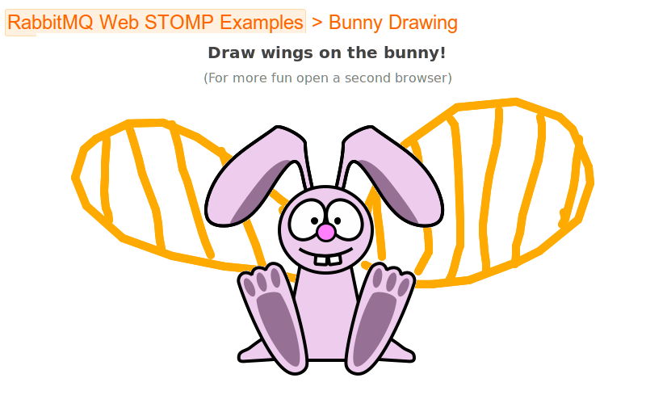

For quite a while here, at RabbitMQ headquarters, we were struggling to
find a good way to expose messaging in a web browser. In the past we tried many
things ranging from the old-and-famous JsonRPC plugin (which basically
exposes AMQP via AJAX), to Rabbit-Socks (an attempt to create a generic
protocol hub), to the management plugin (which can be used for basic
things like sending and receiving messages from the browser).

Over time we've learned that the messaging on the web is very different
to what we're used to. None of our attempts really addressed
that, and it is likely that messaging on the web will not be a fully
solved problem for some time yet.

That said, there is a simple thing RabbitMQ users keep on asking
about, and although not perfect, it's far from the worst way do messaging
in the browser: exposing STOMP through Websockets.

<!-- truncate -->

## STOMP + Websockets

We're delighted to introduce a new plugin for RabbitMQ:

* [RabbitMQ-Web-Stomp](https://github.com/rabbitmq/rabbitmq-server/tree/main/deps/rabbitmq_web_stomp)

It is basically a bridge between [RabbitMQ-STOMP](https://github.com/rabbitmq/rabbitmq-stomp)
plugin and a Websockets server ([SockJS](http://sockjs.org)). Hopefully, it is a decent solution
for a set of rabbit-on-the-web use cases.

## What it actually does

### Within RabbitMQ 

RabbitMQ-Web-Stomp is a simple beast. It takes the STOMP
protocol as provided by the RabbitMQ-STOMP plugin and exposes it using
the SockJS server.

### Wire protocol

One can connect to the SockJS endpoint from any browser using the reliable
SockJS protocol. This will work even in browsers that don't support
native websockets or in environments behind broken proxies that block non-http
transports.

Alternatively, for users that don't need this level of sophistication,
SockJS exposes a raw websockets url that can be accessed directly from
a recent, websocket-capable browser.

### In the browser

Within the browser, the connection to SockJS endpoint is basically
a raw STOMP connection. You can send and receive normal STOMP frames.

Any decent javascript STOMP library should be able to handle that.
For our examples we're using the [stomp-websocket](https://github.com/jmesnil/stomp-websocket/) library by [Jeff Mesnil](https://github.com/jmesnil) and [Jeff Lindsay](https://github.com/progrium).

We use this code in the examples:

```html
<script src="http://cdn.sockjs.org/sockjs-0.3.min.js"></script>
<script src="stomp.js"></script>
<script>
   WebSocketStompMock = SockJS;

    var client = Stomp.client('http://127.0.0.1:55674/stomp');
    [...]

```

## Installation

[Rabbitmq-Web-Stomp](https://github.com/rabbitmq/rabbitmq-server/tree/main/deps/rabbitmq_web_stomp) is an experimental plugin.
It's not distributed with vanilla RabbitMQ releases; you need to install it manually.

1. You need at least Erlang R14 ([more info](/docs/which-erlang)).
2. You need [Rabbitmq-server 2.8.2](/docs/download) installed
3. Grab the needed erlang plugin .ez files:

```shell
wget \
  https://www.rabbitmq.com/releases/plugins/v2.8.2-web-stomp-preview/cowboy-0.5.0-rmq2.8.2-git4b93c2d.ez \
  https://www.rabbitmq.com/releases/plugins/v2.8.2-web-stomp-preview/sockjs-0.2.1-rmq2.8.2-gitfa1db96.ez \
  https://www.rabbitmq.com/releases/plugins/v2.8.2-web-stomp-preview/rabbitmq_web_stomp-2.8.2.ez \
  https://www.rabbitmq.com/releases/plugins/v2.8.2-web-stomp-preview/rabbitmq_web_stomp_examples-2.8.2.ez
```

4. Next, copy them to the [plugins directory](/docs/plugins#plugin-directories). For example, on my Ubuntu box this will be:

```shell
sudo cp *.ez /usr/lib/rabbitmq/lib/rabbitmq_server-2.8.2/plugins
```

5. Now, you're ready to enable them using [rabbitmq-plugins](/docs/plugins):

```shell
sudo rabbitmq-plugins enable rabbitmq_web_stomp
sudo rabbitmq-plugins enable rabbitmq_web_stomp_examples
```

6. Restart the rabbitmq server. On ubuntu:

```shell
sudo /etc/init.d/rabbitmq-server restart
```

As you may have noticed, we enabled two plugins:

* First, [RabbitMQ-web-stomp](https://github.com/rabbitmq/rabbitmq-server/tree/main/deps/rabbitmq_web_stomp), which is the main
plugin. It exposes SockJS endpoint on port 55674, like: [http://127.0.0.1:55674/stomp](http://127.0.0.1:55674/stomp).
* Second,
[RabbitMQ-web-stomp-examples](https://github.com/rabbitmq/rabbitmq-server/tree/main/deps/rabbitmq_web_stomp_examples), which
only hosts a few javascript and html files with examples. This is accessible under:
[http://127.0.0.1:55670/](http://127.0.0.1:55670/).

Keep in mind, that RabbitMQ-web-stomp depends on [RabbitMQ-STOMP](/docs/stomp) which by default will bind to port 61613.

## The usage

If you enabled RabbitMQ-web-stomp-examples plugin, you should be able
to instantly run two examples prepared by us. Just open a web
browser at [http://127.0.0.1:55670/](http://127.0.0.1:55670/).

* ["echo"](http://127.0.0.1:55670/web-stomp-examples/echo.html) - shows how to use STOMP to do
simple message broadcasting ([source](https://github.com/rabbitmq/rabbitmq-server/tree/main/deps/rabbitmq_web_stomp_examples/blob/master/priv/echo.html))


* ["bunny"](http://127.0.0.1:55670/web-stomp-examples/bunny.html) - example of a simple
collaboration canvas painting app ([source](https://github.com/rabbitmq/rabbitmq-server/tree/main/deps/rabbitmq_web_stomp_examples/blob/master/priv/bunny.html))



## Summary

RabbitMQ-web-stomp is quite a simple plugin, but opens wide possibilities,
exposing the STOMP protocol to the browser.

Like always, feedback welcome. We're also looking for inspiration for
more examples!
