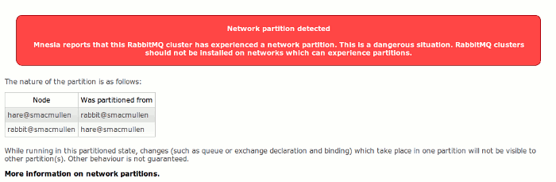
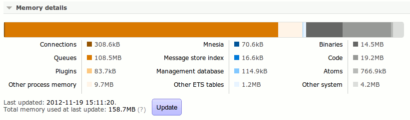
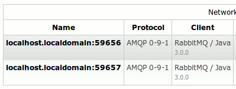

So we've talked about how [RabbitMQ 3.0 can break things](/blog/2012/11/19/breaking-things-with-rabbitmq-3-0), but that's not very positive. Let's have a look at some of the new features! Just some of them - [quite a lot changed in 3.0](https://www.rabbitmq.com/release-notes/README-3.0.0.txt), and we don't have all day...
<!-- truncate -->

## Policy-based mirroring

You can now [define queue mirroring](/docs/3.13/ha) in a much simpler and more flexible way. Your applications no longer need to know about it, and can work the same way in development and production. You can take an existing unmirrored queue and make it become mirrored with no downtime (and vice versa of course). Furthermore you can now mirror queues on to a set number of nodes in a cluster.

## Faster mirroring

Mirrored queues have also become much faster - while the improvement in performance depends on a variety of factors, it is not unknown to see mirrored queues running an order of magnitude faster, or even more.

## Dynamic federation

Federation has also become [more flexible, transparent to applications, and dynamic](/docs/federation). You can federate or unfederate exchanges at any time; and add, remove and reconfigure upstreams without changing anything.

## New clustering commands

Clustering is now easier to [set up](/docs/clustering), and more checks for cluster consistency are performed at each step in the process. It's also now possible to remove a dead node from a cluster without its cooperation.

## Partition detection

[Network partitions](/docs/partitions) in clusters are a bad thing - so RabbitMQ will now display a large warning in the management plugin when one has occurred (this is also available in `rabbitmqctl cluster\_status`).

## Per-message TTL

As well as being able to specify a TTL for messages on a per-queue basis, individual messages can also [have a TTL set](/docs/ttl#per-message-ttl-in-publishers) when they are published.

## Enabling heartbeats by default

Since so many people have experienced problems with long-running idle connections being interrupted by network infrastructure, the server now proposes AMQP heartbeats every 10 minutes by default during connection negotiation. This value can be [configured here](/docs/configure#configuration-files).

## Memory use statistics

It's now possible to get a simple overview of [where the memory used by your broker is going](/docs/memory-use).

## Background GC

Certain long-running processes have ended up consuming a lot of memory while waiting for garbage collection. RabbitMQ now forcibly GCs idle processes in the background, cutting down on excess memory use.

## Reverse DNS lookups

Just a small thing - but you can now have RabbitMQ perform reverse DNS lookups on connecting clients to give clearer names in management and rabbitmqctl. Just set `{reverse\_dns\_lookups, true}` in your [rabbitmq.config](/docs/configure#configuration-files).

## Web-STOMP and MQTT

We've added plugins to support [STOMP-over-websockets](/blog/2012/05/14/introducing-rabbitmq-web-stomp) (with SockJS support for non-websocket browsers) and [MQTT 3.1](https://www.ibm.com/developerworks/webservices/library/ws-mqtt/). We've also added support for [STOMP 1.2](http://stomp.github.com/stomp-specification-1.2.html).
