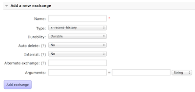

RabbitMQ is a very extensible message broker, allowing users to extend the server's functionality by writing plugins. Many of the broker features are even shipped as plugins that come by default with the broker installation: the [Management Plugin](/docs/management), or [STOMP](/docs/stomp) support, to name just a couple. While that's pretty cool, the fact that plugins must be written in Erlang is sometimes a challenge. I decided to see if it was possible to write plugins in another language that targeted the Erlang Virtual Machine (EVM), and in this post I'll share my progress.

<!-- truncate -->

## Elixir

In the last couple of months I've been paying attention to a new programming language called [*Elixir*](http://elixir-lang.org) that targets the EVM, and in the last week it became immensely popular inside the Erlang community (and other circles) since [Joe Armstrong](https://twitter.com/joeerl), the father of Erlang, [tried the language](https://joearms.github.io/#2013-05-31%20A%20week%20with%20Elixir), and liked it very much. So I said, OK, let's give it a try.

I don't want to spend much time describing what Elixir is - it's better if you read the website or Joe Armstrong's blog post about it. For me, it brings ideas from the Ruby language to the Erlang platform. We can essentially write Erlang programs with an arguably better syntax (for some definitions of *better syntax*).

Compare this Erlang Hello World program, taken from the Elixir website:

```erlang
-module(module_name).
-compile(export_all).

hello() ->
  io:format("~s~n", ["Hello world!"]).
```

With this one in Elixir, also from their website:

```elixir
# module_name.ex

defmodule ModuleName do
  def hello do
    IO.puts "Hello World"
  end
end
```

While this example is quite trivial, I think for someone that has never seen Erlang syntax, the Elixir version is easier to read. From my point of view, I always liked Erlang's syntax, since it makes the semantics of Erlang concepts stand out and is very clear what's going on, but again, that's my own point of view.

Considering that people might prefer to write RabbitMQ plugins with Elixir, let's see how that could be done.

## Writing RabbitMQ Plugins

To write plugins for RabbitMQ you will need to setup your development environment to use the tools, Makefiles and libraries provided by the *rabbitmq public umbrella*. You can follow the setup instructions from [here](/plugin-development). Once you have cloned the `http://hg.rabbitmq.com/rabbitmq-public-umbrella` project and have all the dependencies installed, we can start writing our own plugin. To do it with Elixir, you first need to install the language on your machine, so you can use the Elixir compiler (`mix`) and the language libraries.

When you write RabbitMQ plugins you may want to use some Erlang libraries with your plugin, to do that you need to *wrap them* as a plugin as well, so they can be picked up by the build environment when you declare a library as a dependency of your project. In this case our new plugins will depend on Elixir, so we need to wrap the language libraries as a plugin. I've done that already and you can just clone the [elixir_wrapper](https://github.com/videlalvaro/elixir_wrapper) from Github and follow the instructions on its README to get it installed.

Now is time to create our own plugin. As an example I've ported a plugin called *recent-history-exchange* to Elixir. As the name implies, it adds a new exchange type to RabbitMQ. Exchanges are routing algorithms that RabbitMQ uses to decide where your messages are going to end up. If you want to read more about exchanges go [here](/tutorials/amqp-concepts).

The code for the new exchange can be found on Github: [RabbitMQ Recent History Exchange](https://github.com/videlalvaro/rabbitmq-recent-history-exchange-elixir).

The code for the new exchange type lives inside the file `lib/rabbit_exchange_type_recent_history.ex`, where we implement the `rabbit_exchange_type` behaviour. The overridden methods are: `route/2`, `delete/3` and `add_binding`. What this exchange does is to cache the last 20 messages while they are routed to queues. Whenever a new queue is bound to the exchange, we deliver those last 20 messages to it. Finally, when the exchange is deleted we remove those entries from the database. When is this useful? Say you implement a chat room with RabbitMQ, and you want people that join the room to get the last messages sent to the room - this is a simple way to accomplish that.

While you could understand most of the code if you looked at an [Elixir Tutorial](https://elixir-lang.org/getting_started/1.html) first, there are some points worth noting, since for me it was not so clear on how to port them into Elixir. If you want to take a look at the original project I was porting from Erlang go look [here](https://github.com/videlalvaro/rabbitmq-recent-history-exchange).

### Module Attributes

RabbitMQ uses a concept of *boot steps* in order to start the broker. Those boot steps are scanned when the broker starts, and from there plugins are automatically picked up by the server. They are declared as module attributes, so my first blocker was how to add a module attribute to Elixir. Assuming we have the following module:

```elixir
defmodule RabbitExchangeTypeRecentHistory do
end
```

To add an attribute to it like the ones expected by RabbitMQ we have to do so like this:

```elixir
defmodule RabbitExchangeTypeRecentHistory do

  Module.register_attribute __MODULE__,
       :rabbit_boot_step,
       accumulate: true, persist: true

  @rabbit_boot_step { __MODULE__,
                     [{:description, "exchange type x-recent-history"},
                      {:mfa, {:rabbit_registry, :register,
                              [:exchange, <<"x-recent-history">>, __MODULE__]}},
                      {:requires, :rabbit_registry},
                      {:enables, :kernel_ready}]
end
```

First we have to register our attribute by calling `Module.register_attribute` and then we can use it in our code as in this example.

### Behaviours

Declaring behaviours in our modules is quite easy. We just need to add a behaviour attribute to our module like this:

```elixir
@behaviour :rabbit_exchange_type
```

### Erlang Records

When you develop RabbitMQ plugins (and probably whenever you interop with Erlang libraries) you will need to use the records defined in the library. This isn't as straightforward as I was expecting. We have to import the record definitions into Elixir. For example, to have the `#exchange` record from RabbitMQ we have to do this:

```elixir
defmodule RabbitExchangeTypeRecentHistory do  
  defrecord :exchange, Record.extract(:exchange, from_lib: "rabbit_common/include/rabbit.hrl")
end
```

Keep in mind here that  I'm just showing snippets of the code. You don't need to define the `RabbitExchangeTypeRecentHistory` module every time.

## Building the Plugin

Once we finish implementing our plugin we might want to build it, after all there's a reason why we spent all this time on it! To do so we need to add two `Makefiles` into our project folder in order to integrate with RabbitMQ's build system.

The first is called `Makefile` and it includes just one line:

```makefile
include ../umbrella.mk
```

The second one is a bit more involved. Here we specify the dependencies of our project and we tell the RabbitMQ build system how to compile our Elixir code.

```makefile
DEPS:=rabbitmq-server rabbitmq-erlang-client elixir_wrapper
RETAIN_ORIGINAL_VERSION:=true
ORIGINAL_VERSION:=0.1
DO_NOT_GENERATE_APP_FILE:=

CONSTRUCT_APP_PREREQS:=mix-compile
define construct_app_commands
	mkdir -p $(APP_DIR)/ebin
	cp $(PACKAGE_DIR)/ebin/* $(APP_DIR)/ebin
endef

define package_rules

$(PACKAGE_DIR)/deps/.done:
	rm -rf $$(@D)
	mkdir -p $$(@D)
	@echo [elided] unzip ezs
	@cd $$(@D) &amp;&amp; $$(foreach EZ,$$(wildcard $(PACKAGE_DIR)/build/dep-ezs/*.ez),unzip -q $$(abspath $$(EZ)) &amp;&amp;) :
	touch $$@

mix-compile: $(PACKAGE_DIR)/deps/.done
	mix clean
	ERL_LIBS=$(PACKAGE_DIR)/deps mix compile

endef
```

I won't explain this code line-by-line, just the interesting bits. On the first line we declare our plugin's dependencies. In this case we depend on the `rabbitmq server` and the `rabbitmq-erlang-client` in order to have access to all the behaviours and records required by our plugin. Of course, we also depend on the Elixir libraries that will be shipped with our plugin.

Next, we define some make targets to compile our plugin and package it inside an `.ez` file (RabbitMQ plugins are shipped as .ez files). The `mix-compile` target will build our Elixir code. As you might have noticed it sets the `ERL_LIBS` variable to our plugin's `./deps` folder. For that to work we first need to have the dependencies unpacked there, so the make rule `$(PACKAGE_DIR)/deps/.done` unpacks the previously built dependencies into that folder.

Finally our `define construct_app_commands` will copy our `.beam` files into the destination folder so the RabbitMQ build system will be able to find them and ship them inside our plugin `.ez` file.

Once we have everything in place it's time to actually build our plugin. We can do so by simply calling `make` inside the plugin folder.

Once the build process has finished, we can find the `.ez` files inside the `dist` folder

```shell
ls dist/
amqp_client-3.3.1.ez
elixir-0.9.2.dev-rmq3.3.1-git7c379aa.ez
rabbit_common-3.3.1.ez
rabbitmq_recent_history_exchange_elixir-0.1-rmq3.3.1.ez
```

From that list of files we only need to distribute `rabbitmq_recent_history_exchange_elixir-0.1-rmq3.3.1.ez` and `elixir-0.9.2.dev-rmq3.3.1-git7c379aa.ez` as part of our plugin.

## Installing the Plugin

Copy the files `rabbitmq_recent_history_exchange_elixir-0.1-rmq3.3.1.ez` and `elixir-0.9.2.dev-rmq3.3.1-git7c379aa.ez` into the `plugins` folder of your RabbitMQ installation and then activate the plugin by running: 

```shell
./sbin/rabbitmq-plugins enable rabbitmq_recent_history_exchange_elixir
```

Once we start the broker we can see in the management interface that we can now add exchanges of the type `x-recent-history`.



## Coda

And that's that. We can build RabbitMQ plugins using Elixir! Most of the *yak shaving* is done already, and we just need to use the `elixir_wrapper` and create the proper `package.mk` file for our plugin. From there it's just a matter of invoking `make`. Please share your thoughts in the comments section and if you build a RabbitMQ plugin using Elixir please share it and let me know.
