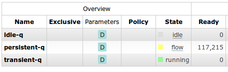
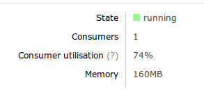

One of the goals for RabbitMQ 3.3 was that you should be able to find bottlenecks in running systems more easily. Older versions of RabbitMQ let you see that you were rate-limited but didn't easily let you see why. In this blog post we'll talk through some of the new performance indicators in version 3.3.
<!-- truncate -->

### Understanding flow control

Since the introduction of flow control in RabbitMQ 2.8.0, you've been able to see when a connection has gone into the flow-controlled state. This (roughly) means that the client is being rate-limited; it would like to publish faster but the server can't keep up. Of course, the next question you'll want to ask is "why?".

The flow control mechanism has always extended throughout the server; not just connections but channels and queues can be in the flow-control state, meaning that they would like to publish messages faster, but something ahead of them can't keep up. So to make sense of the new flow control information you need to know that **a component will go into flow control if anything it is publishing to is a bottleneck - or is in flow control itself**. The order that components handle messages on their way into the server is:

*Network*  
   &#x2193;  
**Connection process** - AMQP parsing, channel multiplexing  
   &#x2193;  
**Channel process** - routing, security, coordination  
   &#x2193;  
**Queue process** - in-memory messages, persistent queue indexing  
   &#x2193;  
**Message store** - message persistence  

So what possible outcomes are there?

* *A connection is in flow control, but none of its channels are* - This means that one or more of the channels is the bottleneck; the server is CPU-bound on something the channel does, probably routing logic. This is most likely to be seen when publishing small transient messages.
* *A connection is in flow control, some of its channels are, but none of the queues it is publishing to are* - This means that one or more of the queues is the bottleneck; the server is either CPU-bound on accepting messages into the queue or I/O-bound on writing queue indexes to disc. This is most likely to be seen when publishing small persistent messages.
* *A connection is in flow control, some of its channels are, and so are some of the queues it is publishing to* - This means that the message store is the bottleneck; the server is I/O-bound on writing messages to disc. This is most likely to be seen when publishing larger persistent messages.

### Consumer utilisation

So hopefully you can now better understand the performance of the publishing side of your server. So what about the consuming side? The flow control mechanism doesn't extend as far as consumers, but we do have a new metric to help you tell how hard your consumers are working.

That metric is *consumer utilisation*. The definition of **consumer utilisation is the proportion of time that a queue's consumers could take new messages**. It's thus a number from 0 to 1, or 0% to 100% (or N/A if the queue has no consumers). So if a queue has a consumer utilisation of 100% then it never needs to wait for its consumers; it's always able to push messages out to them as fast as it can.

If its utilisation is less than 100% then this implies that its consumers are sometimes not able to take messages. Network congestion can limit the utilisation you can achieve, or low utilisation can be due to the use of too low a [prefetch limit](/blog/2014/04/03/an-end-to-synchrony-performance-improvements-in-3-3), leading to the queue needing to wait while the consumer processes messages until it can send out more.

The following table shows some approximate values for consumer utilisation I observed when consuming tiny messages over localhost with a single consumer:

|Prefetch limit|Consumer utilisation|
|--- |--- |
|1|14%|
|3|25%|
|10|46%|
|30|70%|
|1000|74%|

You can see that the utilisation increases with the prefetch limit until we reach a limit of about 30. After that the network bandwidth limitation starts to dominate and increasing the limit has no further benefit. So you can see that consumer utilisation is an easy way to monitor the performance of our consumers.

## Learn More

* Webinar: [What's new in RabbitMQ 3.8?](https://content.pivotal.io/webinars/may-23-what-s-new-in-rabbitmq-3-8-webinar?utm_campaign=rabbitmq-blog-3.8-webinar-q319&utm_source=rabbitmq&utm_medium=website)
* Webinar: [10 Things Every Developer Using RabbitMQ Should Know](https://content.pivotal.io/webinars/dec-12-10-things-every-developer-using-rabbitmq-should-know-webinar?utm_campaign=rabbitmq-blog-10-things-q319&utm_source=rabbitmq&utm_medium=website)

Process finished with exit code 0
