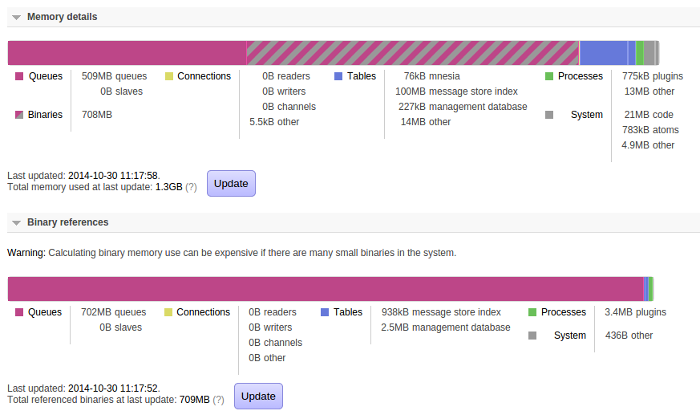
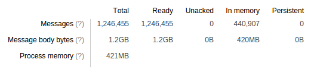
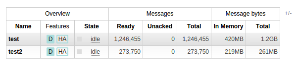

"How much memory is my queue using?" That's an easy question to ask, and a somewhat more complicated one to answer. RabbitMQ 3.4 gives you a clearer view of how queues use memory. This blog post talks a bit about that, and also explains queue memory use in general.

<!-- truncate -->

## A bit of background

First of all we need to understand how Erlang manages memory. Erlang is a bit different from most garbage-collected languages in that it does not have a global heap. Instead, **each process has a separate heap** that's private to it. In RabbitMQ terms process might be queues, channels, connections and so on. This means that the entire system does not have to come to a halt every time garbage collection needs to happen; instead each process collects garbage on its own schedule.

That's fine, but as a message passes through RabbitMQ, it will pass through several different processes. We'd like to avoid doing too much copying as this happens. Therefore Erlang gives us a different memory management scheme for *binaries*, which are used for a number of things inside RabbitMQ, of which the most interesting is message bodies. **Binaries are shared between processes** and reference-counted (with references being held by processes and garbage-collected along with everything else).

## How this applies to RabbitMQ

This means that memory used by message bodies is shared among processes in RabbitMQ. And this sharing also happens between queues too: **if an exchange routes a message to many queues, the message body is only stored in memory once**.

So we can see that asking "how much memory does this queue use?" is a hard question to answer - we can exclude any binary memory which might be referenced by the queue, leading to under-counting, or include it, potentially leading to over-counting.

Earlier versions of RabbitMQ did not attempt to do much with this quandary; they reported the "memory use" of the queue as the size of the process memory (i.e. not including any referenced binaries) and showed a monolithic lump of "binary memory use" in the global memory breakdown. There was no way to investigate further.

RabbitMQ 3.4 gives us some better guidance, both from the top down and from the bottom up. First of all, let's look at a top-down view of memory use:

There are a couple of differences here from what we used to have. The overall memory use breakdown now has rather more categories, and there's a new binary memory "breakdown".

We show the binary memory breakdown separately for a couple of reasons; one is that it can be quite expensive to calculate (we have to walk over all memory used by the server; if there are large numbers of small binaries this can take a while) and another is that we don't guarantee it will add up to the size shown in the overall memory breakdown (due to the way binaries are shared as mentioned above).

But we can see here that almost all binary use is due to messages in queues. This screenshot was taken from a mostly static broker, so that's what we'd expect.

## But what about the queues?

OK, but **which** queues are using all that memory? We can investigate that by looking at the details page for each queue (this information is of course also available via `rabbitmqctl` but pictures are nicer to look at):

Here we can see another new feature of RabbitMQ 3.4: the queue maintains a count of the total number of message body bytes it contains. So we see that this queue contains 1.2GB of message body content, of which 420MB is in memory. We can assume that the 420MB is all in the binary memory used by queues. The queue is also using 421MB of process memory (a very similar amount purely by coincidence) - this includes message properties and headers, and metadata about each message.

It would therefore be reasonable to say "this queue is using 841MB of memory" - except that the message bodies might also be shared with other queues.

As an aside, note that "In memory" and "Persistent" messages are not antonyms here: a non-persistent message can be paged out under memory pressure and a persistent message can be in memory too. See [the documentation](/docs/3.13/memory#paging) for a bit more information about paging.

We can also see this information in the queue list view:

(Here I've clicked on the "+/-" link to add columns to show memory use and remove some others for clarity.)

Of course, this still doesn't give a perfect count of how much memory is in use by a queue; such a thing is probably impossible in a dynamic system. But it gets us much closer.
