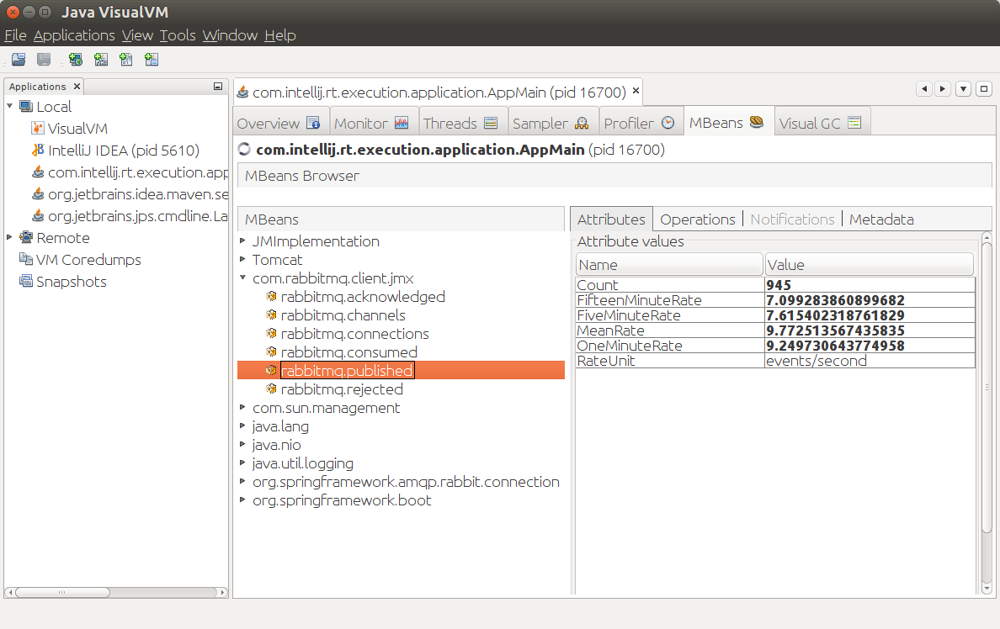

[Version 4.0 of the RabbitMQ Java Client](/blog/2016/11/24/rabbitmq-java-client-4-0-is-released) brings support for runtime metrics. This can be especially useful to know how a client application is behaving. Let's see how to enable metrics collection and how to monitor those metrics on JMX or even inside a Spring Boot application.

<!-- truncate -->

## Metrics activation

Metrics are collected at the `ConnectionFactory` level, through the `MetricsCollector` interface. The Java Client comes with one implementation, `StandardMetricsCollector`, which uses the [Dropwizard Metrics](http://metrics.dropwizard.io/) library. 

Dropwizard Metrics is mature and widely used across the Java community, so we thought it'd make sense to make it our default metrics library. Nevertheless, you can come up with your own `MetricsCollector` implementation if your application has specific needs in terms of metrics.

Note metrics collection is disabled by default, so it doesn't impact users who don't want to have runtime metrics.

Here is how to enable metrics collection with the default implementation and then get the total number of published messages with all the connections created from this `ConnectionFactory`:

```java
ConnectionFactory connectionFactory = new ConnectionFactory();
StandardMetricsCollector metrics = new StandardMetricsCollector();
connectionFactory.setMetricsCollector(metrics);    
// later in the code
long publishedMessagesCount = metrics.getPublishedMessages().getCount();
```

Other available metrics are open connections and channels, consumed messages, acknowledged messages, and rejected messages.

Using metrics inside the application code usually doesn't make much sense: those metrics are rather meant to be sent to some monitoring backends. Fortunately, Dropwizard Metrics support many of those: JMX, Graphite, Ganglia, even CSV file export. Let's see how to use it with JMX, a Java standard to manage and monitor applications.

## With JMX

Dropwizard Metrics has built-in support for JMX thanks to the `JmxReporter` class. The `MetricRegistry` just needs to be shared between the `StandardMetricsCollector` and the `JmxReporter`:

```java
MetricRegistry registry = new MetricRegistry();
StandardMetricsCollector metrics = new StandardMetricsCollector(registry);

ConnectionFactory connectionFactory = new ConnectionFactory();
connectionFactory.setMetricsCollector(metrics);

JmxReporter reporter = JmxReporter
    .forRegistry(registry)
    .inDomain("com.rabbitmq.client.jmx")
    .build();
reporter.start();
```

Pretty straightforward. You can then use any JMX-compliant client, like [Java VisualVM](https://visualvm.github.io/) (with the [appropriate plugin](https://visualvm.github.io/plugins.html)) to browse the metrics.



As stated above, Dropwizard Metrics supports many monitoring backends, feel free to consult the library documentation to see how to send your metrics to those backends.

Let's see now how to integrate the RabbitMQ Java Client metrics with Spring Boot.

## With Spring Boot's metrics endpoint

Many RabbitMQ users are using the Java Client through [Spring AMQP](https://projects.spring.io/spring-amqp/) and [Spring Boot](https://projects.spring.io/spring-boot/). Spring Boot also supports Dropwizard Metrics in its [`/metrics` endpoint](http://docs.spring.io/spring-boot/docs/current/reference/htmlsingle/#production-ready-metrics), one of the very useful endpoints the [Spring Boot Actuator](http://docs.spring.io/spring-boot/docs/current/reference/htmlsingle/#production-ready) provides.

As soon as Spring Boot detects Dropwizard Metrics on the classpath, it creates a `MetricRegistry` bean. It doesn't take long to retrieve this bean and use it in our `StandardMetricsCollector`. Note Spring Boot automatically creates the necessary resources (RabbitMQ's `ConnectionFactory` and Spring AMQP's `CachingConnectionFactory`) if it detects Spring AMQP on the classpath. The glue code to add to a configuration class isn't obvious but it's at least straightforward:

```java
@Autowired CachingConnectionFactory connectionFactory;
@Autowired MetricRegistry registry;

@PostConstruct
public void init() {
    ConnectionFactory rabbitConnectionFactory = connectionFactory.getRabbitConnectionFactory();
    StandardMetricsCollector metrics = new StandardMetricsCollector(registry);
    rabbitConnectionFactory.setMetricsCollector(metrics);
} 
```

Once the Spring Boot web application is up, go to `http://localhost:8080/metrics` and you should see the RabbitMQ Java Client metrics:

```json
{
    ...
    "rabbitmq.acknowledged.count": 5445,
    "rabbitmq.acknowledged.fifteenMinuteRate": 7.789880284345983,
    "rabbitmq.acknowledged.fiveMinuteRate": 9.311935481093306,
    "rabbitmq.acknowledged.meanRate": 9.930420428656602,
    "rabbitmq.acknowledged.oneMinuteRate": 9.972266275538352,
    "rabbitmq.channels": 2,
    "rabbitmq.connections": 1,
    "rabbitmq.consumed.count": 5445,
    "rabbitmq.consumed.fifteenMinuteRate": 7.789875530041546,
    "rabbitmq.consumed.fiveMinuteRate": 9.311910098253794,
    "rabbitmq.consumed.meanRate": 9.930418948751754,
    "rabbitmq.consumed.oneMinuteRate": 9.972238610447798,
    "rabbitmq.published.count": 5445,
    "rabbitmq.published.fifteenMinuteRate": 7.789875530041546,
    "rabbitmq.published.fiveMinuteRate": 9.311910098253794,
    "rabbitmq.published.meanRate": 9.930419905146142,
    "rabbitmq.published.oneMinuteRate": 9.972238610447798,
    "rabbitmq.rejected.count": 0,
    "rabbitmq.rejected.fifteenMinuteRate": 0,
    "rabbitmq.rejected.fiveMinuteRate": 0,
    "rabbitmq.rejected.meanRate": 0,
    "rabbitmq.rejected.oneMinuteRate": 0,
    ...
}
```

Neat isn't it? Plugging the RabbitMQ Java Client metrics on the `/metrics` endpoint is explicit right now, but this [should hopefully become automatic](https://github.com/spring-projects/spring-boot/pull/7499) (as in Spring Boot auto-configuration) as long as the appropriate conditions are met (Dropwizard Metrics and RabbitMQ Java Client version 4.0 or more on the classpath).

## Wrapping up

Operators and developers can now have more insights about applications using the RabbitMQ Java Client. Available metrics can tell you whether the application is operating normally or not. And thanks to Dropwizard Metrics large range of supported backends, plugging the Java Client metrics on your favorite monitoring tool should be straightforward.

[Source code](https://github.com/acogoluegnes/rabbitmq-java-client-metrics-blog-post)

