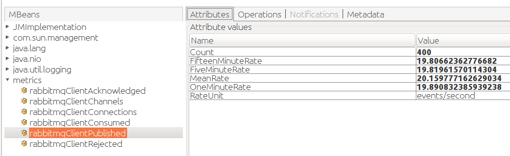
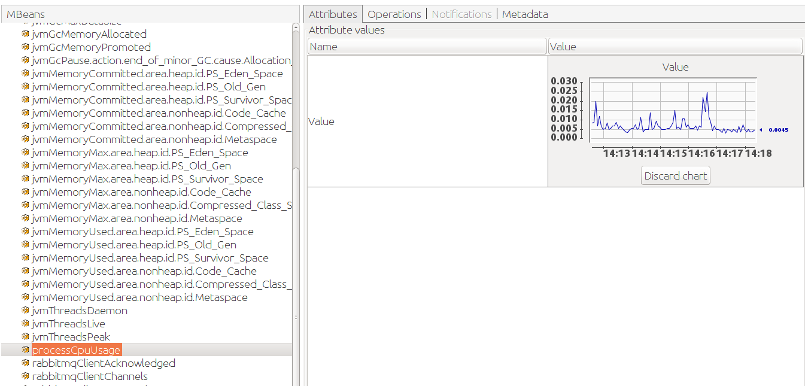
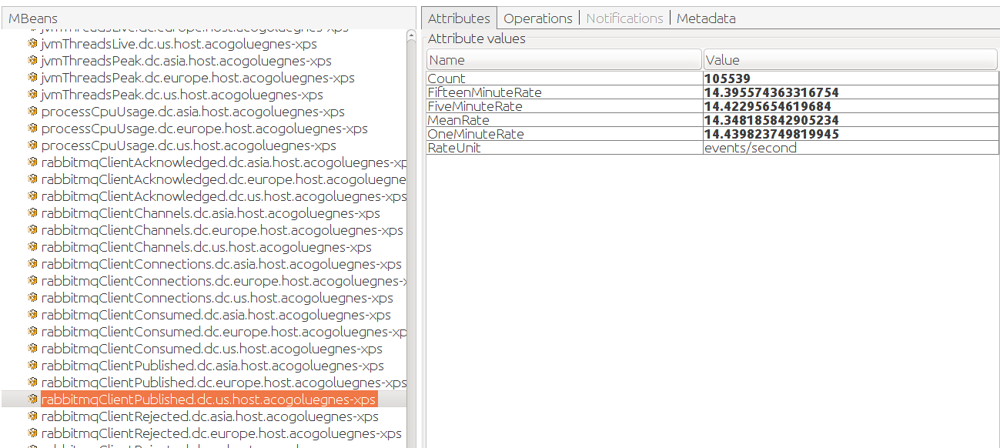
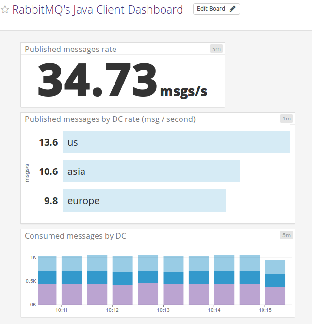

In this post we'll cover how the RabbitMQ Java client library gathers runtime metrics and sends them to monitoring systems like JMX and Datadog.

<!-- truncate -->

## Micrometer in RabbitMQ Java Client

The Java client provides support for [Micrometer](http://micrometer.io/) as of 4.6.0 and 5.2.0. What does this bring to the table? Micrometer is a metrics facade: an application can use the Micrometer API for metrics collection and choose to send these metrics to different backends like JMX, Prometheus, Netflix Atlas, CloudWatch, Datadog, Graphite, Ganglia, and more.
Next lets see how RabbitMQ Java client's users can benefit from Micrometer has to offer. 

We can start by gathering the Java client metrics and exposing them on JMX with Micrometer:

```java
MeterRegistry jmxRegistry = new JmxMeterRegistry(JmxConfig.DEFAULT, Clock.SYSTEM);
ConnectionFactory connectionFactory = new ConnectionFactory();
MicrometerMetricsCollector metricsCollector = new MicrometerMetricsCollector(
    jmxRegistry, "rabbitmq.client"
);
connectionFactory.setMetricsCollector(metricsCollector);

Connection connection = connectionFactory.newConnection();
Channel channel = connection.createChannel();
String queue = channel.queueDeclare().getQueue();
channel.basicConsume(queue, true, (ctag, msg) -> { }, (ctag) -> { });
executor.submit(() -> {
    Random random = new Random();
    while (true) {
        Thread.sleep(random.nextInt(100));
        channel.basicPublish("", queue, null, "".getBytes());
    }
});
```

Then these metrics can be inspected in [VisualVM](https://visualvm.github.io/download.html):



Nothing much new compared to what we had done with Dropwizard Metrics [in a previous post](/blog/2016/11/30/metrics-support-in-rabbitmq-java-client-4-0).

But Micrometer can easily bring value with metrics related to the JVM process. We simply have to bind the appropriate `MeterBinder`s to the JMX meter registry:

```java
MeterRegistry jmxRegistry = new JmxMeterRegistry(JmxConfig.DEFAULT, Clock.SYSTEM);
// JVM and system metrics:
new ClassLoaderMetrics().bindTo(jmxRegistry);
new JvmMemoryMetrics().bindTo(jmxRegistry);
new JvmGcMetrics().bindTo(jmxRegistry);
new ProcessorMetrics().bindTo(jmxRegistry);
new JvmThreadMetrics().bindTo(jmxRegistry);
ConnectionFactory connectionFactory = new ConnectionFactory();
MicrometerMetricsCollector metricsCollector = new MicrometerMetricsCollector(
    jmxRegistry, "rabbitmq.client"
);
connectionFactory.setMetricsCollector(metricsCollector);

Connection connection = connectionFactory.newConnection();
Channel channel = connection.createChannel();
String queue = channel.queueDeclare().getQueue();
channel.basicConsume(queue, true, (ctag, msg) -> { }, (ctag) -> { });
executor.submit(() -> {
    Random random = new Random();
    while (true) {
        Thread.sleep(random.nextInt(100));
        channel.basicPublish("", queue, null, "".getBytes());
    }
});
```

Then the new metrics show up in JVisualVM, there is a bunch of them:



In practice applications often have several instances running at once, sometimes distributed across different data centers. How can we identify an instance that runs in a given datacenter and make the monitoring system aware of this information? Micrometer provides metrics _tags_: it's a matter of adding the datacenter information to the metric collector. We can adapt our example program and iterate over a list of data centers to simulate distributed instances. We use the `dc` tag for the data center information, and add a `host` tag as well:

```java
for (String dc : new String[] {"us", "europe", "asia"}) {
    Tags tags = Tags.of("host", hostname, "dc", dc);
    MeterRegistry jmxRegistry = new JmxMeterRegistry(JmxConfig.DEFAULT, Clock.SYSTEM);
    new ClassLoaderMetrics(tags).bindTo(jmxRegistry);
    new JvmMemoryMetrics(tags).bindTo(jmxRegistry);
    new JvmGcMetrics(tags).bindTo(jmxRegistry);
    new ProcessorMetrics(tags).bindTo(jmxRegistry);
    new JvmThreadMetrics(tags).bindTo(jmxRegistry);
    ConnectionFactory connectionFactory = new ConnectionFactory();
    MicrometerMetricsCollector metricsCollector = new MicrometerMetricsCollector(
        jmxRegistry, "rabbitmq.client", tags
    );
    connectionFactory.setMetricsCollector(metricsCollector);

    Connection connection = connectionFactory.newConnection();
    Channel channel = connection.createChannel();
    String queue = channel.queueDeclare().getQueue();
    channel.basicConsume(queue, true, (ctag, msg) -> { }, (ctag) -> { });
    executor.submit(() -> {
        Random random = new Random();
        int offset = dc.length() * 10;
        while (true) {
            Thread.sleep(random.nextInt(100) + offset);
            channel.basicPublish("", queue, null, "".getBytes());
        }
    }); 
}
```

Let's see how it looks now in VisualVM:



There's now a really long list of metrics as Micrometer flattens the set of tag/key value pairs and adds them to the name. This is because JMX is a _hierarchical_ monitoring system, it doesn't support _dimensions_. This makes it hard to reason about our metrics as a whole, across all our instances and datacenters. And that would be even worse in real life: here we simulate different instances of our application in the same JVM process, but in a real system, we would have a tab for each process, even harder to reason about.

Fortunately, Micrometer takes advantage of _dimensional_ monitoring systems. Just imagine we can see the aggregated metrics of our different instances and drill down into a specific datacenter or a given host.

[Datadog](https://www.datadoghq.com/) is such a system, and Micrometer supports it out of the box. We can use a `DatadogMeterRegistry` and keep using JMX thanks to the `CompositeMeterRegistry`:

```java
for (String dc : new String[] {"us", "europe", "asia"}) {
    CompositeMeterRegistry compositeMeterRegistry = new CompositeMeterRegistry();
    MeterRegistry datadogRegistry = new DatadogMeterRegistry(config, Clock.SYSTEM);
    MeterRegistry jmxRegistry = new JmxMeterRegistry(JmxConfig.DEFAULT, Clock.SYSTEM);

    Tags tags = Tags.of("host", hostname, "dc", dc);
    new ClassLoaderMetrics(tags).bindTo(compositeMeterRegistry);
    new JvmMemoryMetrics(tags).bindTo(compositeMeterRegistry);
    new JvmGcMetrics(tags).bindTo(compositeMeterRegistry);
    new ProcessorMetrics(tags).bindTo(compositeMeterRegistry);
    new JvmThreadMetrics(tags).bindTo(compositeMeterRegistry);

    compositeMeterRegistry.add(datadogRegistry);
    compositeMeterRegistry.add(jmxRegistry);

    ConnectionFactory connectionFactory = new ConnectionFactory();
    MicrometerMetricsCollector metricsCollector = new MicrometerMetricsCollector(
        compositeMeterRegistry, "rabbitmq.client", tags
    );
    connectionFactory.setMetricsCollector(metricsCollector);

    Connection connection = connectionFactory.newConnection();
    Channel channel = connection.createChannel();
    String queue = channel.queueDeclare().getQueue();
    channel.basicConsume(queue, true, (ctag, msg) -> { }, (ctag) -> { });
    executor.submit(() -> {
        Random random = new Random();
        int offset = dc.length() * 10;
        while (true) {
            Thread.sleep(random.nextInt(100) + offset);
            channel.basicPublish("", queue, null, "".getBytes());
        }
    });
}
```

What happens under the hood? Micrometer gathers the metrics and send them every 10 seconds to the Datadog service through HTTPS. Note you need a Datadog API key for this to work, it is used in the Datadog registry configuration. The host and the metrics should show up in your Datadog web UI and you can easilly build a dashboard for your RabbitMQ Java client instances:



Neat isn't it?

## Going Further

Collecting metrics at a single level — say, a particular library such as the RabbitMQ Java client — is only a single step on the path
of gaining visibility into the entire service-oriented system.

Datadog also provides [support for RabbitMQ nodes and clusters](https://docs.datadoghq.com/integrations/rabbitmq/). A node needs to have the Datadog agent installed and this agent will connect to the [RabbitMQ Management Plugin](/docs/management) to gather metrics. Datadog engineers wrote a [series](https://www.datadoghq.com/blog/rabbitmq-monitoring/) of [blog posts](https://www.datadoghq.com/blog/rabbitmq-monitoring-tools) that cover [how to monitor RabbitMQ](https://www.datadoghq.com/blog/monitoring-rabbitmq-performance-with-datadog/). This is a piece of recommended reading for anyone interested in RabbitMQ operations.

Back to the client level, [Spring Boot](https://projects.spring.io/spring-boot/) is a popular way to write RabbitMQ applications in Java. Micrometer is the library that backs up Spring Boot 2.0 metrics system. RabbitMQ Java client metrics collection is [configured automatically](https://docs.spring.io/spring-boot/docs/2.0.0.RELEASE/reference/htmlsingle/#production-ready-metrics-rabbitmq), the developer doesn't even need to register any `MetricsCollector`.

In the world of microservices and IoT workloads where application instances spring up like mushrooms, we hope this makes it easier to gain visibility
into operations of your Java-based apps that use RabbitMQ for messaging thanks to these metrics!

[Source code](https://github.com/acogoluegnes/rabbitmq-java-client-micrometer-datadog)
