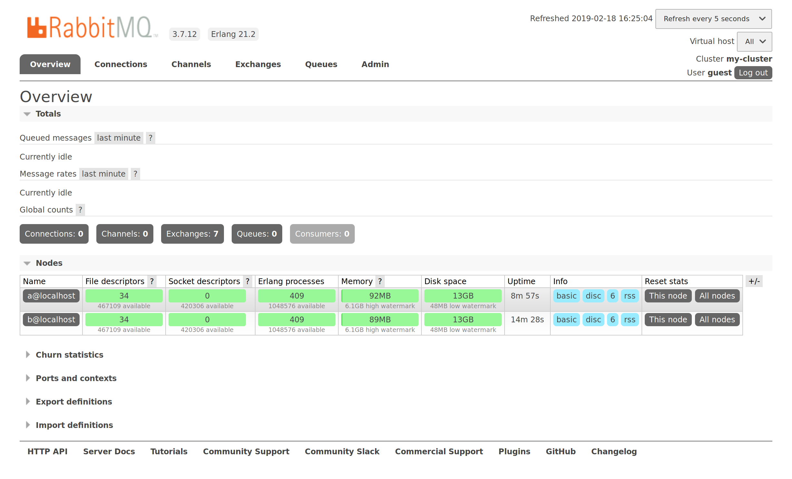
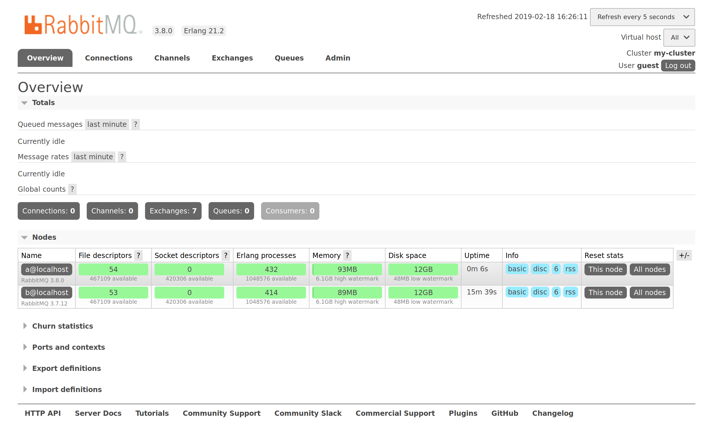
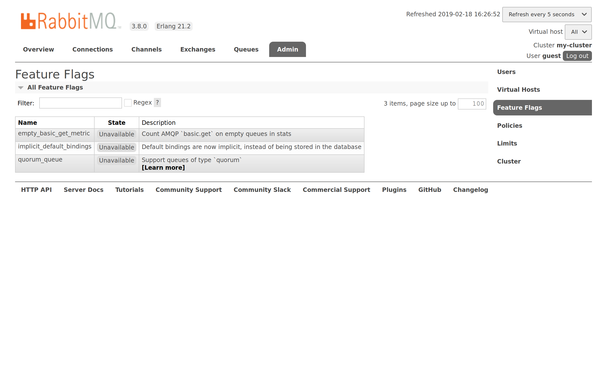
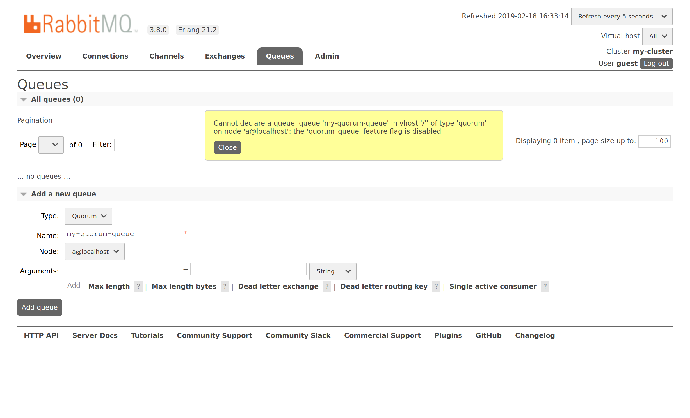
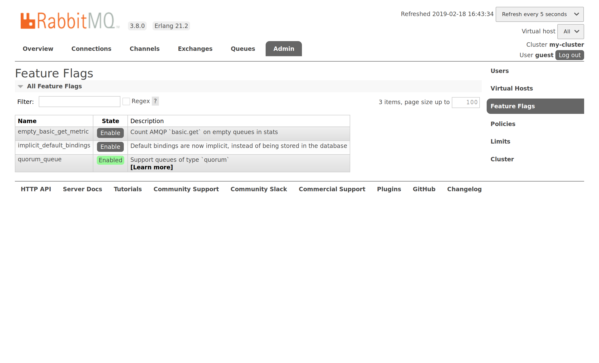
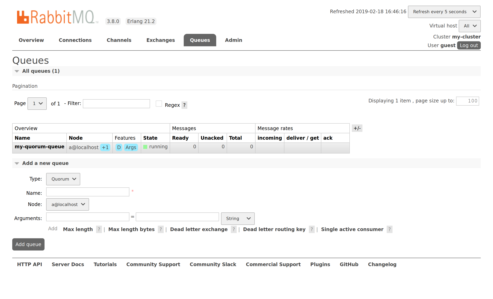

In this post we will cover **[feature flags](/docs/feature-flags)**, a new subsystem in RabbitMQ 3.8. Feature flags will allow a rolling cluster upgrade to the next minor version, without requiring all nodes to be stopped before upgrading.

<!-- truncate -->

## Minor Version Upgrades Today: RabbitMQ 3.6.x to 3.7.x

It you had to upgrade a cluster from RabbitMQ 3.6.x to 3.7.x, you probably had to use one of the following solutions:

* Deploy a new cluster alongside the existing one (this strategy is known as the [blue-green deployment](/docs/blue-green-upgrade)), then migrate data & clients to the new cluster
* Stop all nodes in the existing cluster, upgrade the last node that was stopped first, then continue upgrading all other nodes, one-by-one

Blue-green deployment strategy is low risk but also fairly complex to automate. On the other hand, a cluster-wide shutdown affects availability. Feature flags are meant to provide a 3rd option by making rolling cluster upgrades possible and reasonably easy to automate.

## The Feature Flags Subsystem

Feature flags indicate a RabbitMQ node's capabilities to its cluster peers. Previously nodes used versions to assess compatibility with cluster versions. There are many ways in which nodes in a distributed system can become incompatible, including Erlang and dependency versions. Many of those aspects are not reflected in a set of version numbers. Feature flags is a better approach as it can reflect more capabilities of a node, whether it is a particular feature or internal communication protocol revision. In fact, with some message protocols RabbitMQ supports clients have a mechanism for clients to indicate their capabilities. This allows client libraries to evolve and be upgraded independently of RabbitMQ nodes.

For example, RabbitMQ 3.8.0 introduces a new queue type, [quorum queues](/docs/quorum-queues). To implement them, an internal data structure and a database schema were modified. This impacts the communication with other nodes because the data structure is exchanged between nodes, and internal data store schema is replicated to all nodes.

Without the feature flags subsystem, it would be impossible to have a RabbitMQ 3.8.0 node inside a cluster where other nodes are running RabbitMQ 3.7.x. Indeed, the 3.7.x nodes would be unable to understand the data structure or the database schema from 3.8.0 node. The opposite is also true. That's why RabbitMQ today prevents this from happening by comparing versions and by denying clustering when versions are considered incompatible (the policy considers different minor/major versions to be incompatible).

New in RabbitMQ 3.8.0 is the feature flags subsystem: when a single node in a 3.7.x cluster is upgraded to 3.8.0 and restarted, it will not immediately enable the new features or migrate its database schema because the feature flags subsystem told it not to. It could determine this because RabbitMQ 3.7.x supports no feature flags at all, therefore new features or behaviours in RabbitMQ 3.8.0 cannot be used before all nodes in the cluster are upgraded.

After a partial upgrade of a cluster to RabbitMQ 3.8.0, all nodes are acting as 3.7.x nodes with regards to incompatible features, even the 3.8.0 one. In this situation, quorum queues are unavailable. Operator must finish the upgrade by upgrading all nodes. When that is done, the operator can decide to enable the new feature flags provided by RabbitMQ 3.8.0: one of them enables quorum queues. This is done using RabbitMQ CLI tools or [management UI](/docs/management) and supposed to be performed by deployment automation tools. The idea is that the operator needs to confirm that her cluster doesn't have any remaining RabbitMQ 3.7.x nodes that might rejoin the cluster at a later point.

Once a new feature flag is enabled, it is impossible to add a node that runs an older version to that cluster.

## Demo with RabbitMQ 3.8.0

Let's go through a complete upgrade of a RabbitMQ 3.7.x cluster. We will take a look at the feature flags in the process.

We have the following 2-node cluster running RabbitMQ 3.7.12:

We now upgrade node A to RabbitMQ 3.8.0 and restart it. Here is what the management overview page looks like after the node is restarted:

We can see the difference of versions in the list of nodes: their version is displayed just below their node name.

The list of feature flags provided by RabbitMQ 3.8.0 is now available in the management UI on node A:

This page will not exist on node B because it is still running RabbitMQ 3.7.12.

On node A, we see that the `quorum_queue` feature flag is marked as `Unavailable`. The reason is that node B (still running RabbitMQ 3.7.12) does not known about `quorum_queue` feature flag, therefore node A is not allowed to use that new feature flag. This feature flag cannot be enabled until all nodes in the cluster support it.

For instance, we could try to declare a quorum queue on node A, but it is denied:

After node B is upgraded, feature flags are available and they can be enabled. We proceed and enable `quorum_queue` by clicking the `Enable` button:

Now, we can declare a quorum queue:

## To Learn More

The [Feature Flags subsystem documentation](/docs/feature-flags) describes in greater details how it works and what operators and plugin developers should pay attention to.

Note that feature flags are not a guarantee that a cluster shutdown will never be required for upgrades in the future: the ability to implement a change using a feature flag depends on the nature of the change, and is decided on a case-by-case basis. Correct behaviour of a distributed system may require that all of its components behave in a certain way, and sometimes that means that they have to be upgraded in lockstep.

Please give feature flags a try and let us know what you think on the [RabbitMQ mailing list](https://groups.google.com/forum/#!forum/rabbitmq-users)!
