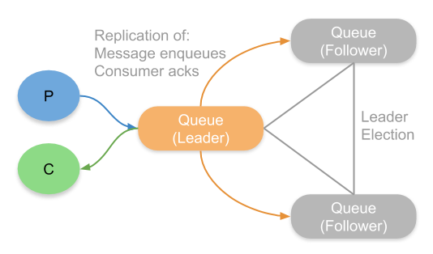
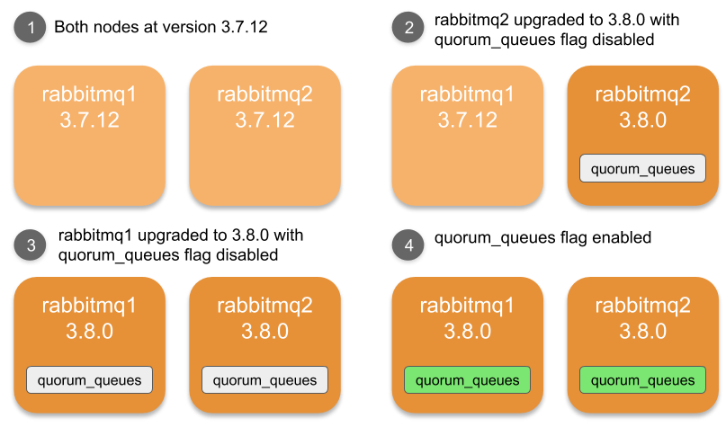
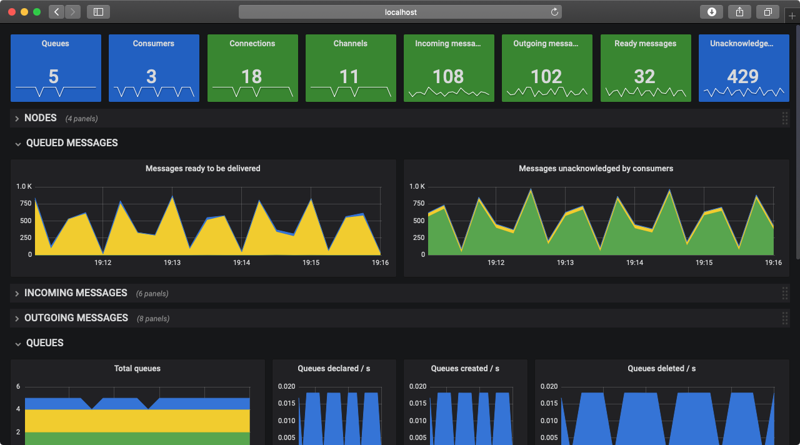
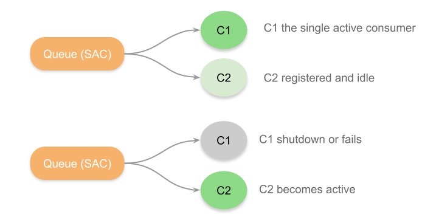

RabbitMQ 3.8 has just been released and has some major new features which focus on reliability, operations, and observability.

You can find the new 3.8 release on the [GitHub releases page](https://github.com/rabbitmq/rabbitmq-server/releases/tag/v3.8.0) which includes information about what is included in the release as well as various installation assets. See our [upgrade guide](/docs/upgrade) for more information about upgrading to 3.8.0.

Our team dedicates this release to [Joe Armstrong](https://en.wikipedia.org/wiki/Joe_Armstrong_(programmer)), the creator of Erlang. Joe’s work in the fields of concurrent and distributed systems benefits RabbitMQ to this day. Equally importantly, Joe was a rare example of a brilliant engineer who was also very humble and kind.

Let’s take a quick look at the new features in this release.

<!-- truncate -->

## Quorum Queues

For years, RabbitMQ has offered mirrored queues, also known as HA queues, as a solution for both high availability and data safety. Messages are replicated from a **queue master** to one or more **mirrors** so that in the event of the loss of a broker, a mirror can be promoted to master and the queue continues to be available without loss of **confirmed** messages.

Quorum queues are the next generation of replicated queue and offer both better performance and solve some of the pain points of mirrored queues. Quorum queues use the well established Raft protocol which has now been implemented in countless data systems as a means of achieving reliable and fault tolerant state replication.

One of the main pain points around mirrored queues was blocking synchronization coupled with throwing away data on leaving and rejoining a cluster. This made applying OS patches difficult if queues were large in size as the administrator was forced to choose between lower redundancy or a period of unavailability. Quorum queues completely avoid this issue by not throwing away data and making replication to a single node non blocking. Quorum queues also avoid split-brain scenarios that could provoke message loss and always favour consistency over availability.

From now on we will be referring to classic and quorum queues.

Read more about quorum queues [in documentation guides](/docs/quorum-queues).

## Feature Flags

Prior to the new feature flag sub-system, upgrades to RabbitMQ required cluster-wide shutdown. Feature flags allow for rolling upgrades of a cluster enabling continued availability.

As Jean-Sébastien Pédron described in  [this blog](/blog/2019/04/23/simplifying-rolling-upgrades-between-minor-versions-with-feature-flags):

> New in RabbitMQ 3.8.0 is the feature flags subsystem: when a single node in a 3.7.x cluster is upgraded to 3.8.0 and restarted, it will not immediately enable the new features or migrate its database schema because the feature flags subsystem told it not to. It could determine this because RabbitMQ 3.7.x supports no feature flags at all, therefore new features or behaviours in RabbitMQ 3.8.0 cannot be used before all nodes in the cluster are upgraded.

Read more about feature flags [in documentation guides](/docs/feature-flags).

## Prometheus and Grafana Monitoring Support

Many systems come with their own custom monitoring visualization solution, the Management Plugin has has been this solution in RabbitMQ for years. The new paradigm is for applications and infrastructure to expose metrics to external observability platforms and delegate the storing, indexing and alerting to those specialized tools. Both Prometheus and Grafana have become an industry standard in the systems observability space and provide powerful visualization and exploratory data analysis capabilities.

RabbitMQ 3.8 comes with new support for exposing its metrics via a Prometheus endpoint. Additionally, many more metrics are now available, vastly improving the overall observability of RabbitMQ. Visualizing these metrics is now as simple as importing pre-built dashboards into Grafana.

Prometheus and Grafana support has a dedicated [documentation guide](/docs/prometheus).

## OAuth 2.0 Support

RabbitMQ 3.8 allows clients to use JWT access tokens for authentication and authorization. Clients obtain an access token from an OAuth2.0 provider, through any grant type they wish, and use that token to gain access to RabbitMQ. OAuth 2.0 tokens use **scopes** to communicate what set of permissions a particular client has been granted and RabbitMQ permissions are mapped onto these scopes.

Read more about OAuth2.0 support [in the docs](https://github.com/rabbitmq/rabbitmq-auth-backend-oauth2).

## Additional CLI Tools

You can perform various levels of [health checks](/docs/monitoring#health-checks) with the rabbitmq-diagostics CLI tool. The checks range from basic pings to checking queues and vhosts are running to in-depth runtime information.

We have a new CLI tool, **rabbitmq-queues**, which gives us the ability to modify quorum queue memberships but also gives us new master/leader rebalancing functionality for both quorum and mirrored queues.

One of the pain points of performing a rolling upgrade to the servers of a RabbitMQ cluster was that queue masters would end up concentrated on one or two servers. The new **rebalance** command will automatically rebalance masters across the cluster. 

`rabbitmq-queues` has a [man page](/docs/man/rabbitmq-queues.8).

## Single Active Consumer (SAC)

SAC is also the next generation of an existing feature - exclusive consumers. The objective of exclusive consumers is to ensure that only a single consumer can consume a given queue at a time. The consumer uses the "exclusive" flag when registering itself, and the registration only succeeds if no other consumer is already registered.

SAC improves on this by making exclusivity a feature of the queue itself and making the process transparent to clients. If a second consumer registers itself, the registration succeeds and the consumer sits idle ready to become active if the currently active consumer shuts down or crashes. This gives us an automatic active-backup consumer strategy for when we want only a single consumer, but a secondary to take over quickly in the event the active goes away.

Read more about Single Active Consumer [in the Consumers guide](/docs/consumers#single-active-consumer).

## And...

* Messages can now be deadlettered from the tail of a classic queue with the new queue overflow configuration *reject-publish-dlx.*
* High queue creation/deletion rates (queue churn) are now less costly.
* Maximum message size is now configurable.
* Quorum queues come with a new poison message feature that allows you to configure messages to be dropped after a given number of redeliveries by setting the delivery-limit policy.
* RabbitMQ for Kubernetes is coming. Sign up to the [beta](https://pivotal.io/pivotal-rabbitmq-on-kubernetes).

If you’re more of a classroom learner, I recommend watching the webinar, "[What's new in RabbitMQ 3.8?](https://content.pivotal.io/webinars/may-23-what-s-new-in-rabbitmq-3-8-webinar?utm_campaign=rabbitmq-blog-3.8-webinar-q319&amp;utm_source=rabbitmq&amp;utm_medium=website)"

Please give 3.8 a try and let us know what you think on the RabbitMQ mailing list!
