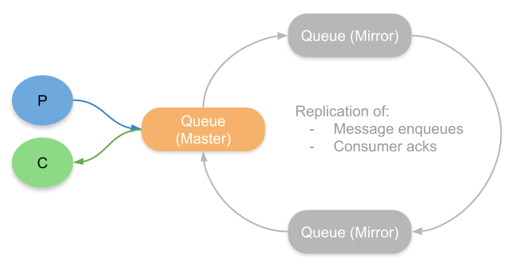
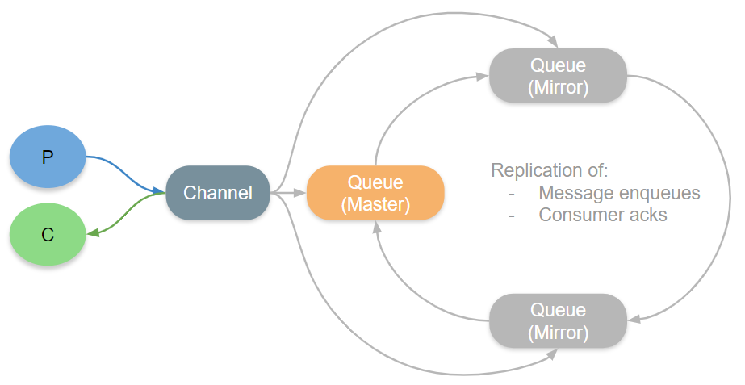
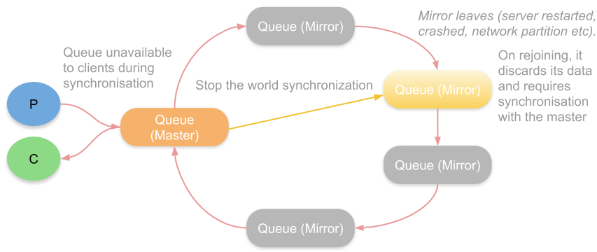
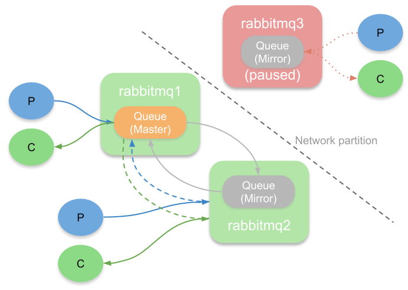
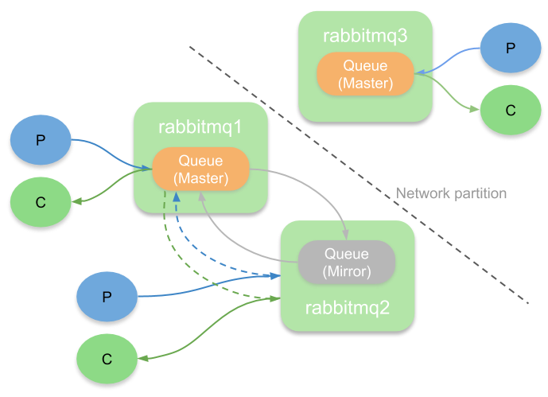
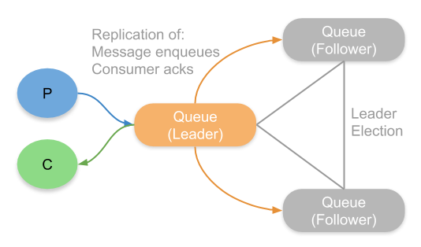
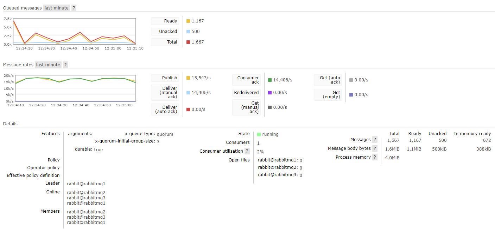
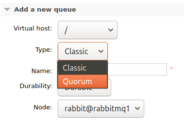
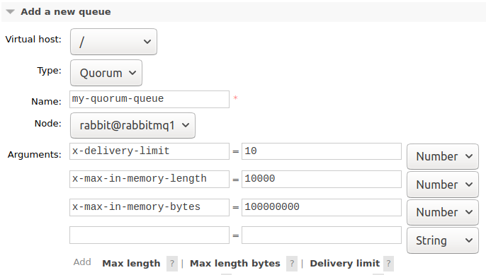

This is the first part of a series on quorum queues, our new replicated queue type. We'll be covering everything from what quorum queues are, to hardware requirements, migration from mirrored queues and best practices.

## Introducing Quorum Queues

Mirrored queues, also known as HA queues have been the de facto option for years when requiring extra data safety guarantees for your messages. Quorum queues are the next generation of replicated queue that aim to replace most use cases for mirrored queues and are available from the 3.8 release and onward.

In this blog series we’re going to cover the following:

* Part 1 - Understand the need for a new replicated queue type and how it works (this post)
* [Part 2 - Why your choice of storage drive matters with quorum queues](/blog/2020/04/21/quorum-queues-and-why-disks-matter)
* [Part 3 - Quorum queues and flow control. Concepts.](/blog/2020/05/04/quorum-queues-and-flow-control-the-concepts)
* [Part 4 - Quorum queues and flow control. Single Queue Benchmarks.](/blog/2020/05/14/quorum-queues-and-flow-control-single-queue-benchmarks)
* [Part 5 - Quorum queues and flow control. Stress Tests.](/blog/2020/05/15/quorum-queues-and-flow-control-stress-tests)
* Part 6 - Quorum queues and cluster/VM Sizing (coming soon)
* Part 7 - When and how to migrate from mirrored to quorum queues (coming soon)
* Part 8 - Best practices and gotchas (coming soon)
* Part 9 - Monitoring and admin operations (coming soon)

<!-- truncate -->

## Why Offer a New Type of Replicated Queue?

Mirrored queues are based on a replication algorithm called Chained Replication. In the context of queues, chained replication forms a ring of queues where there is one leader (the master) and one or more secondaries (mirrors). All messages are published to and consumed from the leader, the leader then replicates those operations to its adjacent mirror which in turn replicates to its adjacent mirror. This continues until reaching the last mirror who then notifies the master that the operation if fully replicated.

Due to some edge cases that produced message loss, this algorithm was modified so that the channel process would additionally send the message directly to each mirror. This unfortunately means that the broker receiving messages from a publisher has to send out each message twice, which doubles the network load.

There are also some pain points regarding this replication algorithm which centre on how it handles mirrors that leave the ring either because of a server restart, a node failure or a network partition.

When a mirror has been out of communication with its peers beyond a certain time limit, it is removed from the ring and the queue continues to be available. The problems occur upon the mirror rejoining the ring again. First the mirror discards all its data and then, optionally, a process called synchronisation begins. 

Synchronisation is where the master replicates its current messages to a mirror. This is a *stop the world* process where the queue becomes frozen until synchronisation is complete. This becomes a problem if the queue is very big as the period of unavailability can be long.

Another option is to not synchronise a rejoining mirror with the master. In this case we end up with lower redundancy but avoid potentially painful synchronisation. Of course, if the queue is empty or has few messages then synchronisation doesn’t pose a big problem.

Another important topic is how it handles network partitions. When a partition occurs that splits a cluster into two halves, we’ll end up with one or more mirrors that lose communications with the master. As an administrator we can choose availability or consistency at this point. The *cluster_partition_handling* configuration determines how RabbitMQ handles the partition.

If we don’t want to lose messages, then we’ll configure the cluster to use *pause-minority* mode. This basically stops all brokers on the minority side of a partition. On the majority side (if there is one) the queue continues to operate, just with reduced redundancy. Once the partition is resolved, the cluster returns to normality. This strategy chooses consistency (albeit with less redundancy) over availability.

If we want continued availability on both sides of the partition then we can choose *ignore* or *auto-heal* mode. This will allow a mirror to be promoted to master, meaning we have a master on both sides. This allows the queue to continue to receive and deliver messages no matter which side of the partition a client is connected to. Unfortunately, on resolving the partition one side of the partition is chosen as the victim and restarted, *losing* any messages in the queue on that side. This is not an ideal option, but in some scenarios it can still better suit your needs than becoming unavailable.

We needed a better replication algorithm and that is how quorum queues were born.

## Quorum Queues

[Quorum queues](/docs/quorum-queues) do not use chained replication but are based on the well established and mathematically proven **Raft** protocol. Raft is a consensus algorithm for replicating a log of operations across a cluster of nodes. It requires a quorum (a majority) of participating nodes to be available and to agree on each new operation appended to the distributed log. This is where quorum queues get their name. 

What operations does a queue have? We have *enqueue* operations and *consumer acknowledgemen*t operations. Just like with mirrored queues, all clients interact with a leader, whose job it is to then replicate the enqueues and acks to its followers.

The algorithm is more efficient and can achieve higher throughput than mirrored queues. It does have higher end-to-end latencies and those latencies closely correspond to the throughput/latency of your disks. Quorum queues only confirm messages once written to disk on a majority and so disk performance plays a large role in quorum queue performance.

### No Difficult Decisions

There is no *stop the world* synchronisation, no throwing away data on rejoining, no difficult decisions to make about automatic vs manual synchronisation at all. There is no availability vs consistency choice to make; a quorum queue will only confirm a message once it has been replicated to a majority of nodes. If a majority is down then you lose availability.

### Network Partitions

When it comes to network partitions quorum queues are much simpler. Firstly they use a separate and much faster failure detector that can detect partitions rapidly and trigger fast leader elections meaning that availability is either not impacted or is quickly restored. The *cluster_partition_handling* configuration does not apply to quorum queues though the *pause_minority* mode can still affect a quorum queue as when a minority side is paused, any quorum queue leaders hosted on that node will become unavailable. However due to the speed of the failure detector, in the event of a partition, a leader election should have selected a new leader well before this pause is triggered.

Quorum queues are for those scenarios where data safety trumps all. Just remember though that data safety starts with applications doing the right thing, using publisher confirms and consumer acks correctly. Quorum queues do have some limitations and gotchas and we’ll be taking a look at those later in the series.

## x-queue-type: classic and quorum

Now that we have a new type of queue, we refer to a queue as either a *classic* or a *quorum* queue. A classic queue is the same old queue as before. Declaring a classic queue with the ha-mode, ha-params, ha-sync-mode properties will make it a classic mirrored queue, as will defining a policy with those arguments that matches the queue.

You cannot turn a classic queue into a quorum queue via policies though. The x-queue-type property set to *quorum* must be included in the queue declaration. It is a quorum queue from birth.

## Quorum Queues in the Management UI

In the screenshot below, firstly you’ll notice the *x-queue-type: quorum* argument and the *x-quorum-initial-group-size: 3* argument that tells that this queue is a quorum queue with a replication factor of 3 (one leader and two followers).

Fig 7. A quorum queue as seen in the management UIWe also can see the members of the queue, which members are online and who the current leader is.

Declaring a quorum queue is as simple as declaring any other queue, simply using the *x-queue-type* argument. By default the quorum size (replicator factor) is 5, though with a smaller cluster, the size will be the size of the cluster itself.

From the management UI you will see the option to add either a classic or quorum queue.

You will see the available arguments change when you select Quorum.

There are three new arguments available for quorum queues. Two are related to how many messages are kept in memory. By default all messages are maintained in memory and so if a quorum queue grows in length it can put memory pressure on a cluster. We can limit how much memory is used by messages by setting one or both of the following arguments:

* x-max-in-memory-length 
* x-max-in-memory-bytes

The queue index is still stored in memory however, so a queue that continues to grow in size can still place memory pressure on a cluster. We’ll look more closely at this later in the series.

The new poison message feature is only available for quorum queues and is set using the *x-delivery-limit* argument. Each time a message is redelivered to a consumer, a counter is incremented. Once the redelivery count exceeds the x-delivery-limit, the message gets dropped or dead-lettered (if a DLX exchange has been configured).

## Takeaways

Quorum queues offer bullet proof safety guarantees and less headaches when it comes to restarting servers. They also place different stresses on your hardware than mirrored queues so before you make the jump, check out our next posts which contain guidance about migrations and required hardware.

In the [next post](/blog/2020/04/21/quorum-queues-and-why-disks-matter) we’ll cover why we recommend SSDs over HDDs and the different performance characteristics we get with each storage drive type.
