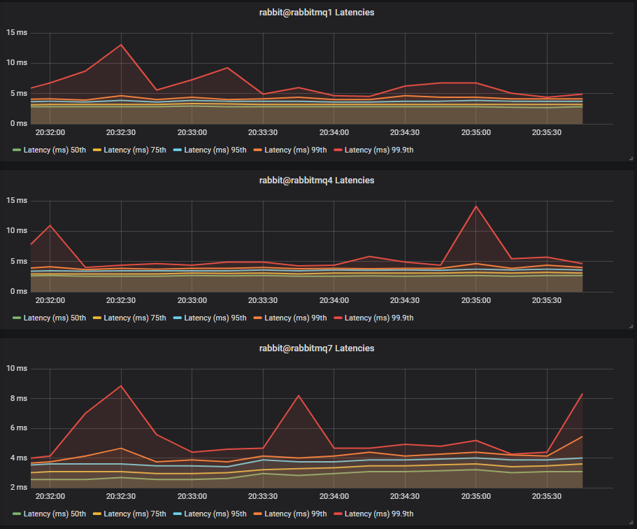

Quorum queues are still relatively new to RabbitMQ and many people have still not made the jump from classic mirrored queues. Before you migrate to this new queue type you need to make sure that your hardware can support your workload and a big factor in that is what storage drives you use.

In this blog post we’re going to take a closer look at quorum queues and their performance characteristics on different storage configurations.

## HDD or SSD? One drive or multiple drives?

The TL;DR is that we highly recommend SSDs when using quorum queues. The reason for this is that quorum queues are sensitive to IO latency and SSDs deliver lower latency IO than HDDs. With higher IO latency, you'll see lower throughput, higher end-to-end latency and some other undesirable effects.

Further down in this post we’ll demonstrate why we recommend this, using various benchmarks with different SSD and HDD configurations.

<!-- truncate -->

## Why are quorum queues sensitive to IO latency?

Let's look at the write path on a single broker to see why this is the case. Let's remember that both publishing and consuming count as writes. Publishing involves *enqueue* operations and consuming involves *ack* operations, and both must be persisted and replicated. Note that if you use a quorum or mirrored queues without publisher confirms or consumer acknowledgements you need to ask yourself why you are using a replicated queue.

Operations first get written to memory and to a Write Ahead Log (WAL). There is a single WAL per broker, which serves all quorum queues on that broker. From there, operations are then written to per-queue segment files by the Segment Writer.

> There is an optimisation however that means enqueue operations (messages) may never need to be written to segment files. Newly arrived messages are kept in memory and messages can be delivered to and acked by consumers before having been written to a segment file. In this case, those messages are not written to disk as they essentially no longer exist as far as the broker is concerned.

This means that for queues where consumers are keeping up, often messages do not get written to segment files at all. By the time an in memory message is ready to be flushed to a segment file, a consumer has acked the message.
If IO latency is high, then the WAL ends up being a bottleneck. Each broker has a single WAL and a single segment writer process, and these act as shared infrastructure that the quorum queue Raft clusters sit on top of. The fsyncing of operations to the active WAL  file is like the beating heart of the Raft clusters. If fsyncs are slow, the throughput across the Raft clusters is slow.

Fsyncing of the segment files can also become a bottleneck. The WAL consists of one or more files; one file being actively written to and zero or more inactive files that were rolled due to reaching the max WAL file size limit. These inactive WAL files can only be safely removed once all their messages have been written to segment files and/or acknowledged (see optimisation above). If the writing of segment files is slow, then the WAL gets larger and larger as messages cannot be written to segment files fast enough.

HDDs are great at large sequential writes but not so great at small or random IO. If your writes have to access multiple files, jumping about the filesystem, then HDDs produce much higher IO latency than SSDs. The great thing about WAL and segment files is that they are append-only files. So HDDs have the potential to deliver decent performance, but only where there is not a lot of random IO contention. As soon as WAL and segment file IO has to contend with other disk IO, performance starts to drop.

## Ok, but what does performance with HDDs look like?

Now we’re going to run some performance benchmarks with both SSDs and HDDs and analyse the results.

There are four main actors that use disk:

* Mnesia and the message store (data)
* Logs (logs)
* Quorum queue segment files (segment)
* Quorum queue WAL (wal)

Each of these workloads has different IO patterns and we can try to isolate these disk workloads to improve performance.

We have six clusters that share certain aspects such as number of CPUs but use different types and number of disks.

Shared:

* 3 node clusters
* Instance type: c4.4xlarge:
  * 16 vCPUs
  * 15GB RAM
  * 2Gbps EBS instance throughput (the VM has a disk IO throughput ceiling of 2Gbps/250MBs)
  * 5Gbps network (625MB/s)

All disks are either 200GB SSDs (io1) or 1TB HDDs (st1). Each has a larger throughput capacity than the c4.4xlarge EC2 instance can use.

Unique:

* Store all data in a single drive
  * Cluster rabbitmq1, SSD1=data/logs/segment/wal
  * Cluster rabbitmq10, HDD1=data/logs/segment/wal
* Store the WAL on a separate drive, but segment files on same drive as classic queue data
  * Cluster rabbitmq4, SSD1=data/logs/segment SSD2=wal
  * Cluster rabbitmq13, HDD1=data/logs/segment HDD2=wal
* Assign classic queue data, segment files and WAL files their own dedicated drive each
  * Cluster rabbitmq7, SSD1=data/logs SSD2=segment SSD3=wal
  * Cluster rabbitmq16, HDD1=data/logs HDD2=segment HDD3=wal

## Pure Quorum Queue Workload

First we'll test workloads that only consist of quorum queues.

### Throughput Benchmark #1 - One Quorum Queue

One publisher, one queue, one consumer, 1kb messages, no rate limit.

We see that the SSD clusters rabbitmq1, rabbitmq4 and rabbitmq7 all are reaching around 19k msg/s. The HDD clusters have lower throughput, with rabbitmq13 (2 disks) and rabbitmq16 (3 disks) are only slightly behind at around 17k msg/s. The single HDD cluster clearly lags at around 13k msg/s.

#### Conclusion

For a single queue workload, separating the WAL from the segment file workload onto separate disks has given us close to SSD performance. 

### Throughput Benchmark #2 - Four Quorum Queues

4 publishers, 4 queues, 4 consumers, 1kb messages, no rate limit.

With 4 quorum queues, we see a different story. HDDs outperform their SSD counterparts by ~2k msg/s. We have to remember that when consumers can keep up, operations are usually only written to the WAL files. The WAL is shared between the four queues so we are pushing more bytes through it. WAL files are written to sequentially and our st1 HDD can manage 500MB/s throughput (though the VM itself is restricted to 250MB/s).

#### Conclusion

In a world of only sequential writes, HDDs can potentially produce similar or even better results to an SSD. A quorum queue only workload, with consumers keeping up should see the vast majority of writes only going to a single append-only WAL file.

### Latency Benchmark #1 - 40 Quorum Queues

40 publishers, 40 queues, 40 consumers, 1kb messages, 10 msg/s per publisher (400 msg/s total).

#### SSDs

#### HDDs

With a total rate of just 400 1kb messages a second, we see SSDs and HDDs with comparable end-to-end latencies.

### Latency Benchmark #2 - 40 Quorum Queues

40 publishers, 40 queues, 40 consumers, 1kb messages, 50 msg/s per publisher (2000 msg/s total).

#### HDDs

This time we see HDDs with significantly higher latencies:

* 75th percentile ~4ms vs ~15ms
* 99.9th percentile ~20ms vs ~110ms

We also see that the two disk and three disk HDD configurations have lower latency than the single HDD. There is not much difference between the two and three disk configurations as we have no mnesia or message store data competing with quorum segment data.

#### Conclusion

With higher throughput, we see SSDs producing much lower latencies than HDD.

## Light Mixed Workload (Classic Lazy and Quorum)

So far we’ve seen quorum queues tested in isolation, without any classic or mirrored queue load. In this test we’ll see how quorum queues behave in a mixed workload of quorum queues and unreplicated lazy queues. Lazy queues are more disk intensive than normal classic queues and should produce more disk contention.

### Throughput Benchmark #1 - One Quorum Queue

One publisher, one queue, one consumer, 1kb messages, no rate limit.

Lazy queue workload: 40 publishers, 40 queues, 40 consumers, 16b messages, 10 msg/s per publisher (400 msg/s).

We see that with this background lazy queue load, the SSD cluster sees no impact in throughput, sitting at 20k msg/s again. However the single HDD cluster has been seriously impacted, down to just 6k msg/s down from 13k msg/s. The write heavy WAL workload now must compete with the message store which will involve much disk seeking.

The two and three disk HDD clusters do better with just a slight drop in throughput, this is because most writes go to the WAL which has a dedicated disk and still achieves sequential writes.

#### Conclusion

A low non-quorum queue message throughput will impact HDDs more, but the impact can be mitigated by separating workloads onto separate disks.

### Throughput Benchmark #2 - Four Quorum Queues

4 publishers, 4 queues, 4 consumers, 1kb messages, no rate limit.

Lazy queue workload: 40 publishers, 40 queues, 40 consumers, 16b messages, 10 msg/s per publisher (400 msg/s).

Again we see the same drop in throughput for HDDs, with the single disk suffering the most.

### Latency Benchmark #1 - 40 Quorum Queues

40 publishers, 40 queues, 40 consumers, 1kb messages, 10 msg/s per publisher (400 msg/s total).

Lazy queue workload: 40 publishers, 40 queues, 40 consumers, 16b messages, 10 msg/s per publisher (400 msg/s).

#### SSDs

#### HDDs

Last time, with no mixed workload, we saw SSDs and HDDs with comparable end-to-end latencies. This time however, the single HDD cluster has a major increase in end-to-end latency with 75th at 50ms and 99.9th up to 300ms. The two and three disk configurations fared better with comparable 75th percentile latencies but we saw one peak up to 25ms at 99.9th percentile.

#### Conclusion

With a light mixed workload, the single HDD configuration fares badly, but the configurations with a separate disk for the WAL did almost as good as the SSDs.

### Latency Benchmark #2 - 40 Quorum Queues

40 publishers, 40 queues, 40 consumers, 1kb messages, 50 msg/s per publisher (2000 msg/s total).

Lazy queue workload: 40 publishers, 40 queues, 40 consumers, 16b messages, 10 msg/s per publisher (400 msg/s).

#### SSDs

#### HDDs

Again we see the single HDD perform the worst, but this time the two and thee disk HDD cluster fare worse, hovering around the 20-60ms mark, compared to the SSDs which hover around 5-15ms.

#### Conclusion

With a light mixed workload, but higher quorum queue load we see HDDs clearly at a disadvantage to SSDs.

## Medium Mixed Workload (Classic Lazy and Quorum)

This time we’ll increase the lazy queue traffic five fold from 400 msg/s to 2000 msg/s and see how our SSD and HDD clusters fare.

### Throughput Benchmark #1 - One Quorum Queue

One publisher, one queue, one consumer, 1kb messages, no rate limit.

Lazy queue workload: 40 publishers, 40 queues, 40 consumers, 16b messages, 50 msg/s per publisher (2000 msg/s).

This time HDD throughput has been driven very low. We can see the two and thee disk configurations help, but not by much:

* 1 disk: ~300 msg/s
* 2 disks: ~1700 msg/s
* 3 disks: ~2300 msg/s

But look at the SSDs, they achieve the same throughput as ever.

#### Conclusion

Once the mixed workload reaches a certain point, quorum queue throughput on HDD drops very low, no matter if you isolate the disk workloads. Obviously there is another factor in play here as the three disk configuration which has isolated segment and WAL file load from classic queues is not enough.

### Throughput Benchmark #2 - Four Quorum Queues

4 publishers, 4 queues, 4 consumers, 1kb messages, no rate limit.

Lazy queue workload: 40 publishers, 40 queues, 40 consumers, 16b messages, 50 msg/s per publisher (2000 msg/s).

This time the single HDD barely managed a single message. The two and three disk configurations managed around 2300 msg/s.

This time note that the single SSD cluster saw an impact from the lazy queue traffic. The two and three SSD clusters saw almost no impact, demonstrating that quorum queues can benefit from disk workload isolation even on SSDs.

### Latency Benchmark #1 - 40 Quorum Queues

40 publishers, 40 queues, 40 consumers, 1kb messages, 10 msg/s per publisher (400 msg/s total).

Lazy queue workload: 40 publishers, 40 queues, 40 consumers, 16b messages, 50 msg/s per publisher (2000 msg/s).

#### SSDs

#### HDDs

The single HDD basically was non functional, and the two and three disk configurations saw large latencies with the two disk one reaching above 1 second, despite the low message rate.

#### Conclusion

HDD cluster end-to-end latency continues to worsen as both quorum queue and non-quorum queue load increases. SSDs remain largely unchanged.

### Latency Benchmark #2 - 40 Quorum Queues

40 publishers, 40 queues, 40 consumers, 1kb messages, 50 msg/s per publisher (2000 msg/s total).

Lazy queue workload: 40 publishers, 40 queues, 40 consumers, 16b messages, 50 msg/s per publisher (2000 msg/s).

#### SSDs

#### HDDs

Again, the single HDD cluster didn’t manage to handle any messages. The three disk configuration, which completely isolates quorum queue load from the lazy queue disk load saw the best latency, but still a much higher latency than the SSDs.

## Final Conclusions

Quorum queues on SSDs show they are not overly sensitive to mixed workloads but can benefit from a multi-SSD drive configuration under higher loads.

We have also seen that quorum queues do not handle **mixed** workloads very well when running on HDDs. It is possible to mitigate those issues by isolating the segment and WAL files on separate HDDs from the mnesia (meta-data) and message store (classic queue data) workloads, but at a certain classic queue traffic level, the throughput will drop a lot. What that level of load is totally depends on your particular setup.

When might quorum queues be safe on HDDs? While not recommended you may still get good performance with low queue count pure quorum queue workloads or with mixed workloads which are low volume. But we have seen that quorum queue performance can drop precipitously on HDDs so you are taking a risk. We highly recommend SSDs and discourage the use of HDDs when employing quorum queues.

In the next post of this series we'll look at migrating from classic mirrored queues to quorum queues, using a few example workloads to demonstrate what you might expect.
