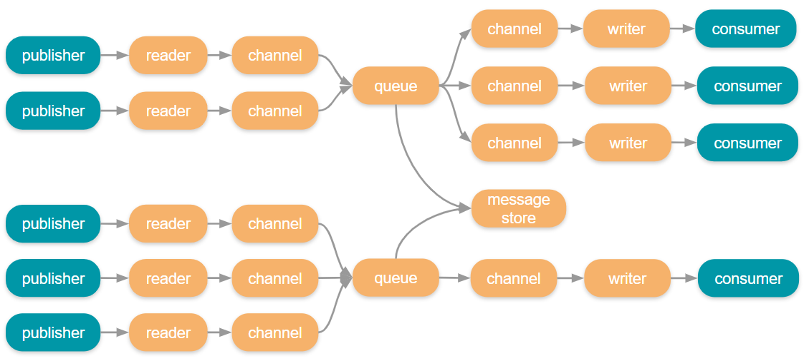
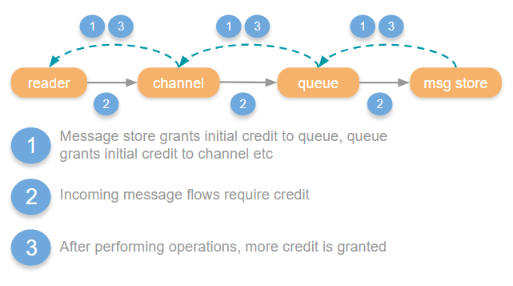
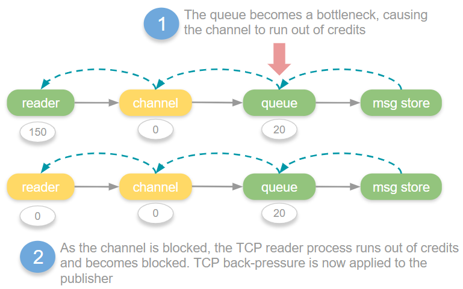
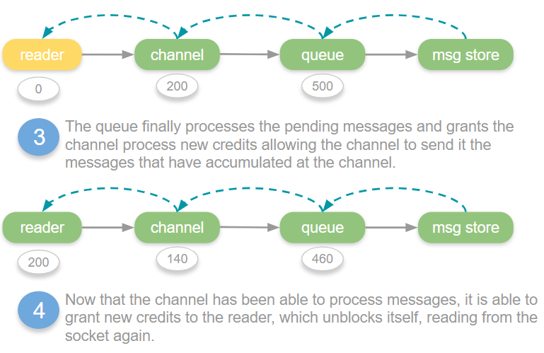

As part of our quorum queue series we’re taking a look at flow control, how it protects RabbitMQ from being overloaded and how that relates to quorum queues.

## What is Flow Control?

Flow control is a concept that has been in computer networking and networked software for decades. Essentially it is a mechanism for applying back pressure to senders to avoid overloading receivers. Receivers typically buffer incoming packets/messages as a way of dealing with a send rate that exceeds its processing rate. But receiver buffers cannot grow forever so either the send rate should only transiently exceed receiver processing capacity (bursty traffic) or the sender must be slowed down (back pressure).

Flow control is a way of applying this back pressure on the sender, slowing them down so that the receiver’s buffers do not overflow and latencies do not grow too large. In a chain of sender/receivers, this back pressure can propagate up the chain to the origin of the traffic. In more complex graphs of connected components, flow control can balance incoming traffic between fast and slow senders, avoiding overload but allowing the system to reach full utilisation despite different numbers of senders, different rates and different load patterns (steady or bursty).

<!-- truncate -->

## Flow Control in RabbitMQ

RabbitMQ looks much like a network. Each RabbitMQ broker internally is implemented with the actor pattern where different components communicate with each other via message passing, sometimes locally, sometimes over the network. There are also the publishers that send messages to the brokers and the consumers that receive messages from the brokers, both over the network.

At any point in this chain, bottlenecks can occur causing congestion. Congestion results in buffers and ports filling, data on disk growing and hardware resources running low. If left uncontrolled RabbitMQ could use up all available memory resulting in either a crash or being killed by the OS.

Taking the system as a whole (broker and clients) we have four flow control mechanisms available to us:

* Credit based flow control
* Memory alarms
* Publisher confirms
* Consumer acknowledgements and prefetch

## Credit Based Flow Control

[Credit based flow contro](/docs/flow-control)l is a method of rate limiting message ingress. It allows various actors within the system to protect themselves and apply back pressure when they cannot process messages fast enough. It is targeted at only those connections, channels and queues that are having issues, leaving other parts of the system unaffected.

The way it works is that each actor in the system that handles messages uses “credit” as a way of applying back pressure up the chain. If a channel wants to send a message to a queue, it needs credit. The queue grants the channel some initial credit, and then after that, each message that the channel sends to the queue requires a credit. The queue will periodically grant the channel more credit, when it in turn has been able to pass messages onto the persistence layer. If the channel doesn’t have credit, it is blocked from sending messages to the queue until the queue grants it more. This way a channel cannot run roughshod over a queue.

So we have a chain of credit flow controls that apply back pressure all the way back to the publisher. Ultimately, TCP back pressure will be applied to the publisher because the TCP reader process is not reading from the socket as it is blocked.

When a connection, channel or queue runs out of credits they are blocked until more credits are granted, this state is known as “flow”. In the management UI you might see that a connection,  channel or queue are in the *flow* state which indicates that flow occurs very recently. This just means that they have temporarily run out of credits and are waiting for the next link in the chain to catch up and grant some credits. This can trigger multiple times a second.

When a queue or connection reaches its throughput limit or a downstream bottleneck, the flow state can kick in many times a second, at various points in the chain, as various actor’s credit amounts reach 0 and then get replenished. 

But it doesn’t necessarily stop the broker from running out of memory. Incoming messages are not always the only primary cause of high memory usage, it can also be from large queues and a number of other causes.

## Memory Alarms

If the credit based flow control was unable to put the brakes on enough, or memory usage has grown to critical levels for another reason, memory alarms kick in as a last resort to protect the broker from crashing (or being killed by the OS) due to running out of memory.

When [memory alarms](/docs/memory) kick in, all publishers are blocked. It’s like you turn off the tap on incoming messages across the cluster. Not the targeted rate limiting of credit based flow control, but a sledgehammer. 

Consumers can continue to consume though, and the hope at this point is that draining the queues somewhat will start bringing down the memory footprint.

In the management UI you will see connections as blocked or blocking when memory alarms are in force.

## Publisher Confirms

The primary job of [publisher confirms](/docs/confirms) is data safety but they also play an important role in flow control. 

There are three ways of employing publisher confirms:

* *Send one at a time*, waiting for each confirm before sending the next (very slow).
* *Window based*. Send messages until reaching a window size (time or number of messages) and wait for all confirms before sending the next window.
* *Pipelining*. Allow a publisher to continuously send messages but block when the unconfirmed message count (the messages in-flight) reaches a limit. When confirms come in, more messages can be sent until reaching the limit again. 

The pipelining (or simply the *asynchronous*) approach provides the highest and most stable throughput. It can be used as an additional protection against broker overload, as the publisher itself places itself in “flow” before even placing pressure on the broker.

When you don’t use publisher confirms you rely solely on TCP flow control for the link between the publisher and the connection reader process on the broker. With a relatively small number of publishers, TCP flow control can be enough to avoid overloading the broker, but when you have a large number of clients, TCP is not enough and publisher confirms become necessary for cluster stability while under heavy load. Interestingly AMQP 1.0 added link flow control to overcome this problem.

## Consumer Acknowledgements and Prefetch

Using manual acknowledgements with a prefetch puts back pressure on RabbitMQ to stop it from overwhelming your consumer clients. It uses the pipelining method to send a constant stream of messages but bounding the number of unacknowledged messages to the size of the prefetch (QoS). With AutoAck mode, we again rely only on TCP back pressure. The various ingress buffers of your clients can fill up fast. 

It is highly recommended to use manual acks and a prefetch.

## Quorum queues

The credit based flow control chain is different with quorum queues as they have a completely different persistence and replication protocol. Channels send all messages to a Raft cluster leader that in turn passes the message to the WAL and replicates the message to its followers. The Raft consensus algorithm that quorum queues use for replication does not include credit based flow control so this mechanism ends at the channel. 

Rather than using credit as a mechanism for blocking itself when the Raft leader cannot keep up, the channel keeps track of the number of pending Raft commands that the leader has not yet applied. If that number exceeds the *quorum commands soft limit *configuration, then the channel ceases to grant more credits to the reader process.

The other controls such as memory alarms, publisher confirms and consumer acknowledgements/prefetch are the same for quorum queues as classic queues. 

## Improvements to quorum queues in the upcoming 3.8.4 release

We identified flow control as one of the weaker areas of quorum queues compared to mirrored queues. We found that quorum queues did not apply back pressure as effectively as mirrored queues while under heavy load from 100s or 1000s of clients. Quorum queues had some new bottlenecks that occurred under these scenarios that could cause memory to grow, relying on memory alarms rather than credit based flow control.

We set about improving that for the next release and have greatly improved this aspect of quorum queues, we’ll write more about those changes when 3.8.4 comes out.

## In the next part… using publisher confirms to improve throughput under load

So you know a bit more about RabbitMQ, flow control and quorum queues. You know that publisher confirms can be important for both data safety but also for flow control between publishers and brokers. But how do we implement pipelining? How big an in-flight limit should we use? What effect will different limits have on throughput and latency?

All these question will be answered in the next part of this series. We'll run a number of benchmarks against both mirrored and quorum queues and get some answers.
