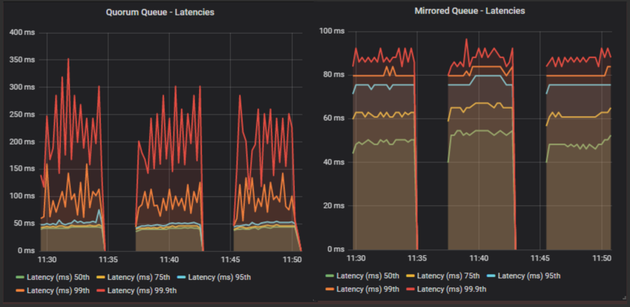
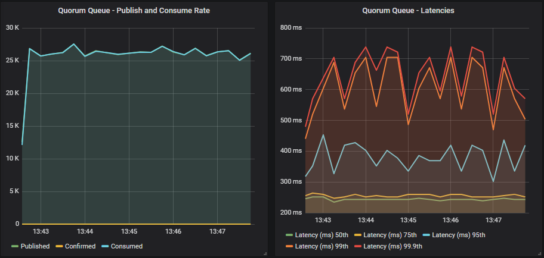

In the last post we covered what flow control is, both as a general concept and the various flow control mechanisms available in RabbitMQ. We saw that publisher confirms and consumer acknowledgements are not just data safety measures, but also play a role in flow control. 

In this post we’re going to look at how application developers can use publisher confirms and consumer acknowledgements to get a balance of safety and high performance, in the context of a single queue. 

Flow control becomes especially important when a broker is being overloaded. A single queue is unlikely to overload your broker. If you send large messages then sure, you can saturate your network, or if you only have a single CPU core, then one queue could max it out. But most of us are on 8, 16 or 30+ core machines. But it’s interesting to break down the effects of confirms and acks on a single queue. From there we can take our learnings and see if they apply to larger deployments (the next post).

<!-- truncate -->

## Pipelining and Publisher Confirms

Publishers can rate limit themselves based on the number of unconfirmed messages in-flight. With a limit of 5, the publisher will send 5 messages and then block until confirms come in. If a single confirm comes in, the publisher can now send a message and block again. If three confirms come in, the publisher can send three more, and so on.

Confirms can be batched together via the use of the *multiple* flag. This allows the broker to confirm multiple messages at a time. If 100 messages are pending confirmation, with sequence numbers 1-100, the broker can send a single confirm with the multiple flag set and the sequence number of 100. This allows for less communications between publisher and broker, which is more efficient.

This pipelining method will produce the highest and most stable throughput. You can find code samples for how to do this in tutorial 7, strategy #3. There is a [Java](/tutorials/tutorial-seven-java) version and a [C#](/tutorials/tutorial-seven-dotnet) version. The same approach can be applied to other languages.

## Pipelining and Consumer Acks

RabbitMQ employs the pipelining method, where its “in-flight limit” is the consumer prefetch (QoS) on a given channel. Without a prefetch, it will send messages as fast as it can until there are no more messages to send or TCP back-pressure is applied due to the client TCP buffer being full. This can overload the consumer so please use a prefetch!

When your consumer sends an acknowledgement, that is like when the broker sends a confirm to a publisher. It allows more messages to be pushed down the channel.

Just like confirms, consumer acks get to use the multiple flag as well. The consumer can choose to acknowledge every message individually or every N number of messages. We’ll call this the *ack interval*. With an ack interval of 10, a consumer will acknowledge every 10th message, using the multiple flag. 

This can be more complex code as you also need to take into account:

* If the last 10 messages includes a mix of acks, nacks and rejects then you can’t simply perform a single ack with multiple flag set.
* You will probably wish to put a temporal limit on the length of time between acks, in case messages come in slowly, for example, every 10 messages or up to 50ms.

## Measuring the Impact of In-Flight Limit, Prefetch and Ack Interval

The best way to see the impact is to run a series of benchmarks with a typical cluster and change the publisher confirm in-flight limit, the consumer prefetch and the ack interval.

All benchmarks are run in AWS with the following configuration:

* c5.4xlarge EC2 instance: 16 vCPUs (Cascade Lake/Skylake Xeon), 32 GB RAM, 5gbit network, 200 GB SSD (io1 with 10000 IOPS)
* 3 brokers in a cluster
* 1 load generation EC2 machine of the same spec (c5.4xlarge)
* 1kb messages
* No processing time as this is a pure throughput/latency benchmark of a single publisher and single consumer.

We test quorum queues and mirrored queues to give an idea of how quorum queues differ from their older counterpart.

Mirrored queues have one master and one mirror, and quorum queues use a replication factor of three (one leader + two followers). It’s not exactly a fair fight, a replication factor of two with mirrored and a replication factor of three with quorum queues, but those are the most common configurations respectively. All tests use an alpha build of RabbitMQ 3.8.4 with new quorum queue features for handling high load. 

Benchmarks:

1. Increasing in-flight limit, prefetch 1000, ack interval 1
1. 1000 in-flight limit, increasing prefetch, ack interval 1
1. 1000 in-flight limit, 1000 prefetch, increasing ack interval
1. No confirms, no acks

## Interpreting these results

The rules:

* **Rule 1** - These are synthetic benchmarks, with a specific version of RabbitMQ, with cloud instances (which introduces all kinds of reproducibility issues) and a specific hardware configuration. There is no single benchmark result, there are infinite. So don’t look at specific numbers, look at trends and patterns.
* **Rule 2** - These results are using the Java client, not Spring, not Python or any other language or framework. However, what we are testing should hold true for other frameworks as they have to use the same settings, how they use those settings may or may not be under your control.
* **Rule 3** - Try out your existing code with these different settings changes and see for yourself!

## Benchmark #1 - Increasing in-flight limit, prefetch 1000, ack interval 1

This is a 30 minute benchmark where we increase the in-flight limit every 5 minutes with the following values: 1, 5, 20, 200, 1000, 10000. With the low values, the publishers will be rate limiting themselves pretty aggressively, constraining throughput, but as the limit increases we should see throughput increase.

**Mirrored queue**

**Quorum queue**

Both queue types have a similar profile. As we increase the in-flight limit, throughput goes up until we see that the level is so high as to not have any kind of flow control effect. Both see the biggest jump between 20 and 200. A limit of 10000 has no benefit over 1000, all that happens is we increase end-to-end latency.

The quorum queue achieves much higher throughput than the mirrored queue and also has lower 95th percentile latencies. Quorum queue 99.9th percentile latencies reach the mirrored queue latencies where all percentiles cluster around the same value.

In our case, because the brokers and the load generator are all in the same availability zone, network latency is very low. In higher network latency scenarios, we would continue to see large benefits of higher in-flight limits.

Lastly, remember that if our message rate were 1000 msg/s, then all in-flight limits would look the same. So if you are nowhere close to the queue throughput limit, then these settings won't necessarily come into play.

## Benchmark #2 - 1000 in-flight limit, increasing prefetch, ack interval 1

This test is a little different to the others. The others are a single run where we dynamically change the behaviour of the load generator. In this test we use a separate run per setting. We have to do this because you’ll see that a prefetch of 1 makes the consume rate so slow, that the queue fills up fast and negatively affects the later phases of the test. So we run each prefetch setting as a completely isolated run.

**Mirrored queue**

**Quorum queue**

A prefetch of 1, combined with a fast publisher did not go well for either queue type, but quorum queues did especially badly. Quorum queues saw very low consumer throughput with a prefetch 1 and 10, but we also saw the publish rate drop as time went by and the queue filled. 

In fact in these first two tests (prefetch 1 and 10), the quorum queue reached around 4 million messages. We know that quorum queues do slow down a bit once they get into the millions of messages.

From a prefetch of 100 and onwards we start hitting the top throughput as the RabbitMQ consumer channel is not having to block so often (waiting for acks to come in). Setting a high prefetch does not affect end-to-end latency as we see below (for prefetch of 100, 1000, 10000). 

The reason that prefetch doesn’t necessarily increase latency but the in-flight limit can, is that with the in-flight limit we are rate limiting ingress, avoiding buffering in the broker, whereas the prefetch only affects messages already in flight. Whether the messages are buffered in the broker or in the client doesn’t affect latency, especially in a single consumer test. In a multiple consumer test it is conceivable that there could still be an effect.

### Some Nuance Around End-to-end Latency

Of course the above is predicated on end-to-end latency being from the moment a publisher sends a message to the moment the message is received by a consumer. In your system, end-to-end latency will likely start at an earlier point. So rate limiting the publisher can reduce latency from the point of view of RabbitMQ, but not necessarily your wider system. When it would definitely affect your wider system's end-to-end latency is if RabbitMQ got overloaded and materially slowed down.

## Benchmark #3 - 1000 in-flight limit, 1000 prefetch, increasing ack interval

We’re back to the dynamic update of settings again, as we’ll see that while the ack interval does affect throughput, it does not affect it as much as prefetch (not even close!). Using an ack interval of 1 is ok, you will still get good throughput, so if that is what you already do and don’t want the complexity of multiple flag usage, then carry on.

But we’ll see next that if you want every last bit of performance, multiple flag usage helps.

**Mirrored queue**

**Quorum queue**

Both queue types see the biggest jump in throughput when switching from an ack interval of 1 to 10. After that the peak is around 50-100. That is 5% and 10% respectively of the prefetch. As a general rule of thumb, this tends to be the sweet spot for the ack interval. 

Mirrored queues tend to see a reduction in throughput once you get past the 25-30% of prefetch mark and rapidly drops off past 50%. Quorum queues remained flat in this test, right up to 50%. 

## Benchmarks #4 - No confirms and acks

In these tests we'll not use publisher confirms and the consumer will use auto ack mode (this means that the broker will treat a message as delivered as soon as it transmits it).

**Mirrored queue**

**Quorum queue**

If we compare those results to using confirms and acks, we see no benefit in throughput. In fact all we see is an increase in end-to-end latency. For mirrored we go from 95th percentile at ~60ms to ~1s. Likewise for quorum queues we go from 95th percentile ~50ms to ~400ms.

So not only do we not see an increase in throughput but we see a worse latency. Of course this is a single queue, things only get worse as we add more queues and load, as we’ll see in the next post. 

With a non-replicated classic queue, you will definitely see a difference between confirms/acks vs none. This is because without replication, RabbitMQ doesn’t have to do much work, so the overhead of confirms and acks is noticeable. This isn’t the case when replication is involved, the overhead of confirms/acks is small in comparison.

## Final Conclusions

At this point, with a single queue, the conclusions are simple and limited - that is, they apply to a single queue for sure, and will likely apply to multiple queues but not necessarily a stressed system. That is why we have a follow-up post covering exactly the same settings, but with a system under stress.

Low broker stress, single queue, high throughput conclusions:

1. Low publisher in-flight limits equate to lower throughput as publishers exert their own flow control. Higher in-flight limits equate to higher throughput, but at some point you stop getting gains. Where that point is, is totally dependent on your system and can change as conditions in your system change.
1. Low prefetch can be terrible for a high throughput queue with a single consumer. But in a low throughput queue or where there are many many consumers, it will not be so much of a problem (as we’ll see in the next post where we have 100s of consumers).
1. An ack interval of 1 is ok, don’t sweat it. But increasing it a little can be beneficial. Up to around 10% of prefetch is a good rule of thumb but as always, it is dependent on your system and local conditions.
1. Confirms and acks are necessary for data safety and not using them with a replicated queue doesn’t gain you any performance, quite the opposite, it increased latency. That said, in this single queue test, the loss of the extra flow control exerted by confirms and acks was not a major problem.
1. Finally - a single quorum queue outperforms a single mirrored queue significantly.

All these tests were about sending/consuming messages as fast as possible, pushing a single queue to its limit. What we learned is informative but you likely are not in that situation and so you will probably find the next post more useful. In that post we will look at low load and high load scenarios, with different numbers of queues and clients, but seeing the effects of these same three settings on both quorum and mirrored queues. For the stress tests, flow control will become more important, it will help the stressed system to degrade gracefully rather than catch on fire. Expect a larger impact of not using confirms and acks.
