In the [last post](/blog/2020/05/14/quorum-queues-and-flow-control-single-queue-benchmarks) we ran some simple benchmarks on a single queue to see what effect pipelining publisher confirms and consumer acknowledgements had on flow control. 

Specifically we looked at:

* Publishers: Restricting the number of in-flight messages (messages sent but pending a confirm).
* Consumers: Prefetch (the number in-flight messages the broker will allow on the channel)
* Consumers: Ack Interval (multiple flag usage)

Unsurprisingly, we saw when we restricted publishers and the brokers to a small number of in-flight messages at a time, that throughput was low. When we increased that limit, throughput increased, but only to a point, after which we saw no more throughput gains but instead just latency increases. We also saw that allowing consumers to use the multiple flag was beneficial to throughput.

In this post we’re going to look at those same three settings, but with many clients, many queues and different amounts of load, including stress tests. We’ll see that publisher confirms and consumer acknowledgements play a role in flow control to help prevent overload of a broker. 

<!-- truncate -->

With data safety the clients play a role, they must use confirms and acks correctly to achieve at-least once processing. Likewise, thousands of clients shouldn’t expect to hammer a broker with load and accept no responsibility for how that goes. 

Be warned, there is a fair amount of detail in this post so make sure you are comfortable with a beverage nearby before you begin.

## Mechanical Sympathy

I really like the term mechanical sympathy. When you drive a racing car slowly, you can get away with pretty much anything. It’s when you push the car to its limits that you need to start listening to it, feeling the vibrations and adjust accordingly else it will break down before the end of the race. 

Likewise, with RabbitMQ, if you have a low load, then you can get away with a lot. You might not see much impact of changing these three settings, or using confirms at all (at least on performance). It’s when you stress a cluster to its limit that these settings really become important.

## Degrading Gracefully

What should a system do when you throw more data at it than it can handle? 

* Answer 1: accept all data only to burst into a flaming pile of bits.
* Answer 2: deliver huge swings of high and low throughput, with hugely varying latencies.
* Answer 3: rate limit data ingress and deliver steady throughput with low latencies.
* Answer 4: favour ingress to egress, absorbing the data as if it were a peak in load causing high latencies but better keeping up with the ingress rate.

At RabbitMQ we would argue that answers 3 and 4 are reasonable expectations whereas nobody wants 1 and 2.

When it comes to answer 4, when is a peak not a peak? At what point does a short peak become chronic? How should such a system favour publishers over consumers? This is a hard choice to make and a hard one to implement well. RabbitMQ goes more along with answer 3: rate limit publishers and try to balance the publish and consume rate as much as possible.

It comes down to flow control.

## Choosing the right in-flight limit and prefetch

The decision is simple if you never expect heavy load. We saw in the last post with a single high throughput queue that you can set a high in-flight limit, high prefetch and optionally use the multiple flag with consumer acknowledgements and you’ll do ok. If you have low load then likely all settings look the same to the final throughput and latency numbers.

But if you expect periods of heavy load and have hundreds or even thousands of clients then is that still a good choice? The best way I know to answer these questions is to run tests, many, many tests with all kinds of parameters.

So we’ll run a series of benchmarks with different:

* numbers of publishers
* numbers of  queues
* numbers of  consumers
* publish rates
* in-flight limits
* prefetch and ack intervals

We’ll measure both throughput and latency. The in-flight limit will be a percentage of the target rate per publisher with the percentages anywhere between 1% to 200%. So for example with a per publisher target rate of 1000:

* 1% in-flight limit = 10
* 5% in-flight limit = 50
* 10% in-flight limit = 100
* 20% in-flight limit = 200
* 100% in-flight limit = 1000
* 200% in-flight limit = 2000

Like in the last post we’ll test both mirrored and quorum queues. Mirrored with one master plus one mirror (rep factor 2) and quorum queues with one leader and two followers (rep factor 3).

All tests use an alpha build of RabbitMQ 3.8.4 with improved quorum queue internals for handling high load. Additionally we’ll be conservative with memory use and set the quorum queue *x-max-in-memory-length* property to a low value, this makes a quorum queue act a little bit like a lazy queue, it will remove message bodies from memory as soon as it is safe to do so and the queue length has reached this limit. Without this limit, quorum queues maintain all messages in memory. It can be less performant if consumers are not keeping up as there are more disk reads, but it is a safer more conservative configuration. It will become important as we stress the system as it avoids large memory spikes. In these tests it is set to 0 which is the most aggressive setting.

All tests were on 3 node clusters with 16 vCPU (Cascade Lake/Skylake Xeon) machines with SSDs.

Benchmarks:

1. 20 publishers, 1000 msg/s, 10 queues, 20 consumers, 1kb messages
1. 20 publishers, 2000 msg/s, 10 queues, 20 consumers, 1kb messages
1. 500 publishers, 30 msg/s, 100 queues, 500 consumers, 1kb messages
1. 500 publishers, 60 msg/s, 100 queues, 500 consumers, 1kb messages
1. 1000 publishers, 100 msg/s, 200 queues, 1000 consumers, 1kb messages

## Benchmark #1: 20 publishers, 1000 msgs/s per publisher, 10 queues, 20 consumers

With a  total target rate of 20000 msg/s this is within the total throughput limit of the cluster on the chosen hardware for this number of clients and queues. This kind of load is sustainable for this cluster.

We have two tests:

1. No publisher confirms
1. Confirms with in-flight limit as a percentage of the target send rate: 1% (10), 2% (20), 5% (50), 10% (100), 20% (200), 100% (1000).

**Mirrored queue without confirms**

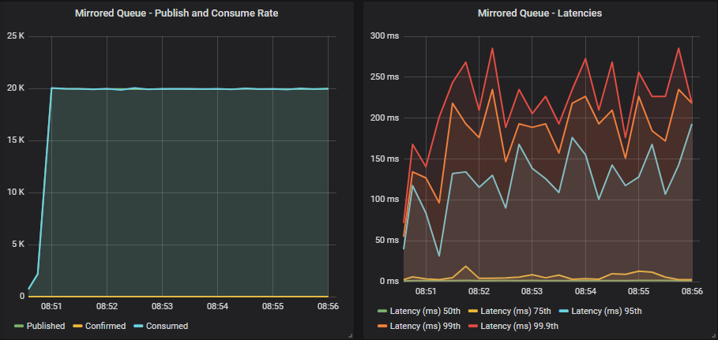

The cluster is not being driven harder by the publishers than it can handle. We get a smooth throughput that matches our target rate with sub-second latency.

**Mirrored queue with confirms**

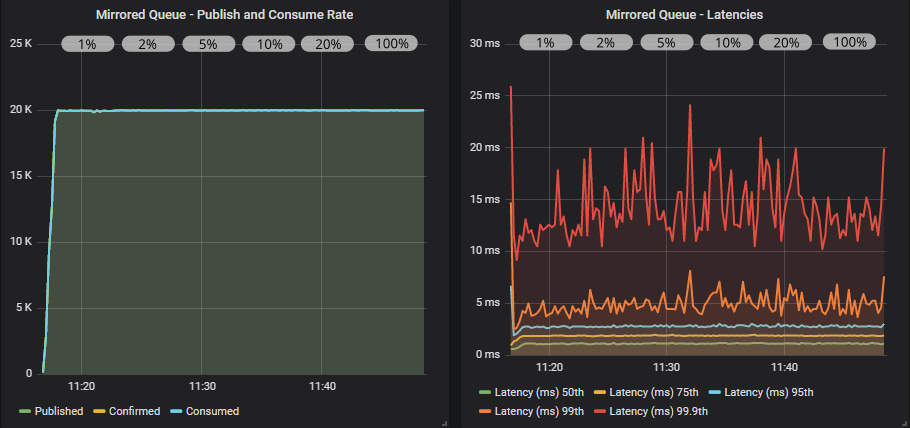

With this load level, all in-flight settings behave the same. We are not anywhere near the broker’s limit.

**Quorum queue without confirms**

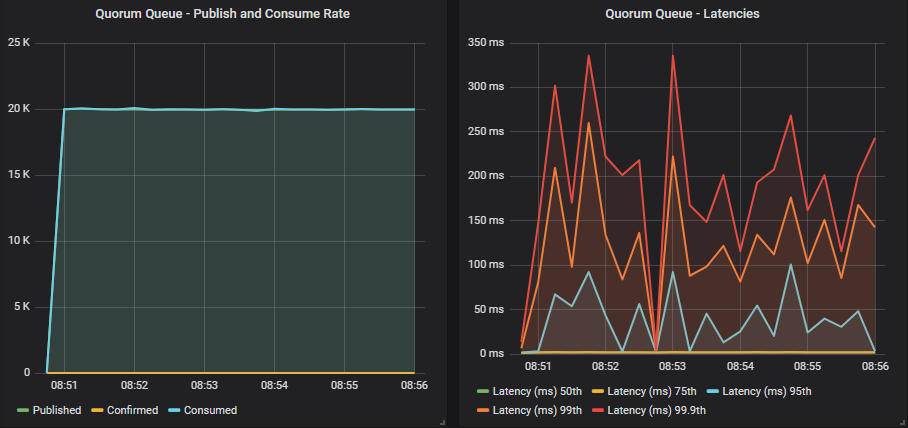

Target rate matched, latency sub-second.

**Quorum queue with confirms**

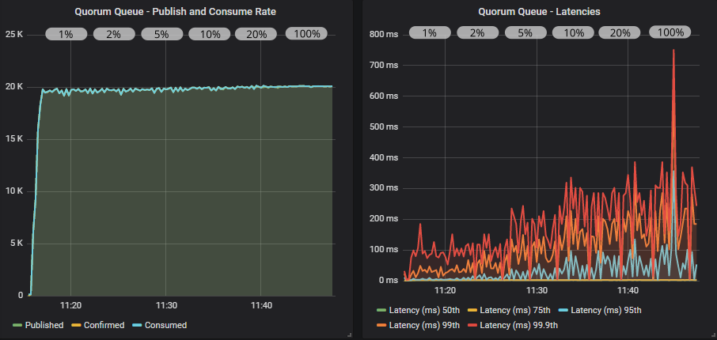

With confirms, and a low in-flight limit, quorum queues are a tiny bit short of the target rate but are achieving &lt; 200ms at all percentiles. As we increase the in-flight limit, the target rate is reached, with a smooth line but latencies increase while still falling below 1 second.

### Conclusion

When the publish rate is within a clusters capacity to deliver it to consumers, confirms with a low in-flight limit delivered the best end-to-end latency while no confirms or confirms with a high in-flight limit delivered the target throughput but at a higher latency (though still sub-second).

## Benchmark #2: 20 publishers, 2000 msgs/s per publisher, 10 queues, 20 consumers

With a total target rate of 40000 msg/s, this is around or above the throughput limit of the cluster on the chosen hardware. This kind of load is probably unsustainable for this cluster but could occur under peak load conditions. If it were sustained then bigger hardware would be advised.

We have three tests:

1. No publisher confirms
1. Confirms with in-flight limit as a percentage of the target send rate: 1% (20), 2% (40), 5% (100), 10% (200), 20% (400), 100% (2000). Prefetch of 2000, ack interval of 1.
1. Same as 2, but with multiple flag usage by consumers, using an ack interval of 200 (10% of prefetch).

**Mirrored queue without confirms**

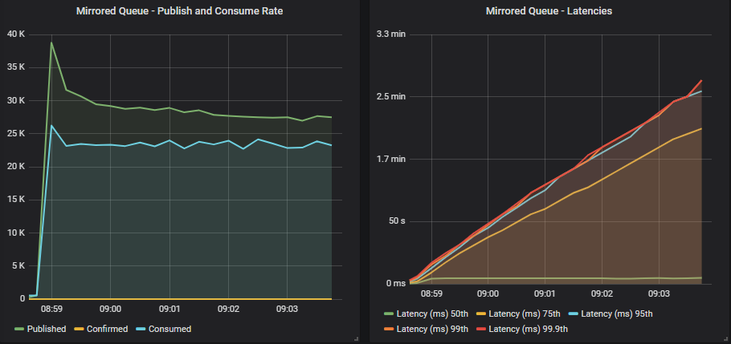

Publishers briefly touch close to the target rate but both publisher and consumer rates stabilise at a lower rate, with the publish rate exceeding the consumer rate. This causes the queues to fill up and latencies to skyrocket. If this were sustained then the queue would grow huge and place increasing pressure on resource usage.

**Mirrored queue with confirms**

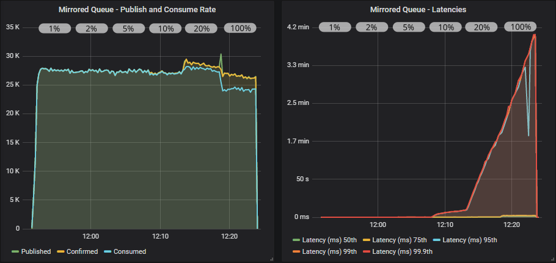

**Mirrored queue with confirms and multiple flag usage**

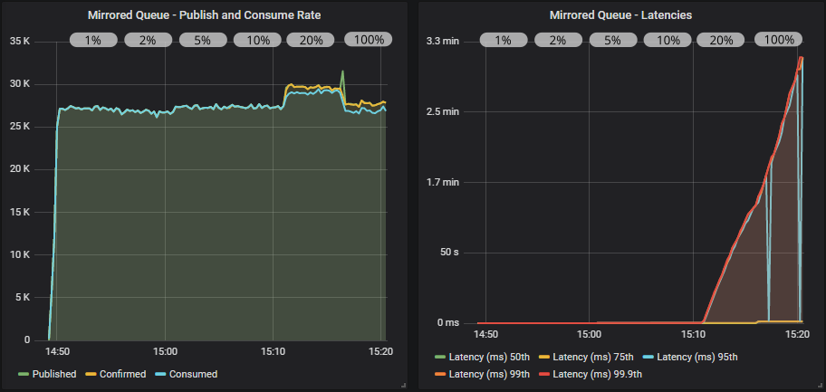

Confirms really make a difference now, applying effective back pressure on the publishers. We hit the peak throughput (still way-off the target) with the lowest in-flight limit of 20 (1% of target rate). End-to-end latency is low, at around 20ms. But as we increase the in-flight limit, a minority of the queues start filling up, causing the 95th percentile latency to shoot up. 

We see that using the multiple flag reduces the publish-to-consume rate imbalance when at the high in-flight limit and thereby reduces the worst of the latencies a bit. But the effect is not super strong in this case.

**Quorum queue without confirms**

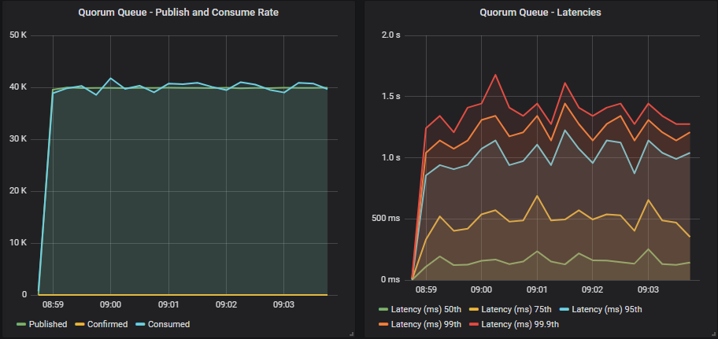

Quorum queues tend to outperform mirrored queues when the queue count is low. Here we see that 40000 msg/s was achieved and so back pressure on publishers was not needed.

**Quorum queue with confirms**

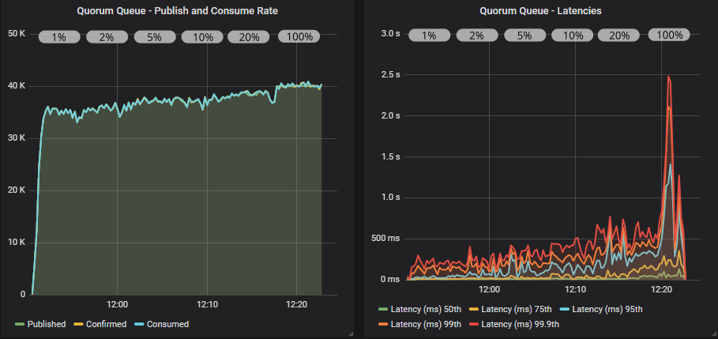

**Quorum queue with confirms and multiple flag usage**

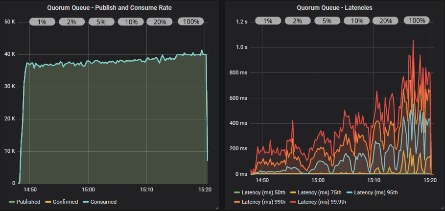

Quorum queues yet again deliver higher throughput and we even reached the target rate of 40000 msg/s with an in-flight limit of 2000. There was a mild benefit to using the multiple flag.

### Conclusion

Without the back pressure of using publisher confirms and an in-flight limit, mirrored queues fell apart. When publishers used confirms they effectively put back pressure on the publishers, achieving low latency until the in-flight limit reached 100% of the target rate, where again latency started spiking again. The important thing to note is that this target rate exceeded the mirrored queues capacity, and we saw how important back pressure was.

Quorum queues can achieve higher throughput than mirrored queues when the number of queues and publishers is relatively low. They were capable of delivering 40000 msg/s and so using confirms or not using confirms was not critical to stable performance.

Multiple flag usage was beneficial, but not game changing.

## Benchmark #3: 500 publishers, 30 msgs/s per publisher, 100 queues, 500 consumers

With a total target rate of 15000 msg/s, this is within the total throughput limit of the cluster on the chosen hardware. 

We have two tests:

1. No publisher confirms
1. Confirms with in-flight limit as a percentage of the target send rate: 6% (2), 10% (3), 20% (6), 50% 12, 100% (30), 200% (60) and no multiple flag usage.

**Mirrored queue without confirms**

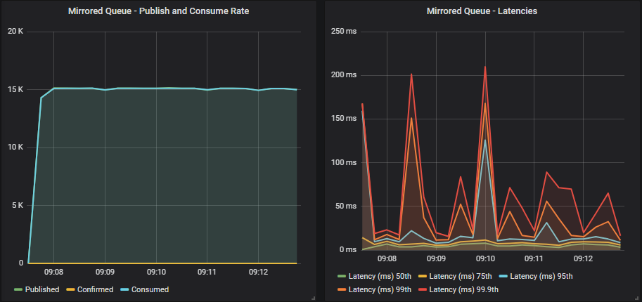

**Mirrored queue with confirms**

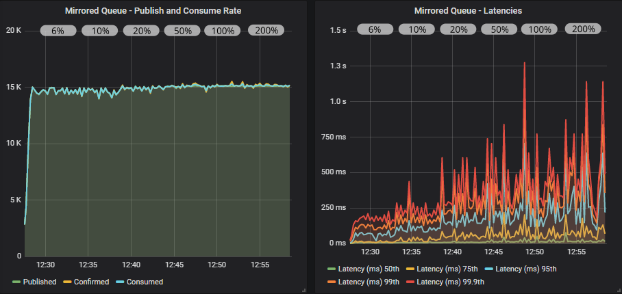

**Quorum queue without confirms**

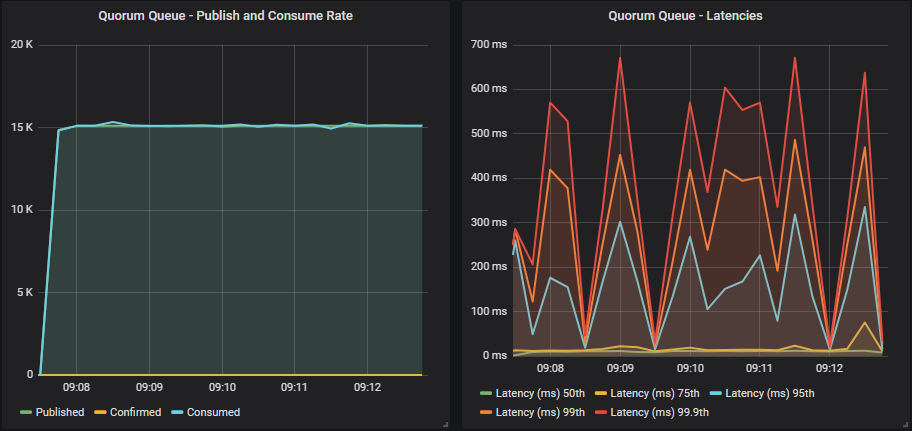

**Quorum queue with confirms**

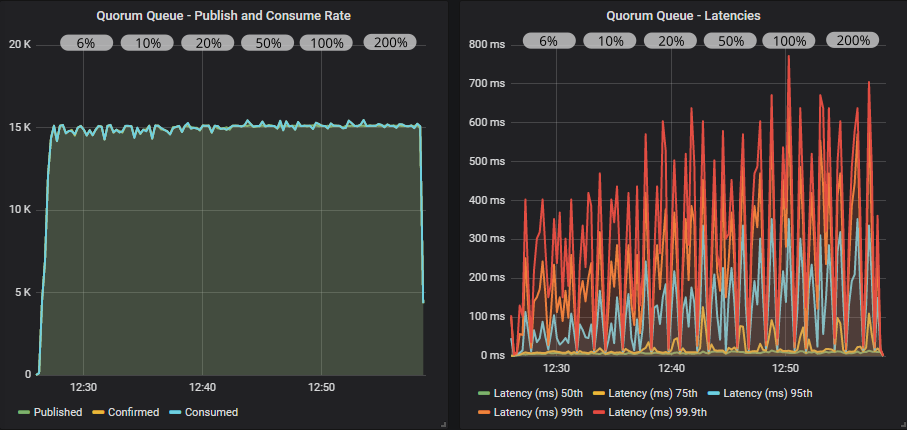

In all cases we matched the target rate. With confirms and a low in-flight limit the throughput had a small amount of jitter that resolved at higher limits.

As we increased the in-flight limit, latency crept up. Mirrored queues passed 1 second while quorum queues remained below 1 second.

Again, we see that when the cluster is within its capacity, we don’t need confirms as a back pressure mechanism (just for data safety).

## Benchmark #4: 500 publishers, 60 msgs/s per publisher, 100 queues, 500 consumers

With a total target rate of 30000 msg/s, this is just above the total throughput limit of the cluster for this number of clients and queues (on the chosen hardware). This will stress the cluster and is not a sustainable load that this cluster should be exposed to.

We have three tests:

1. No publisher confirms
1. Confirms with in-flight limit as a percentage of the target send rate: 5% (3), 10% (6), 20% (12), 50% (24), 100% (60), 200% (120) and a prefetch of 60.
1. Same as 2 but with multiple flag usage with an ack interval of 6 (10% of prefetch).

**Mirrored queue without confirms**

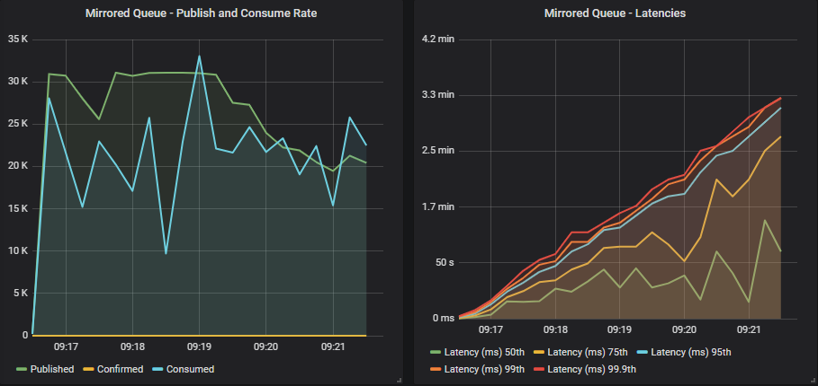

Without confirms, publishers briefly manage the target rate but consumers can’t keep up. Throughput is pretty wild and latencies for half the queues get close to 1 minute and the rest reach over 2-3 minutes.

**Mirrored queue with confirms**

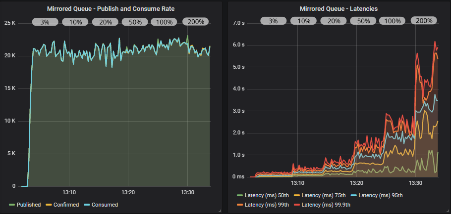

**Mirrored queue with confirms and multiple flag usage**

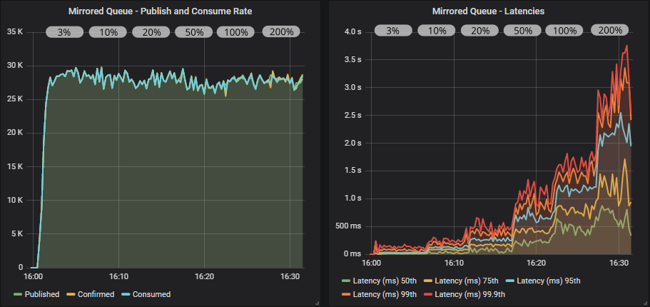

With confirms we get much more stable throughput where consumers keep up with the publish rate because the publishers are being rate limited by their in-flight limit. The multiple flag definitely helps this time, pushing us up to 5000 msg/s higher throughput. Notice that the in-flight limit of just 3% of the target rate delivers the best performance.

**Quorum queue without confirms**

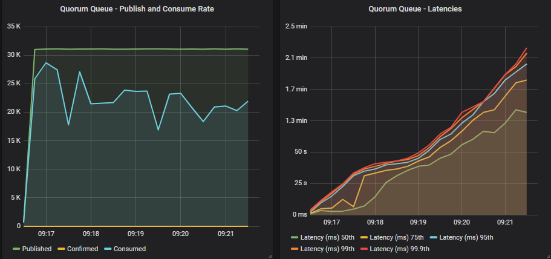

The publishers hit their target, but consumers are not keeping up and the queues are filling. This is not a sustainable position to be in.

**Quorum queue with confirms**

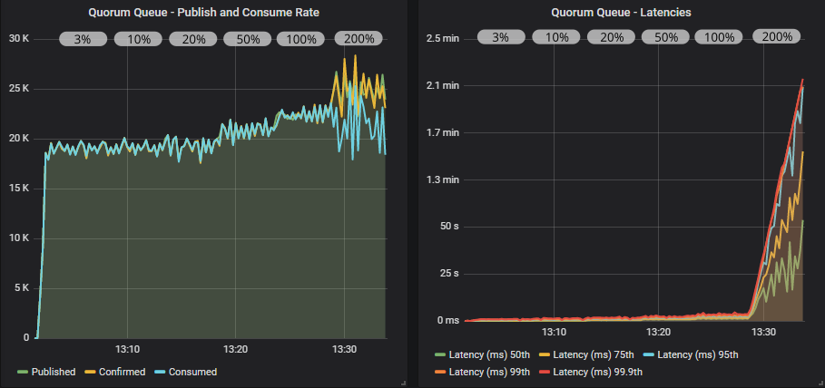

**Quorum queue with confirms and multiple flag**

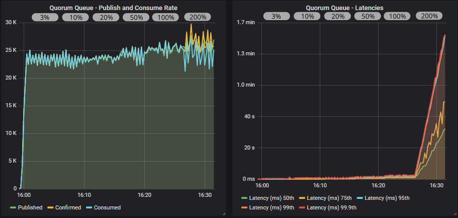

With publisher confirms we see more stable throughput but there is a definitely a saw-tooth pattern. We can go all the way up to an in-flight limit of 100% of the target rate without things falling apart, though latencies are steadily rising. At 200%, the publish rate exceeds the consume rate and the queues start filling up.

### Conclusion

When a cluster is past its limit, use of publisher confirms with an in-flight limit ensure a balanced publish and consume rate. Even though the publishers would go faster, they rate limit themselves and RabbitMQ can deliver sustainable performance for long periods.

With large numbers of publishers, consumers and queues, the maximum throughput of mirrored and quorum queues has converged to a similar number. Quorum queues no longer outperform mirrored queues. We saw a higher throughput with less clients and queues. Less means less context switching, less random IO which is all more efficient.

## Benchmark #5: 1000 publishers, 100 msgs/s per publisher, 200 queues, 1000 consumers

This load is way past what this cluster can handle at a total target rate of 100000 msg/s second over 200 queues. Beyond the low 10s of queues, expect maximum throughput of a cluster to fall as the number of queues increases.

If this cluster ever gets hit like this then it should only be for short periods of time.

We have three tests:

1. No confirms
1. Confirms with in-flight limit as a percentage of the target send rate: 2% (2), 5% (5), 10% (10), 20% (20), 50% (50), 100% (100) and a prefetch of 100.
1. Same as 2 but with multiple flag usage and an ack interval of 10 (10% of prefetch).

**Mirrored queue without confirms**

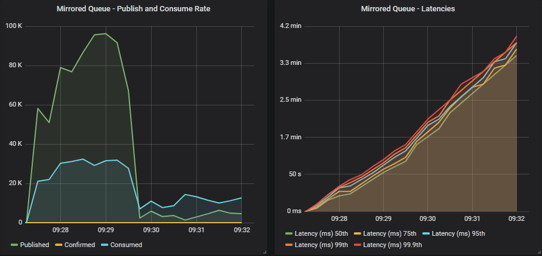

Publishers almost reach the target rate, but then buffers inside the brokers start reaching capacity and throughput plummets like a stone. Relying on TCP back pressure, with default credit based flow control settings with 1000 publishers sending faster than the cluster could handle didn’t go very well. 

The initial credit is 400 for each actor in the credit chain, so the reader process on each connection will accept at the least 400 messages before being blocked. With 1000 publishers, that’s 400,000 messages buffered just in the reader processes. Add to that the buffers of the channels and the queues, and all the outgoing port buffers etc and you can see how a broker can absorb and then get choked by a large number of messages from a large number of publishers, even before TCP back pressure kicks in.

**Mirrored queue with confirms**

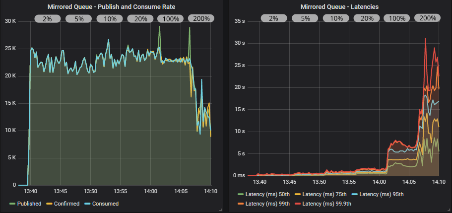

**Mirrored queue with confirms and multiple flag usage**

The publishers would love to reach the target rate but they are being rate limited effectively. As we increase the in-flight limit we see a slight increase in throughput and a larger increase in latency. In the end, when we reach an in-flight limit of 200% of the target rate, it’s too much, but publishers are still throttled. Queues back up a little and throughput drops, getting pretty choppy. Usage of the multiple flag helps, it lessens the drop and keeps latency below 25 seconds.

If we look at the [RabbitMQ Overview](https://grafana.com/grafana/dashboards/10991) Grafana dashboard (slightly modified for show here), we see that when the in-flight limit is low, there are a low number of pending confirms and pending consumer acks, but as we reach 100% in-flight limit those numbers reach 100,000. So RabbitMQ has a lot more messages buffered internally. Consumers have not reached their prefetch limit though peaking at 55,000 of their total possible 100,000.

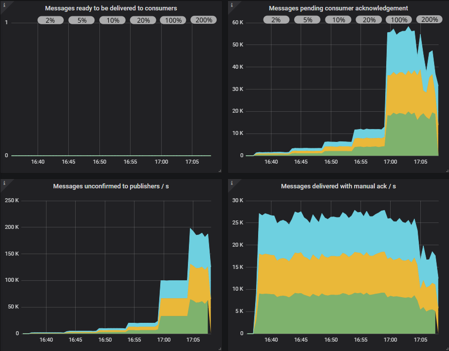

**Quorum queue without confirms**

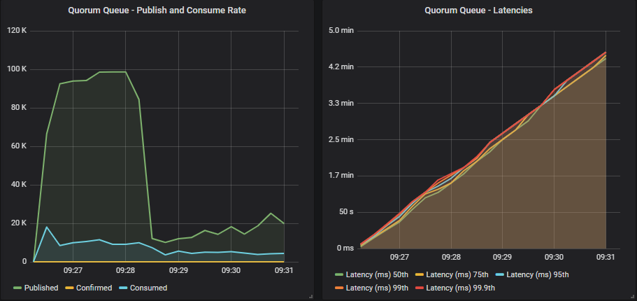

Same as mirrored queues. TCP back pressure was not enough to stop overload.

**Quorum queue with confirms**

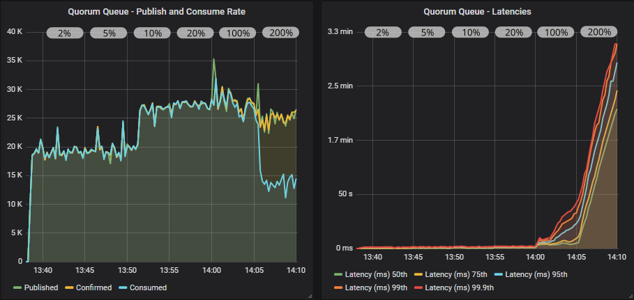

**Quorum queue with confirms and multiple flag usage**

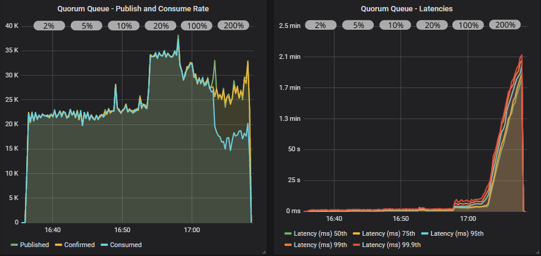

Quorum queues definitely benefited more than mirrored queues when switching from a low to a medium sized in-flight limit. With multiple flag usage we even hit close to 35000 msg/s. Things started to go wrong at the 100% of target rate limit and then really bad at 200%. The publishers pulled ahead causing the queues to fill up. This is when you really need that low value for the  *x-max-in-memory-length* quorum queue property. Without it, memory usage would spike very fast under these conditions causing huge swings in throughput as memory alarms turn on and off repeatedly.

We have made big improvements to quorum queue memory usage under stress in the upcoming 3.8.4 release. All these tests show the results of that work. Towards the end of this post we’ll show this same test with 3.8.3 and how it doesn’t deal so well with this stress test.

In the Overview dashboard we see how the queues are filling up. Consumers have reached their prefetch limit.

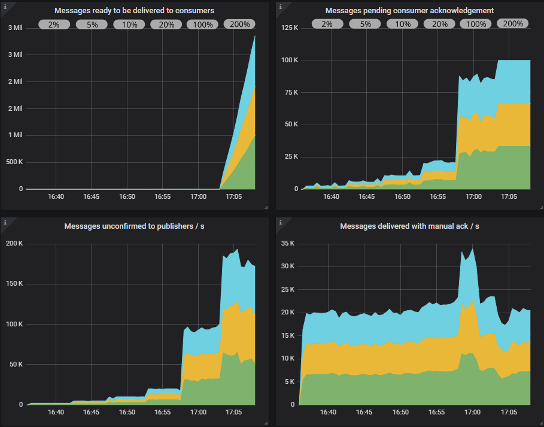

### Conclusion

Neither queue type could handle this load without publisher confirms. Each cluster got totally overwhelmed.

With confirms, mirrored and quorum queues achieved the same ballpark throughput and latency numbers until the 100% and 200% in-flight limits, where quorum queues fared worse.

Mirrored queues handled the overload pretty well, even with high in-flight limits. Quorum queues needed the additional help of a low in-flight limit to achieve stable throughput with low latency.

## What about 3.8.3 and earlier?

All the quorum queue tests were run on an alpha of 3.8.4, in order to show performance of the upcoming 3.8.4 release. But the rest of you will be on version 3.8.3 and earlier. So what can you expect?

The improvements landing in 3.8.4 are:

* High throughput capacity of segment writing. Messages are written first to the WAL and secondly to segment files. In 3.8.3 we saw that the segment writer was a bottleneck in high load, high queue count scenarios which would cause high memory usage. 3.8.4 comes with parallelised segment writing which completely solves this bottleneck.
* Default configuration values for quorum queues were load tested and we found some changes resulted in more stable throughput under high load. Specifically we changed quorum\_commands\_soft\_limit from 256 to 32 and raft.wal\_max\_batch\_size from 32768 to 4096.

If you are on 3.8.3 the good news is that rolling upgrades these days are easily performed, but if you can’t upgrade then try the above configurations. You’ll still have the possible bottleneck of the segment writer though.

Below is benchmark #5, with a longer running time, with 3.8.3 (with the configuration changes applied).

**3.8.3 benchmark #5**

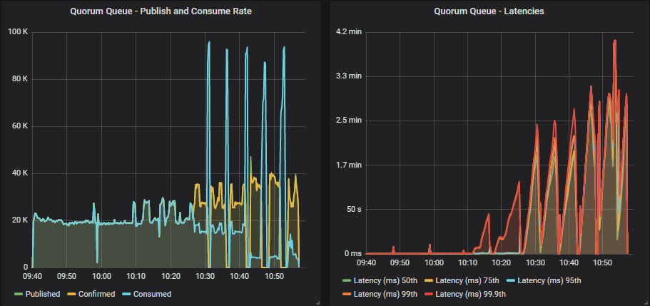

The main difference with 3.8.3 is that as we increase the in-flight limit, the segment writer falls behind and memory grows until memory alarms hit. Publishers get blocked and consumers are then unconstrained by competing with publishers to get their acks into the replicated log. The consume rate reaches short peaks of up to 90k msg/s until the queues are drained, memory falls and alarms deactivated, only to repeat again and again.

We can see that from the Overview dashboard. The 3.8.4 alpha has a slowly increasing memory growth as the in-flight limit rises.

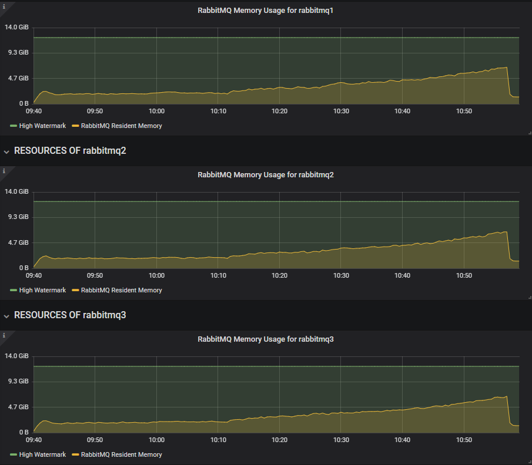

**3.8.3 hits the memory alarms repeatedly.**

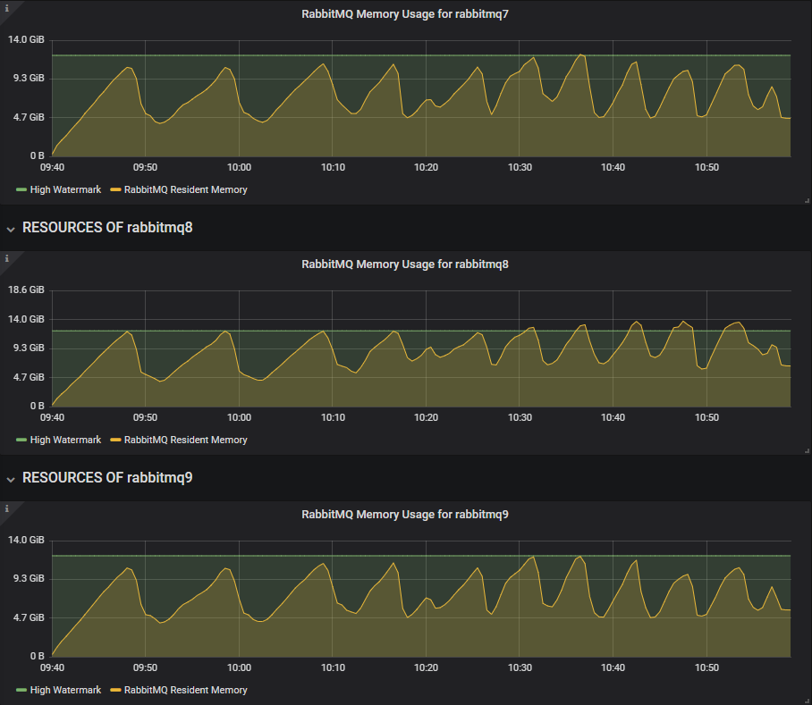

Even with the low in-flight limit, this heavy workload with a 1000 publishers was too much for the segment writer and it reached close to the memory alarms early in the test.

So if you have large publisher and queue counts with regular peaks in load that exceed its limits, then consider upgrading to 3.8.4 when it is out.

## Final Conclusions

First of all, if you are using a replicated queue (mirrored or quorum) then not using publisher confirms, from a data safety point of view, is highly inadvisable. Message delivery is not guaranteed, so please use them.

Data safety aside, these tests show that confirms also play a role in flow control.

Some key takeaways:

* Quorum queues can deliver higher throughput than mirrored queues when the queue count is in the region of 1-2 per core.
* At low publisher and queue counts, you can pretty much do anything. TCP back pressure is probably enough for both mirrored and quorum queues (not using confirms).
* At high publisher and queue counts and higher load, TCP back pressure is not enough. We must employ publisher confirms so that publishers rate limit themselves.
* At high publisher and queue counts, performance was more or less similar for both queue types. But quorum queues needed a little extra help via a lower in-flight limit during the stress test.
* Multiple flag usage was beneficial but not critical.
* Whatever you do, don't put your brokers under high load without publisher confirms!

So what is the best in-flight limit? I hope I’ve managed to persuade you that *it depends*, but as a rule of thumb, with low network latency between publishers and the broker, using a limit between 1% and 10% of the target rate is optimal. With fewer publishers that have a high send rate, then we veer towards 10% but with hundreds of clients then we veer towards the 1% mark. These numbers are likely to increase with higher latency links between publishers and brokers.

Regarding consumer prefetch, all these tests used a prefetch of the target publish rate (per publisher, not total), but remember that in these tests, the number of publishers matched the number of consumers. When the multiple flag was used, the ack interval was 10% of the prefetch value. Multiple flag usage is beneficial but its not a big deal if you don't use it.

If you are currently on mirrored queues and your workload more closely resembles benchmark #5 rather than any of the others, then it is recommended to make the jump after 3.8.4 is released. Improving flow control and resiliency under load is likely to be an ongoing effort, but is also workload specific in many cases. Hopefully you have seen that you have the power to tune throughput and latency via the use confirms, and get the behaviour that you need.

I would be amiss if I didn't mention capacity planning. Ensuring that RabbitMQ has enough hardware to handle peak loads is the best way to ensure that it can deliver performance that is acceptable. But there are always surprise loads, limits in budget and so on.

Remember, as with all benchmarks like this, don't fixate on these specific numbers. Your situation will be different. Different hardware, different message sizes, degrees of fanout, different versions of RabbitMQ, different clients, frameworks... the list goes on. The main takeaway is that you shouldn’t expect RabbitMQ to exert flow control by itself when under heavy load. It’s all about *mechanical sympathy*.

Next in the series is a look at migrating from mirrored to quorum queues.
