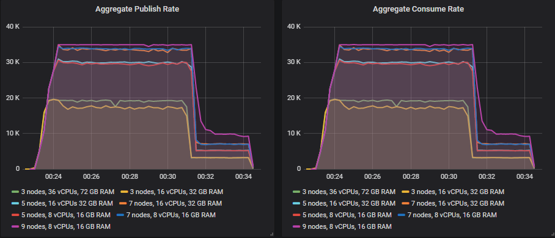

This is the start of a short series where we look at sizing your RabbitMQ clusters. The actual sizing wholly depends on your hardware and workload, so rather than tell you how many CPUs and how much RAM you should provision, we’ll create some general guidelines and use a case study to show what things you should consider.

<!-- truncate -->

## Common Questions

What is the best combination of VM size and VM count for your RabbitMQ cluster? Should you scale up and go for three nodes with 32 CPU threads? Or should you scale out and go for 9 nodes with 8 CPU threads? What type of disk offers the best value for money? How much memory do you need? Which hardware configuration is better for throughput, latency, cost of ownership?

First of all, there is no single answer. If you run in the cloud then there are fewer options but if you run on-premise then the sheer number of virtualisation, storage and networking products and configurations out there makes this an impossible question.

While there is no single sizing guide with hard numbers, we can go through a sizing analysis and hopefully that will help you with your own sizing.

## Some common considerations

### The number of queues and clients

Client connections and queues require compute time and memory. If you have thousands of queues and clients, then that will affect your sizing. The more you have, the more CPU cores and memory you're likely to need. Having few queues and clients is more efficient for RabbitMQ to handle - there is less CPU context switching and less memory overhead. So if you have a workload with thousands of queues and clients, then you'll need larger VMs or more VMs for the same total throughput compared to if you only had a handful of each.

Various types of churn can impact a cluster:

* Connection churn (the opening and closing of connections)
* Queue and queue binding churn (the creation and deletion queues and bindings)

### What is high throughput?

A million messages a day might sound like a lot, but when you calculate that as a per-second rate, it's just down to just under 12 messages per second. When you have throughput anywhere under a 100 per second you'll likely be able to size your VMs very small. It is unlikely you'll see a resource bottleneck unless you have thousands of queues and clients. If you use a cluster, at this rate it will be purely for redundancy rather than performance.

Once you get past 1000 messages a second (86 million a day or 2.5 billion per month), that's when you need to spend more time on your sizing analysis. For 1000 messages a second you can still go pretty small, but there may be some resource bottlenecks.

Beyond 10000 (860 million per day or 25 billion per month), I recommend you be even more thorough with your sizing analysis. We say *a happy Rabbit is an empty Rabbit*. RabbitMQ provides the best throughput and lowest latency when queues are empty. Messages are served from memory, often not written to disk at all. When you have a large backlog, messages are very likely read/written to disk, data structures are larger and less efficient and inevitably the maximum throughput a cluster can handle drops. When you have a high throughput cluster, backlogs can go from nothing to millions fast, and so you need to make sure you size for that. Don't just size for the happy case, but also the unhappy case. We'll look at this in more detail later on.

### What workloads require more memory?

Classic and classic mirrored queues will keep messages in memory but start evicting them when memory gets low. Its hard to predict because it is a dynamic behaviour. One good practice is to use lazy queues if you have very large queues because lazy queues evict from memory very early and typically use far less memory.

Quorum queues store all messages in memory at all times by default, even under low memory conditions. This means unless you change the defaults, you are more likely to hit the memory alarms (which blocks all publishers) when queues grow longer. The good news is this can be configured using a couple of queue properties (such as x-max-in-memory-length) which will only keep this configured number of messages in memory at a time. This should probably be set on all your quorum queues. It does mean that more messages are read from disk so it doesn't come for free.

### How does redundancy affect sizing?

If you use quorum queues or mirrored queues, then each message will be delivered to multiple brokers. If you have a cluster of three brokers and quorum queues with a replicator factor of 3, then every broker will receive every message. In that case, we've created a cluster for redundancy only. But we can also create larger clusters for scalability. We could have a cluster of 9 brokers, with quorum queues with a rep factor of 3 and now we've spread that load out and can handle a much larger total throughput.

Adding more redundancy will reduce total throughput, so to counteract that you can add more brokers to your cluster to spread the load.

### How does message size affect sizing?

Small messages, say under 1kb, are unlikely to saturate network or disk. If you hit a resource bottleneck it will likely be CPU. But we can easily saturate network and disk with larger message sizes. If you have 1Mb messages and a 5gbit network, then with a classic queue, you're going to saturate the network at just over 300 msg/s. If you use quorum or mirrored queues, it will be even lower as the messages must not only be received/sent to clients, but replicated between brokers.

### Do you plan to use Federation?

Federation involves running AMQP clients on the RabbitMQ brokers. That means they contend for the same resources as channels and queues. This may mean you need to increase the size/number of your VMs. Also take into account that:

* if you use mirrored queues for the local queues (that act as an outbox), then you'll be replicating those outgoing messages across your cluster. Redundancy is expensive.
* messages will be transmitted across the network to another broker, this adds to your network sizing.

Always include the federation setup in your sizing tests.

## Sizing - An AWS Case Study

We'll go through a case study now which will involve identifying the workload, defining our requirements regarding end-to-end latency and resiliency and finally a suite of tests that will measure different VM sizes and numbers against those requirements.

Remember, this is a case study, so your own requirements and workload may be very different to this. It is also a detailed analysis suitable for when RabbitMQ is a critical part of your infrastructure and is worth the time investment in doing a thorough sizing analysis.

### The Case Study Workload

For the purposes of our case study, I have chosen a medium sized, high intensity workload. That means we have a moderate number of queues and clients, but pushing a large number of messages through them.

* 200 publishers
* 100 queues
* 200 consumers
* No fanout - using the default exchange to do point-to-point
* 1kb message sizes
* 10 millisecond processing time per message
* Java client
* Constant rate

We have relatively stable throughput of 5000 msg/s most of the time but peaks of up to 20,000 msg/s that can last anything up to an hour or two hours per day. We project that traffic is likely to increase by 10% over the next year.

### Our Requirements

We want to size our cluster according to the peak throughput plus an additional 10,000 msg/s just in case of unexpectedly high traffic which will also cover the expected 10% growth. We don't need to size according to our expected growth beyond that as we can easily upgrade EC2 instances in the future.

We want to use a replicated queue as these messages have monetary value for the business. So we’ll run a sizing analysis for mirrored and the newer quorum queues.

In terms of latency, we’re happy as long as we’re below 1 second at 99th percentile end-to-end (time between publish and consumption of a message).

Finally we want to make sure we can hit our throughput peak even under adverse conditions such as losing a broker or there is a downstream outage that affects consumer throughput. If a queue backlog grows because consumers are running slowly, we want to absorb the message ingress (maintaining the publish rate). Slowing down publishing has a monetary cost for us.

### The Tests

#### Ideal Conditions - Increasing Intensity Tests

For the publish rate, we’ll actually run a series of benchmarks with different publish rates that cover the 5k to 30k msg/s and more. The idea is to identify up to what rate does a chosen sizing deliver the necessary results and when does it start to struggle and not meet the requirements. This is the happy scenario where RabbitMQ will likely remain empty (and fastest) because the consumers are keeping up at all times (until the cluster reaches its capacity).

We’ll use the rates (total across all publishers):

* 1000 msg/s (hourly=3.6 million, daily=86.4 million, monthly=2.5 billion)
* 5000 msg/s (hourly=18 million, daily=432 million, monthly=12.9 billion)
* 10000 msg/s (hourly=36 million, daily=864 million, monthly=25.8 billion)
* 15000 msg/s (hourly=54 million, daily=1.3 billion, monthly=38.9 billion)
* ...
* 70000 msg/s (hourly=252 million, daily= 6 billion, monthly=181.4 billion)

#### Adverse Conditions - Lose a Broker Test

We'll test that a chosen cluster size can handle the peak rate (30k msg/s) even when a broker is down. Brokers can go down because of multiple reasons: we reboot a machine as part of OS patch installations, a disk fails, a network partition etc. The worst case is this happens during peak load.

#### Adverse Conditions - Consume rate drops, creating a backlog test

A database server is being overloaded, or there is a network slowdown in downstream systems or a third party API is running slowly. Either way, the time to process each message goes from 10ms to 30 ms, dropping the consume rate. Can we continue to accept the publish rate unaffected and absorb the backlog?

#### Adverse Conditions - Publish rate peaks very high, exceeding consumers capacity test

A marketing campaign goes viral and we get way more traffic than expected, so much that our processing systems cannot handle the load. Can we absorb the traffic as large queue backlogs that can be processed later?

### The Clusters

#### The Cluster Sizes and Storage Volumes

We're running on AWS ec2, and what is the cloud but one giant API? We can easily automate the creation of any cluster size or any ec2 instance type we want.

We'll run all these tests on 7 different cluster configurations, with three different storage volume types (io1, gp2, st1).

The clusters:

* 3 nodes, c5.9xlarge, 36 vCPUs, 72 GB RAM = 108 vCPUs
* 3 nodes, c5.4xlarge, 16 vCPUs, 32GB RAM = 48 vCPUs
* 5 nodes, c5.4xlarge, 16 vCPUs, 32GB RAM = 80 vCPUs
* 7 nodes, c5.4xlarge, 16 vCPUs, 32GB RAM = 112 vCPUs
* 5 nodes, c5.2xlarge, 8 vCPUs, 16 GB RAM = 40 vCPUs
* 7 nodes, c5.2xlarge, 8 vCPUs, 16 GB RAM = 56 vCPUs
* 9 nodes, c5.2xlarge, 8 vCPUs, 16 GB RAM = 72 vCPUs

The c5.9xlarge can be considered a very large VM, it is definitely the biggest VM you would ever you go for. The c5.4xlarge could be considered large and the c5.2xlarge a medium sized instance. This is quite an intensive workload which is why we include these large instance types in the analysis. Many less intensive workloads would be suitable on a smaller instance type, such as the c5.xlarge with 4 vCPUs or c5.large. Larger memory instance types (m5, r5) are also an option if memory ever becomes an issue on these compute optimised instances.

The volumes:

* io1 (provisioned iops SSD), 200GB, 10000 IOPS, 500MiB/s max = $725 per month
* gp2 (general purpose SSD), 1000GB, 3000 IOPS, 250 MiB/s max = $100 per month
* st1 (high throughput HDD), 7000GB, 280 MB/s baseline, 500MiB/s max = $315 per month

The io1 has a large number of IOPs for its size which is expensive. This choice was in part a way of showing how more expensive disks factor into a sizing analysis. You'll see from the case studies that we could go with an io1 with less IOPs and it would be more cost effective.

We go for a large gp2 because smaller volumes get burst credits, which can surprise you. Likewise we went for 7TB HDD because of burst credits also. This size still has burst, but these workloads don’t dig into the burst much and are a balance of cost (this size will manage the 2 hour peaks). For the lower intensity workloads, we could go smaller and save ourselves some money.

This is a test with a 1TB HDD where the burst ran out.

### Costs Per Month (On-Demand pricing)

#### io1 SSD

Costs are: VMs + Volumes = Total

* 3 nodes, c5.9xlarge = 36 vCPUs, monthly cost of $3300 + $2175 = $5475
* 3 nodes, c5.4xlarge = 16 vCPUs, monthly cost of $1468 + $2175 = $3643 
* 5 nodes, c5.4xlarge = 16 vCPUs, monthly cost of $2445 + $3625 = $6070
* 7 nodes, c5.4xlarge = 16 vCPUs, monthly cost of $4123 + $5075 = $9198
* 5 nodes, c5.2xlarge = 8 vCPUs, monthly cost of $1225 + $3625 = $4850
* 7 nodes, c5.2xlarge = 8 vCPUs, monthly cost of $1715 + $5075 = $6790
* 9 nodes, c5.2xlarge = 8 vCPUs, monthly cost of $2205 + $6525 = $8730

#### gp2 SSD

Costs are: VMs + Volumes = Total

* 3 nodes, c5.9xlarge = 36 vCPUs, monthly cost of $3300 + $300 = $3600
* 3 nodes, c5.4xlarge = 16 vCPUs, monthly cost of $1468 + $300 = $1768 
* 5 nodes, c5.4xlarge = 16 vCPUs, monthly cost of $2445 + $500 = $2945
* 7 nodes, c5.4xlarge = 16 vCPUs, monthly cost of $4123 + $700 = $4823
* 5 nodes, c5.2xlarge = 8 vCPUs, monthly cost of $1225 + $500 = $1725
* 7 nodes, c5.2xlarge = 8 vCPUs, monthly cost of $1715 + $700 = $2415
* 9 nodes, c5.2xlarge = 8 vCPUs,, monthly cost of $2205 + $900 = $3105

#### st1 HDD

Costs are: VMs + Volumes = Total

* 3 nodes, c5.9xlarge = 36 vCPUs, monthly cost of $3300 + $945 = $4245
* 3 nodes, c5.4xlarge = 16 vCPUs, monthly cost of $1468 + $945 = $2413 
* 5 nodes, c5.4xlarge = 16 vCPUs, monthly cost of $2445 + $1575 = $4020
* 7 nodes, c5.4xlarge = 16 vCPUs, monthly cost of $4123 + $2205 = $6328
* 5 nodes, c5.2xlarge = 8 vCPUs, monthly cost of $1225 + $1575 = $2800
* 7 nodes, c5.2xlarge = 8 vCPUs, monthly cost of $1715 + $2205 = $3920
* 9 nodes, c5.2xlarge = 8 vCPUs,, monthly cost of $2205 + $2835 = $5040

We are not including data transfer costs.

We see that choosing gp2 is actually the cheapest option for us. Of course the st1 HDD is half the cost per GB but if we go smaller we can’t achieve the higher intensity throughput. So it seems that for our needs, an SSD could be the most cost effective option. Of course, it can never handle more than 250 MiB/s, so if that is the limiting factor then you would be forced to choose either the expensive io1 or the st1.

## The case studies

In the next posts we’ll perform this sizing analysis using both mirrored and quorum queues.

* [Cluster Sizing Case Study - Mirrored Queues Part 1](/blog/2020/06/19/cluster-sizing-case-study-mirrored-queues-part-1)
* [Cluster Sizing Case Study - Mirrored Queues Part 2](/blog/2020/06/20/cluster-sizing-case-study-mirrored-queues-part-2)
* [Cluster Sizing Case Study - Quorum Queues Part 1](/blog/2020/06/21/cluster-sizing-case-study-quorum-queues-part-1)
* [Cluster Sizing Case Study - Quorum Queues Part 2](/blog/2020/06/22/cluster-sizing-case-study-quorum-queues-part-2)

## Other tests that might apply to your workload

There are some more tests that you may wish to run depending on your workload. For example:

* You might want to run long-running tests at peak load. The tests in these two case studies were short - between 10 minutes to 1hr 40 minutes. If you identify a specific intensity and cluster configuration, you can try running it for 24 hours to make sure of your choice. Obviously if you have burst network/disk then that may affect things if you test at peak for that long.
* You might periodically get very large messages from a batch job that you want to test. *By the way, we recommend using an object store like s3 for large messages (passing its URI as the message).*
* You might want to test recovery time with a backlog by doing a full stop and start of your cluster. 
* You may have a variable number of clients connect to your cluster. Test your candidate cluster sizes with normal to worst case number of connected clients.
* [Connection churn](/docs/connections#high-connection-churn) (the opening and closing of connections) can also stress a cluster. If you have a variable amount of connection churn then test with normal and worst case. Also see [/docs/networking.html#tuning-for-large-number-of-connections-tcp-buffer-size](/docs/networking#tuning-for-large-number-of-connections-tcp-buffer-size).
* You may have a variable number of queues. Test your candidate cluster sizes with normal to worst case number of queues.

## Final Thoughts

The amount of effort you put into sizing is probably going to relate to how much you rely on RabbitMQ in your system and what kind of costs are involved if it fails to deliver the necessary performance. If you have a small workload that is not critical then you may not wish to spend too much time on sizing. Try out a couple of small options and monitor.

If you have larger workloads or business critical workloads, then taking the time to do capacity planning and sizing right may save you more lost time and pain later.

Take the time to review the quorum and mirrored queue case studies, but if you don't have time then here are some guidelines distilled into a single section.

High availability (HA) is a common requirement and is the reason we use replicated queues (quorum, mirrored). We don't want to lose messages and we want to have continued availability even when failures occur. Don't forget that capacity planning is also critical to get right in order to achieve those goals.

Sizing is about running your workload or workload simulations under both ideal and adverse conditions. Peak load is often when a business is making most money and when adverse conditions are also most likely to occur. Sizing according to the adverse conditions is a key part of getting sizing right.

Adverse conditions, where RabbitMQ can still operate effectively if appropriately sized are:

* loss of brokers (disk failing, VM reboots, network partitions)
* queue backlogs (caused by consumer slowdown or publishing peaks)
* huge numbers of TCP connections
* huge numbers of queues

Of those things, broker loss is probably the least stressful for RabbitMQ. One of the hardest things for RabbitMQ to handle is very large queue backlogs. In our case studies we saw that with appropriate sizing, RabbitMQ could handle this high throughput workload despite huge backlogs, but only with the largest clusters. Smaller clusters did fine under ideal conditions but quickly deteriorated when queues started backing up.

If you already have your production and QA environment deployments automated, then testing different VM sizes and counts should be simple enough to do. If you can run these sizing tests with your actual applications then that is likely to give you the most accurate results. If using your own applications to generate the load is too much, then look at designing a synthetic workload that matches the real-world as close as possible.

The case studies include PerfTest commands and there is also [this post](/blog/2020/06/04/how-to-run-benchmarks) that provides guidance and options for running performance tests.

I hope this sizing guidance has been helpful and helps RabbitMQ be a rock solid piece of your architecture.
