The team was recently asked about whether and how quorum queues can offer the same message ordering guarantees as classic queues given that they will deliver messages from a local queue replica (leader or follower) when possible. Mirrored queues always deliver from the master (the leader), so delivering from any queue replica sounds like it could impact those guarantees. 

That is the subject of this post. Be warned, this post is a technical deep dive for the curious and the distributed systems enthusiast. We’ll take a look at how quorum queues can deliver messages from any queue replica, leader or follower, without additional coordination (extra to Raft) but maintaining message ordering guarantees.

<!-- truncate -->

## TLDR

All queues, including quorum queues, provide ordering guarantees per channel for messages that are not *redeliveries*. The simplest way to look at it is if a queue has only one consumer, then that consumer will get messages delivered in FIFO order. Once you have two consumers on a single queue, then those guarantees change to a monotonic ordering of *non-redelivered* messages - that is that there may be gaps (because consumers now compete) but a consumer will never be delivered a later message before an earlier message (that is *not a redelivery*).

If you need bullet proof FIFO ordering guarantees of ALL messages (including redelivered messages) then you need to use the Single Active Consumer feature with a prefetch of 1. Any redelivered messages get added back to the queue before the next delivery takes place - maintaining FIFO order.

Quorum queues deliver the same ordering guarantees as classic queues. It just happens to also be able to deliver from any local replica, that is, local to the consumer channel. If you want to understand how quorum queues manage that, then read on! If not then stop here but be happy knowing that the usual ordering guarantees are still maintained.

## The Cost of Proxying Traffic

RabbitMQ tries to make things simple by allowing any client to connect to any node in a cluster. If a consumer connects to broker 1 but the queue exists on broker 2, then the traffic will be proxied from broker 2 to broker 1 and back. The consumer has no clue that the queue is hosted on a different node.

This flexibility and ease of use comes at a cost though. On a three node cluster, the worst case scenario is that the publisher connects to broker 1, its messages are routed to a classic unreplicated queue on broker 2 and the consumer of that queue is connected to broker 3. To process these messages, all three brokers have been roped into it which is of course less efficient.

If that queue were replicated then the messages would have to be transmitted between the brokers one time for the proxying and then additionally for the replication. On top of that we covered how inefficient the [mirrored queue algorithm](/blog/2020/04/20/rabbitmq-gets-an-ha-upgrade) is with multiple sends of each message.

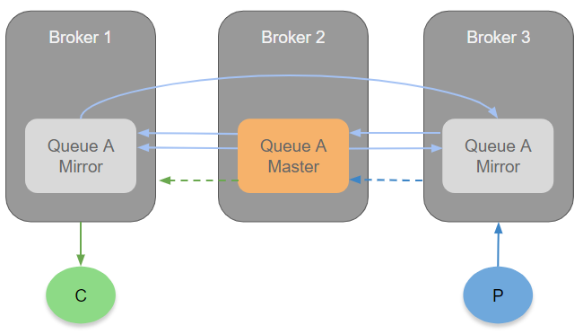

It would be nice if consumers could get delivered the messages from where they are connected to, rather than from the leader that exists on a different broker - this would save on network utilisation and take some pressure off the queue leader.

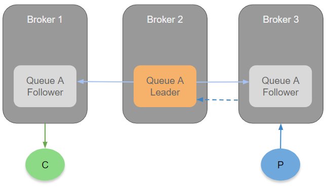

## The Cost of Coordination

With mirrored queues, all messages are delivered by the queue master (and potentially sent to the consumer via another broker). This is simple and requires no coordination between the master and its mirrors.

In quorum queues we could have added coordination between the leader and the followers to achieve local delivery. Communication between the leader and followers would coordinate who would deliver which message - because what we can’t have is a message being delivered twice or not at all. Unfortunate things can happen, consumers can fail, brokers can fail, network partitions etc and the coordination would need to handle all of that. 

But coordination is bad for performance. The kind of coordination to make local delivery work could be extremely impactful on performance and also extremely complex. We needed another way and luckily everything we needed was already built into the protocol.

## Coordination No, Determinism Yes

A common method of avoiding coordination in distributed systems is by using determinism. If every node in a cluster gets the same data, in the same order and makes decisions based only on that data then each node will make the same decision at that point in the log. 

Deterministic decision making requires that each node is fed the same data in the same order. Quorum queues are built on Raft which is a replicated commit log - an ordered sequence of operations. So as long as all the information required to perform local delivery is written to this ordered log of operations, then each replica (leader or follower) will know who should deliver each message without needing to talk to each other about it.

It turns out that even for leader-only deliveries, we still need the coming and going of consumers to be added to the log. If a broker fails and another follower gets promoted to leader, it will need to know about the surviving consumer channels that exist across the cluster so it can deliver messages to them. This information also enables coordination free local delivery.

## Effects and the Local flag

Quorum queues are built on a Raft implementation called Ra (also developed by the RabbitMQ team). Ra is a programmable state machine that replicates a log of operations. It differentiates between operations that all replicas should perform (commands), for consistency, and external operations that only the leader should perform (effects). These commands, states and effects are programmed by the developer. Quorum queues have their own commands, states and effects.

A good example of commands and effects are a key-value store. Adding, updating and deleting the data should be performed by all replicas. Each replica needs to have the same data, so when a leader fails, a follower can take over, with the same data. So data modifications are commands. But notifying a client application that a key changed should only happen once. If a client app asked to be notified when a key is updated, it doesn’t want to be notified by the leader and all the secondary replicas! So only the leader should execute the effects.

Ra has support for “local” effects. In the case of quorum queues, only the *send_msg* effect is local. The way it works is that all replicas know which consumer channels exist and on which nodes. When a consumer registers, that information is added to the log and likewise, when it fails or cancels that is also added to the log.

Each replica “applies” each *committed* (majority replicated) command in the log in order. Applying an *enqueue* command adds the message to the queue, applying a *consumer down* command removes that consumer from the Service Queue (more on that next) and returns all messages it has pending back to the queue for redelivery.

The consumers are added to a Service Queue (SQ) which is deterministically maintained - meaning that all replicas have the same SQ at any given point in the log. Each consumer will assess any given message not yet delivered, with exactly the same SQ as all the other replicas and will dequeue a consumer from the SQ. If that consumer is local (meaning that its channel process is hosted on the same broker as the replica) then the replica will send the message to that local channel. That channel will then send it to the consumer. If the consumer channel is not local, then the replica will not deliver it, but will track its state (who it was delivered to, whether it has been acknowledged etc). One caveat is that if there isn’t a replica that is local to the consumer channel, then the leader sends it to that channel (the proxying approach).

If you still find this interesting, but find it hard to conceptualise then I don’t blame you. What we need are diagrams and a sequence of events to demonstrate this.

## An example with diagrams

I will group sets of events into each diagram, so as to keep the number of diagrams as low as possible.

Each diagram consists of three queue replicas, one leader and two followers. We see the state of the log, the service queue, the queue representation and the “apply” actions. Each operation has the format “command term:offset data”. So for example ***E 1:1 m1*** is the enqueue command, which is added in the first term, has the first offset and is message m1. Terms and offsets are Raft algorithm terms and not super important in order to understand local delivery (but I recommend reading up on the Raft algorithm if you find this interesting).

**Diagrams guide**

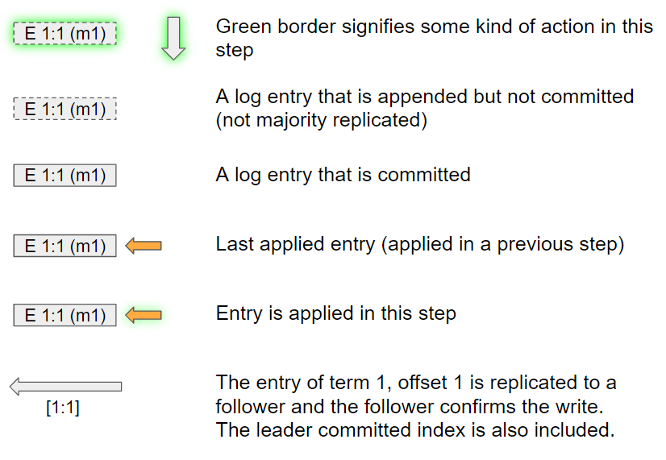

### Group 1 (event sequence 1)

* A publisher channel adds an **enqueue m1* *command for message m1.

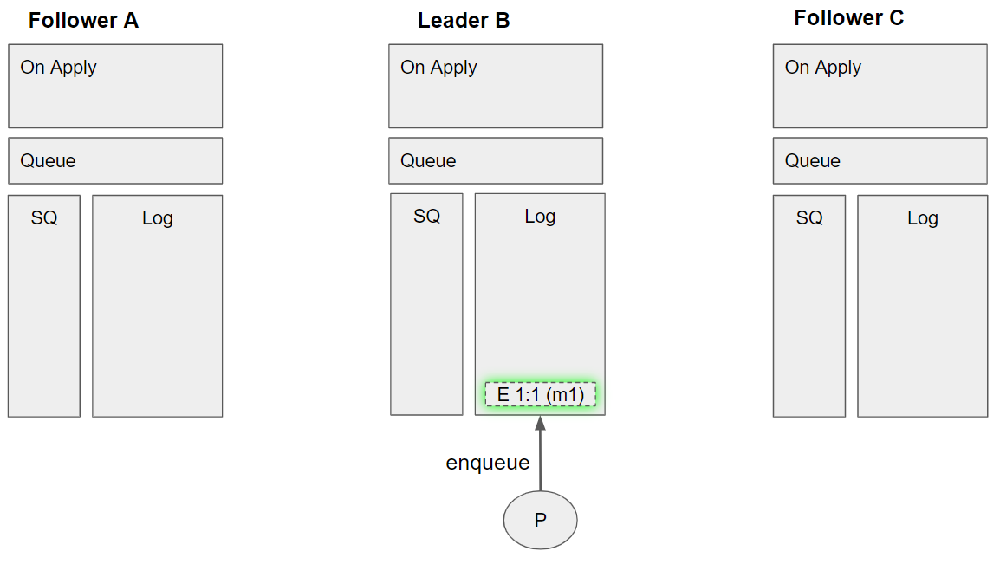

### Group 2 (event sequence 2-3)

* The leader replicates the **enqueue m1** command to Follower A
* The leader replicates the **enqueue m1** command to Follower C

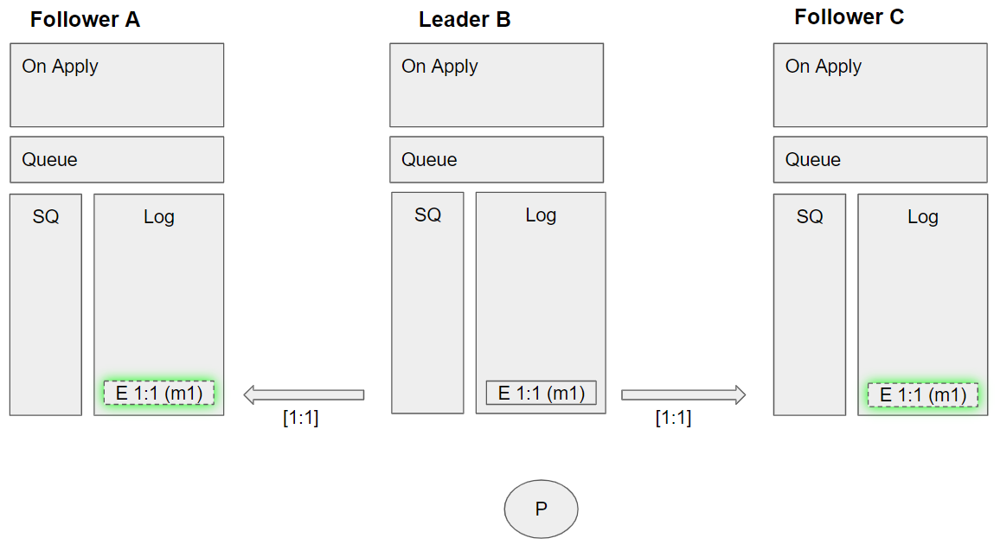

### Group 3 (event sequence 4-5)

* The channel for consumer 1, connected to the broker of Follower A, adds a **subscribe c1** command
* Command **enqueue m1** is applied by leader B (because it is now committed). 
  1. The leader adds it to its queue
  1. The leader notifies the publisher channel it is committed.

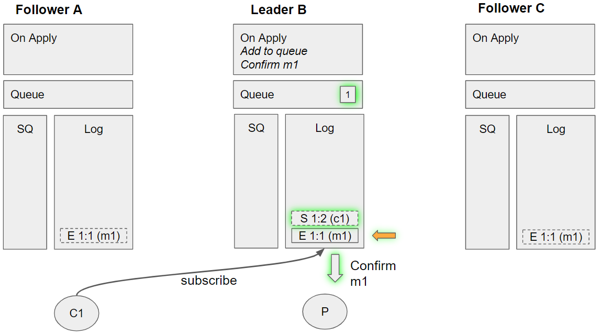

### Group 4 (event sequence 6-9)

* The leader replicates the **subscribe c1** command to Follower A
* The leader replicates the **subscribe c1** command to Follower C
* Follower C applies the **enqueue m1** command:
  1. Adds the message to its queue
  1. Sees no consumers, so no delivery to be made
* Follower A applies the **enqueue m1** command:
  1. Adds the message to its queue
  1. Sees no consumers, so no delivery to be made

The consumer does exist of course, but the replicas only learn of consumers when they apply the subscribe command in their logs. They do have those commands in their logs, but they have not yet applied them.

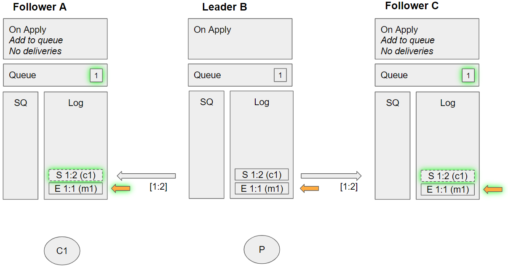

### Group 5 (event sequence 10-12)

* Leader B applies the **subscribe c1** command:
  1. C1 is added to its Service Queue (SQ)
  1. Assesses message m1 which is not delivered yet. It dequeues C1 from the SQ but sees that it is not local so does not send the message to C1, instead it just tracks m1 as being handled by C1. Requeues C1 on the SQ.
* C2 adds a **subscribe c2** command to the leader.
* The publisher channel adds an **enqueue m2** command for message m2.

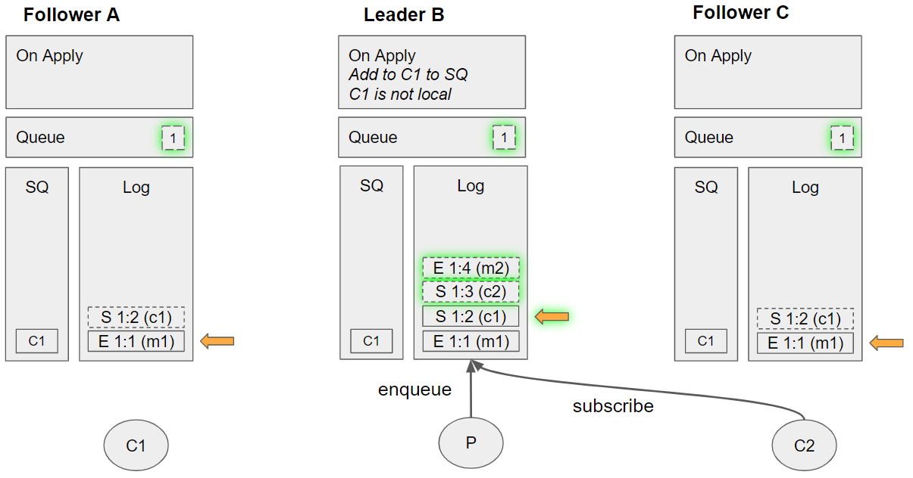

### Group 6 (event sequence 13-16)

* The leader replicates the **subscribe c2** command to Follower A
* The leader replicates the **subscribe c2** command to Follower C
* Follower C applies the **subscribe c1** command:
  1. C1 is added to its Service Queue (SQ)
  1. Assesses message m1 against the first consumer in its SQ, but that channel is not local, requeues C1 on the SQ.
* Follower A applies the **subscribe c1** command:
  1. C1 is added to its Service Queue (SQ)
  1. Assesses message m1 against the first consumer in its SQ, and sees that the channel is local and so sends the message to that local channel. Requeues C1 on the SQ.

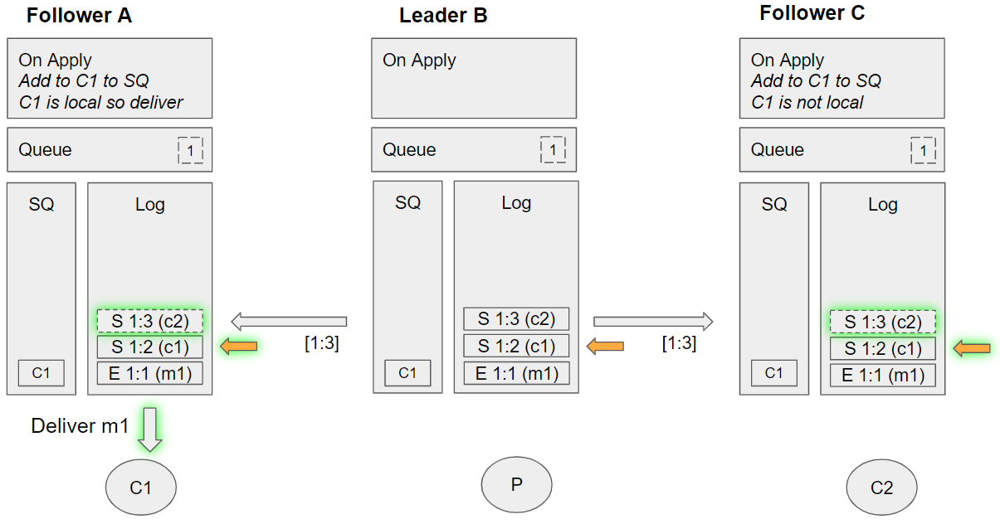

### Group 7 (event sequence 17-20)

* Leader B applies the **subscribe c2** command:
  1. Enqueues C2 on its SQ.
* The leader replicates the **enqueue m2** command to Follower A
* The channel of consumer 1 adds an **acknowledge m1** command for m1.
* Follower A applies the **subscribe c2** command:
  1. Enqueues C2 on its SQ.

Notice that Follower A and Leader B are at the same point in their logs, and have the same Service Queues.

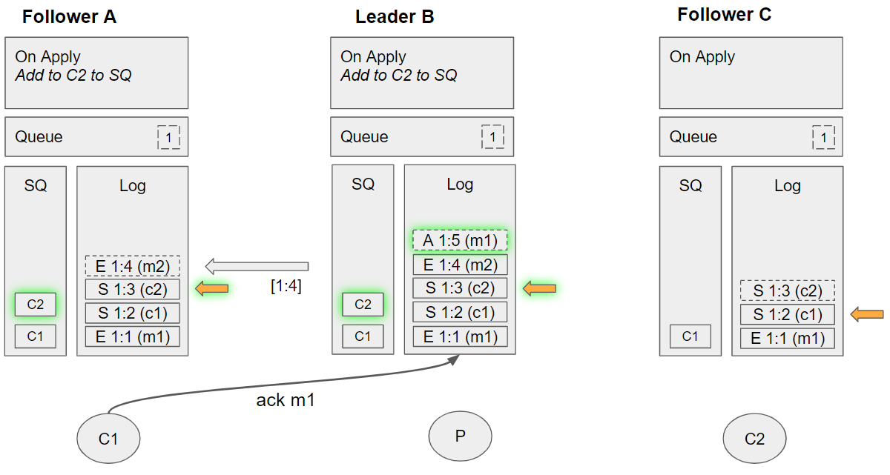

### Group 8 (event sequence 21-23)

* Leader B replicates the **enqueue m2** command to Follower C
* Follower C applies the **subscribe c2** command
  1. Enqueues C2 to its SQ
* Leader B applies the **enqueue m2** command:
  1. Adds message m2 to its queue
  1. Dequeues C1 from its SQ. Sees that this channel is not local. Requeues C1 to the SQ. Tracks state message m1 (that C1 will handle it).
  1. Notifies the publisher channel that this message has been committed.

At this point the SQ of Leader B is different from the followers, but that is only because it is one command ahead in its log.

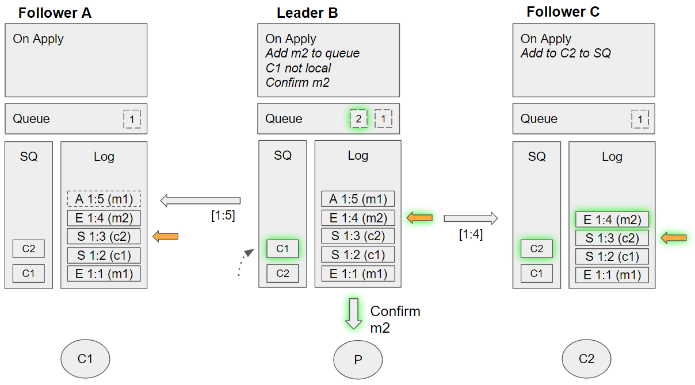

### Group 9 (event sequence 24-26)

* Leader B applies the **acknowledge m1** command:
  1. Removes the message from its queue
*Follower C applies the **enqueue m2** command:
  1. Adds message m2 to its queue
  1. Dequeues C1 from the SQ, but C1 is not local.
* Follower A applies the **enqueue m2** command:
  1. Adds message m2 to its queue
  1. Dequeues C1 from the SQ, and sees that C1 is local so sends C1 the message m2. Requeues C1 on the SQ.

See that the service queues match each other - the followers are at the same offset and the leader is ahead by one, but acknowledgements don’t affect the service queues.

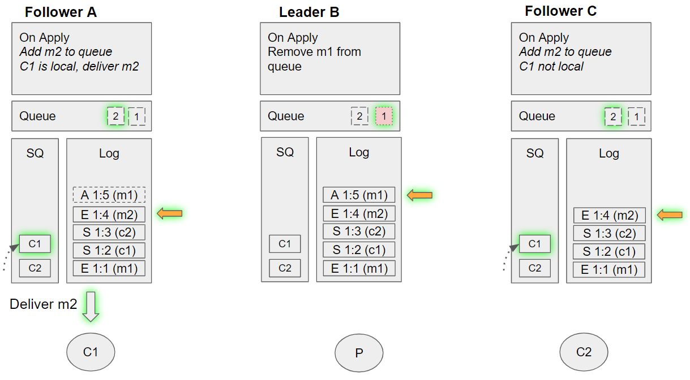

### Group 10 (event sequence 27)

* The broker that hosts Leader B fails or is shutdown.

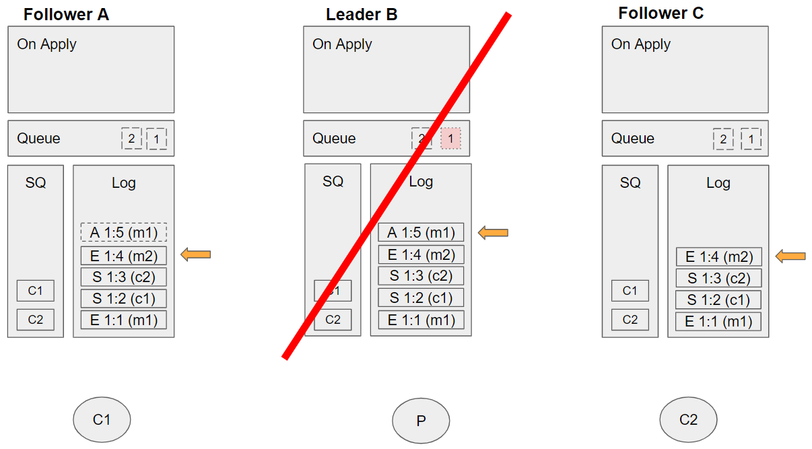

### Group 11 (event sequence 28)

* A leader election occurs and Follower A wins as it has the highest epoch:offset operation in its log.

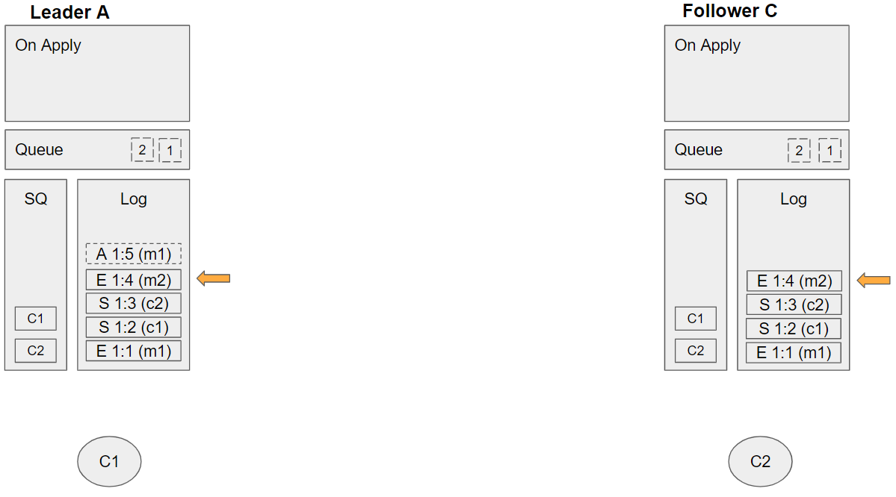

### Group 12 (event sequence 29-30)

* A publisher channel adds an **enqueue m3** command.
* Leader A replicates the **acknowledge m1** command to Follower C

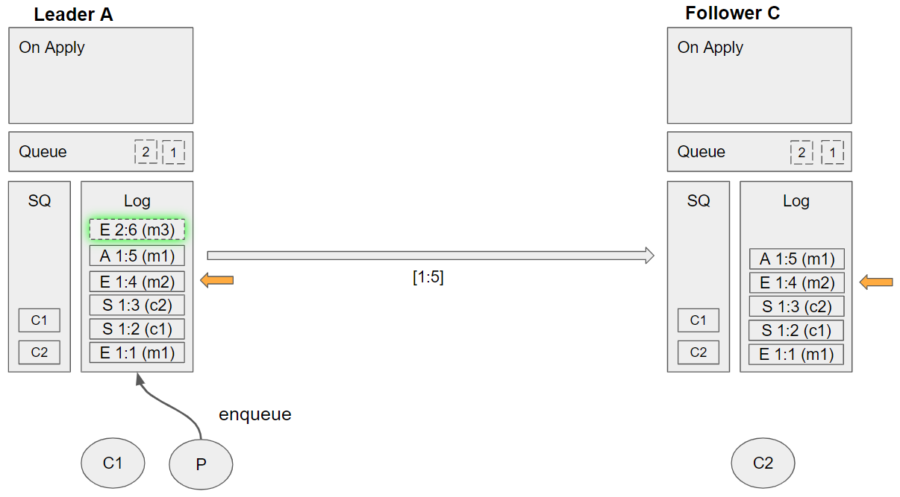

### Group 13 (event sequence 31-33)

* Leader A replicates the **enqueue m3** command to Follower C
* Leader A applies the **acknowledge m1** command
  1. Removes m1 from its queue
* Follower C applies the **acknowledge m1** command
  1. Removes m1 from its queue

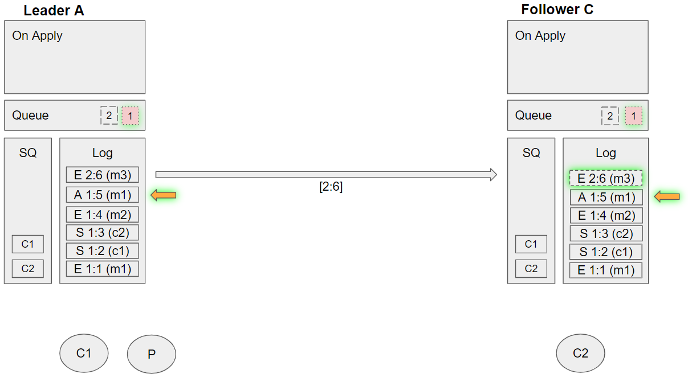

### Group 14 (event sequence 34-35)

* Leader A applies the **enqueue m3** command:
  1. Adds m3 to its queue
  1. Dequeues C2 from its SQ. C2 is not local, so requeues C2 and tracks message m3 state.
* Follower C applies the **enqueue m3** command:
  1. Adds m3 to its queue
  1. Dequeues C2 from its SQ. C2 is local and so sends message m3 to that local channel. Requeues C2 on its SQ.

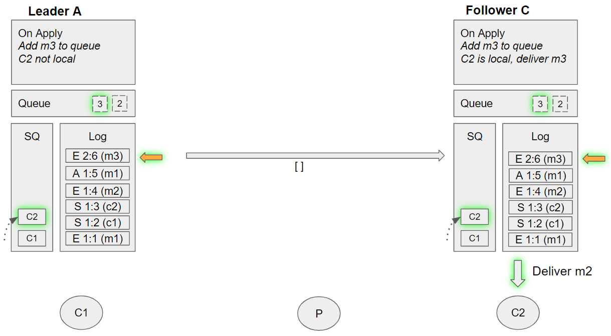

So we see that without additional coordination between the replicas, we achieve local delivery, while maintaining FIFO order, even across leadership fail-overs.

But what about if a consumer fails after having been delivered a message by a follower? Will that be detected and the message redelivered to another consumer channel on a different broker?

## Alternate scenario - Consumer Failure

We’ll continue where we left off from Group 6 - m1 was already delivered to C1 but not acknowledged.

### Group 7 - Alternate (event sequence 17-20)

* The channel for C1 goes away (for whatever reason)
* Leader B applies the **subscribe c2** command:
  1. Enqueues C2 to SQ
* Follower A applies the **subscribe c2** command:
  1. Enqueues C2 to SQ
* Leader B’s monitor sees that C1 is gone. Adds a **down c1** command it’s log.

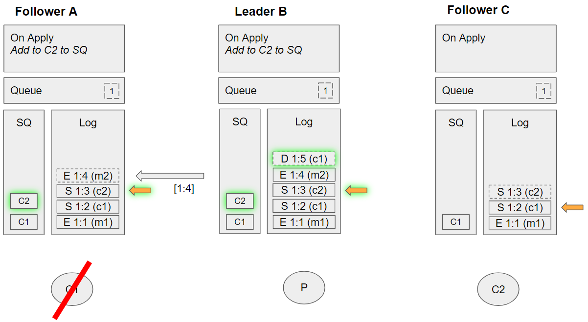

### Group 8 - Alternate (event sequence 21-25)

* Leader A replicates the **down c1** command to Follower A
* Leader A replicates the **enqueue m2** command to Follower C
* Follower C applies the **subscribe c2** command:
  1. Enqueues C2 to its SQ
* Leader B applies the **enqueue m2** command:
  1. Dequeues C1 from its SQ, but C1 is not local so requeues it. 
* Follower A applies **enqueue m2** command:
  1. Dequeues C1 from its SQ. C1 is local. Tries to send it the message m2 (but can’t because it doesn't exist anymore). Requeues C1 on its SQ.

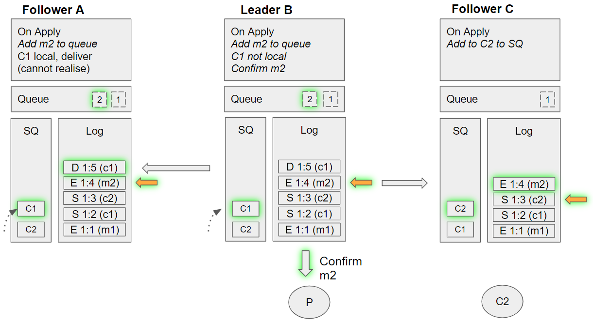

### Group 9 - Alternate (event sequence 26-28)

* Leader B applies the **down c1** command:
  1. Removes C1 from its SQ
  1. Retuns to the queue the messages m1 and m2 that were previously delivered to C1 but not acknowledged
  1. For redelivering message m1, dequeues C2 from the SQ but sees that it is not local. Requeues C2.
* Follower C applies the **enqueue m2** command:
  1. Dequeues C1 from its SQ, but C1 is not local so requeues it, tracks m2 as being handled by C1.
* Follower A applies the **down c1** command:
  1. Removes C1 from its SQ
  1. Returns to the queue the messages m1 and m2 that were previously delivered to C1 but not acknowledged
  1. For redelivering message m1, dequeues C2 from the SQ but sees that it is not local. Tracks as being handled by C2.

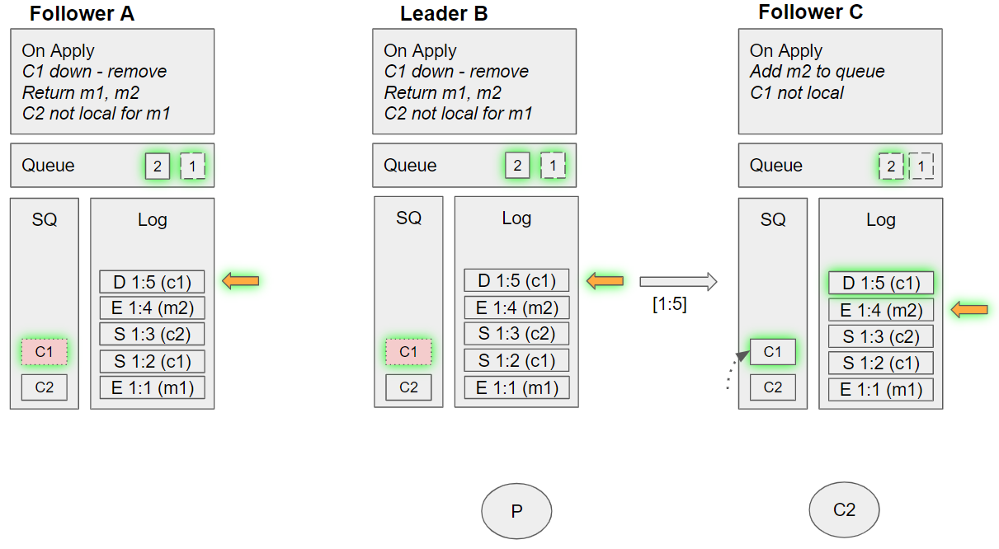

### Group 10 - Alternate (event sequence 29-31)

* Follower A takes the next undelivered message, m2. Dequeues C2 from its SQ, but C2 is not local. Tracks m2 as being handled by C2, requeues C2 on the SQ.
* Leader B takes the next undelivered message, m2. Dequeues C2 from its SQ, but C2 is not local. Tracks m2 as being handled by C2, requeues C2 on the SQ.
* Follower C applies **down c1** command:
  1. Removes C1 from its SQ
  1. Follower C takes the next undelivered message, m1. Dequeues C2 from its SQ, and sees that C2 is local. Sends m1 to this local channel, requeues C2 on the SQ.

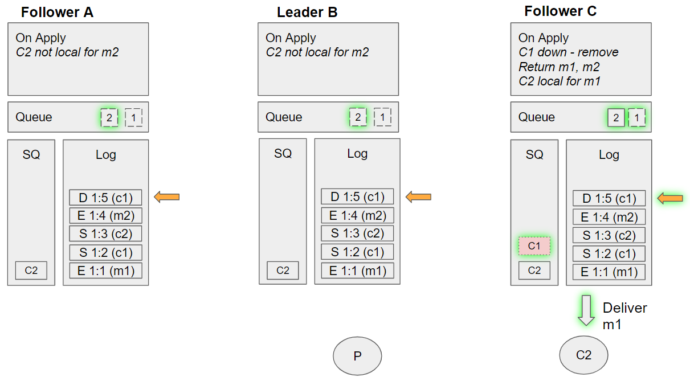

### Group 11 - Alternate (event sequence 32)

* Follower C takes the next undelivered message, m2. Dequeues C2 from its SQ, and sees that C2 is local. Sends m2 to this local channel. Requeues C2 on the SQ.

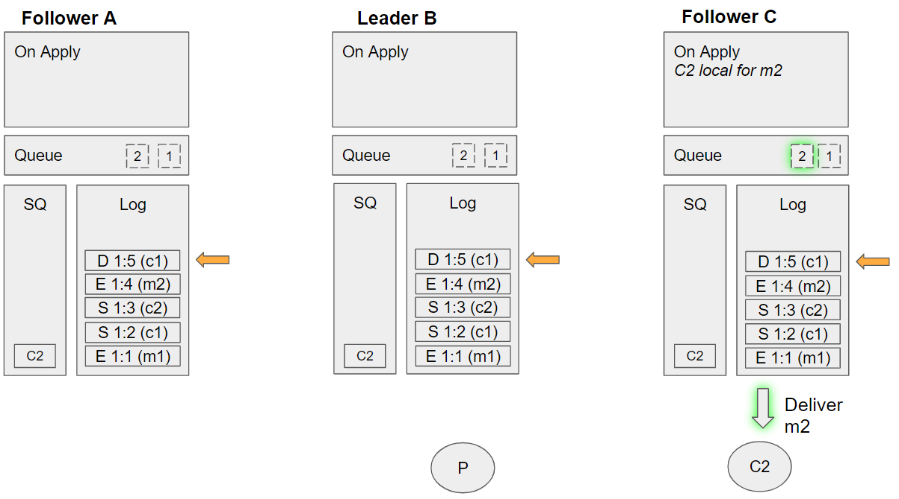

The quorum queue handled the consumer 1 failure without any problems, while still delivering from a local replica without additional coordination. The key is deterministic decision making which requires that each node uses only data in the log to inform it's decisions and that there is no divergence of committed entries in their logs (which is all handled by Raft).

## Final Thoughts

Quorum queues have the same ordering guarantees as any queue but are also able to deliver messages from a local replica. How they achieve this is interesting but not relevant to developers or administrators. What IS useful is understanding that this is another reason to choose quorum queues over mirrored queues. We [previously described](/blog/2020/04/20/rabbitmq-gets-an-ha-upgrade) the very network inefficient algorithm behind mirrored queues, and now you’ve seen that with quorum queues we have heavily optimised network utilisation.

Consuming from a follower replica doesn’t just result in better network utilisation though, we also get better isolation between publisher and consumer load. Publishers can impact consumers and the other way around because they put contention on the same resource - a queue. By allowing consumers to consume from a different broker, we get better isolation. Just see the [recent sizing case study](/blog/2020/06/18/cluster-sizing-and-other-considerations) that showed that quorum queues can sustain a high publish rate even in the face of huge queue backlogs and extra pressure from consumers. Mirrored queues were more susceptible.

So... consider quorum queues!
