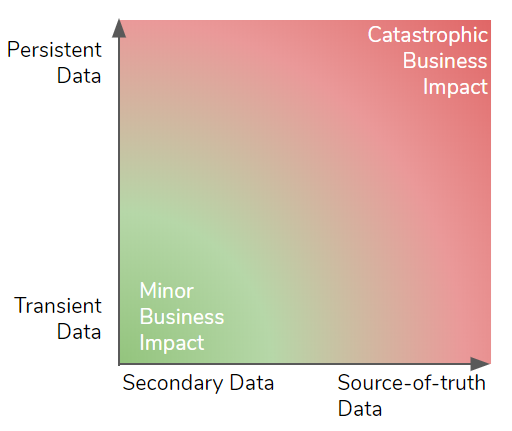
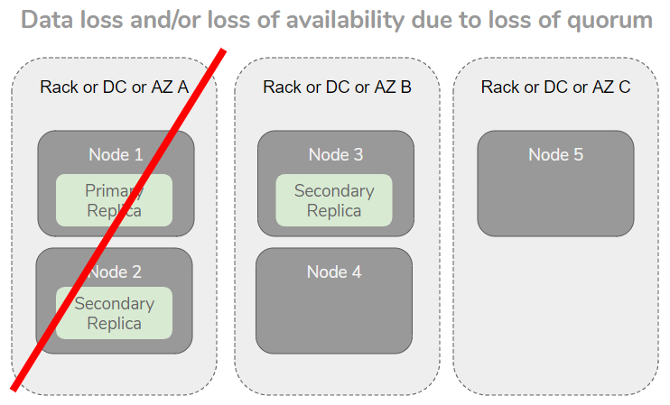

| Be aware this post has out of date information |
| :--- |
| RabbitMQ now has Disaster Recovery capabilities in the commercial editions via the [Warm Standby Replication feature](https://docs.vmware.com/en/VMware-RabbitMQ-for-Kubernetes/1/rmq/standby-replication.html) |

___ 

In this post I am going to cover perhaps the most commonly asked question I have received regarding RabbitMQ in the enterprise.

> How can I make RabbitMQ highly available and what architectures/practices are recommended for disaster recovery?

RabbitMQ offers features to support high availability and disaster recovery but before we dive straight in I’d like to prepare the ground a little.
First I want to go over Business Continuity Planning and frame our requirements in those terms. From there we need to set some expectations about what is possible. There are fundamental laws such as the speed of light and the CAP theorem which both have serious impacts on what kind of DR/HA solution we decide to go with.

Finally we’ll look at the RabbitMQ features available to us and their pros/cons.

<!-- truncate -->

## What is the difference between High Availability and Disaster Recovery?

*High Availability* typically refers to some kind of automated fail-over from one instance of deployed software to another in the event of a localised failure, such as a server or disk failing, or a limited network outage. The impact of failure on availability should either not be seen or be extremely low.

*Disaster Recovery* typically refers to a response to a more major incident (a disaster) such as the loss of an entire data center, massive data corruption or any other kind of failure that could cause a total loss of service and/or data. Disaster Recovery attempts to avoid permanent partial or total failure or loss of a system and usually involves building a redundant system that is geographically separated from the main site.

Both fall within the realm of Business Continuity.

## Business Continuity Planning 101

Ultimately, we want to be able to recover fast from major incidents (disaster recovery) and deliver continued availability during more minor incidents (high availability).

A major incident may involve losing a whole data center, due to fire, a power outage or extreme weather. A more minor incident might involve the partial loss of a data center, or simply the loss of a disk drive or server.

Implementing a system that can recover from failure and disaster can be expensive both monetarily and also with regard to performance. Ultimately the implementation will be a balance of cost of implementation vs the cost of data loss and service interruption.

In order to make that balance, we need to take into consideration:

 * The available tools for redundancy/availability and their limitations
 * The types of data and the associated costs to the business if lost

First we’ll cover the measurable objectives that define our acceptable data loss and unavailability time windows in the event of an incident, then we’ll cover the considerations above.

### Loss of Data and Availability Objectives

As part of a Business Continuity Plan, an enterprise must decide on two key objectives with regard to disaster recovery.

The **Recovery Point Objective** (RPO) determines the maximum time period of data loss a business can accept as the result of a major incident. The obvious answer is 0 seconds, meaning no data loss, but this can be hard to achieve and even when possible can have serious downsides like cost or performance. Other values might be 1 hour or 24 hours, with higher values typically being easier to achieve at a lower implementation cost. In the end it will be a balance of the downsides vs the business impact of data loss.

The **Recovery Time Objective** (RTO) determines the maximum time period of unavailability, aka the time it takes to recover and be operational again. The obvious answer might be 0 seconds, meaning a seamless failover with continued availability, but this might not be technically achievable and if it were then the costs might be far higher than your enterprise is willing to pay.

These windows of availability and data loss may or may not overlap.

Ultimately both RPO and RTO are a trade-off between the benefits of having continued business operations and the various downsides, such as cost and performance impact. 

### Types of Data and Business Impact

Persistent data sticks around week after week and even year after year. If an enterprise loses its most valuable persistent data it can kill the company. Transient data has a short life, it may be data in-flight between two systems or data that can be evicted at any time. While losing transient data can be impactful, it is unlikely to cause a company to go out of business. 

Source-of-truth data is either master data and/or data that doesn’t exist anywhere else. Secondary data is a copy (possibly filtered and transformed) of the source-of-truth that can be recovered from the source persistent store. Examples of secondary data are:

 * a cache stores secondary data that can be re-hydrated from a persistent store.
 * a microservice stores some small amount of data in a database that belongs to another service.
 * A distributed log streams database data modifications to other systems.

The loss of secondary data can cause:

 * loss of availability while it is recovered from the source-of-truth.
 * loss of performance capacity due losing "hot" data

The most damaging data loss would be loss of source-of-truth persistent data and the least would be transient secondary data.

In the persistent/transient continuum, at the persistent end we have databases, at the transient end we have message queues (like RabbitMQ) and in the middle are distributed logs (e.g. Apache Kafka). Databases, message queues and distributed logs can store both source-of-truth and secondary data. Caches and search engines typically store secondary data.

RabbitMQ stores transient data. A message is simply data in-flight from a source to one or more destinations. Once read, the message is destroyed. If you want the data in that message to stick around then you’ll need to write that message data to some kind of persistent store like a database, file-system or object store. While a message is transient, it may still be source-of-truth data because it doesn’t exist anywhere else yet, and if lost can never be recovered.

It is important to take into account where your data sits in this continuum when defining your RPO and RTO values. Because these values are a balance of the cost of implementation vs cost of service interruption - make sure you get the appropriate balance for the type of data that is stored and served.

### Data Redundancy Tools - Back-ups and Replication

Data systems such as databases, caches and message queues usually offer one or two ways of safeguarding data in the event of failure.

All database systems offer some kind of *back-up* feature. Full back-ups can be made on a schedule, such as nightly or weekly and additionally can offer incremental backups on a higher cadence, such as every 15 minutes.

The important thing to remember about backups is that recovering from them involves potential data loss as there was potentially new data that entered the system since the last backup was made. Recovery from back-up can also take time - time to move backup files to their destination and time for the data system to recover from those files.

The other common feature is *replication*. This is where data modifications are streamed from one node to another, meaning that the data now resides in at least two locations. Replication comes in two flavours: synchronous or asynchronous and there is a big difference between them.

With *synchronous replication*, the client only gets the confirmation that the operation has succeeded once it has been replicated to other nodes. This is the only form of replication that offers no data loss, but it comes at a price: 

 * waiting for an operation to be replicated adds latency
 * If the network is down between the nodes then availability may be lost
 * If the secondary node(s) is down then availability may be lost

Synchronous replication is typically the solution for high availability within a data center or cloud region. Fail-over is often automated and fast causing little or no impact on clients. Some data systems use asynchronous replication for high availability that provide eventual consistency (with potential data loss).

With *asynchronous replication*, the client gets the confirmation that the operation has succeeded when it has been committed locally. The operation is replicated in the background meaning that there is no additional latency for the client and no loss of availability if the network between the primary and secondary is down. The downside is that there will be lag between the primary and secondary node, meaning that data loss can occur in the event that the primary is lost.

Asynchronous replication and backups are typically the solution for Disaster Recovery.

### Fundamental Limits

When designing both a High Availability and Disaster Recovery strategy, we need to take into account some fundamental limits such as the speed of light and the CAP theorem. These limits affect the costs and feasibility of the RPO and RTO values we choose.

The CAP theorem states that in the event of a network partition, either you can have  consistency or availability but not both. It uses the letters C for Consistency, A for Availability and P for Partition tolerance. We always have to choose P, but we only get A or C.

CAP classifies systems as either:

 * AP - Availability in a partitioned network
 * CP - Consistency in a partitioned network

CP systems lose availability if they cannot satisfy the necessary level of redundancy due to lack of connectivity to peer nodes. CP systems synchronously replicate operations and only confirm to clients when those operations are safely committed to multiple nodes. This avoids data loss at the cost of higher latency.

You choose a CP system when consistency is the most important consideration. 

AP systems continue to be available despite not reaching the desired redundancy level. AP systems asynchronously replicate operations but this can cause data loss if a node is lost, this loss being due to replication lag. The upside is lower latency as operations can be immediately confirmed to clients.

You choose an AP system when availability and/or latency is the most important consideration. 

#### Single Data Center

Within a single data center, you can choose either an AP or a CP system and many data systems are configurable allowing you to tune them towards availability or consistency. 

Within a single data center, the network can offer a high degree of reliability and low latency. In this environment, the use of quorum (majority) based replication algorithms by CP systems can make unavailability a rare event. Quorum based CP systems can tolerate the failure or network isolation of a minority of nodes and delivery availability without data loss and are a good high availability solution.

#### Multiple Data Centers

The reliability and latency of the network between data centers is inferior to that of a LAN and building a CP system that has acceptable availability and latency is at best challenging and most likely infeasible.

AP systems can be built across multiple data centers but they increase the likelihood of data loss and also the size of the data loss window.

### Rack Awareness

This is a feature of data systems that ensure that data is replicated across racks or availability zones or data centers, basically any type of failure domain in your infrastructure. The idea is that if data is replicated but still only exists on a single rack, then losing the entire rack means we lose the data. Rack awareness is an extra resiliency feature.

When spread out across AZs, the loss of one AZ cannot cause data loss or loss of availability.

## HA and DR Considerations Overview

 * High Availability is the ability to remain available in the face of failures
 * Disaster Recovery is the ability to recover from disaster with bounded data loss and unavailability
 * Recovery Point Objective (RPO) defines the time period of data loss that is acceptable in the event of a disaster.
 * Recovery Time Objective (RTO) defines the maximum time period to recovery (the unavailability period).
 * RPO and RTO are a tradeoff between cost of implementation and cost of data loss/service interruption.
 * Synchronous replication provides data safety at the cost of availability and extra latency. The only choice for an RPO of 0 seconds. Typically not multi-DC friendly.
 * Asynchronous replication provides higher availability, lower latency but at the cost of potential data loss in a fail-over - a good choice when RPO &gt; 0 minutes. Typically multi-DC compatible.
 * Back-ups can be slower to recover with, but have other benefits such as being able to travel back in time.
 * Rack awareness adds additional resiliency to replicated data stores.

Now let’s look at RabbitMQ’s features, framed against what we have covered so far.

## RabbitMQ 

RabbitMQ supports:

 * clustering of multiple nodes
 * synchronous replication - replicated queues
 * asynchronous cluster-to-cluster message routing - exchange federation and shovels
 * limited back-up support
 * limited rack awareness support

We’ll next see how these features can be used for high availability and disaster recovery.

### High Availability

For high availability we recommend [*clustering*](/docs/clustering) multiple RabbitMQ brokers within a single data center or cloud region and the use of **replicated queues**. Clustering requires highly reliable, low latency links between brokers. Clustering over a WAN is highly discouraged.

#### Clustering and Availability Zones

Most regions in AWS, Azure and GCP offer multiple availability zones. Availability zones are essentially data centers that are connected by ultra reliable, low latency links but not geographically separated. Clustering across AZs in these clouds can offer higher availability than hosting a cluster in just one AZ. It can however increase costs if the cloud provider charges for cross AZ data transfer.

A multi AZ cluster is a good option for high availability but due to lack of geographic separation may not meet your needs for disaster recovery. It is important to note that the concept of an AZ is not standardised and other cloud platforms may use this term more loosely.

RabbitMQ offers two types of replicated queue: mirrored queues (HA queues) and quorum queues. These queue types use synchronous replication and provide data safety and high availability in the face of failures such as servers, disks and network.

#### Clustering and Multiple Data Centers

We highly discourage clustering across a WAN due to the effect of network partitions. Links that are tunnels across the public internet are simply not viable. Leased links from providers are better but also a risky choice. If an enterprise has its own fibre linking its data centers which is highly reliable and consistently low latency (like on-prem availability zones), then it might be an option.

#### Quorum Queues

[Quorum queues](/docs/quorum-queues) are CP and tolerate the loss of brokers as long as a quorum (majority) remains functioning. Likewise, in the event of a network partition, as long as the queue has a majority that can still communicate, the queue continues to function. Quorum queues do not use RabbitMQ's traditional [partition handling strategies](/docs/partitions#automatic-handling) but use their own failure detector that is both faster to detect partitions and failures but also less prone to false positives, this allows them to deliver the fastest fail-over of the replicated queue types.

#### Classic Mirrored Queues

Classic queues can be [mirrored](/docs/3.13/ha) and configured for either availability (AP) or consistency (CP). Using the *auto-heal* or *ignore *partition handling strategies will allow all brokers in a cluster to continue serving publishers and consumers even if one or more brokers get cut off by a network partition. However, on recovering from the partition, data may be lost.

Using the *pause_minority* partition handling strategy makes mirrored queues favour consistency. In the event of a network partition, any brokers on the minority side will pause themselves, closing all network connections. No confirmed writes will be lost, but any brokers on the minority side lose availability and if there are multiple partitions where no majority exists then the entire cluster becomes unavailable. Likewise, if a majority of nodes are down, the remaining brokers will pause themselves. 

Fail-overs are not as fast as quorum queues and there exist edge cases where the fail-over can take minutes or hours for extremely large queues.

See our recent [post on quorum queues and mirrored queues](/blog/2020/04/20/rabbitmq-gets-an-ha-upgrade) that explains this in more detail.

#### Client Reconnections

In order to achieve high availability, clients also need to be able to reconnect automatically in the event of a connection failure or a broker going offline. Most RabbitMQ clients offer automatic reconnection features. When accessing the brokers of a cluster by their individual host names, ensure that all are provided to the client so that it can attempt to reconnect to all nodes in the cluster until it finds a broker that is up and running. When using a load balancer, ensure that there is no affinity/stickiness to the balancing to ensure that when clients reconnect they are not always routed back to the same broker (which may now be down).

#### Rack Awareness

While RabbitMQ does not currently have rack awareness, you can achieve the same results via manually specifying the nodes that a replicated queue should be spread across. With mirrored queues you can specify the [list of nodes](/docs/3.13/ha#mirroring-arguments) it should be spread across. With quorum queues you must currently create the queue with an initial group size of 1 and then [add members](/docs/man/rabbitmq-queues.8#Replication) on the nodes to achieve the desired spread.

### Capacity Planning

Good capacity planning goes hand-in-hand with Business Continuity Planning as both are required to achieve reliability and resiliency. Check out our [RabbitMQ sizing guidance](/blog/2020/06/18/cluster-sizing-and-other-considerations).

### Disaster Recovery

Disaster recovery typically requires asynchronous replication of data between data centers. RabbitMQ does not currently support this feature but other message routing features can be leveraged to offer a partial solution.

RabbitMQ does have support for replication of schema (the exchanges, queues, bindings, users, permissions, policies etc) which allows for a secondary cluster in a different data center to be an empty mirror of the primary cluster. A fail-over using only schema synchronisation would provide availability but with a data loss window.

#### Schema Replication

RabbitMQ has two features for schema replication.

[Definitions export/import](/docs/definitions) is a feature of the management plugin that allows the export and import of the schema via JSON files.

[Tanzu RabbitMQ](https://tanzu.vmware.com/rabbitmq) offers the Schema Sync Plugin which actively replicates schema changes to a secondary cluster.

#### Data

RabbitMQ does not yet have an asynchronous data replication feature that is suitable for all multi-DC scenarios. However, you can leverage [exchange federation](/docs/federated-exchanges) or [shovels](/docs/shovel) which are an asynchronous message routing feature that work across clusters. These features were not built for an active-passive architecture and therefore do have some drawbacks. They were built for moving messages between clusters to be actively processed, not to mirror a cluster’s data for redundancy.

The difference between replication and cross-cluster message routing is that replication involves replicating both enqueue and acknowledgement operations, whereas message routing is only about replicating the messages. The fact that a message was consumed and removed from the queue is not included in federation or shovels (because that is not the purpose of those features).

As an example, exchange E1 has a single binding to a quorum queue in DC1. DC2 has a federation link to DC1 and a federated exchange E1 which also has a single binding to a quorum queue. When message m1 and m2 is published to E1 on DC1, those messages are routed to the queue on DC1 and also routed asynchronously to E1 in DC2 and enqueued on the queue there. Now messages m1 and m2 exist on the queue in both DCs.

But now a consumer consumes and acknowledges messages m1 and m2 on DC1, and new messages m3 and m4 are published. The quorum queue leader synchronously replicates the new enqueues and the acknowledgements. Federation routes the m3 and m4 messages to DC2 but not the acks (federation does message routing only). Now m1 and m2 only exist on DC2, having been consumed on DC1. If DC1 went down and we failed over to DC2, m1 and m2 would be consumed again.

This means that you will need to tolerate duplicates in the event of a fail-over from one RabbitMQ cluster to another. Also, queues will continue to grow as messages accumulate. 

In order to mitigate the problems of duplication, you can apply either [message TTL policies](/docs/ttl#per-queue-message-ttl) on the passive cluster that remove messages after a time period or [queue length limits](/docs/maxlength) that remove messages when the queue length reaches the limit. These are admittedly, imperfect solutions given that they could actually cause message loss. Given a 24 hour TTL, a message might have been sitting in a queue in DC1 for 25 hours unconsumed when DC1 went down, and that same message will have been discarded from the same queue in DC2 an hour before.

In order to cope with duplication, your systems either need to tolerate duplication (by being idempotent) or have a deduplication solution in place (like message ids being stored in Redis). Any at-least-once message queue/bus will cause duplicates from time to time, so this may already be something that is taken care of.

### A Note on Back-ups

RabbitMQ does support [back-ups](/docs/backup) but the support is limited and therefore not commonly used. The limitation is that a cluster must be shut down entirely in order to make a back-up of its data directory. This makes back-ups an infeasible disaster recovery strategy for most enterprises.

## Summary

RabbitMQ provides excellent support for high availability within a single data center or across multiple availability zones via the use of clustering and replicated queues.

For business continuity plans that require multiple data centers, with geographical separation in an active-passive architecture there are challenges. An RPO of 0 minutes is only achievable with a single cluster and so is not realistic in a multi-DC (or multi-region) scenario. With an RPO above 0 minutes, we can leverage federation and shovel but this also presents challenges in the form of message duplication. This duplication can be accommodated with a deduplication strategy.

RabbitMQ has many features on its road-map, including real asynchronous replication support for disaster recovery, data recovery tooling, rack awareness and more. So stay tuned because RabbitMQ is changing fast.

