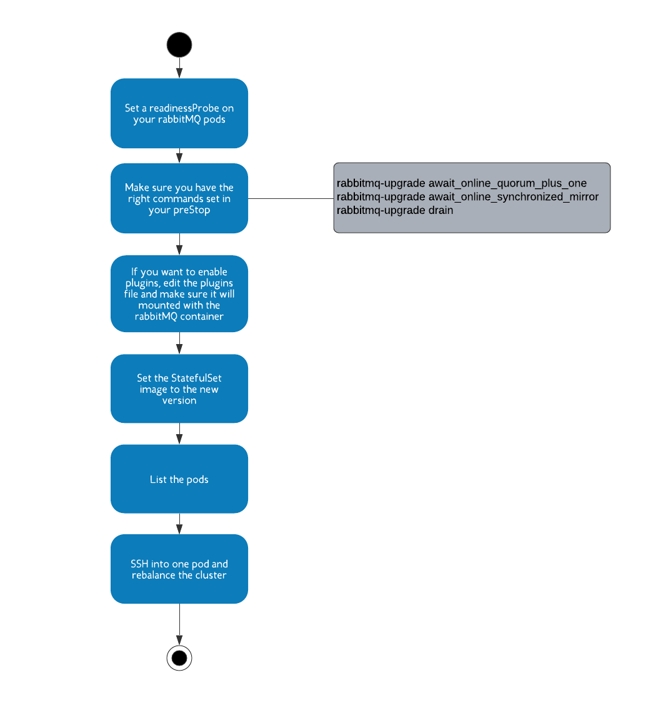

We are pleased to announce that the RabbitMQ Operator for Kubernetes is now generally available. The RabbitMQ Operator makes it easy to provision
and manage RabbitMQ clusters consistently on any certified Kubernetes distribution.  Operators inform the Kubernetes container orchestration
system how to provision and control specific applications. The Kubernetes (hereafter K8s) Operator pattern is a way to extend the K8s API and
state management to include the provisioning and management of custom resources -- resources not provided in a default K8s deployment. In this
post, we’ll discuss how the Operator enables the K8s system to control a RabbitMQ cluster.

<!-- truncate -->

## Where do I start?

If you are new to K8s, start with learning the basics of K8s and kubectl before attempting to use the operator.  You can also visit the
[Kube Academy](https://kube.academy/) for more in-depth primers. Watch [this episode of TGIR](https://www.youtube.com/watch?v=NWISW6AwpOE)
to see how easy it is to deploy and monitor a RabbitMQ cluster with the operator. Next you can try the
[quick start guide](https://github.com/rabbitmq/cluster-operator). In a minute or two you will have the operator and your first instance
of operator created rabbitMQ cluster.

Want to go further? Look at the [operator yaml examples](https://github.com/rabbitmq/cluster-operator/tree/main/docs/examples) for
quick deployment of advanced clusters. For the entire set of supported features, [look at the documentation](/kubernetes/operator/operator-overview).

## The Rabbit K8s Operator

It’s recommended that you first be familiar with the basics of K8s. If you need a refresher, VMware’s Kube Academy has a comprehensive set of resources.
**The Rabbit MQ K8s operator is composed of 2 building blocks**:

 * Custom resources: An extension to the native K8s resources in order to manage custom state of a particular stateful platform or application.
 In our case the custom resource  is reflecting the configuration size and state of a RabbitMQ cluster
 * Custom controller: A k8s controller is a non-terminating loop that regulates the state of standard K8s resources, like ReplicaSet, StatefulSet, or Deployments.
 The custom controller is adding a non-terminating control loop with custom logic to regulate the state of the custom resource. In the case of RabbitMQ cluster,
 the controller can settle changes to cluster & node configurations.

## What’s the value of a RabbitMQ Cluster Operator?

The RabbitMQ Cluster Operator (aka the operator) is a bridge between K8s managed states and RabbitMQ configuration and state.
**The RabbitMQ Cluster Operator helps to simplify two types of tasks**:

 * Provisioning of new clusters
 * Post-installation tasks, managed by K8s

 ## Provisioning of a new RabbitMQ cluster

[Creating a new RabbitMQ cluster on K8s manually is a multi step process](/blog/tags/diy),
that the operator is automating:

 1. Creating the RabbitMQ configuration file as a ConfigMap, so that is can be mounted as a file by the RabbitMQ container
 1. Setting the K8s secrets required by RabbitMQ (TLS certificates, default user password etc)
 1. Creating a StatefulSet that will manage the cluster nodes (as pods)
 1. Creating a headless service(a service without a cluster IP) to manage rabbitMQ node discovery
 1. Creating a service for RabbitMQ clients to access the cluster

The operator is not the only way to automate this process, but it has the benefit of mapping all the RabbitMQ configurations into a k8s descriptor
and a custom resource.  This means that there is a single source of truth regarding the cluster state, and users can manage their clusters
configurations using [Gitops](https://www.weave.works/blog/what-is-gitops-really). 

By using an operator to provision RabbitMQ clusters, the user enjoys several benefits:

 * A declarative API to create a RabbitMQ cluster with any setting with a single command. The operator is automating the provisioning of the
 complex set of K8s resources composing the cluster: such as services, pods, statefulset, persistent volumes etc
 * The operator comes with a set of YAML examples so in most cases you have almost no effort in order to have a development or even a production
 grade cluster.
 * Once the cluster is created it has a K8s state and description you can observe to know if your RMQ cluster is ready. RabbitMQ comes with
 in-built support for Prometheus. Node and cluster metrics can be visualised with Grafana.
 * The operator goes further and displays status conditions for the RabbitMQ cluster. The possible status conditions are:
   * *ClusterAvailable* - RabbitMQ accessible by client apps
   * *AllReplicasReady* - RabbitMQ cluster fully available
   * *ReconcileSuccess* - Custom Resource reconciled successfully. This being false may denote that the user needs to intervene
 (for example if TLS is enabled but the secret does not exist).
 * K8s controllers can now regulate the set of resources that compose the cluster: The rabbitMQ nodes, the routing service, the node registry
 service and the volumes. If any of these resources is not available according to K8s liveness probe, K8s will auto heal it

While the operator is useful for day 1 tasks, it confers even greater benefits when we talk about day 2 operations triggered by the user or by k8s.

## Post Installation Tasks

Having a RabbitMQ cluster provisioned is just the beginning of the journey as any developer and operator knows. There are various lifecycle events
to take care of:
 * Scaling the cluster when the application messaging volume increases as a result of additional functionality or demand growth
 * Self healing the cluster when a node is crashed or the network breaks
 * Rotating certificates
 * Upgrading the cluster with zero downtime when a new version of RabbitMQ is needed for security patching or new features

Many of the above processes require graceful termination of a node, some RabbitMQ API call after node start, or more complex flows that have a
sequence of K8s lifecycle events and RabbitMQ cluster events.This is exactly where the value of the operator stands out.

 * The Cluster Operator will allow RabbitMQ users to address all of these with a simple K8s CLI declarative command.
 * The operator will automate these complex flows using both K8s building block and custom controller logic that takes care of the RabbitMQ
 administrative tasks

**The operator now supports the core of day 2 RabbitMQ operations such as**:

 * Reconfigurations
 * Enabling / disabling of plugins
 * Self healing 
 * Scaling
 * In place upgrade
 * Certificate rotations - using rolling updates

In the future, the operator can be upgraded to provide new flows. For example, a new version of the operator may be released with a new major version of RabbitMQ. The use of the operator pattern means we can provide specific logic to, say, upgrade the existing RabbitMQ clusters to a new major version without losing messages and without downtime. The existence of a new operator version does not force users to upgrade existing clusters; K8s will still be able to manage these clusters going forward.

**It is only a K8s operator that can automate such complex and delicate processes in such an elegant way and without a risk. Here’s an example of
how RabbitMQ will save users from pain and errors by automating the process of in-place upgrade. The diagram lists the manual steps a user need to
perform in order to have a rolling upgrade of the cluster (without an operator).**

Now watch as Gerhard covers more advanced topics in running [RabbitMQ reliably on K8s](https://www.youtube.com/watch?v=I02oKJlOnR4).

## But wait - there’s more

The operator comes with a kubectl plugin that provides many commands to make your life easier. As described
[here](/kubernetes/operator/install-operator#kubectl-plugin), you can install the kubectl
plugin using [krew](https://github.com/kubernetes-sigs/krew). Some handy commands are installing the cluster operator as well
as creating, listing and deleting RabbitMQ clusters. Other commands targeting a specific RabbitMQ cluster include printing
the default user secret, opening the RabbitMQ management UI, enabling debug
logging on all RabbitMQ nodes, and running [perf-test](https://github.com/rabbitmq/rabbitmq-perf-test).

## What’s next?

The Cluster Operator gives users a lot of power to create clusters and manage them. There is still a wider scope of functionality to support,
depending on your requests and feedback.

Some examples are:

 * Examples of topologies using Istio for encryption /decryption of traffic between nodes as well as client with traffic
 * Scaling down gracefully
 * Monitoring the operator - the operator will report metrics in Prometheus format
 * Labelling cluster resources with RMQ and operator metadata
 * Testing on additional K8s providers (currently testing on Tanzu Kubernetes Grid and GKE)

In addition, we plan to add another operator that will wrap some of RabbitMQ's APIs with K8s declarative API, allowing for creation of users, queues and exchanges.

**We welcome feedback, feature requests, bug reports and any questions you have regarding RabbitMQ**:

 * For feature requests and bugs use [Github issues](https://github.com/rabbitmq/cluster-operator/issues)
 * For questions and feedback use Github or the [rabbitmq-users group](https://groups.google.com/g/rabbitmq-users).
 You can also subscribe to the community [mailing list](https://groups.google.com/forum/#!forum/rabbitmq-users)
 and the RabbitMQ [Slack channel](https://rabbitmq-slack.herokuapp.com/)
 * Read the RabbitMQ [community blog](https://blog.rabbitmq.com)
 * We’re always looking for [new contributors](/github) to the RabbitMQ project!
