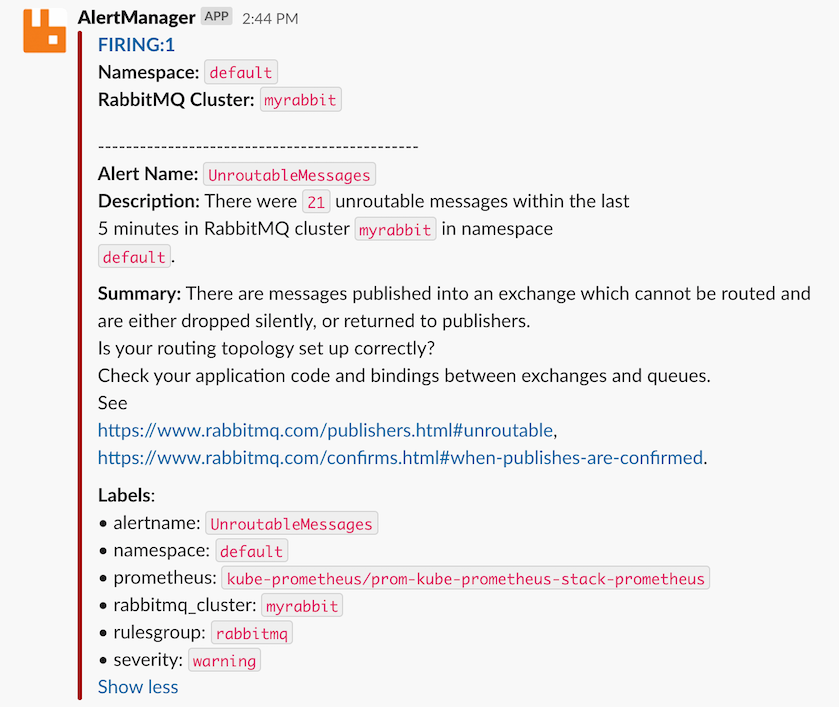

If you want to be notified when your RabbitMQ deployments have a problem, now you can set up the RabbitMQ monitoring and alerting that we have made available in the [RabbitMQ Cluster Operator](https://github.com/rabbitmq/cluster-operator/tree/v1.7.0/observability) repository.
Rather than asking you to follow a series of steps for setting up RabbitMQ monitoring & alerting, we have combined this in [a single command](https://github.com/rabbitmq/cluster-operator/blob/v1.7.0/observability/quickstart.sh).
While this is a Kubernetes-specific quick-start, and you can use these Prometheus alerts outside of Kubernetes, the setup will require more consideration and effort on your part.
We share the quick & easy approach, open source and free for all.

<!-- truncate -->

When everything is set up and there is a problem with RabbitMQ, this is an example of a notification that you can expect:



The above is a good example of a problem that may not be obvious when it happens, and takes a few steps to troubleshoot.
Rather than losing messages due to a misconfiguration, this notification makes it clear when incoming messages are not routed within RabbitMQ.


## What alerts are available today?

* **[NoMajorityOfNodesReady](https://github.com/rabbitmq/cluster-operator/blob/v1.7.0/observability/prometheus/rules/rabbitmq/no-majority-of-nodes-ready.yml)**: Only a minority of RabbitMQ nodes can service clients. Some queues are likely to be unavailable, including replicated ones.
* **[PersistentVolumeMissing](https://github.com/rabbitmq/cluster-operator/blob/v1.7.0/observability/prometheus/rules/rabbitmq/persistent-volume-missing.yml)**: A RabbitMQ node is missing a volume for persisting data and can't boot. This is either a misconfiguration or capacity issue.
* **[InsufficientEstablishedErlangDistributionLinks](https://github.com/rabbitmq/cluster-operator/blob/v1.7.0/observability/prometheus/rules/rabbitmq/insufficient-established-erlang-distribution-links.yml)**: RabbitMQ nodes are not clustered due to networking issues or incorrect permissions.
* **[UnroutableMessages](https://github.com/rabbitmq/cluster-operator/blob/v1.7.0/observability/prometheus/rules/rabbitmq/unroutable-messages.yml)**: Messages are not routed from channels to queues. Routing topology needs reviewing.
* **[HighConnectionChurn](https://github.com/rabbitmq/cluster-operator/blob/v1.7.0/observability/prometheus/rules/rabbitmq/high-connection-churn.yml)**: Clients open and close connections too often, which is an anti-pattern. Clients should use long-lived connections.
* **[LowDiskWatermarkPredicted](https://github.com/rabbitmq/cluster-operator/blob/v1.7.0/observability/prometheus/rules/rabbitmq/low-disk-watermark-predicted.yml)**: Available disk space is predicted to run out within 24h. Limit queue backlogs, consume faster or increase disk size.
* **[FileDescriptorsNearLimit](https://github.com/rabbitmq/cluster-operator/blob/v1.7.0/observability/prometheus/rules/rabbitmq/file-descriptors-near-limit.yml)**: 80% of available file descriptors are in use. Fewer connections, fewer durable queues, or higher file descriptor limit will help.
* **[TCPSocketsNearLimit](https://github.com/rabbitmq/cluster-operator/blob/v1.7.0/observability/prometheus/rules/rabbitmq/tcp-sockets-near-limit.yml)**: 80% of available TCP sockets are in use. More channels, fewer connections or a more even spread across the cluster will help.
* **[ContainerRestarts](https://github.com/rabbitmq/cluster-operator/blob/v1.7.0/observability/prometheus/rules/rabbitmq/container-restarts.yml)**: The Erlang VM system process within which RabbitMQ runs had an abnormal exit. The most common cause is misconfiguration.
* **[RabbitMQClusterOperatorUnavailableReplicas](https://github.com/rabbitmq/cluster-operator/blob/v1.7.0/observability/prometheus/rules/rabbitmq-cluster-operator/unavailable-replicas.yml)**: The Operator managing RabbitMQ clusters is not available. Pod scheduling or misconfiguration issue.


## How to get started quickly?

You will need the following:

1. Any Kubernetes deployment version 1.18 or above
1. [`kubectl`](//kubernetes.io/docs/tasks/tools/) pointing to your Kubernetes deployment and matching the Kubernetes server version
1. [`helm`](//helm.sh/docs/intro/install/) version 3

Now you are ready to run the following in your terminal:

```bash
git clone https://github.com/rabbitmq/cluster-operator.git

# Optionally, set the name of the Slack channel and the Slack Webhook URL
# If you don't have a Slack Webhook URL, create one via https://api.slack.com/messaging/webhooks
# export SLACK_CHANNEL='#my-channel'
# export SLACK_API_URL='https://hooks.slack.com/services/paste/your/token'

./cluster-operator/observability/quickstart.sh
```

The last command takes about 5 minutes, and it sets up the entire RabbitMQ on Kubernetes stack:

* [RabbitMQ Cluster Operator](https://github.com/rabbitmq/cluster-operator) declares `RabbitmqCluster` as a custom resource definition (CRD) and manages all RabbitMQ clusters in Kubernetes
* [kube-prometheus-stack](https://github.com/prometheus-community/helm-charts/tree/main/charts/kube-prometheus-stack) Helm chart which installs:
  * [Prometheus Operator](https://github.com/prometheus-operator/prometheus-operator) manages Prometheus and Alertmanager, adds `PrometheusRule` and `ServiceMonitor` custom resource definitions
  * [Prometheus](https://github.com/prometheus/prometheus) scrapes (i.e. reads) metrics from all RabbitMQ nodes, stores metrics in a time series database, evaluates alerting rules
  * [Alertmanager](https://github.com/prometheus/alertmanager) receives alerts from Prometheus, groups them by RabbitMQ cluster, optionally sends notifications to Slack (or other services)
  * [Grafana](https://github.com/grafana/grafana) visualises metrics from Prometheus
  * [kube-state-metrics](https://github.com/kubernetes/kube-state-metrics) provides Kubernetes metrics RabbitMQ alerting rules rely on
* [ServiceMonitor](https://github.com/rabbitmq/cluster-operator/blob/v1.7.0/observability/prometheus/monitors/rabbitmq-servicemonitor.yml) configuration for Prometheus which helps discover [RabbitMQ metrics](https://github.com/rabbitmq/rabbitmq-server/blob/master/deps/rabbitmq_prometheus/metrics.md) from all RabbitMQ nodes
* [PrometheusRule](https://github.com/rabbitmq/cluster-operator/tree/v1.7.0/observability/prometheus/rules) for each RabbitMQ Prometheus alert condition
* [Secret](https://github.com/rabbitmq/cluster-operator/tree/v1.7.0/observability/prometheus/alertmanager) for the Alertmanager Slack configuration (optional)
* [ConfigMap](https://github.com/rabbitmq/cluster-operator/tree/v1.7.0/observability/grafana/dashboards) for each RabbitMQ Grafana dashboard definition


## Trigger your first RabbitMQ alert

To trigger an alert, we need a RabbitMQ cluster. This is the easiest way to create one:

```bash
# Add kubectl-rabbitmq plugin to PATH so that it can be used directly
export PATH="$PWD/cluster-operator/bin:$PATH"

# Use kubectl-rabbitmq plugin to create RabbitmqClusters via kubectl
kubectl rabbitmq create myrabbit --replicas 3
```

To trigger the `NoMajorityOfNodesReady` alert, we stop the `rabbit` application on two out of three nodes:
```bash
kubectl exec myrabbit-server-0 --container rabbitmq -- rabbitmqctl stop_app
kubectl exec myrabbit-server-1 --container rabbitmq -- rabbitmqctl stop_app
```

Within 2 minutes, two out of three RabbitMQ nodes will be shown as not `READY`:
```diff
kubectl rabbitmq get myrabbit
NAME                    READY   STATUS    RESTARTS   AGE
- pod/myrabbit-server-0   1/1     Running   0          70s
+ pod/myrabbit-server-0   0/1     Running   0          3m
- pod/myrabbit-server-1   1/1     Running   0          70s
+ pod/myrabbit-server-1   0/1     Running   0          3m
  pod/myrabbit-server-2   1/1     Running   0          3m
```

The pods are still `Running` because the `rabbitmqctl stop_app` command leaves the Erlang VM system process running.

To see the `NoMajorityOfNodesReady` alert triggered in Prometheus, we open the Prometheus UI in our browser: [http://localhost:9090/alerts](http://localhost:9090/alerts).
For this to work, we forward local port 9090 to Prometheus port 9090 running inside Kubernetes:

```bash
kubectl -n kube-prometheus port-forward svc/prom-kube-prometheus-stack-prometheus 9090
```


`NoMajorityOfNodesReady` alert is first orange which means it is in a `pending` state.
After 5 minutes the colour changes to red and the state becomes `firing`.
This will send an alert to Alertmanager.
After we port-forward - same as above - we open the Alertmanager UI: [http://localhost:9093](http://localhost:9093)

```bash
kubectl -n kube-prometheus port-forward svc/prom-kube-prometheus-stack-alertmanager 9093
```


Alertmanager groups alerts by `namespace` and `rabbitmq_cluster`.
You see a single alert which Alertmanager forwards to your configured Slack channel:


Congratulations, you triggered your first RabbitMQ alert! To resolve the alert, start the `rabbit` application on both nodes:

```bash
kubectl exec myrabbit-server-0 --container rabbitmq -- rabbitmqctl start_app
kubectl exec myrabbit-server-1 --container rabbitmq -- rabbitmqctl start_app
```

The alert will transition to green in Prometheus, it will be removed from Alertmanager, and a **RESOLVED** notification will be sent to your Slack channel.


## Past and current RabbitMQ alerts

To see all past and current RabbitMQ alerts across all your RabbitMQ clusters, look at the RabbitMQ-Alerts Grafana dashboard: [http://localhost:3000/d/jjCq5SLMk](http://localhost:3000/d/jjCq5SLMk) (username: `admin` & password: `admin`)

```bash
kubectl -n kube-prometheus port-forward svc/prom-grafana 3000:80
```


In the example above, we have triggered multiple alerts across multiple RabbitMQ clusters.


## How can you help?

We have shared the simplest and most useful alerts that we could think of.
Some of you already asked us about missing alerts such as memory threshold, Erlang processes & atoms, message redeliveries etc.
[Commercial customers](https://tanzu.vmware.com/rabbitmq) asked us for runbooks and automated alert resolution.

What are your thoughts on the current alerting rules? What alerts are you missing?
[Let us know via a GitHub discussion.](https://github.com/rabbitmq/cluster-operator/discussions)
