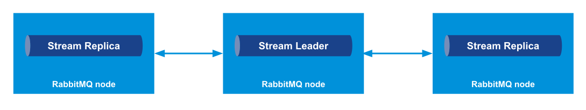
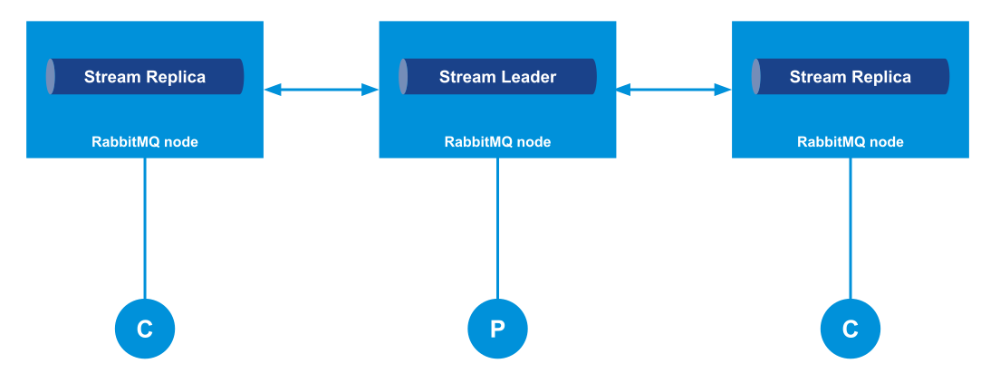
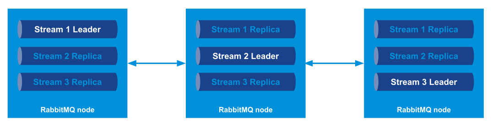
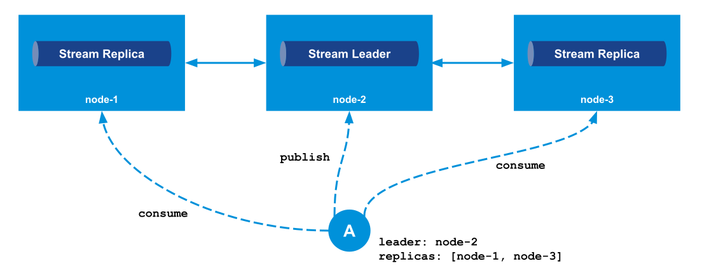
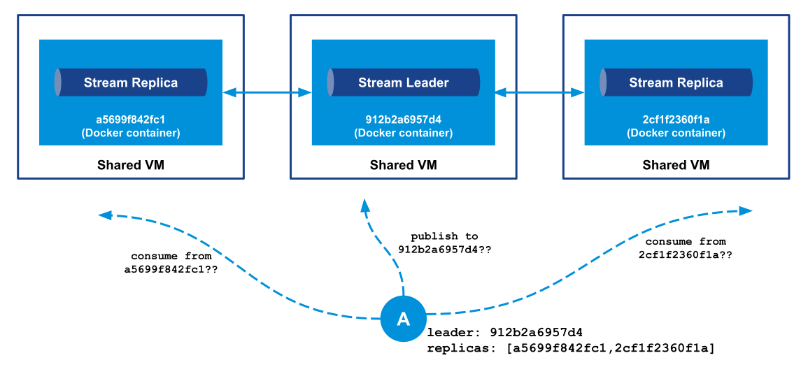
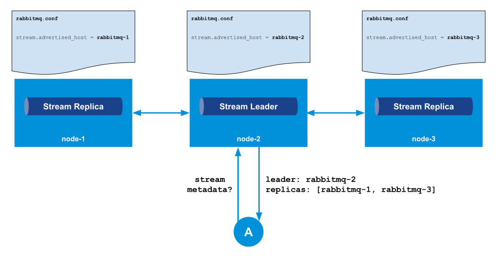
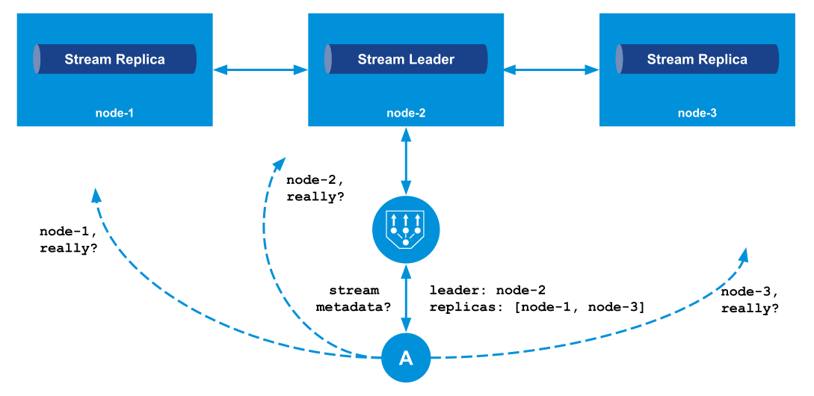

<!-- diagrams: https://drive.google.com/drive/folders/1ZLgazMBjma_wal2bcKZvFl4q9zB-cuQG?usp=sharing -->
[RabbitMQ Streams Overview](/blog/2021/07/13/rabbitmq-streams-overview) introduced streams, a new feature in RabbitMQ 3.9.
This post covers how client applications should connect to RabbitMQ nodes to get the most benefit from streams when the [stream protocol](https://github.com/rabbitmq/rabbitmq-server/blob/v3.9.x/deps/rabbitmq_stream/docs/PROTOCOL.adoc) is in use.

Streams are optimized for high throughput scenarios, that's why technical details like data locality are critical to get the best out of your RabbitMQ cluster.
Client libraries can handle most of the details, but a basic understanding of how things work under the hood is essential when a setup involves extra layers like containers and load balancers. Keep reading if you want to learn more about streams and avoid some headaches when deploying your first stream applications!

<!-- truncate -->

## Topology of a Stream

A stream is replicated and persistent, it is composed of a _leader_ Erlang process and _replica_ Erlang processes. These processes are spread across the nodes of a RabbitMQ cluster, as shown in the following diagram:



Only the leader process handles write operations like inbound messages. Any _member_ of the stream – leader and replicas – can dispatch messages to client applications.

An application that publishes to a stream using the [stream protocol](https://github.com/rabbitmq/rabbitmq-server/blob/v3.9.x/deps/rabbitmq_stream/docs/PROTOCOL.adoc) can connect to any node in the cluster: messages will automatically go from the connection node to the node that hosts the leader process.
It does not require a PhD to understand that the operation is not optimal if the connection and the stream leader are not on the same node.
_An application that publishes to a stream should connect to the node that hosts the leader of the stream, to avoid an extra network hop_.

The story is a bit different for consuming applications.
With the stream protocol, messages are dispatched to applications using [`sendfile`](https://man7.org/linux/man-pages/man2/sendfile.2.html): file chunks that contain messages are sent directly from the node file system to the network socket, without going through user space.
This optimization requires that _the node the consuming application is connected to hosts a member of the stream_.
Whether this member is the leader or a replica does not matter, as long the data is on the file system, ready to go through the network socket with `sendfile`.

This constraint for consuming applications does not seem too harsh: in the diagram above, each node has a member of the stream, so an application can connect to any node to consume.
But imagine a 5-node cluster with streams using a replication factor of 2: each stream will have members only on 3 nodes out of the 5 nodes.
In this case, consuming applications have to pick their node appropriately.

With this knowledge in mind, let's try now to come up with some best practices. 

## Well-behaved Clients

So a publishing application can connect to any node of a cluster, it will always reach the leader process.
A consuming application must connect to a node that hosts a member of the target stream, and this member can be the leader or a replica.
Client applications can stick to these rules, but the following best practices should be enforced whenever possible:

* **a publishing application should always connect to the node that hosts the leader process of the target stream**.
* **a consuming application should always connect to a node that hosts a replica of the target stream**.

The following diagram illustrates these best practices:



As stated previously, connecting directly to the node of the stream leader avoids a network hop, as messages have to go the leader process anyway.
What about always using a replica for consuming? Well, it just offloads the leader process, which is already busy dealing with all the write operations.

These best practices should be enforced ideally by client libraries, all these technical details should not leak into the application code.
We'll see next how the stream protocol allows client applications to find out about the topology of a given stream.

## Streams Across a Cluster

Before moving on to the `metadata` command of the stream protocol, let's clarify how streams (plural) spread across the nodes of a RabbitMQ cluster.
We mentioned that a stream has a leader Erlang process located on a node and replica Erlang processes located on other nodes.
With several streams, all these Erlang processes (think "very lightweight thread" for an Erlang process) spread across the cluster nodes, and at no point a given RabbitMQ node is supposed to host all the stream leaders.

Think of a stream as a small cluster in the RabbitMQ cluster, as illustrated with several streams in the next diagram:



The way leaders are spread across the cluster depends on the "leader locator strategy" when a stream is created.
The default strategy is "least leaders", which means picking the node with least number of stream leaders for the leader of the new stream.
There are other strategies, but covering them is out of the scope of this post.

With this clarification in mind, let's move on to the way to find out about the topology of streams.

## The `metadata` command

The stream protocol provides a [`metadata` command](https://github.com/rabbitmq/rabbitmq-server/blob/v3.9.x/deps/rabbitmq_stream/docs/PROTOCOL.adoc#metadata) to query the topology of one or several streams.
For each queried stream, the response contains the hostname and port of the nodes that host the leader and replicas.

The following diagram illustrates how a client application already connected to one of the nodes can find out about the topology of a given stream:


_So a common pattern is to provide one or several entry points to a client library, use the `metadata` command once connected to learn the topology of a target stream, and then connect to the appropriate nodes depending on the operations (publishing or consuming)_:



The `metadata` command is key for client libraries to enforce the best practices mentioned above.

Unfortunately, the metadata returned by default are not always accurate, or at least accurate enough for the client application to connect. Let's see an example.

## Limitations of Default Metadata

The stream plugin returns the hostname of each node for the host metadata (this is the host part of the Erlang node name to be more accurate, but this does not matter much here).
This is fine... as long as the client can resolve the hostname to connect to the node!

In these times of containers, the hostname can be a blurry concept, which does not make much sense as soon as you are out of the container.
The following diagram illustrates a 3-node RabbitMQ cluster where the nodes are containers running on different VMs.
A client application can connect to the nodes if the ports are mapped correctly, but there's no way it can do it by using the hostname of the containers.



The stream plugin does its best, but it cannot do miracles here.
Fortunately, it is possible to configure what a node returns when it is asked its "coordinates" for the `metadata` command.

## Advertised Host and Port

The [`advertised_host` and `advertised_port` configuration entries](/docs/stream#advertised-host-port) of the stream plugin can be set to tell a node what to return when asked how to be contacted.
There is no trick here: the plugin will just trust the operator that did the configuration and will blindly return these values.
This means a client application must be able to connect to the node using this information.



The `advertised_host` and `advertised_port` settings should help solve all the headaches with client applications not able to connect to nodes because of incorrect stream metadata.
Always keep them in mind if you deploy a RabbitMQ cluster with containerized nodes and if you use streams.

There is still one common use case where this discovery mechanism can be problematic: when a load balancer sits between client applications and the cluster nodes.

## With a Load Balancer

Having a load balancer in front of a RabbitMQ cluster is a common scenario.
This may cause some problems because of the way streams work, but there are always solutions.
If we come back to the metadata command but with a load balancer, things will go wrong: the client will receive the nodes information and will use it to connect _directly_ to the nodes, bypassing the load balancer.
The following diagram illustrates this unfortunate situation:



This is probably not what you want.

What about setting the `advertised_host` and `advertised_port` configuration entries to use the load balancer information?
This way client applications will always connect to the load balancer!
This is not such a great idea, because we won't be able to enforce the best practices (publishing to leader, consuming from replica) and in a deployment where streams are not on all nodes, consuming will fail if the application ends up being connected to a node without a stream member.

OK, this is a bit depressing, but cheer up, as client libraries can implement a workaround to solve this problem.

## Client Workaround With a Load Balancer

A client application can still always connect to the load balancer and end up connected to the appropriate node.
How can it do it?
Two steps:

* use the `metadata` command but _ignore_ the information and always connect to the load balancer
* retry connecting until it gets connected to the appropriate node

You may wonder how to find out about the node once a connection is established?
The "coordinates" of the node (hostname and port, or `advertised_host` and `advertised_port` if configured) are available in a stream protocol connection.
So a client application can know to which node it is connected to.

**This means `advertised_host` and `advertised_port` should not be configured when a load balancer is in use.**
The "coordinates" of a node that the `metadata` command returns are not used to connect in this case, as the client always connects to the load balancer.
They are used to _correlate_ the connection the load balancer provides with the node the client expects, and the hostname is perfect for this.

Let's take an example:

* a publishing application knows the leader of its targeted stream is on `node-1` thanks to the response of a `metadata` request
* it creates a new connection using the load balancer address
* the load balancer chooses to connect to `node-3`
* the connection is properly established but the client application finds out it is connected to `node-3`, it immediately closes the connection, and retries
* this time the load balancer chooses `node-1`
* the application is happy about the node it's connected to, it moves on to publishing using this connection

The following diagram illustrates this process:


As stream connections are long-lived and a stream application is not supposed to have a lot of connection churn, retrying to connect is not a concern here.

This solution also assumes that the load balancer will not always connect to the same backend server. Round-robin is an appropriate balancing strategy for this case.

It should also be clear now that setting `advertised_host` and `advertised_port` is not necessary when using this technics and setting them to the load balancer coordinates for all nodes is a bad idea.
Letting each node returns its hostname is fine here, as the hostname is supposed to be unique in a network.

So the onus is on the client library. Let's see now how this is implemented with the stream Java client.

## Using the Stream Java Client With a Load Balancer

The [stream Java client](https://github.com/rabbitmq/rabbitmq-stream-java-client) provides [an `AddressResolver` extension point](https://github.com/rabbitmq/rabbitmq-stream-java-client/blob/main/src/main/java/com/rabbitmq/stream/AddressResolver.java).
It is used whenever a new connection is created: from the passed-in `Address` (the node to connect to based on the `metadata` query), the address resolver can provide some logic to compute the actual address to use.
The default implementation just returns the given address.
If you want to implement the workaround presented above when a load balancer is in use, always return the address of the load balancer, as shown in the following code snippet:

```java
Address entryPoint = new Address("my-load-balancer", 5552);
Environment environment = Environment.builder()
    .host(entryPoint.host())
    .port(entryPoint.port())
    .addressResolver(address -> entryPoint)
    .build();
```

The [stream PerfTest tool](https://rabbitmq.github.io/rabbitmq-stream-java-client/stable/htmlsingle/#the-performance-tool) also supports this mode when the `--load-balancer` option is enabled.
Here is how to tell the tool to always use the same entry point for publishers and consumers connections:

```shell
# with the Java binary
java -jar stream-perf-test.jar --uris rabbitmq-stream://my-load-balancer:5552 --load-balancer

# with Docker
docker run -it --rm pivotalrabbitmq/stream-perf-test --uris rabbitmq-stream://my-load-balancer:5552 --load-balancer
```

## Wrapping Up

This post covered how client applications should connect when using the stream protocol.
Here is the gist:

* publishing applications should connect to the node that hosts the leader of the target stream
* consuming applications should connect to a node that hosts of replica of the target stream
* client applications must use the [`metadata` stream protocol command](https://github.com/rabbitmq/rabbitmq-server/blob/v3.9.x/deps/rabbitmq_stream/docs/PROTOCOL.adoc#metadata) to learn about the topology of the streams they want to interact with
* the stream [Java](https://github.com/rabbitmq/rabbitmq-stream-java-client) and [Go](https://github.com/rabbitmq/rabbitmq-stream-go-client) clients enforce these best practices
* the `metadata` command returns by default the nodes hostname and listener port, which can be problematic e.g. when containers are in use
* the [`advertised_host` and `advertised_port` configuration entries](/docs/stream#advertised-host-port) allow to specify what values a node should return for the `metadata` command
* a load balancer can confuse a client library that will try to bypass it to connect directly to the nodes
* client libraries can provide a workaround to work properly with a load balancer
* the stream [Java](https://github.com/rabbitmq/rabbitmq-stream-java-client) and [Go](https://github.com/rabbitmq/rabbitmq-stream-go-client) clients implement such a workaround
