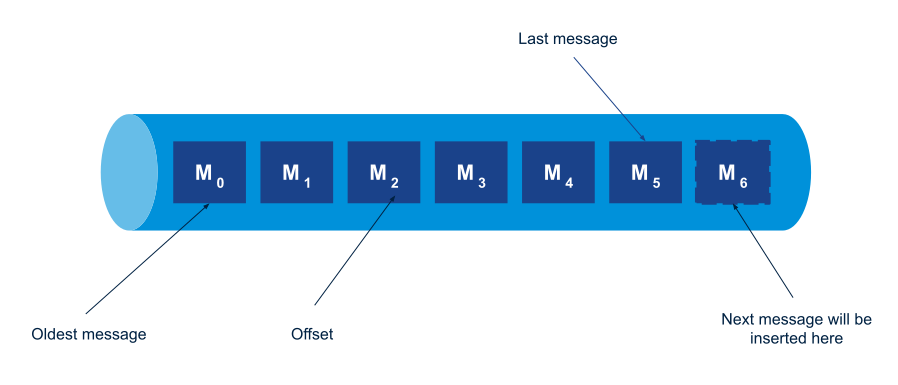
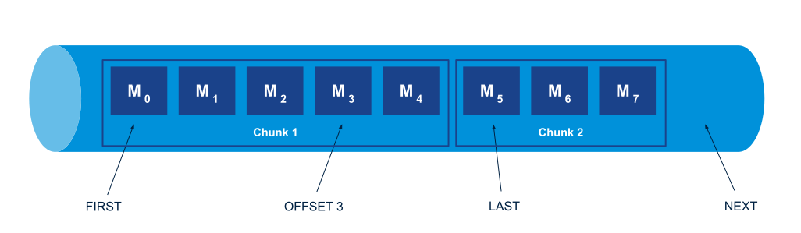

<!-- diagrams: https://drive.google.com/drive/folders/1CsoMiLkJBsShk4aBuUhRKyjBrGsIBEgb?usp=sharing -->
RabbitMQ Streams provides server-side offset tracking for consumers.
This features allows a consuming application to restart consuming where it left off in a previous run.
This post covers the semantics of offset tracking and how it is implemented in the stream Java client.

<!-- truncate -->

## What is Offset Tracking?

Offset tracking is the process for a consuming application to store its position in a stream.
If a consuming application position in a stream is 1,000, it means it has processed all the messages up to this position.
If the application were to stop and restart, it would re-attach to the stream right after its last stored position, that is 1,001 in our example, and restart consuming from there.

We use the concept of _offset_ to specify the exact position in a stream.

## What is an Offset in the First Place?

If we model a stream like an array where each element is a message, then the offset is just the index of a given message in this array.



This mental representation is accurate enough to understand offset tracking in our case, but it is not completely exact.
Let's just say that an element in this large array is not always a message, it can be some piece of information needed for the stream housekeeping.
A consequence is that 2 contiguous messages may not always have 2 contiguous offset values, but it does matter in the context of this post.

## The Different Offset Specifications in a Stream

The absolute offset does not have any meaning, it is just technical.
So when an application wants to attach to a stream for the first time, it is unlikely it will use an offset, it will prefer to use a higher-level concept like the _beginning_ or the _end_ of the stream, or even some _point in time_ in the stream.

Luckily, RabbitMQ Streams supports different _offset specifications_ in addition to the absolute offset: `first`, `last`, `next`, and `timestamp`.

There are 2 offset specifications for the "end" of the stream: `next` means the next offset to be written.
If a consumer attaches to a stream at `next` and no-one is publishing, the consumer won't receive anything.
It will start receiving when new messages come in.

`last` means "from the last chunk of messages".
A chunk is a RabbitMQ Streams term for "batch of messages", as messages are handled in batches for performance reasons.

The following figure shows offset specifications in a stream.



## The Different Steps in Offset Tracking

So an application will usually specify an offset like `first` or `next` when it starts for the first time, process messages, and store an offset value periodically (e.g. every 10,000 messages) on the server.

The application may stop for some reason (e.g. upgrade).
When it restarts, it will retrieve its last stored offset and restart consuming just after this position.

The RabbitMQ Stream protocol provides commands to store and look up an offset for a given application on a given stream, so offset tracking is mainly a client concern.

## Offset Tracking Application Requirements

There is a simple requirement for an application that wants to use offset tracking in a stream: it must use a _tracking reference_ that stays the same between the application restarts.

The way to specify this reference depends on the client library and more generally, client libraries can have different features or approaches to deal with offset tracking.
Read more about offset tracking in the stream Java client [here](https://rabbitmq.github.io/rabbitmq-stream-java-client/stable/htmlsingle/#consumer-offset-tracking).

## The Dark Side of Server-Side Offset Tracking

Server-side offset tracking in RabbitMQ Streams is pretty neat but it should be used cautiously though.
Offset tracking information is stored in the stream log.
Remember the array representation of a stream?
Imagine that most of the array elements are messages, but some contain offset tracking information, that is for example "offset 1000 for application 'my-application'".

So every time a client asks to store an offset for a given consumer, this creates a small entry in the log.
You don't want to create too many of these entries, that's why we advise to store offsets every few thousands messages and avoid consumers that store offsets for every single message.
Again, just be cautious and reasonable with server-side offset tracking.

Remember also that server-side offset tracking is just a commodity and by no means the only solution to allow consumers to restart where they left off.
Imagine message processing is a database operation inside a transaction.
Storing the offset in the database as part of the same transaction is a good idea as it ensures the data changes and the offset storage happens atomically.

## Server-Side Offset Tracking in Action

Let's see now how to set up offset tracking with the stream Java client.

### The Tracking Consumer

Here is some code to start a consumer with offset tracking:

```java
AtomicInteger messageConsumed = new AtomicInteger(0);
Consumer consumer = environment.consumerBuilder()
    .stream("offset-tracking-stream") // the stream to consume from
    .offset(OffsetSpecification.first()) // start consuming at the beginning
    .name("my-application") // the name (reference) of the consumer
    .manualTrackingStrategy() // tracking is done in application code
    .builder()
    .messageHandler((context, message) -> {
        // ... message processing ...

        // condition to store the offset: every 10,000 messages
        if (messageConsumed.incrementAndGet() % 10_000 == 0) {
           context.storeOffset(); // store the message offset
        }
        // ... 
    })
    .build();
```

In case you want a reminder on the stream Java client API, you can read [RabbitMQ Streams First Application](/blog/2021/07/19/rabbitmq-streams-first-application).

Here are the key points in this snippet:
* the consumer **must** have a name to enable offset tracking.
It uses its name as the tracking reference when storing an offset value.
* the consumer starts consuming at the beginning of the stream with `OffsetSpecification.first()`.
This specification is ignored when the consumer restarts and there is a stored offset value for it.
* the application code handles the tracking explicitly with `Context#storeOffset()`. The `Consumer#store(long)` method is another possibility to store an offset.

You see how offset tracking can depend on the client library.
The stream Java client provides also an [automatic offset tracking strategy](https://rabbitmq.github.io/rabbitmq-stream-java-client/stable/htmlsingle/#consumer-automatic-offset-tracking) if you don't want to deal with offset tracking in your code.

As you can see, offset tracking is pretty easy when the requirements and semantics are understood. Let's run the example now.

### Setting Up The Sample Project

Running the samples requires Docker, Git, and Java 8 or higher installed.
You can start the broker with the following command:

```shell
docker run -it --rm --name rabbitmq -p 5552:5552 \
    -e RABBITMQ_SERVER_ADDITIONAL_ERL_ARGS='-rabbitmq_stream advertised_host localhost' \
    rabbitmq:3.9
```

You need then to enable the stream plugin:

```shell
docker exec rabbitmq rabbitmq-plugins enable rabbitmq_stream
```

The [code is hosted on GitHub](https://github.com/acogoluegnes/rabbitmq-streams-blog-posts).
Here is how to clone the repository:

```shell
git clone https://github.com/acogoluegnes/rabbitmq-streams-blog-posts.git
cd rabbitmq-streams-blog-posts
```

In the sample project we will:
* publish a first wave of messages
* start the consumer, it will consume the messages, store offset periodically, and stop at the end of the first wave (thanks to a poison message)
* publish a second wave of messages
* start the consumer again and make sure it restart where it left off (at the end of the first wave) and consume only the messages from the second wave

### Publishing the First Wave of Messages

Publish the first messages with the following command:

```shell
./mvnw -q compile exec:java -Dexec.mainClass='com.rabbitmq.stream.OffsetTracking$PublishFirstWave'
```

You should get the following on the console:

```
Connecting...
Connected
Creating stream...
Stream created
Creating producer...
Producer created
Sending 500,000 messages
Messages sent, waiting for confirmation...
All messages confirmed? yes (928 ms)
Closing environment...
Environment closed
```

The program publishes 500,000 messages with the same `first wave` body, except for the last message which is a poison message to stop the consuming.

### Consuming the First Wave of Messages

Start the consumer:

```shell
./mvnw -q compile exec:java -Dexec.mainClass='com.rabbitmq.stream.OffsetTracking$Consume'
```

You get:

```
Connecting...
Connected
Start consumer...
Consumed 500,000 messages in 364 ms (bodies: poison, first wave)
Closing environment...
Environment closed
```

The consumer behaved as expected: it started from the beginning because it consumed the 500,000 messages.
The consumer also records all the bodies it get in a set, it got `first wave` messages and the `poison` message, good.

### Publishing the Second Wave of Messages

Let's publish another wave of messages:

```shell
./mvnw -q compile exec:java -Dexec.mainClass='com.rabbitmq.stream.OffsetTracking$PublishSecondWave'
```

This time we get:

```
Connecting...
Connected
Creating producer...
Producer created
Sending 100,000 messages
Messages sent, waiting for confirmation...
All messages confirmed? yes (312 ms)
Closing environment...
Environment closed
```

OK, 100,000 more messages in the stream.

### Consuming the Second Wave of Messages

Let's restart the consumer:

```shell
./mvnw -q compile exec:java -Dexec.mainClass='com.rabbitmq.stream.OffsetTracking$Consume'          
```

We get:

```
Connecting...
Connected
Start consumer...
Consumed 100,000 messages in 215 ms (bodies: poison, second wave)
Closing environment...
Environment closed
```

Nice! Even if the consumer was supposed to start at the beginning of the stream, it detected there was a stored offset, so it used it to restart properly.
It consumed only the second wave of messages.

## Wrapping Up

RabbitMQ Streams provide server-side offset tracking for consumers.
A consumer instance must have a name (or tracking reference) that stays the same between restarts.
The client application stores the offsets periodically, the way it's done depends on the client library.

Offset tracking is essential for applications that need to restart where they left off.

The stream Java client has excellent support for offset tracking and its [documentation](https://rabbitmq.github.io/rabbitmq-stream-java-client/stable/htmlsingle/#consumer-offset-tracking) covers it in-depth. 
