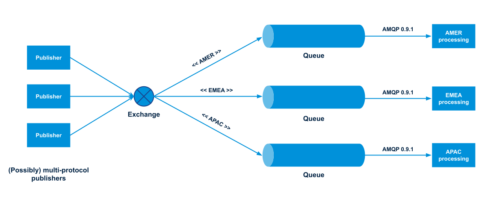
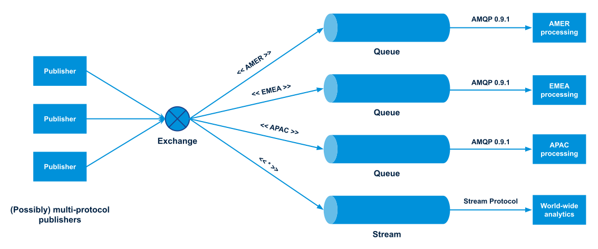

<!--diagrams: https://drive.google.com/drive/folders/1V-VuvO6jeL3dqHBiGZq3uCErc-vOeH49?usp=sharing -->
RabbitMQ streams allow applications to convey detailled information thanks to the powerful message format they use.
Streams are a feature of their own, but they also fully integrate with the existing resources and protocols that RabbitMQ supports.
This blog post covers the interoperability of streams in RabbitMQ and explores the scenarios it unlocks.

<!-- truncate -->

## Messages in RabbitMQ Streams

We saw in the [RabbitMQ Streams First Application](/blog/2021/07/19/rabbitmq-streams-first-application) blog post that stream messages have a binary body, properties, with different types supported.
For example:

```java
Message message = producer.messageBuilder()
  .properties()
    .creationTime(System.currentTimeMillis()) // Unix time, with a precision of milliseconds
    .messageId(i) // long, string, binary, or UUID
  .messageBuilder()
    .addData("hello world".getBytes(StandardCharsets.UTF_8))
  .build();
```

RabbitMQ Stream uses the [AMQP 1.0 message format](https://www.amqp.org/resources/specifications) to encode messages.
It is a flexible, powerful, and efficient format, with a sophisticated type system.
It is also supported by a variety of platforms, like Java, Go, .NET, and many others.
Our examples use Java, but messages could be published and consumed by [different](https://github.com/rabbitmq/rabbitmq-stream-go-client) [platforms](https://github.com/rabbitmq/rabbitmq-stream-dotnet-client) as well. 


Note RabbitMQ Streams does not use the AMQP 1.0 *protocol* as it has its own [binary protocol](https://github.com/rabbitmq/rabbitmq-server/blob/v3.9.x/deps/rabbitmq_stream/docs/PROTOCOL.adoc), which happens to convey messages encoded in the AMQP 1.0 *format* in some of its frames.
The stream Java client documentation contains [more details on AMQP 1.0 messages](https://rabbitmq.github.io/rabbitmq-stream-java-client/stable/htmlsingle/#working-with-complex-messages).

## What About Other Protocols?

So stream applications can publish and consume complex messages, so far so good. 
But streams are not an island in RabbitMQ: they are interoperable with the other protocols supported by RabbitMQ, that is AMQP 0.9.1, AMQP 1.0, STOMP, and MQTT.

So if an application using a given protocol can publish messages that end up in a queue, a stream application can consume these messages as long as *the queue is a stream*.
And the opposite is true: if a stream application publishes messages to a stream, applications using other protocols see the stream as a queue and can consume messages from it.

This interoperability combined with the routing capabilities of RabbitMQ bring a lot of flexibility and is helpful in many scenarios that may involve a variety of plaforms and programming languages.
This also means that even though streams are a new feature in RabbitMQ 3.9, you don't have to start using them only for new applications with stream publishers and stream consumers, but you can *include* them in your existing RabbitMQ architecture.

## Streams in an Existing System

Imagine an existing system with publishers sending messages to a topic exchange.
Depending on their routing keys, messages are routed to a given queue, matching a given region of the world.
Each queue has its own processing, that depends on the region.
Note the publishers don't have to use AMQP 0.9.1, they can use any protocol supported by RabbitMQ, as long as they publish to the exchange with the appropriate routing key.



Imagine now we want to keep the existing processing as is, but do some extra processing like analytics on all messages.
We just have to create a stream and bind it to the topic exchange with a wildcard:



A stream is appropriate for analytics thanks to its non-destructive consumer semantics and, as the stream protocol is very fast, results can be recomputed from scratch every day.
This can also benefit any other application that needs the entire or partial history of messages, as any number of consumers can read and re-read the stream from any point in time.

The region processing done from the queues can stay exactly the same, as long as the queue semantics fit the needs (destructive consuming, competing consumers, etc.)

This is an excellent example of how streams can be introduced easily and without risks in existing RabbitMQ architectures, to provide added value immediately.

## Publishing With AMQP 0.9.1, Consuming With the Stream Protocol

Let's see a bit of code that illustrates this example.

The next snippet shows a publisher using the RabbitMQ 0.9.1 AMQP Java client:

```java
channel.basicPublish(
  "events",  // exchange
  REGIONS[i % REGIONS.length], // routing key, round robin across regions
  new AMQP.BasicProperties.Builder()
    .messageId(String.valueOf(i)) // message ID
    .timestamp(new Date()) // creation time
    .contentType("text/plain") // content type
    .build(),
  ("message " + i).getBytes(StandardCharsets.UTF_8) // body
);
```

The publisher sets a few properties to illustrate the interoperability betweem AMQP 0.9.1 and stream messages.

And here is a consumer that uses the stream Java client to process the messages from the world-wide stream:

```java
environment.consumerBuilder()
  .stream("world")
  .offset(OffsetSpecification.first())
  .messageHandler((context, message) -> {
    String body = new String(message.getBodyAsBinary());
    log(
      "Message #%s, creation time %tF %tT, content type '%s', from exchange %s with routing key %s",
      message.getProperties().getMessageId(),
      message.getProperties().getCreationTime(),
      message.getProperties().getCreationTime(),
      message.getProperties().getContentType(),
      message.getMessageAnnotations().get("x-exchange"),
      message.getMessageAnnotations().get("x-routing-key"));
  })
  .build();
```

The consumer can retrieve properties from the original AMQP 0.9.1 message even though stream are using the AMQP 1.0 message format.
It is also possible to retrieve the exchange and the routing key of the message in the message annotations (an AMQP 1.0 concept.)

## Interoperability in Action

Let's run the previous code in a project with the topology described above.

### Setting Up The Sample Project

Running the samples requires Docker, Git, and Java 8 or higher installed.
You can start the broker with the following command:

```shell
docker run -it --rm --name rabbitmq -p 5552:5552 -p 5672:5672 -p 15672:15672 \
    -e RABBITMQ_SERVER_ADDITIONAL_ERL_ARGS='-rabbitmq_stream advertised_host localhost' \
    rabbitmq:3.9-management
```

You need then to enable the stream plugin:

```shell
docker exec rabbitmq rabbitmq-plugins enable rabbitmq_stream
```

The [code is hosted on GitHub](https://github.com/acogoluegnes/rabbitmq-streams-blog-posts).
Here is how to clone the repository:

```shell
git clone https://github.com/acogoluegnes/rabbitmq-streams-blog-posts.git
cd rabbitmq-streams-blog-posts
```

In the sample project we will:
* create the topology illustrated in the diagram above
* publish messages with an AMQP 0.9.1 publisher
* consume the messages from the stream using the stream protocol

### Creating the Topology

The following command creates the exchange, the queues, the stream, and their respective bindings:

```shell
./mvnw -q compile exec:java -Dexec.mainClass='com.rabbitmq.stream.Interoperability$CreateTopology'
```

You should see the following on the console:

```
Connecting...
Connected
Creating 'events' topic exchange...
Creating 'amer' queue and binding it to 'events' exchange...
Creating 'emea' queue and binding it to 'events' exchange...
Creating 'apac' queue and binding it to 'events' exchange...
Creating 'world' stream and binding it to 'events' exchange...
Closing connection
```

It is possible to check the resources have been created in the [management UI](http://localhost:15672/#/queues) (user `guest`, password `guest`.)

### Publishing the Messages

The following runs a publisher that sends 100 messages:

```shell
./mvnw -q compile exec:java -Dexec.mainClass='com.rabbitmq.stream.Interoperability$Publish'
```

You should get the following console output:

```
Connecting...
Connected
Sending 100 messages
Messages sent, waiting for confirmation...
Messages confirmed
Closing connection
```

As shown in the snippet above, the publisher sets some message properties and changes the routing key in a round robin fashion to publish to every region.
You can go back to the [management UI](http://localhost:15672/#/queues) to check the content of the queues and of the stream.
Note the stream contains an extra message: it is a poison message to stop the consumer we'll run next.

### Consuming the Message from the Stream

It's time to consume all the messages that ended up in the stream:

```shell
./mvnw -q compile exec:java -Dexec.mainClass='com.rabbitmq.stream.Interoperability$Consume'
```

You should get something like the following:

```
Connecting...
Connected
Start consumer...
Message #0, creation time 2021-10-06 14:19:55, content type 'text/plain', from exchange events with routing key amer
Message #1, creation time 2021-10-06 14:19:55, content type 'text/plain', from exchange events with routing key emea
Message #2, creation time 2021-10-06 14:19:55, content type 'text/plain', from exchange events with routing key apac
Message #3, creation time 2021-10-06 14:19:55, content type 'text/plain', from exchange events with routing key amer
...
Message #97, creation time 2021-10-06 14:19:55, content type 'text/plain', from exchange events with routing key emea
Message #98, creation time 2021-10-06 14:19:55, content type 'text/plain', from exchange events with routing key apac
Message #99, creation time 2021-10-06 14:19:55, content type 'text/plain', from exchange events with routing key amer
Received poison message, stopping...
Closing environment...
Environment closed
```

The stream consumer gets all the messages, without losing information between the AMQP 0.9.1 to AMQP 1.0 message format conversion.
Note the exchange and routing key information is available as well as part of the message annotations.

## Wrapping Up

We saw in this blog post that streams in RabbitMQ can convey messages with a sophisticated format (binary body, but also properties, with complex types.)
Applications can access streams with the stream protocol, which is fast and efficient, but also with the other protocols RabbitMQ supports.
This makes streams first-class citizens in systems that require interoperability, one of the strong points of RabbitMQ.
You can use streams for brand new applications, but don't hesitate to integrate them smoothly in your existing systems as suggested in the scenario above.
