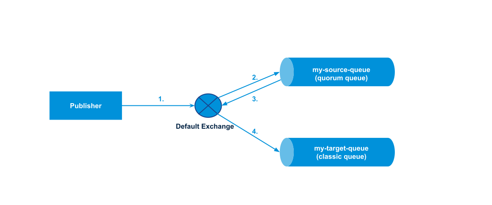
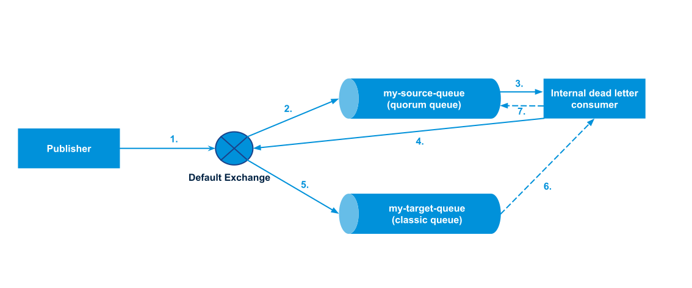

Quorum queues in [RabbitMQ 3.10](https://github.com/rabbitmq/rabbitmq-server/releases/tag/v3.10.0) provide a safer form of dead lettering that uses at-least-once guarantees for the message transfer between queues.
This blog post explains everything you need to know to start using at-least-once dead lettering.

This post also introduces two other [RabbitMQ 3.10](https://github.com/rabbitmq/rabbitmq-server/releases/tag/v3.10.0) features: message Time-To-Live (TTL) for quorum queues and Prometheus metrics for dead lettered messages.

<!-- truncate -->

## Overview

Some messages stored in RabbitMQ queues will expire or be negatively acknowledged by consumers.
Instead of silently dropping them, RabbitMQ can be configured to ["dead letter"](/docs/dlx#overview) them instead,
that is to republish those messages to a special-purpose exchange.

Prior to RabbitMQ 3.10 dead lettering has not been [safe](/docs/dlx#safety).
Messages that get dead lettered from a queue (the "source queue") are not guaranteed to be delivered to the queues routed to by the
exchange configured in the `dead-letter-exchange` policy (henceforth the "target queues").

This is because messages are dead lettered without publisher confirms turned on internally.
We call it the "at-most-once" dead letter strategy.
Dead lettered messages may arrive at the target queues.
They may also get lost for a variety of reasons:

* The target queue is unavailable. For example, a classic queue's host node is down or being upgraded or a quorum queue loses a majority of its nodes temporarily.
* The target queue's [length limit](/docs/maxlength) is reached while its [overflow behaviour](/docs/maxlength#overflow-behaviour)
is set to `reject-publish` rejecting any incoming messages.
* A network partition prevents communication between source queue and target queue.
* The dead letter routing topology is not configured correctly. For example, the configured `dead-letter-exchange` does not exist or no target queue is bound
to the `dead-letter-exchange`.

RabbitMQ 3.10 introduces a new feature called ["at-least-once" dead lettering](/docs/quorum-queues#dead-lettering).
It is an opt-in feature available for source queues being quorum queues.
This new feature ensures that all messages dead lettered in the source quorum queue will arrive at the target queues (classic queue, quorum queue, or stream) eventually
even in the scenarios described above where messages would have been lost with the "at-most-once" strategy.

This blog post covers instructions how to enable at-least-once dead lettering, provides a detailed example, and describes caveats and best practices of this new feature.

## Usage

To enable `at-least-once` dead-lettering for a source quorum queue, we need to apply the following policies
(or their equivalent queue arguments starting with `x-`):

* `dead-letter-strategy` is set to `at-least-once`. The default is `at-most-once`.
* `overflow` is set to `reject-publish`. The default is `drop-head`.
* `dead-letter-exchange` is configured.

Furthermore, the [feature flag](/docs/feature-flags) `stream_queue` must be enabled. By default that feature flag is enabled for RabbitMQ clusters created since 3.9.
Even though streams are not used in at-least-once dead lettering (unless a target queue happens to be a stream) the `stream_queue` feature flag is required because
at-least-once dead lettering relies on some implementation details that come with that feature flag.

## Example

Following this example requires [kubectl](https://kubernetes.io/docs/tasks/tools/#kubectl) client to be installed and pointing against any running Kubernetes cluster v1.19 or newer.

If you do not have a Kubernetes cluster available, the quickest way is to install [kind](https://kubernetes.io/docs/tasks/tools/#kind) to start a local Kubernetes cluster in Docker:
```zsh
> kind create cluster
```

Install the [rabbitmq/cluster-operator](https://github.com/rabbitmq/cluster-operator):
```zsh
> kubectl apply -f https://github.com/rabbitmq/cluster-operator/releases/latest/download/cluster-operator.yml
```

Deploy a 3-node RabbitMQ cluster:
```zsh
> cat <<EOF | kubectl apply -f -
---
apiVersion: rabbitmq.com/v1beta1
kind: RabbitmqCluster
metadata:
  name: my-rabbit
spec:
  replicas: 3
  image: rabbitmq:3.10.0-management
EOF
```

Once all 3 pods are ready (which takes less than 1 minute), we create a source queue and a target queue:
```zsh
> kubectl exec my-rabbit-server-0 -c rabbitmq -- rabbitmqadmin declare queue name=my-source-queue \
    durable=true queue_type=quorum arguments='{"x-dead-letter-exchange" : "",
    "x-dead-letter-routing-key" : "my-target-queue" , "x-overflow" : "reject-publish"}'

> kubectl exec my-rabbit-server-0 -c rabbitmq -- rabbitmqadmin declare queue name=my-target-queue \
    durable=true queue_type=classic
```

The last two commands declare a queue by executing the `rabbitmqadmin` command in the RabbitMQ container of pod `my-rabbit-server-0`.

The `rabbitmqadmin` command is a Python script that talks against the RabbitMQ Management API.
The `rabbitmqadmin` command is not the recommended way to declare queues and to send messages.
We use it in this blog post since it is the simplest way for you to follow the examples.

The rabbitmq/cluster-operator creates pod names in the format `<rabbitmq-cluster-name>-server-<index>`.
In the YAML above, we defined `<rabbitmq-cluster-name>` to be `my-rabbit`.

The first command creates the source queue. For at-least-once dead lettering to work it must be of `queue_type=quorum`.
For the source queue, we define further queue arguments (starting with `x-`) encoded in JSON format:

* `x-dead-letter-exchange` set to the empty string (`""`) means that messages dead lettered by the source queue are published to the default exchange.
(While we could have created a new dead letter exchange, dead-lettering to the default exchange keeps this example simpler.)
* `x-dead-letter-routing-key` set to `my-target-queue` means that dead lettered messages will be published with routing
key `my-target-queue`. Since this routing key matches the queue name of the target queue (created by the 2nd command), dead letter messages
will be routed by the default exchange to the target queue without the need to create any further bindings.
* As stated above `x-overflow` must be set to `reject-publish` as a prerequisite for at-least-once dead lettering.

The second command creates the target queue. It can be of any queue type. In this example we choose a classic queue.
Note that compared to the source quorum queue having 3 replicas on all 3 nodes, the target classic queue is not highly available
and resides on a single node.

Let us publish our first message `msg1`:
```zsh
> kubectl exec my-rabbit-server-0 -c rabbitmq -- rabbitmqadmin publish exchange=amq.default routing_key=my-source-queue \
    payload=msg1 properties='{"expiration" : "1000", "delivery_mode" : 2}'
```

This command demonstrates another new feature of RabbitMQ 3.10: [Message TTL](/docs/ttl) is supported for quorum queues.
The following figure illustrates how the message flows:

1. We publish one message to the default exchange.
1. It gets routed to the source quorum queue where it expires after 1 second (1000 milliseconds).
1. The expiration causes the message to be dead lettered to the default exchange.
1. It gets routed to the target classic queue.

<!--diagrams: https://drive.google.com/drive/folders/1V-VuvO6jeL3dqHBiGZq3uCErc-vOeH49?usp=sharing -->


Note that we set the `delivery_mode` to the integer `2` which denotes that the message is persisted.
That flag does not matter when publishing the message to the source quorum queue initially because all messages in quorum queues
are written to disk anyway. However, that persistence flag becomes important once the message will be dead lettered
to a target queue (which may not be a quorum queue).

We can validate that the message arrived in the target queue:
```zsh
> kubectl exec my-rabbit-server-0 -c rabbitmq -- rabbitmqctl list_queues --formatter=pretty_table --quiet \
    name type messages messages_ready messages_unacknowledged

┌─────────────────┬─────────┬──────────┬────────────────┬─────────────────────────┐
│ name            │ type    │ messages │ messages_ready │ messages_unacknowledged │
├─────────────────┼─────────┼──────────┼────────────────┼─────────────────────────┤
│ my-target-queue │ classic │ 1        │ 1              │ 0                       │
├─────────────────┼─────────┼──────────┼────────────────┼─────────────────────────┤
│ my-source-queue │ quorum  │ 0        │ 0              │ 0                       │
└─────────────────┴─────────┴──────────┴────────────────┴─────────────────────────┘
```

Next, let us try out what happens when the target queue becomes unavailable.
One way to determine the host node of the target classic queue is listing the queue's process identifier (PID):
```zsh
> kubectl exec my-rabbit-server-0 -c rabbitmq -- rabbitmqctl list_queues --quiet name pid

name	pid
my-target-queue	<rabbit@my-rabbit-server-0.my-rabbit-nodes.default.1646297039.856.0>
my-source-queue	<rabbit@my-rabbit-server-0.my-rabbit-nodes.default.1646297039.821.0>
```

The PID shows that both the target classic queue process and the source quorum queue leader process
reside in pod `my-rabbit-server-0`.
Let us stop that RabbitMQ server:

```zsh
> kubectl exec my-rabbit-server-0 -c rabbitmq -- rabbitmqctl stop_app

Stopping rabbit application on node rabbit@my-rabbit-server-0.my-rabbit-nodes.default ...
```

The source quorum queue will still be available because a majority of nodes (2 out of 3) are available and another node becomes the new leader.

As before we again send a message to the source queue and let it expire after 1 second.
Since the RabbitMQ node in pod `my-rabbit-server-0` is down, we execute the following commands
in `my-rabbit-server-1`:
```zsh
> kubectl exec my-rabbit-server-1 -c rabbitmq -- rabbitmqadmin publish exchange=amq.default routing_key=my-source-queue \
    payload=msg2 properties='{"expiration" : "1000", "delivery_mode" : 2}'
```

Since the target queue is down, it will not report its statistics:
```zsh
>  kubectl exec my-rabbit-server-1 -c rabbitmq -- rabbitmqctl list_queues --formatter=pretty_table --quiet \
    name type messages messages_ready messages_unacknowledged state

┌─────────────────┬──────────────────────┬──────────┬────────────────┬─────────────────────────┬─────────┐
│ name            │ type                 │ messages │ messages_ready │ messages_unacknowledged │ state   │
├─────────────────┼──────────────────────┼──────────┼────────────────┼─────────────────────────┼─────────┤
│ my-target-queue │ rabbit_classic_queue │          │                │                         │ down    │
├─────────────────┼──────────────────────┼──────────┼────────────────┼─────────────────────────┼─────────┤
│ my-source-queue │ quorum               │ 0        │ 0              │ 0                       │ running │
└─────────────────┴──────────────────────┴──────────┴────────────────┴─────────────────────────┴─────────┘
```
However, because the target queue is down and because the source queue does not contain any messages we know that the second message
got lost while it was dead lettered!

Since we did not yet define `dead-letter-strategy` to be `at-least-once` when declaring the source queue above,
the source queue uses the default strategy `at-most-once`.
We can do better. In this example, we switch the dead letter strategy dynamically to `at-least-once` by applying a policy:
```zsh
> kubectl exec my-rabbit-server-1 -c rabbitmq -- rabbitmqctl set_policy --apply-to queues \
    my-policy my-source-queue '{"dead-letter-strategy" : "at-least-once"}'

Setting policy "my-policy" for pattern "my-source-queue" to "{"dead-letter-strategy" : "at-least-once"}"
with priority "0" for vhost "/" ...
```

Let us send a third message:
```zsh
> kubectl exec my-rabbit-server-1 -c rabbitmq -- rabbitmqadmin publish exchange=amq.default routing_key=my-source-queue \
    payload=msg3 properties='{"expiration" : "1000", "delivery_mode" : 2}'
```

With the new `at-least-once` strategy when the 3rd message expires and gets dead lettered, it will be stored
by the source queue since the target queue is not available:
```zsh
> kubectl exec my-rabbit-server-1 -c rabbitmq -- rabbitmqctl list_queues --formatter=pretty_table --quiet \
    name type messages messages_ready messages_unacknowledged state

┌─────────────────┬──────────────────────┬──────────┬────────────────┬─────────────────────────┬─────────┐
│ name            │ type                 │ messages │ messages_ready │ messages_unacknowledged │ state   │
├─────────────────┼──────────────────────┼──────────┼────────────────┼─────────────────────────┼─────────┤
│ my-target-queue │ rabbit_classic_queue │          │                │                         │ down    │
├─────────────────┼──────────────────────┼──────────┼────────────────┼─────────────────────────┼─────────┤
│ my-source-queue │ quorum               │ 1        │ 0              │ 0                       │ running │
└─────────────────┴──────────────────────┴──────────┴────────────────┴─────────────────────────┴─────────┘
```

The message is neither "ready" (i.e. available for normal queue consumers) nor "unacknowledged" (i.e. consumed by normal queue consumers but not yet acknowledged).
However, the message is kept safely in the source quorum queue in a separate data structure that is only available for consumption
by a special RabbitMQ internal dead letter consumer process.

Let us output the logs of that dead letter consumer process.
The dead letter consumer process is co-located on the quorum queue leader node.
We first need figure out which node became the new leader:
```zsh
> kubectl exec my-rabbit-server-1 -c rabbitmq -- rabbitmqctl list_queues --formatter=pretty_table --quiet name leader
┌─────────────────┬───────────────────────────────────────────────────┐
│ name            │ leader                                            │
├─────────────────┼───────────────────────────────────────────────────┤
│ my-target-queue │                                                   │
├─────────────────┼───────────────────────────────────────────────────┤
│ my-source-queue │ rabbit@my-rabbit-server-1.my-rabbit-nodes.default │
└─────────────────┴───────────────────────────────────────────────────┘
```
In our example the new leader happens to be on pod `my-rabbit-server-1`.
When you run this example, it could also be `my-rabbit-server-2` in which case you will need replace `1` with `2` in below commands.

The log displays a descriptive warning message:
```
> kubectl logs my-rabbit-server-1 -c rabbitmq | grep dead-letter

[warn] <0.4156.0> Cannot forward any dead-letter messages from source quorum queue 'my-source-queue'
in vhost '/' with configured dead-letter-exchange exchange '' in vhost '/' and configured
dead-letter-routing-key 'my-target-queue'. This can happen either if the dead-letter routing topology is misconfigured
(for example no queue bound to dead-letter-exchange or wrong dead-letter-routing-key configured)
or if non-mirrored classic queues are bound whose host node is down.
Fix this issue to prevent dead-lettered messages from piling up in the source quorum queue.
This message will not be logged again.
```

We fix this issue by restarting the target classic queue's host node:
```zsh
> kubectl exec my-rabbit-server-0 -c rabbitmq -- rabbitmqctl start_app

Starting node rabbit@my-rabbit-server-0.my-rabbit-nodes.default ...
```

The internal dead letter consumer process retries to send the message periodically.
The current default retry interval is 3 minutes.
After no later than 3 minutes the 3rd message should have made it to the target queue:

```zsh
> kubectl exec my-rabbit-server-0 -c rabbitmq -- rabbitmqctl list_queues --formatter=pretty_table --quiet \
    name type messages messages_ready messages_unacknowledged state

┌─────────────────┬─────────┬──────────┬────────────────┬─────────────────────────┬─────────┐
│ name            │ type    │ messages │ messages_ready │ messages_unacknowledged │ state   │
├─────────────────┼─────────┼──────────┼────────────────┼─────────────────────────┼─────────┤
│ my-source-queue │ quorum  │ 0        │ 0              │ 0                       │ running │
├─────────────────┼─────────┼──────────┼────────────────┼─────────────────────────┼─────────┤
│ my-target-queue │ classic │ 2        │ 2              │ 0                       │ running │
└─────────────────┴─────────┴──────────┴────────────────┴─────────────────────────┴─────────┘
```

Our understanding is that the 1st and 3rd message are in the target queue but that the 2nd message got lost
because it used `at-most-once` dead lettering while the target queue was down:

```zsh
> kubectl exec my-rabbit-server-0 -c rabbitmq -- rabbitmqadmin get queue=my-target-queue count=2
+-----------------+----------+---------------+---------+---------------+------------------+-------------+
|   routing_key   | exchange | message_count | payload | payload_bytes | payload_encoding | redelivered |
+-----------------+----------+---------------+---------+---------------+------------------+-------------+
| my-target-queue |          | 1             | msg1    | 4             | string           | False       |
| my-target-queue |          | 0             | msg3    | 4             | string           | False       |
+-----------------+----------+---------------+---------+---------------+------------------+-------------+
```

The `payload` column validates that our understanding is correct and that `at-least-once` dead lettering works as expected.
Even though the target queue was unavailable, the dead letter message made it to the target queue once it became available again.
The 1st message is still stored in the target queue because we published to the source quorum queue setting the persistence flag.
If we did not set the persistence flag, the 1st message would have been lost as well.

The following figure summarises the flow of the 3rd message.



1. The message is published to the default exchange.
1. The message is routed to the source quorum queue. A quorum queue is a replicated state machine in the Raft consensus algorithm.
A quorum queue's state consists of more than a queue data structure where messages from publishers are enqueued:
The state also includes data about publishers, consumers as well as messages sent to (but not yet acknowledged by) consumers, and some other statistics.
`At-least-once` dead lettering adds yet another queue data structure to the quorum queue's state: a queue that contains only dead lettered messages.
So when the message expires after 1 second it is moved from the "normal" message queue to the dead letter message queue.
The message remains safely stored there until it gets acknowledged by step 7.
1. There is one (RabbitMQ internal) dead letter consumer process co-located on the node of the quorum queue leader.
Its job is to consume messages from a single source quorum queue's dead letter message queue, forward them to all target queues,
waiting until **all** publisher confirmations are received (step 6) and finally acknowledge the dead lettered message
back to the source quorum queue (step 7).
1. The dead letter consumer routes dead lettered messages via the configured `dead-letter-exchange`. In our example, we configured the default exchange
to be the dead letter exchange. If a route does not exist, the dead letter consumer will try to route again after some time.
1. If a route exists the message is sent to the target queue.
1. The target queue sends a publisher confirmation back to the dead letter consumer.
1. The dead letter consumer sends a consumer acknowledgement back to the source quorum queue where the dead lettered message will be deleted.

### Prometheus metrics

RabbitMQ 3.10 comes with another new feature: Prometheus metrics for dead lettered messages.
Node-global counters will return the number of messages that get dead lettered broken down by the following dimensions:

1. dead letter reason:
    * `expired`: Message TTL exceeded (as in our example).
    * `rejected`: Consumer sent `basic.reject` or `basic.nack` without requeue option.
    * `maxlen`: Queue length exceeded with `overflow` set to `drop-head` or `reject-publish-dlx`. (The latter setting applies only to classic queues.)
    * `delivery_limit`: Delivery limit exceeded. (Applies only to quorum queues). Message got requeued too often,
for example because consumer sent `basic.reject` or `basic.nack` with requeue option or consumer got disconnected from the quorum queue leader.

2. source queue type. i.e. queue type where messages were dead lettered **from**:
    * `rabbit_classic_queue`
    * `rabbit_quorum_queue`
    * (Streams do not dead letter messages because they are append-only logs where messages get truncated according to retention policies.)

3. dead letter strategy:
    * `disabled`: Queue has no `dead-letter-exchange` configured or configured `dead-letter-exchange` does not exist implying messages get dropped.
    * `at_most_once`: Queue's configured dead-lettered-exchange exists.
    * `at_least_once`: Queue type is `rabbit_quorum_queue`, `dead-letter-exchange` is configured, `dead-letter-strategy` is set to `at-least-once`, `overflow` is set to `reject-publish`.

Following our example let us output these metrics.
In a shell window port-forward RabbitMQ's Prometheus port `15692`:
```zsh
> kubectl port-forward pod/my-rabbit-server-1 15692
```
In another shell window scrape the Prometheus endpoint:
```zsh
> curl --silent localhost:15692/metrics/ | grep rabbitmq_global_messages_dead_lettered

# TYPE rabbitmq_global_messages_dead_lettered_confirmed_total counter
# HELP rabbitmq_global_messages_dead_lettered_confirmed_total Total number of messages dead-lettered and confirmed by target queues
rabbitmq_global_messages_dead_lettered_confirmed_total{queue_type="rabbit_quorum_queue",dead_letter_strategy="at_least_once"} 1

# TYPE rabbitmq_global_messages_dead_lettered_delivery_limit_total counter
# HELP rabbitmq_global_messages_dead_lettered_delivery_limit_total Total number of messages dead-lettered due to
# delivery-limit exceeded
rabbitmq_global_messages_dead_lettered_delivery_limit_total{queue_type="rabbit_quorum_queue",dead_letter_strategy="at_least_once"} 0
rabbitmq_global_messages_dead_lettered_delivery_limit_total{queue_type="rabbit_quorum_queue",dead_letter_strategy="at_most_once"} 0
rabbitmq_global_messages_dead_lettered_delivery_limit_total{queue_type="rabbit_quorum_queue",dead_letter_strategy="disabled"} 0

# TYPE rabbitmq_global_messages_dead_lettered_expired_total counter
# HELP rabbitmq_global_messages_dead_lettered_expired_total Total number of messages dead-lettered due to message TTL exceeded
rabbitmq_global_messages_dead_lettered_expired_total{queue_type="rabbit_classic_queue",dead_letter_strategy="at_most_once"} 0
rabbitmq_global_messages_dead_lettered_expired_total{queue_type="rabbit_classic_queue",dead_letter_strategy="disabled"} 0
rabbitmq_global_messages_dead_lettered_expired_total{queue_type="rabbit_quorum_queue",dead_letter_strategy="at_least_once"} 1
rabbitmq_global_messages_dead_lettered_expired_total{queue_type="rabbit_quorum_queue",dead_letter_strategy="at_most_once"} 1
rabbitmq_global_messages_dead_lettered_expired_total{queue_type="rabbit_quorum_queue",dead_letter_strategy="disabled"} 0

# TYPE rabbitmq_global_messages_dead_lettered_maxlen_total counter
# HELP rabbitmq_global_messages_dead_lettered_maxlen_total Total number of messages dead-lettered due to overflow drop-head
# or reject-publish-dlx
rabbitmq_global_messages_dead_lettered_maxlen_total{queue_type="rabbit_classic_queue",dead_letter_strategy="at_most_once"} 0
rabbitmq_global_messages_dead_lettered_maxlen_total{queue_type="rabbit_classic_queue",dead_letter_strategy="disabled"} 0
rabbitmq_global_messages_dead_lettered_maxlen_total{queue_type="rabbit_quorum_queue",dead_letter_strategy="at_most_once"} 0
rabbitmq_global_messages_dead_lettered_maxlen_total{queue_type="rabbit_quorum_queue",dead_letter_strategy="disabled"} 0

# TYPE rabbitmq_global_messages_dead_lettered_rejected_total counter
# HELP rabbitmq_global_messages_dead_lettered_rejected_total Total number of messages dead-lettered due to basic.reject or basic.nack
rabbitmq_global_messages_dead_lettered_rejected_total{queue_type="rabbit_classic_queue",dead_letter_strategy="at_most_once"} 0
rabbitmq_global_messages_dead_lettered_rejected_total{queue_type="rabbit_classic_queue",dead_letter_strategy="disabled"} 0
rabbitmq_global_messages_dead_lettered_rejected_total{queue_type="rabbit_quorum_queue",dead_letter_strategy="at_least_once"} 0
rabbitmq_global_messages_dead_lettered_rejected_total{queue_type="rabbit_quorum_queue",dead_letter_strategy="at_most_once"} 0
rabbitmq_global_messages_dead_lettered_rejected_total{queue_type="rabbit_quorum_queue",dead_letter_strategy="disabled"} 0
```

We scraped only the Prometheus metrics of pod `my-rabbit-server-1`.
Since these counters are "node-global", it means above list shows only the metrics as observed by node `my-rabbit-server-1` (but global
across all queues on that node).

The very 1st message we sent went to pod `my-rabbit-server-0` before we stopped that node.
Thereafter the quorum queue leader changed in our example from `my-rabbit-server-0` to `my-rabbit-server-1`.
We then sent the 2nd message using the `at-most-once` dead letter strategy and the 3rd message using the `at-least-once` dead letter strategy.
The 3rd message that got dead lettered was eventually acknowledged by the dead letter consumer (or in other words, confirmed by the target queues).
This is why the following counters have the value `1`:
```zsh
rabbitmq_global_messages_dead_lettered_confirmed_total{queue_type="rabbit_quorum_queue",dead_letter_strategy="at_least_once"} 1
rabbitmq_global_messages_dead_lettered_expired_total{queue_type="rabbit_quorum_queue",dead_letter_strategy="at_least_once"} 1
rabbitmq_global_messages_dead_lettered_expired_total{queue_type="rabbit_quorum_queue",dead_letter_strategy="at_most_once"} 1
```

If you are curious you can scrape the Prometheus metrics for pod `my-rabbit-server-0`.
What would you expect to see? Does the output match your expectations?
Hint: "A Prometheus counter is a cumulative metric that represents a single monotonically increasing counter whose value can only increase or be reset to zero on restart."

## Caveats

We saw how messages being dead lettered make it from the dead letter source queue to the dead letter target queue eventually even when the target queue is temporarily unavailable.
So why is at-least-once dead lettering not the new default dead letter strategy?

There are some caveats to be aware of when enabling at-least-once dead lettering:

### Caveat 1 - Message buildup in the source quorum queue

At-least-once dead lettering does a great job ensuring messages are not lost when target queues are temporarily unavailable or when the routing topology is not configured correctly.
However, if the dead letter consumer process does not obtain publisher confirmations from **all** target queues for a long time while more and more messages keep getting dead lettered
in the source queue, it can cause excessive message buildup in the source queue.
In the worst case, the source quorum queue will contain only of dead lettered messages.
To prevent excessive message buildup, set a [queue length limit](/docs/maxlength) for the source queue (`max-length` or `max-length-bytes`).

### Caveat 2 - Dead letter throughput

The dead letter consumer has a configurable setting called `dead_letter_worker_consumer_prefetch` whose current default value is set to `32`.
This means that the dead letter consumer process will prefetch and buffer at most 32 messages while waiting for publisher confirmations from target queues.

Since RabbitMQ 3.10 quorum queues store all message bodies / payloads always on disk.
There is still a very small per message memory overhead for each message in the quorum queue because the quorum queue holds some metadata for each message in memory (for example the Raft index and
the message payload size).

The dead letter consumer process on the other hand keeps message bodies in memory.
To protect against the worst case where hundreds of quorum queues have at-least-once dead lettering enabled and publisher confirmations are not received, this prefetch value is set
to a moderate default value of `32` to not cause high memory usage by the dead letter consumers.

A low prefetch value however will cause lower throughput.
If you have a scenario where sustained dead lettering throughput of thousands of messages per second is required (for example thousands of messages expire or are getting rejected every second)
you can increase the prefetch setting in the advanced config file.

Here is an example how to increase the prefetch in Kubernetes:
```yaml
---
apiVersion: rabbitmq.com/v1beta1
kind: RabbitmqCluster
metadata:
  name: my-rabbit
spec:
  replicas: 3
  rabbitmq:
    advancedConfig: |
      [
          {rabbit, [
              {dead_letter_worker_consumer_prefetch, 512}
          ]}
      ].
```

### Caveat 3 - Increased resource usage

Enabling at-least-once dead lettering for every quorum queue will increase resource usage.
More memory and more CPU will be consumed.
Comparing figure 1 (at-most-once dead lettering) with figure 2 (at-least-once dead lettering), we observe that at-least-once dead lettering will require
sending more messages (including acknowledgements).

### Caveat 4 - Overflow drop-head

As explained in the [Usage](#usage) section, enabling `at-least-once` dead lettering requires setting `overflow` to `reject-publish`.
Setting `overflow` to `drop-head` will make dead letter strategy fall back to `at-most-once`.
`drop-head` is not supported because dropping dead lettered messages from the source quorum queue would violate `at-least-once` semantics.

### Caveat 5 - Switching dead letter strategy

For a quorum queue, it is possible to switch the dead-letter strategy via a policy from `at-most-once`
to `at-least-once` and vice versa. If the dead-letter strategy is changed either directly
from `at-least-once` to `at-most-once` or indirectly, for example by changing overflow from `reject-publish`
to `drop-head` or by unsetting `dead-letter-exchange`, any dead-lettered messages that have not yet been confirmed by all target queues will be permanently deleted
in the source quorum queue.

## Best Practices

Based on what we have learnt above, at-least-once dead lettering best practices include:

### Best Practice 1

Set `max-length` or `max-length-bytes` in the source quorum queue to guard against excessive message buildup.

### Best Practice 2

Bind a target quorum queue or stream to the dead letter exchange.
This provides higher availability than a target classic queue.
Redelivery of dead letter messages will also be faster for target quorum queues or target streams than for target classic queues.
This is because quorum queues and streams have their own clients, delivery protocols and retry mechanisms.
Remember that classic mirrored queues are deprecated.

### Best Practice 3

Set the persistence flag on all messages published to the source quorum queue.
If the persistence flag is not set, dead lettered messages will not have it set either.
This becomes relevant when dead lettered messages are routed to a target classic queue.

## Wrapping Up

Prior to RabbitMQ 3.10 dead lettering in RabbitMQ has not been safe.
Messages being dead lettered could get lost for a variety of reasons - especially in multi-node RabbitMQ clusters.

At-least-once dead lettering ensures dead lettered messages arrive at the target queue eventually even in the presence of rolling upgrades and
temporary failures such as network partitions or routing topology misconfigurations.

Besides at-least-once dead lettering for quorum queues, we also learnt about two other new features in RabbitMQ 3.10:
Message TTL in quorum queues and Prometheus metrics for dead letter messages.

Since at-least-once dead lettering comes with increased resource usage, it should only be enabled if dead lettered messages are not "dead" in the
original sense but rather "alive" and crucial for your business logic.
If in your use case dead lettered messages are only of informational nature, at-most-once dead lettering should be used.

The at-least-once dead lettering feature for quorum queues paves the way for new use cases where you know that you
have messages that might be negatively acknowledged but still needs to be processed or where you cannot lose messages with an expiring TTL.
Such scenarios were previously unsafe or hard to achieve with RabbitMQ.
