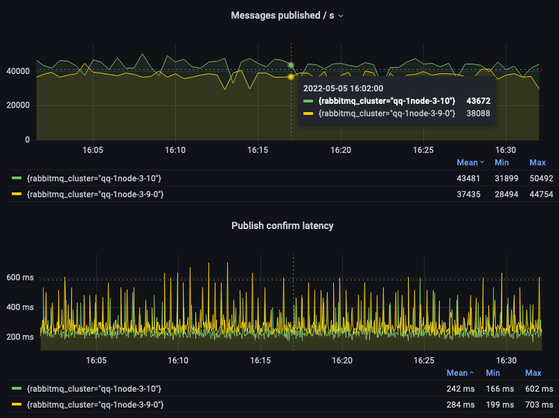
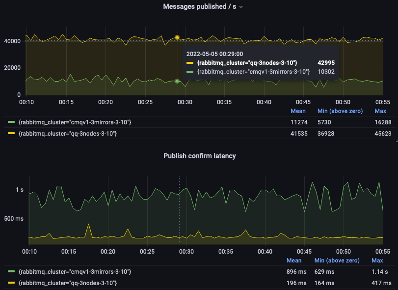
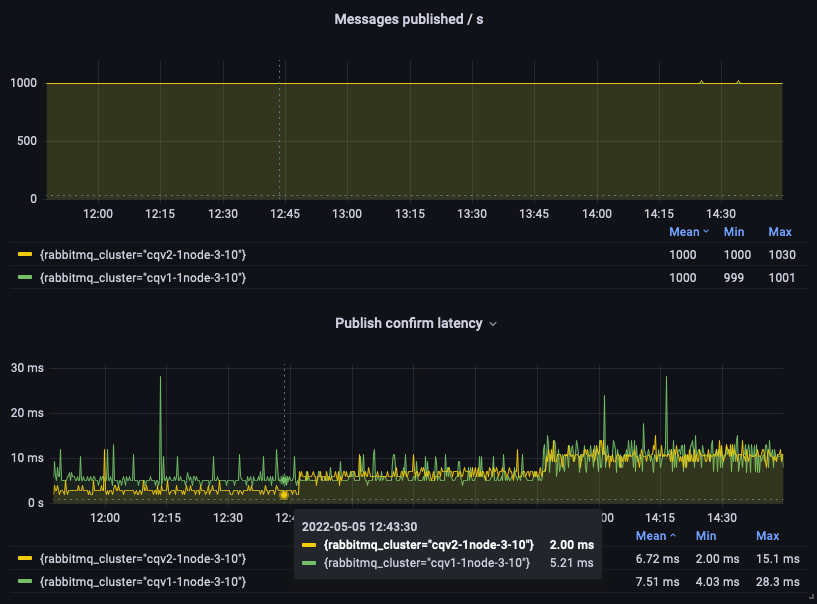

RabbitMQ 3.10 has recently been released and has some major new features
which focus on optimizations, performance, and stability.

[Release notes page](https://github.com/rabbitmq/rabbitmq-server/releases/tag/v3.10.0)
includes information about the specific changes in this version as well as various installation assets.
See our [upgrade guide](/docs/upgrade) for more information about upgrading to 3.10.0.

Let's have a tour!

<!-- truncate -->

## Quorum Queues

Quorum queues now support dead lettering with at-least-one guarantees and a long awaited feature: message TTL.
A [separate blog post](/blog/2022/03/29/at-least-once-dead-lettering) covers these 2 aspects.

Quorum queues now move messages to disk as quickly as possible.
This significantly reduces their memory footprint for some workloads, as well as provides more predictable throughput and latency.

We published a [detailed blog post on performance improvements in RabbitMQ 3.10](/blog/2022/05/16/rabbitmq-3.10-performance-improvements), but we can't help sharing a small glimpse here.
The following graph shows that quorum queues in RabbitMQ 3.10 provide significantly higher throughput and lower publish confirm latency than in 3.9:



We encourage all users to use quorum queues instead of classic mirrored queues. Quorum queues are a better replicated and persistent queue type,
even though previously the lack of support for message TTL could have prevented their adoption for some use cases.
Now that quorum queues support message TTL, the following graph should convince you to always favor them over classic mirrored queues:



## Classic Queues

Classic queues get new index and message store implementations, known as _CQv2_.
With CQv2, memory footprint of classic queues is more predictable and for most workloads, lower than with the previous version.
Another benefit of CQv2: consumer delivery is more efficient, potentially increasing throughput for workloads where consumers do keep up with producers.

Even though we heavily tested and benchmarked CQv2, the original index and store implementations are still the default for now.
CQv2 must be enabled explicitly via configuration (globally) or with a policy (for a specific set of queues).
We want CQv2 to perform optimally for most workloads and to be battle-tested before making it the default.

The following graph shows a test run with a fixed publishing rate and 3 phases where the message size start at 10 bytes,
then changes to 1,000 bytes, to finish at 5,000 bytes.
CQv2 provides a lower publish confirm latency for the first phase than CQv1, and the two implementations behave comparably in the final two phases.



## Streams

Streams benefit from bug fixes and optimizations.
They now also support replication over TLS based on the [inter-node TLS configuration](/docs/clustering-ssl).

## Scope Aliases in OAuth 2

[RabbitMQ OAuth 2 plugin](https://github.com/rabbitmq/rabbitmq-server/tree/v3.10.x/deps/rabbitmq_auth_backend_oauth2) uses a convention that translates
client-resented JWT token scopes into a set of RabbitMQ resource permissions. This works well for many environments, however,
in some cases JWT tokens come from an identity provider that won't produce scopes in this format, for technical or organizational reasons

Starting with RabbitMQ 3.10, the plugin now can be configured with a map of scopes to sets of RabbitMQ permissions.
This allows the plugin to integrate with identity providers that use scopes as role names assigned to client identity.
This is done in the advanced config file:

``` erlang
{rabbitmq_auth_backend_oauth2, [
    {resource_server_id, <<"rabbitmq-122">>},
    {extra_scopes_source, <<"claims">>},
    {scope_aliases, #{
      <<"megacorp.roles.122">>      => [
        <<"rabbitmq.read:vhost-122/*">>,
        <<"rabbitmq.write:vhost-122/*">>,
        <<"rabbitmq.configure:vhost-122/*">>
      ],
      <<"megacorp.roles.188">>     => [
        <<"rabbitmq.read:vhost-188/*">>,
        <<"rabbitmq.configure:vhost-188/*">>
       ],
      <<"megacorp.roles.read-only">> => [<<"rabbitmq.read:*/*">>]
    }}
    %% ...
```

In the above example, identity provider can assign roles such as `megacorp.roles.122` or `megacorp.roles.read-only` to an identity
and include them into JWT token scopes. The plugin will look up those "scope aliases" and append more scopes
to the decoded token. Then they are translated into RabbitMQ permissions.

## Miscellaneous

RabbitMQ 3.10 comes with bug fixes and improvements in its core, but also in several plugins, like the Prometheus, MQTT,
Shovel, and Consul Peer Discovery plugins.

It is also the first release to introduce support for Erlang 25 (at RC stage at the time of writing).

## Last Words

We would like to thank all contributors to this release.

A couple of last recommendations before you [install](https://github.com/rabbitmq/rabbitmq-server/releases/tag/v3.10.0)
or [upgrade](/docs/upgrade) to RabbitMQ 3.10:

* Use Erlang 24 or more for [the best performance](/blog/2021/03/23/erlang-24-support-roadmap)
* Be aware of the [removal of some deprecated capabilities](/blog/2021/08/21/4.0-deprecation-announcements) in RabbitMQ 4.0

We value our feedback: you can [discuss](https://github.com/rabbitmq/rabbitmq-server/discussions) on GitHub, ask questions
on the [mailing list](https://groups.google.com/g/rabbitmq-users) or [RabbitMQ Community Slack](https://rabbitmq-slack.herokuapp.com),
and report actionable [issues](https://github.com/rabbitmq/rabbitmq-server/issues) you run into.
