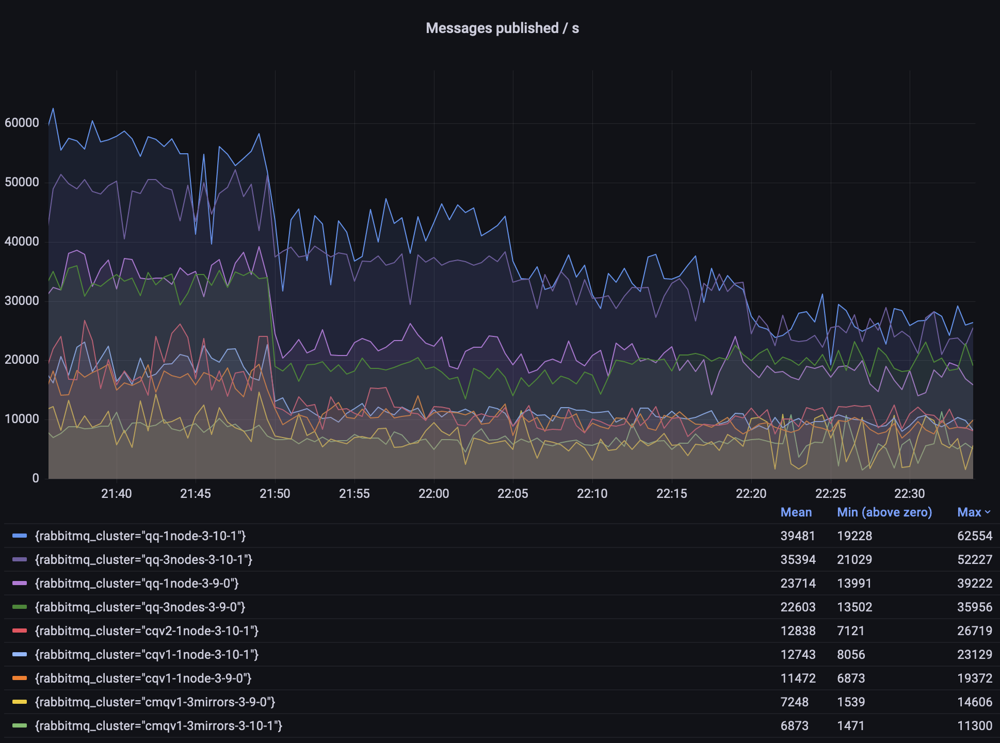
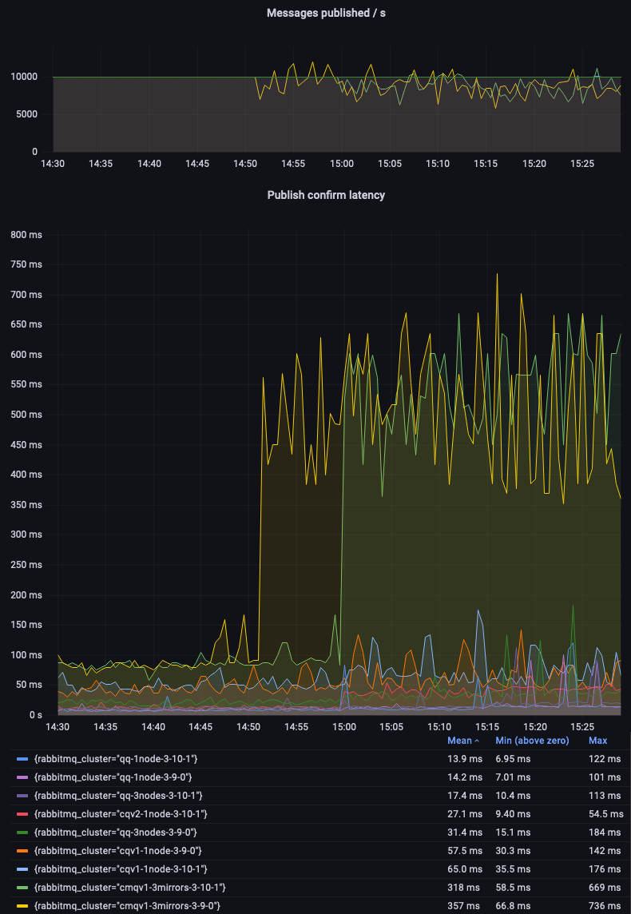
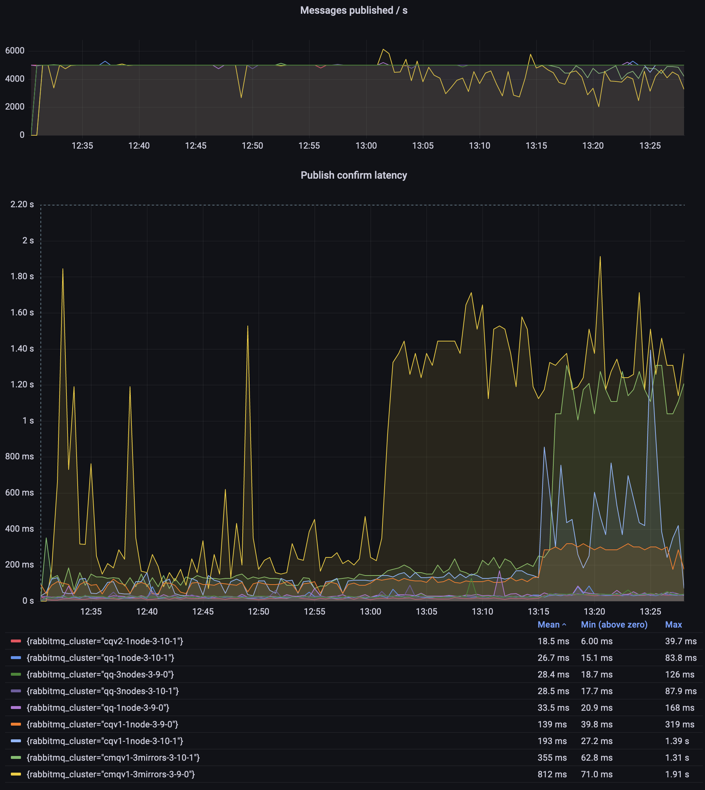
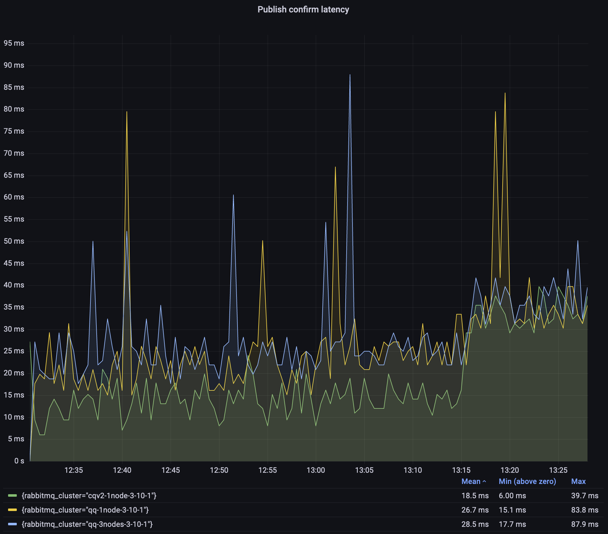
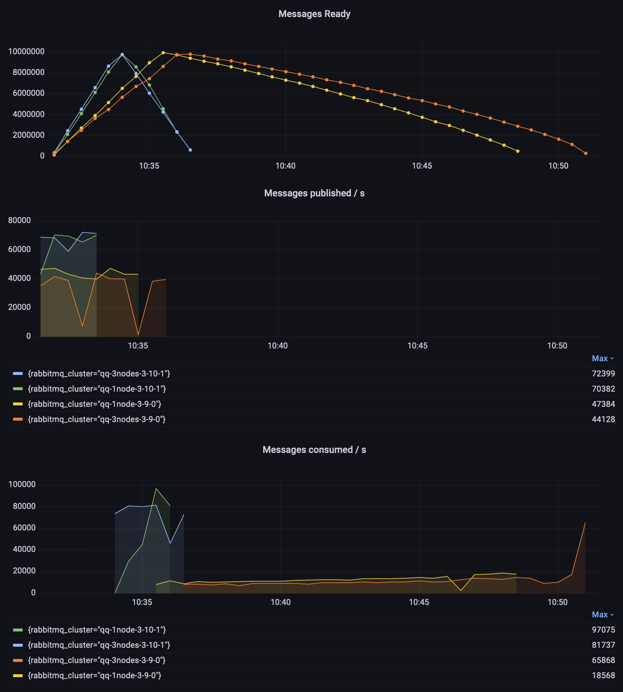
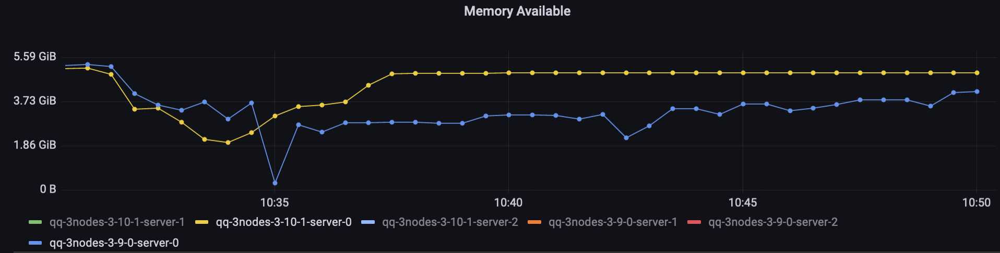

RabbitMQ 3.10 was released on the 3rd of May 2022, with [many new features and improvements](/blog/2022/05/05/rabbitmq-3.10-release-overview).
This blog post gives an overview of the performance improvements
in that release. Long story short, you can expect higher throughput, lower latency and faster node startups,
especially with large definitions files imported on startup.

<!-- truncate -->

## Overview

First, have a look at [3.10 release overview blog post](/blog/2022/05/05/rabbitmq-3.10-release-overview) for a high-level overview of what's new in that release.
Here, we'll only focus on the performance improvements and features that have performance implications.
Some of the improvements covered here have been backported to 3.9.x,
so to demonstrate the difference, we will use 3.9.0 as a point of reference.

If you can't upgrade to 3.10 just yet, make sure you are at least running a latest 3.9.x patch release
to take advantage of these optimizations.

## RabbitMQ 3.9 vs 3.10

Let's compare RabbitMQ 3.9 and 3.10 in a few different scenarios. Please keep in mind that these are specific benchmarks
that may or may not reflect the nature and performance of your workload.

You can run these or similar tests on your own using RabbitMQ load testing tools, [perf-test](https://github.com/rabbitmq/rabbitmq-perf-test)
and [stream-perf-test](https://github.com/rabbitmq/rabbitmq-stream-java-client).

### The Environment

These tests were executed using:

* A GKE cluster with e2-standard-16 nodes
* RabbitMQ clusters deployed using [our Kubernetes Operator](/kubernetes/operator/operator-overview) with the following resources and configuration

```yaml
apiVersion: rabbitmq.com/v1beta1
kind: RabbitmqCluster
metadata:
  name: ...
spec:
  replicas: 1 # or 3
  image: rabbitmq:3.10.1-management # or rabbitmq:3.9.0-management
  resources:
    requests:
      cpu: 8
      memory: 16Gi
    limits:
      cpu: 8
      memory: 16Gi
  persistence:
    storageClassName: premium-rwo
    storage: "3000Gi"
  rabbitmq:
    advancedConfig: |
      [
      {rabbit, [
          {credit_flow_default_credit,{0,0}}
      ]}
      ].
```

Some notes on the environment:

1. For many tests (or even production workloads), these resource settings are excessive. This, however, is the standard configuration for RabbitMQ load tests on our team.
2. You should be able to reach higher values with better hardware, including in Google Cloud
3. The credit flow was disabled because otherwise a single fast publisher will be throttled (to prevent overload and to give a fair chance to other publishers),
   which is the right thing to do in a production environment but doesn't make sense in a server load test.

### Scenario 1: One Queue, Fast Publishers and Consumers

In the first scenario, we will use just 1 queue, with 2 publishers and 2 consumers.
We will test with message sizes of 10, 100, 1000 and 5000 bytes.

We are using 2 publishers, because a single publisher is unable to fully utilize the queue in some configurations, especially with very small messages.
Note that RabbitMQ 3.11 (currently in `master`) already has some [routing efficiency improvements](https://github.com/rabbitmq/rabbitmq-server/pull/4606),
so perhaps this will not be the case for future releases.

The following [`perf-test` flags](https://rabbitmq.github.io/rabbitmq-perf-test/stable/htmlsingle/) were used in this workload:

```shell
# classic queues (with an exactly=3 mirroring policy where applicable)
perf-test --producers 2 --consumers 2 --confirm 3000 --multi-ack-every 3000 --qos 3000 \
          --variable-size 10:900 --variable-size 100:900 --variable-size 1000:900 --variable-size 5000:900 \
          --auto-delete false --flag persistent --queue cq

# quorum queues
perf-test --producers 2 --consumers 2 --confirm 3000 --multi-ack-every 3000 --qos 3000 \
          --variable-size 10:900 --variable-size 100:900 --variable-size 1000:900 --variable-size 5000:900 \
          --quorum-queue --queue qq
```



Observations:

* quorum queues throughput is several times higher than that of classic mirrored queues (CMQs)
* quorum queues in 3.10 can achieve even 50% higher throughput in some scenarios
* classic queues v2 are already a bit better than v1 in some scenarios
* CMQs do not get any new improvements and will be removed in RabbitMQ 4.0; please migrate to quorum queues, [streams](/docs/stream)
  or non-mirrored classic queues where appropriate

### Scenario 2: One Queue, 10000 msg/s

In the previous scenario, some code paths in RabbitMQ were running at or close to its maximum speed at all times.
This time, we'll set a fixed target throughput of 10000 msg/s
and compare whether different environments can sustain this workload, as the message size increases over time.

Since the expected throughput is known, we will focus on measuring latency and its variability.

The following perf-test flags were used in this scenario:

```shell
# classic queues (with an exactly=3 mirroring policy where applicable)
perf-test --rate 10000 --confirm 3000 --multi-ack-every 3000 --qos 3000 \
          --variable-size 10:900 --variable-size 100:900 --variable-size 1000:900 --variable-size 5000:900 \
          --auto-delete false --flag persistent --queue cq

# quorum queues
perf-test --rate 10000 --confirm 3000 --multi-ack-every 3000 --qos 3000 \
          --variable-size 10:900 --variable-size 100:900 --variable-size 1000:900 --variable-size 5000:900 \
          --quorum-queue --queue qq
```

Once again, quorum queues confidently beat classic mirrored queues (CMQs):



Let's zoom in on non-mirrored classic queues to compare the v1 and v2 message store and queue index implementations.
We can see that CQv2 offer lower and more consistent latency:


Single-node quorum queues 3.9 and 3.10 performed very similarly in this test (see the legend on the first graph).
Let's focus on the 3-node clusters:


As you can see, quorum queues in version 3.10 offer a significantly lower and more consistent latency. There are still spikes, due to the batching or periodic
nature of some quorum queues operations. This is an area of improvement for future releases.

### Scenario 3: 500 Queues, 5000 msg/s Total

In this scenario, we will have 500 queues, each queue with 1 publisher publishing 10 messages per second and a consumer that consumes these messages. The total expected
throughput is therefore 5000 messages per second. Once again, we ran this scenario for one hour, changing message size every 15 minutes (10, 100, 1000 and 5000 bytes).

```shell
# classic queues (with an exactly=3 mirroring policy where applicable)
perf-test --producers 500 --consumers 500 --publishing-interval 0.1 --confirm 10 --multi-ack-every 100 --qos 100 \
          --variable-size 10:900 --variable-size 100:900 --variable-size 1000:900 --variable-size 5000:900 \
          --queue-pattern cq-%d --queue-pattern-from 1 --queue-pattern-to 500 \
          --auto-delete false --flag persistent

# quorum queues
perf-test --producers 500 --consumers 500 --publishing-interval 0.1 --confirm 10 --multi-ack-every 100 --qos 100 \
          --variable-size 10:900 --variable-size 100:900 --variable-size 1000:900 --variable-size 5000:900 \
          --quorum-queue --queue-pattern qq-%d --queue-pattern-from 1 --queue-pattern-to 500
```



Observations:

1. Only CMQs struggled to sustain the expected 5000 msg/s throughput
2. Classic queues v2 had the lowest and most consistent latency throughout the test 
3. A 3.9.0 CMQ environment had a crazy high publishing latency; I did not investigate why, simply use quorum queues or streams!

Since classic queues, especially the mirrored 3.9.0 environment, dominated the graph so much,
here is the same graph but focused on classic queues v2 and 3.10 quorum queues:



As explained above, quorum queues latency is not as consistent as we would like it to be, but most of the time they stay within 25ms.
That's still with 500 queues, at 5000 msg/s total with 10/100/1000 byte messages, and not much higher with 5000-byte messages.

In the case of a 3-node quorum queue, this was a degenerate (edge case) cluster with all queue leaders
and all connections on a single node. This was done intentionally to make test results more comparable between runs and between single-node and 3-node clusters.

### Scenario 4: Long Quorum Queues

Prior to 3.10, quorum queues did not perform very well when they were long -- retrieving the oldest messages for the consumers was a costly operation.
In this scenario we'll first publish 10 million messages using 2 publishers and then will consume all of them using two consumers.

```shell
# publish 10 milion messages
perf-test --producers 2 --consumers 0 --confirm 3000 --pmessages 5000000 \
          --queue-args x-max-in-memory-length=0 --quorum-queue --queue qq

# consume 10 milion messages
perf-test --producers 0 --consumers 2 --multi-ack-every 3000 --qos 3000 --exit-when empty \
          --queue-args x-max-in-memory-length=0 --quorum-queue --queue qq
```

Note that starting with 3.10, quorum queues ignore the  `x-max-in-memory-length` property.
It can still be configured via a policy but will have no effect -- the queues will behave as if it was set to `0`.



Observations:

1. In 3.10.1, it took roughly the same time to publish and consume the messages (about 3 minutes each)
2. 3.9.0 needed twice as much time to publish the messages (about 6 minutes)
3. A singe node 3.9.1 needed almost 15 minutes to empty the queue and a 3-node cluster needed additional 2 minutes
4. Both 3.9 instances started consumption at about 10000 msg/s and slowly improved over time. The consumption rate for the 3-node 3.9.0 cluster
   increased significantly at the end, when the queue was short

Worth noting are the two dips in the 3.9 publisher's graph (the orange line). The cluster hit a memory alarm, so the publishers were temporarily blocked.
This didn't happen to the 3.10 environment, despite 3.10 performing more work at that time (publishing and consuming faster).

Quorum queues in 3.10 test used more memory on average than classic queues
because they keep metadata about messages in memory, but they use less memory than they used to in 3.9.

Here's a direct comparison between the two nodes that did most of the work (hosted all queue leaders and all connections):




## Faster Import and Declarations

For those who [import definitions on startup](/docs/definitions), nodes should take less time to start after upgrading to 3.10.
There are multiple changes and features that lead to that and the expected behaviour depends on your definitions, and which features you use and will use/configure. Here's a summary:

1. If you use `load_definitions` configuration option, and have many definitions in the JSON file, nodes should be able to start faster without you doing anything.
This can save minutes on every node start for users with many thousands of queues. The main difference here is that in 3.10, re-declaring an already existing entity should
be much quicker. Nodes in the cluster usually share the same configuration file, so each would attempt the same import but all but the first node would effectively re-import
existing entities. On node restarts, assuming you do not delete those entities, all nodes can boot faster.

2. If you [set a new property, `definitions.skip_if_unchanged = true`](/docs/definitions#import-on-boot-skip-if-unchanged),
RabbitMQ will skip the import altogether if the checksum of the definitions file is the same as it was when previously imported. This can save minutes
per node for clusters with large definition files. This is similar to the previous point, except you need to opt-in (set the property) and the
speed-up is even higher because not attempting the import is obviously even faster than checking if the entities already exist.

## Other Improvements

### Erlang 25

This release supports [Erlang 25](https://www.erlang.org/blog/my-otp-25-highlights/), which introduces a number of compiler and runtime efficiency
improvements. This would be most visible on 64-bit ARM CPUs because the JIT in Erlang 25 now supports that architecture.

### Definition Import on Boot

In clusters where nodes [import definitions on boot](/docs/definitions#import-on-boot),
every node in a cluster will import the same definitions in practice because all nodes use identical or almost identical configuration files.

This usually leads to one of two problems, based on the exact timing of events:

  * if nodes start one by one, all queues will generally end up on a single node, since there is only one node in the cluster at the time of import
  * if nodes start in parallel, there is a lot of contention with multiple nodes trying to declare the same definitions

In RabbitMQ 3.10, a number of re-import optimizations generally helps with the second problem.

In addition, `cluster_formation.target_cluster_size_hint` is a new setting that can now be set to tell RabbitMQ how many nodes are expected
to be in the cluster once it is fully formed.

With this additional information, only the last node to join the cluster will import the definitions.
The main benefit is that quorum queues should be well balanced between the nodes (subject to leader placement settings).
In the past, if the import took place as soon as the first node started,
the other nodes would effectively start empty, since all the queues were already running when they started.

## Conclusion

Many improvements have been shipped in RabbitMQ 3.10 and some of them were also backported to the recent patch released of 3.9.

We are always on the lookout to make things faster. However, RabbitMQ can be configured
and used in many different ways and many improvements are specific to the workload.
We would really appreciate your help -- if you wish RabbitMQ was faster in a certain scenario, please reach out and tell us about your workload.
Ideally, if you can reproduce the problem with [perf-test](https://github.com/rabbitmq/rabbitmq-perf-test),
we would be happy to see what we can do to increase the throughput, lower the latency or reduce the memory usage.
