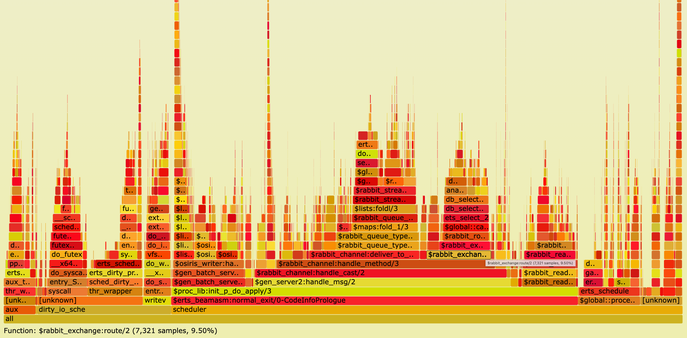
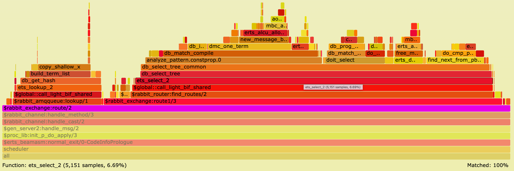
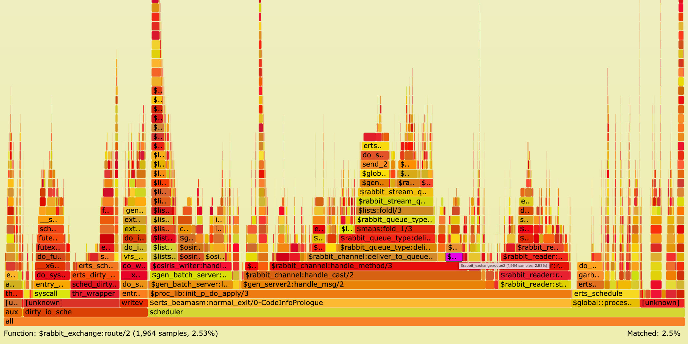
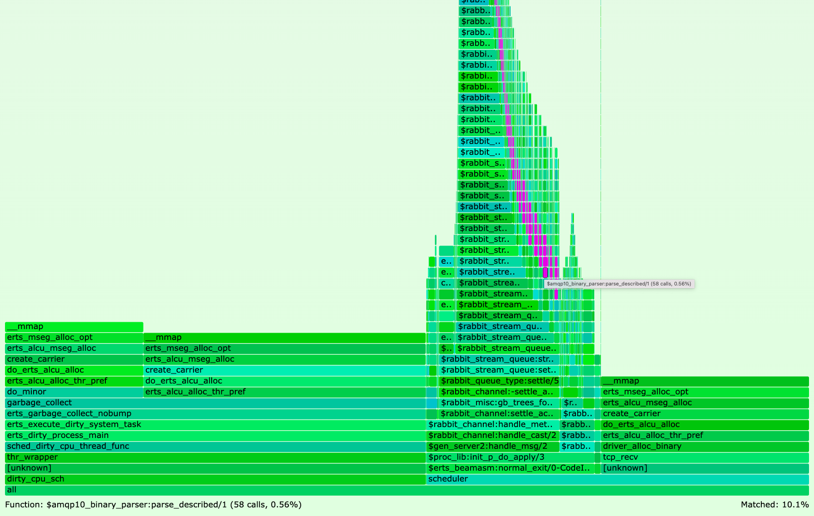
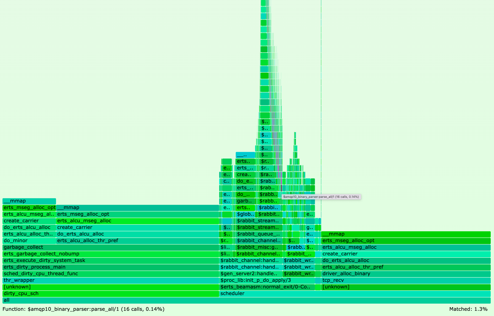

Recent Erlang/OTP versions ship with [Linux perf](https://perf.wiki.kernel.org/index.php/Main_Page) support.
This blog post provides step by step instructions on how you can create CPU and memory [flame graphs](https://www.brendangregg.com/flamegraphs.html) in RabbitMQ to quickly and accurately detect performance bottlenecks.
We also provide examples of how flame graphs have helped us to increase message throughput in RabbitMQ.

<!-- truncate -->

## Overview

Prior to Erlang/OTP 24, many tools including
[fprof](https://www.erlang.org/doc/man/fprof.html),
[eprof](https://www.erlang.org/doc/man/eprof.html), and
[cprof](https://www.erlang.org/doc/man/cprof.html)
have been available to [profile Erlang code](https://www.erlang.org/doc/efficiency_guide/profiling.html).
However, none of these tools can generate call graphs with minimal overhead.

Erlang/OTP 24 introduces the [just-in-time (JIT) compiler](https://www.erlang.org/blog/my-otp-24-highlights/#beamasm---the-jit-compiler-for-erlang).
Instead of interpreting code, the JIT compiler produces machine code.
That machine code can be instrumented by native tooling.
Specifically, Erlang/OTP 24 ships with Linux perf support.
Perf can profile machine code and generate call graphs with low overhead since profiling takes place within the Linux kernel.

This is a big feature in Erlang/OTP 24 because it allows any Erlang program to efficiently and precisely detect bottlenecks in its source code.

Once a program was profiled and its call graphs generated, these stack traces can then be visualized and analysed by a variety of tools.
The most popular tool is flame graphs.
Flame graphs were invented by [Brendan Gregg](https://www.brendangregg.com) in 2011.

While it was possible to create flame graphs for profiled Erlang code many years ago, what is new is that these flame graphs can now be
created with accurate call stack reporting without a noticeable slowdown of the Erlang program.

In this blog post, we demonstrate how to create CPU and memory flame graphs, explain how to interpret them, and show how they have helped us improving RabbitMQ performance.

## CPU Flame Graphs

In order to profile RabbitMQ with Linux perf, we need to run RabbitMQ on a Linux operating system.
(The commands in this blog post were run on Ubuntu 22.04 LTS.)

A physical Linux box is best because more hardware counters will be present.
However, a Linux virtual machine (VM) is good enough to start with.
Keep in mind that a VM can come with some limitations.
For example, the [fsync](https://man7.org/linux/man-pages/man2/fdatasync.2.html) system call which is heavily used
in RabbitMQ might be a no-op in certain virtualised environments.

Execute the following steps to create our first flame graph:

1. Install Erlang/OTP 25.0 (which includes [supports frame pointers in JIT](https://github.com/erlang/otp/pull/4676)).
Here, we use [kerl](https://github.com/kerl/kerl):
```bash
kerl build 25.0 25.0
kerl install 25.0 ~/kerl/25.0
source ~/kerl/25.0
```

2. Install Elixir. Here, we use [kiex](https://github.com/taylor/kiex):
```bash
kiex install 1.12.3
kiex use 1.12.3
```

3. Clone RabbitMQ server:
```bash
git clone git@github.com:rabbitmq/rabbitmq-server.git
cd rabbitmq-server
git checkout v3.10.1
make fetch-deps
git -C $(pwd)/deps/seshat checkout 68f2b9d4ae7ea730cef613fd5dc4456e462da492
```

4. Since we are going to stress test RabbitMQ and we do not want RabbitMQ to artificially slow down our performance tests
by protecting itself against overload, we increase the memory threshold to not hit [memory alarms](/docs/memory),
and increase credit [flow control](/docs/flow-control) settings by a factor of 4 compared to their default settings.
You can also try out setting `credit_flow_default_credit` to `{0, 0}` which disables credit based flow control altogether.
Create the following [advanced.config](/docs/configure#advanced-config-file) file:
```
[
 {rabbit,[
  {vm_memory_high_watermark, {absolute, 15_000_000_000}},
  {credit_flow_default_credit, {1600, 800}}
 ]}
].
```

5. Start RabbitMQ server. We do not enable any RabbitMQ plugins (since plugins can have a negative impact on performance, especially
some plugins that query statistics in scenarios with many thousand objects such as queues, exchanges, channels, etc).
We set Erlang emulator flags `+JPperf true` to enable support for Linux perf and
`+S 4` to create 4 scheduler threads.
```bash
make run-broker PLUGINS="" RABBITMQ_SERVER_ADDITIONAL_ERL_ARGS="+JPperf true +S 4" \
                RABBITMQ_CONFIG_FILE="advanced.config" TEST_TMPDIR="test-rabbit"
```

6. In a 2nd shell window, start [RabbitMQ PerfTest](https://rabbitmq.github.io/rabbitmq-perf-test/stable/htmlsingle/).
In our example PerfTest creates one producer publishing with at most 2,000 unconfirmed messages in flight to a stream called `my-stream` for 60 seconds.

```bash
# Install PerfTest
wget -O perf-test https://github.com/rabbitmq/rabbitmq-perf-test/releases/download/v2.17.0/perf-test_linux_x86_64
chmod +x perf-test
# Start PerfTest client generating load against RabbitMQ server
./perf-test --queue my-stream --queue-args x-queue-type=stream --auto-delete false --flag persistent \
            --producers 1 --confirm 2000 --consumers 0 --time 60
```

7. While PerfTest is running, in a 3rd shell window, record a profile which samples CPU stack traces of the RabbitMQ server process (`--pid`)
at 999 hertz (`--freq`) recording call-graph for both kernel space and user space (`-g`) for 30 seconds.
```bash
# Install perf, e.g. on Ubuntu:
# sudo apt-get install linux-tools-common linux-tools-generic linux-tools-`uname -r`
sudo perf record --pid $(cat "test-rabbit/rabbit@$(hostname --short)/rabbit@$(hostname --short).pid") --freq 999 -g -- sleep 30
```

8. Once the 60 seconds PerfTest run finishes in the 2nd shell window, check the results.
On this machine, we get a sending rate average of ~103,000 messages per second.
This result can be slower or faster on your machine.

```bash
test stopped (Reached time limit)
id: test-114336-500, sending rate avg: 103132 msg/s
id: test-114336-500, receiving rate avg: 0 msg/s
```

9. The previous perf command outputs a file `perf.data`.
Create a CPU flame graph from this data as described in the Erlang [documentation](https://www.erlang.org/doc/apps/erts/beamasm#flame-graph):
```bash
git clone git@github.com:brendangregg/FlameGraph.git
# Convert perf.data (created by perf record) to trace output
sudo perf script > out.perf
# Collapse multiline stacks into single lines
./FlameGraph/stackcollapse-perf.pl out.perf > out.folded
# Merge scheduler profile data
sed -e 's/^[0-9]\+_//' -e 's/^erts_\([^_]\+\)_[0-9]\+/erts_\1/' out.folded > out.folded_sched
# Create the SVG file
./FlameGraph/flamegraph.pl --title="CPU Flame Graph" out.folded_sched > cpu.svg
```
Opening the resulting `cpu.svg` file in your browser should show you a CPU flame graph similar to the following:



If you did not run above steps, click [here](flame-graph-cpu-3-10-1.svg) to open Figure 1 as SVG file in your browser.

A CPU flame graph is interpreted as follow:
* Each box is a stack frame.
* The SVG is interactive. Try to click on a stack frame to zoom into a particular call graph.
On the top left of the SVG click on `Reset Zoom` to go back.
* Colours (yellow, orange, red) have no meaning.
* The height represents how deep the call stacks are. High "towers" can represent recursive function calls.
Most of the time it is perfectly okay to have a certain level of recursion.
In above SVG click on a stack frame in the highest tower (on the left half of the graph) and you will see that
a function called `lists:foldr_1/3` causes this recursion.
* The horizontal order of stack frames on the same level is alphabetically ordered.
Hence, the horizontal order does not represent time.
* The most important characteristic to watch out for is the width of the boxes.
The width determines how often a function was on CPU.
In particular, look for wide stack frames at the top of the graph because they consume
directly a lot of CPU cycles!
* All Erlang functions are prefixed by the dollar sign (`$`).
* At the top right of the flame graph, you can click on the grey `Search` icon.
If you enter the regular expression `^\$` into the search box (meaning "match everything starting with the dollar sign"), all Erlang functions will be highlighted in purple.

Unsurprisingly, the hardest part is to optimize performance based on the insights a flame graph provides.
In general, two strategies have proven to be successful:
1. Run a workload which you know is problematic for RabbitMQ.
For example, if RabbitMQ runs slow, or eats a lot of memory for a particular client workload, run that client workload (e.g. with PerfTest),
record RabbitMQ server's profile with Linux perf, and create a flame graph. Chances are high that the flame graph will present the bottleneck. 
2. Try to optimize performance exploratively. This is what we are going to do in this blog post.

We started PerfTest where one publisher sends messages to a stream without being aware of any performance issues.
Clicking on some stack frames and examining what functions consume CPU time, it is astonishing that function `rabbit_exchange:route/2` spends 9.5% on the CPU.
Search for that function in above SVG to highlight it purple, then click on the purple box to zoom in (or click [here](flame-graph-cpu-3-10-1.svg?s=rabbit_exchange%3Aroute%2F2&x=744.8&y=1397)).
It will show you the following image:




Execute the following command in a shell to list RabbitMQ bindings:
```bash
./sbin/rabbitmqctl list_bindings --formatter=pretty_table

Listing bindings for vhost /...
┌─────────────┬─────────────┬──────────────────┬──────────────────┬──────────────────────────────────────┬───────────┐
│ source_name │ source_kind │ destination_name │ destination_kind │ routing_key                          │ arguments │
├─────────────┼─────────────┼──────────────────┼──────────────────┼──────────────────────────────────────┼───────────┤
│             │ exchange    │ my-stream        │ queue            │ my-stream                            │           │
├─────────────┼─────────────┼──────────────────┼──────────────────┼──────────────────────────────────────┼───────────┤
│ direct      │ exchange    │ my-stream        │ queue            │ f809d879-b5ad-4159-819b-b39d6b50656a │           │
└─────────────┴─────────────┴──────────────────┴──────────────────┴──────────────────────────────────────┴───────────┘
```
PerfTest client created a stream (queue) `my-stream`.
The first binding shows that every queue is automatically bound to the default exchange (the exchange with the empty string `""`).
PerfTest also created a direct exchange called `direct` and bound the stream to this exchange with some random routing key.

Although there are merely 2 bindings (routes), RabbitMQ spends a lot of CPU time (9.5%) in function `rabbit_exchange:route/2` - a function routing messages -
and it spends 6.69% of CPU time in function [ets:select/2](https://www.erlang.org/doc/man/ets.html#select-2).

We also see in the function stack trace a wide box `db_match_compile` meaning the same [match specification](https://www.erlang.org/doc/apps/erts/match_spec.html)
gets compiled for every message being routed.

Pull Request (PR) [#4606](https://github.com/rabbitmq/rabbitmq-server/pull/4606) follows
the [Tables and Databases efficiency guide](https://www.erlang.org/doc/efficiency_guide/tablesdatabases):
> An Ets table is a single-key table (either a hash table or a tree ordered by the key) and is to be used as one. In other words, use the key to look up things whenever possible. 

This PR adds an Mnesia index table whose table key is the Erlang tuple `{SourceExchange, RoutingKey}` so that routing destinations will be looked up by that key.

In our example, this means instead of calling `ets:select/2` which uses an expensive match specification, the routing destination `my-stream` is looked up
using [ets:loookup_element/3](https://www.erlang.org/doc/man/ets.html#lookup_element-3) by providing the table key `{direct, f809d879-b5ad-4159-819b-b39d6b50656a}`.

Stop RabbitMQ server with `Ctrl+g q` and delete its data directory:
```bash
rm -rf test-rabbit
```

Let us check out a commit from the `master` branch (in May 2022 at the time of writing) which includes PR #4606:

```bash
git checkout c22e1cb20e656d211e025c417d1fc75a9067b717
```

Re-run the same scenario by repeating steps 5 - 9 above.

Open the new CPU flame graph and search for stack frame `rabbit_exchange:route/2` (or click [here](flame-graph-cpu-c22e1cb.svg?s=rabbit_exchange%3Aroute%2F2)):



With the new optimisation CPU usage for that function dropped from 9.5% down to only 2.5%.

As a result of this optimisation PerfTest outputs a sending rate average of ~129,000 messages per second.
Compared to ~103,000 messages before this change this is a sending throughput improvement of 26,000 messages per second or 25% for a single publisher.
This speed-up applies to publishers sending via AMQP 0.9.1, AMQP 1.0, STOMP, and MQTT via a direct exchange.

As described in the PR, the end-to-end (from client to RabbitMQ server) sending throughput improvement is lower (20,000 messages per second or 15%) when sending to a classic or quorum queue (since they store messages slower than a stream)
and the throughput improvement is higher (90,000 messages per second or 35%) when there are many bindings because after this change routing table lookup happens via a table key in constant time.

To sum up, in this section we created a CPU flame graph for a usual RabbitMQ workload.
A CPU flame graph shows precisely what functions require CPU usage: the wider the boxes the more CPU time is required.
Just by exploring the stack frames we were able to detect routing to be a bottleneck.
Being aware of this bottleneck we could subsequently speed up routing via the direct exchange type and therefore sending throughput by 15% - 35%.

Further examples of reducing CPU usage in RabbitMQ by analysing CPU flame graphs can be found in PRs
[#4787](https://github.com/rabbitmq/rabbitmq-server/pull/4787),
[#3934](https://github.com/rabbitmq/rabbitmq-server/pull/3934), and
[rabbitmq/ra #272](https://github.com/rabbitmq/ra/pull/272).

## Memory Flame Graphs

Flame graphs visualize hierarchical data.
In the previous section this data represented code paths consuming CPU time.
This section is about data representing code paths causing memory usage.

Brendan Gregg suggests different tracing approaches to analyze memory usage:
1. Allocators such as the [malloc()](https://man7.org/linux/man-pages/man3/malloc.3.html) library function.
The glibc's `malloc()` implementation requests memory using system calls [brk()](https://man7.org/linux/man-pages/man2/brk.2.html) and [mmap()](https://man7.org/linux/man-pages/man2/mmap.2.html).
2. `brk()` system call typically indicating memory growth.
3. `mmap()` system call used by glibc for larger allocations. `mmap()` creates a new mapping in the virtual address space.
Unless subsequently freed using `munmap()`, a `mmap()` flame graph may detect functions that grow or leak memory.
4. Page faults indicating physical memory usage.

Not all Erlang memory allocations can be traced by one of these approaches.
For example, memory that is already preallocated by the Erlang VM (at boot time) cannot be traced.
Also, to reduce the number of system calls, some memory segments allocated via `mmap()` are [cached](https://www.erlang.org/doc/man/erts_alloc.html#allocators) before being destroyed.
Newly allocated segments are served from that cache and can therefore not be traced with Linux perf.

In this section we create a `mmap()` flame graph (approach 3).

Stop RabbitMQ server, delete its data directory, checkout tag `v3.10.1`, and start RabbitMQ server as done
in step 5 in the previous section.

In the 2nd shell window, start PerfTest with 1 publisher sending messages to a stream for 4 minutes:
```bash
./perf-test --queue my-stream --queue-args x-queue-type=stream --auto-delete false --flag persistent \
            --producers 1 --consumers 0 --time 240
```

After the 4 minutes we see that PerfTest client published more than 32 million messages.

```bash
./sbin/rabbitmqctl list_queues name type messages --formatter=pretty_table

Timeout: 60.0 seconds ...
Listing queues for vhost / ...
┌───────────┬────────┬──────────┐
│ name      │ type   │ messages │
├───────────┼────────┼──────────┤
│ my-stream │ stream │ 32748214 │
└───────────┴────────┴──────────┘
```

Start 4 consumers each consuming these messages for 90 seconds.

```bash
./perf-test --queue my-stream --queue-args x-queue-type=stream --auto-delete false --flag persistent \
            --producers 0 --consumers 4 --qos 10000 --multi-ack-every 1000 -consumer-args x-stream-offset=first --time 90
```

While PerfTest is running, in the 3rd shell window, record a profile which traces `mmap()` system calls:
```bash
sudo perf record --pid $(cat "test-rabbit/rabbit@$(hostname --short)/rabbit@$(hostname --short).pid") \
                 --event syscalls:sys_enter_mmap -g -- sleep 60
```

After 90 seconds PerfTest outputs a receiving rate average of ~287,000 messages per second.

```bash
test stopped (Reached time limit)
id: test-102129-000, sending rate avg: 0 msg/s
id: test-102129-000, receiving rate avg: 287086 msg/s
```

The previous Linux perf command writes file `perf.data`.
Create a `mmap()` flame graph:
```bash
sudo perf script > out.perf
# Collapse multiline stacks into single lines
./FlameGraph/stackcollapse-perf.pl out.perf > out.folded
# Merge scheduler profile data
sed -e 's/^[0-9]\+_//' out.folded > out.folded_sched
# Create the SVG file
./FlameGraph/flamegraph.pl --title="mmap() Flame Graph" --color=mem --countname="calls" out.folded_sched > mmap.svg
```
Opening the resulting `mmap.svg` file in your browser and searching for `amqp10_binary_parser` should show you a `mmap()` flame graph similar to the following:



If you did not run above steps, click [here](flame-graph-mmap-3-10-1.svg?s=amqp10_binary_parser) to open Figure 4 as SVG file in your browser.

As in CPU flame graphs, except for the purple color highlighting search matches, colors (green, blue) have no meaning in memory flame graphs.

The flame graph reveals that 10.1% of all `mmap()` system calls happen in module `amqp10_binary_parser`.
PR [#4811](https://github.com/rabbitmq/rabbitmq-server/pull/4811) optimises the code in that module by following the
[Matching Binaries efficiency guide](https://www.erlang.org/doc/efficiency_guide/binaryhandling.html), that is by reusing match contexts instead of creating new sub-binaries.

Stop RabbitMQ server. Without deleting its data directory, checkout tag `v3.10.2` which includes PR #4811.
Repeat the previous steps by starting RabbitMQ server and consuming from the stream with 4 consumers while recording `mmap()` system calls with Linux perf.

When PerfTest finishes after 90 seconds, this time it outputs a receiving rate average of ~407,000 messages per second.
Compared to the 287,000 messages in v3.10.1 this is a receiving throughput improvement of ~120,000 messages per second or ~42%.

Create again a `mmap()` flame graph as done before and search for `amqp10_binary_parser`.



If you did not run above steps, click [here](flame-graph-mmap-3-10-2.svg?s=amqp10_binary_parser) to open Figure 5 as SVG file in your browser.

The binary matching optimisations decreased `mmap()` system calls of module `amqp10_binary_parser` from 10.1% in v3.10.1 to 1.3% in v3.10.2.

To sum up, in this section we created a `mmap()` memory flame graph for a usual RabbitMQ workload.
A `mmap()` flame graph shows precisely what functions cause `mmap()` system calls: the wider the boxes the more `mmap()` system calls they trigger.
Just by exploring the stack frames, we were able to detect AMQP 1.0 binary parsing to be a bottleneck.
Being aware of this bottleneck we could subsequently speed up AMQP 1.0 binary parsing and therefore receiving throughput from a stream via AMQP 0.9.1 by ~42%.

Another example of reducing `mmap()` system calls in RabbitMQ by exploring `mmap()` flame graphs can be found in PR [#4801](https://github.com/rabbitmq/rabbitmq-server/pull/4801).

Creating a page fault flame graph (approach 4) works the same way as creating a `mmap()` flame graph (approach 3).
The only difference is to replace Linux perf flag `--event syscalls:sys_enter_mmap` with `--event page-faults`.
An example of how a page fault flame graph helped improve RabbitMQ performance can be found in PR [#4110](https://github.com/rabbitmq/rabbitmq-server/pull/4110) where less physical
memory is consumed by a new queue implementation maintaining its own queue length.

## Wrapping Up
Since Erlang/OTP 25 we can efficiently and precisely detect stack traces in RabbitMQ that consume a lot of CPU or memory by using Linux perf and creating flame graphs.
Once the bottlenecks are identified, we can optimise code paths and therefore improve RabbitMQ performance.

Different client workload will cause different CPU and memory usage patterns of RabbitMQ server.
Whether you experience RabbitMQ to run slow, suspect RabbitMQ to leak memory, or just want to speed up RabbitMQ, we encourage you to create flame graphs
to pin down performance bottlenecks.

As opposed to one-off profiling a single RabbitMQ node as done in this blog post, we are also experimenting with continuous profiling across multiple nodes in a RabbitMQ cluster.
In the future, a potential way to continuously profile RabbitMQ in production is deploying RabbitMQ on Kubernetes using the [rabbitmq/cluster-operator](https://github.com/rabbitmq/cluster-operator)
while profiling with [Parca Agent](https://github.com/parca-dev/parca-agent).
