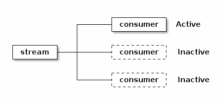
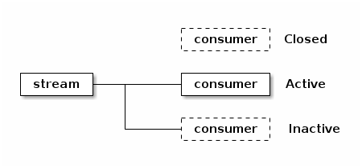
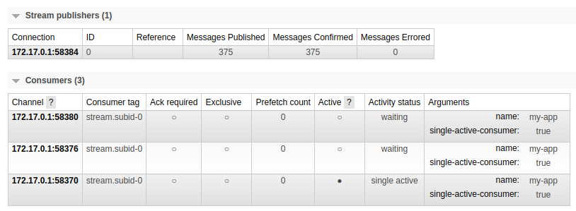
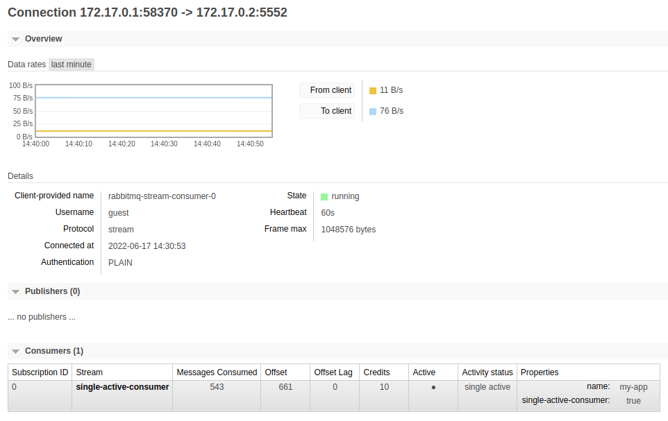

RabbitMQ 3.11 will bring a noteworthy feature to streams: single active consumer.
Single active consumer provides _exclusive consumption_ and _consumption continuity_ on a stream.
It is also critical to get the most out of [super streams](/blog/2022/07/13/rabbitmq-3-11-feature-preview-super-streams), our solution for partitioning, that provide scalability for streams.

Read on to find out more about single active consumer for streams and don't hesitate to experiment with what is already available: [try it](/blog/2022/07/05/rabbitmq-3-11-feature-preview-single-active-consumer-for-streams#setting-up-the-sample-project), break it, [tell us](/contact) what you like and don't like, what's missing.
Your feedback is essential to make this feature the best it can be.

<!-- truncate -->

## Overview

So, _exclusive consumption_, _consumption continuity_, what does this mean?
Imagine you want to make sure your stream processing does not stop, even though the application instances handling this processing come and go.
You spin up several instances of the same processing application, with the single active consumer flag enabled on your stream consumer.
The broker will make sure only one instance gets messages at a time: the _active_ one.



The broker will automatically fall back to the instance next in line and starts dispatching messages to it when the active consumer goes away (closes or crashes).



So with single active consumer on, you don't have to worry about having multiple instances doing the same processing in parallel, the broker takes care of everything.

Note there can be as many single active consumer groups as you want on a given stream: applications must provide a name for a consumer and this name acts as the identifier for the group of consumers.
The single active consumer semantics will apply to the consumer instances sharing the same name.

Let's go through a demo to see how single active consumer for streams works.

## Single Active Consumer for Stream in Action

We are going to start 3 consumers simulating the instances of the same application.
We'll see that only one consumer instance gets activated and receives messages, the 2 other instances will remain idle.
We'll close the connection of the active consumer and see another instance takes over.

We'll start the 3 consumers in the same process for simplicity's sake.
Here is the definition of a consumer with the stream Java client:


```java
System.out.println("Starting consumer instance " + i);
Consumer consumer = environment.consumerBuilder()
    .stream(stream)
    .name(reference)
    .singleActiveConsumer()
    .autoTrackingStrategy()
        .messageCountBeforeStorage(10)
    .builder()
    .messageHandler((context, message) -> {
        System.out.printf(
            "Consumer instance %d received a message (%d).%n",
            i, sequence.incrementAndGet()
        );
    })
    .build();
```

The code to declare a single active consumer is almost the same as for a regular consumer: you must provide a name and use `ConsumerBuilder#singleActiveConsumer()`.
The `i` and `sequence` variables are just there to help understand what's going on.

If you want to run the code as you are reading, you can move on to the next section.
Note you can follow the remaining of the post without running anything, so you can skip the next section if you don’t want to try out the code.

### Setting Up The Sample Project

Running the samples requires Docker, Git, and Java 11 or higher installed.
Remove the Docker image if it's already there locally, to make sure to pull the latest image later:

```shell
docker rmi pivotalrabbitmq/rabbitmq-stream
```

And then start the broker:

```shell
docker run -it --rm --name rabbitmq -p 5552:5552 -p 5672:5672 -p 15672:15672 \
   -e RABBITMQ_SERVER_ADDITIONAL_ERL_ARGS='-rabbitmq_stream advertised_host localhost' \
   pivotalrabbitmq/rabbitmq-stream
```

The container starts listening on several ports: 5552 for the stream plugin, 5672 for AMQP, 15672 for the HTTP management plugin.

The sample project code is [hosted on GitHub](https://github.com/acogoluegnes/rabbitmq-stream-single-active-consumer).
Clone the project locally and start the application that simulates 3 consumer instances:

```shell
cd /tmp
git clone https://github.com/acogoluegnes/rabbitmq-stream-single-active-consumer.git
cd rabbitmq-stream-single-active-consumer
```

The setup is done, let's start our single active consumers.

### Starting The Consumers

Start the consumer instances with the following command:

```shell
./mvnw -q compile exec:java -Dexec.mainClass=com.rabbitmq.stream.SingleActiveConsumer
```

The application confirms it registered 3 consumers:

```
Created stream single-active-consumer
Starting consumer instance 0
Starting consumer instance 1
Starting consumer instance 2
```

These consumers would be running on separate hosts in a real system.
But running them in the same process is simpler for our demonstration and makes our point as well.

We are all set, let's publish to the stream.

### Publishing Messages

We have an application running, it registered 3 identical consumers instances, with single active consumer enabled.
We are using the [stream performance tool](https://rabbitmq.github.io/rabbitmq-stream-java-client/stable/htmlsingle/#the-performance-tool) to publish a message every second:

```shell
cd /tmp
wget -O stream-perf-test.jar \
  https://github.com/rabbitmq/rabbitmq-java-tools-binaries-dev/releases/download/v-stream-perf-test-latest/stream-perf-test-latest.jar
java -jar /tmp/stream-perf-test.jar --rate 1 -x 1 -y 0 --streams single-active-consumer
```

The performance tool starts publishing (it emits a warning about the stream creation, this is expected):

```
Starting producer
1, published 0 msg/s, confirmed 0 msg/s, consumed 0 msg/s, latency min/median/75th/95th/99th 0/0/0/0/0 ms, chunk size 0
2, published 1 msg/s, confirmed 1 msg/s, consumed 0 msg/s, latency min/median/75th/95th/99th 0/0/0/0/0 ms, chunk size 0
3, published 1 msg/s, confirmed 1 msg/s, consumed 0 msg/s, latency min/median/75th/95th/99th 0/0/0/0/0 ms, chunk size 0
4, published 1 msg/s, confirmed 1 msg/s, consumed 0 msg/s, latency min/median/75th/95th/99th 0/0/0/0/0 ms, chunk size 0
5, published 1 msg/s, confirmed 1 msg/s, consumed 0 msg/s, latency min/median/75th/95th/99th 0/0/0/0/0 ms, chunk size 0
...
```

The first consumer instance gets the messages from the stream:

```
Created stream single-active-consumer
Starting consumer 0
Starting consumer 1
Starting consumer 2
Consumer instance 0 received a message (1).
Consumer instance 0 received a message (2).
Consumer instance 0 received a message (3).
Consumer instance 0 received a message (4).
...
```

Without single active consumer enabled, each consumer instance would get the messages in the stream and you would see 3 lines for each message.
So our application is working as expected, only one consumer is active.
Let's see if we can learn more about our consumers...

### Inspecting the Consumers

The `list_stream_consumers` CLI command lists the consumers for all streams in a virtual host:

```shell
docker exec rabbitmq rabbitmqctl list_stream_consumers \
  connection_pid,stream,messages_consumed,active,activity_status
```

We see our consumers with their respective state:

```
Listing stream consumers ...
┌────────────────┬────────────────────────┬───────────────────┬────────┬─────────────────┐
│ connection_pid │ stream                 │ messages_consumed │ active │ activity_status │
├────────────────┼────────────────────────┼───────────────────┼────────┼─────────────────┤
│ <11771.870.0>  │ single-active-consumer │ 259               │ true   │ single_active   │
├────────────────┼────────────────────────┼───────────────────┼────────┼─────────────────┤
│ <11771.882.0>  │ single-active-consumer │ 0                 │ false  │ waiting         │
├────────────────┼────────────────────────┼───────────────────┼────────┼─────────────────┤
│ <11771.894.0>  │ single-active-consumer │ 0                 │ false  │ waiting         │
└────────────────┴────────────────────────┴───────────────────┴────────┴─────────────────┘
```

Let's imagine we have many streams, with many groups of consumers for each of them.
A concise view of this would be welcome.
Let's use the `list_stream_consumer_groups` command:

```shell
docker exec rabbitmq rabbitmqctl list_stream_consumer_groups stream,reference,consumers
```

Our `my-app` group shows up, with the number of consumers registered:

```
Listing stream consumer groups ...
┌────────────────────────┬───────────┬───────────┐
│ stream                 │ reference │ consumers │
├────────────────────────┼───────────┼───────────┤
│ single-active-consumer │ my-app    │ 3         │
└────────────────────────┴───────────┴───────────┘
```

We can drill down into our group with the `list_stream_group_consumers` command:

```shell
docker exec rabbitmq rabbitmqctl list_stream_group_consumers --stream single-active-consumer --reference my-app
```

And the consumers of the group show up:

```
Listing group consumers ...
┌─────────────────┬─────────────────────────────────────┬──────────┐
│ subscription_id │ connection_name                     │ state    │
├─────────────────┼─────────────────────────────────────┼──────────┤
│ 0               │ 172.17.0.1:58370 -> 172.17.0.2:5552 │ active   │
├─────────────────┼─────────────────────────────────────┼──────────┤
│ 0               │ 172.17.0.1:58376 -> 172.17.0.2:5552 │ inactive │
├─────────────────┼─────────────────────────────────────┼──────────┤
│ 0               │ 172.17.0.1:58380 -> 172.17.0.2:5552 │ inactive │
└─────────────────┴─────────────────────────────────────┴──────────┘
```

Nice, we have CLI commands to get some insight about consumers that enabled the single active consumer flag.

### Looking at the Management UI

We have also something more graphical than the CLI with the [page of the stream in the management UI](http://localhost:15672/#/queues/%2F/single-active-consumer) (username/password: `guest`/`guest`):



The consumers `channel` column does not exactly show AMQP channels: our sample uses the stream protocol, where the channel concept does not exist.
The management UI adapts and shows the _connections_ of the consumers.
We can get even more details if we click on the link to the channel/connection of the active consumer:



It's time to experiment with the single active consumer semantics.

### Terminating the Active Consumer

Let's close the connection of the active consumer with the `Force Close` button at the bottom of the connection page.

We see from our consuming application console output that the active consumer is gone and the next consumer took over:

```
...
Consumer instance 0 received a message (130).
Consumer instance 0 received a message (131).
Consumer instance 0 received a message (132).
Consumer instance 1 received a message (133).    <---- Instance #1 got activated
Consumer instance 1 received a message (134).
Consumer instance 1 received a message (135).
...
```

The failover worked as expected: the active consumer died and the next in line got activated.
In the real world, the active consumer instance could have restarted after an OS upgrade or its connection could have been closed after a network glitch.
We just closed the connection on purpose in this example.

Let's list the consumers of the group to confirm our findings:

```shell
docker exec rabbitmq rabbitmqctl list_stream_group_consumers --stream single-active-consumer --reference my-app
```

We still have 3 consumers, because the client library recovered the closed connection automatically:

```
Listing group consumers ...
┌─────────────────┬─────────────────────────────────────┬──────────┐
│ subscription_id │ connection_name                     │ state    │
├─────────────────┼─────────────────────────────────────┼──────────┤
│ 0               │ 172.17.0.1:58376 -> 172.17.0.2:5552 │ active   │
├─────────────────┼─────────────────────────────────────┼──────────┤
│ 0               │ 172.17.0.1:58380 -> 172.17.0.2:5552 │ inactive │
├─────────────────┼─────────────────────────────────────┼──────────┤
│ 0               │ 172.17.0.1:58388 -> 172.17.0.2:5552 │ inactive │
└─────────────────┴─────────────────────────────────────┴──────────┘
```

The consumer from the `172.17.0.1:58376 -> 172.17.0.2:5552` connection is now the active one.
It was the second in line before we closed the first active consumer and it got promoted.
The `172.17.0.1:58388 -> 172.17.0.2:5552` connection is the connection the client library recovered, it sits now at the bottom of the list.

The demonstration is over, you can now close the running programs with `Ctrl-C`: `stream-perf-test`, the consumer, and the broker Docker container. 

## Wrapping Up

We covered _single active consumers for streams_ in this blog post, a new feature in the upcoming RabbitMQ 3.11 release.
It allows attaching several consumer instances to a stream and having only one instance active at a time.
If the active consumer instance goes down, the next instance will automatically take over, this way the processing goes on with as little interruption as possible.

Don't hesitate to [run the demonstration](#setting-up-the-sample-project), the [source code is available](https://github.com/acogoluegnes/rabbitmq-stream-single-active-consumer).
You can also experiment on your own, the support for single active consumer in the stream Java client is [documented](https://rabbitmq.github.io/rabbitmq-stream-java-client/snapshot/htmlsingle/#single-active-consumer) and the continuously-built [Docker image is available](#setting-up-the-sample-project).
We are excited to share this new feature with the RabbitMQ community and we can't wait to hear [some feedback](/contact) before RabbitMQ 3.11 goes GA later this year.

We will follow up shortly with a blog post on another RabbitMQ 3.11 feature: [super streams](/blog/2022/07/13/rabbitmq-3-11-feature-preview-super-streams), our solution to scale out streams.
Stay tuned!
