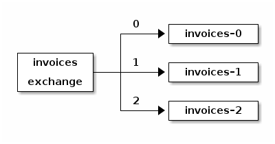
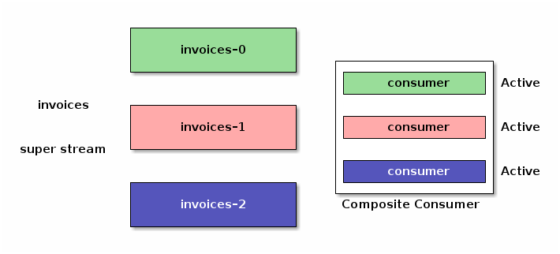
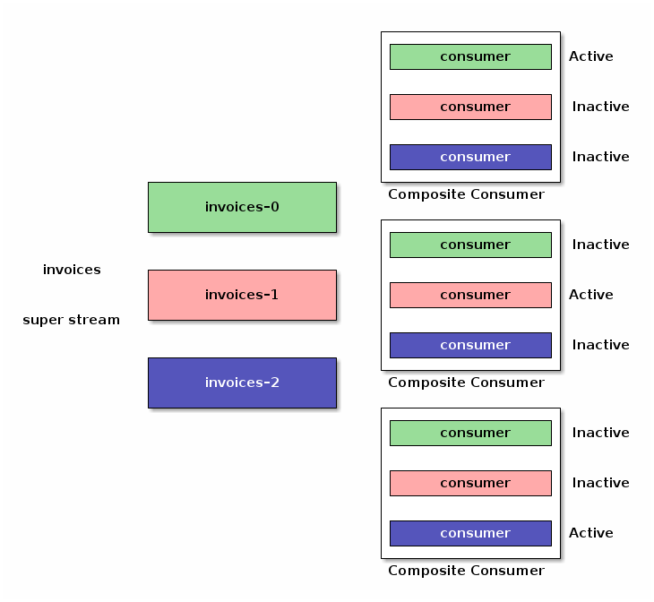

RabbitMQ 3.11 will bring a feature with one of the coolest names in its history: super streams.
Super streams are a way to scale out by partitioning a large stream into smaller streams.
They integrate with [single active consumer](/blog/2022/07/05/rabbitmq-3-11-feature-preview-single-active-consumer-for-streams) to preserve message order within a partition. 

This blog post gives an overview of super streams and the use cases they unlock.
Read on to learn more, we value [your feedback](/contact) to make this feature the best it can be.

<!-- truncate -->

## Overview

A super stream is a logical stream made of individual, regular [streams](/blog/2021/07/13/rabbitmq-streams-overview#what-are-rabbitmq-streams).
It is a way to _scale out publishing and consuming_ with RabbitMQ Streams: a large logical stream is divided into partition streams, splitting up the storage and the traffic on several cluster nodes.

A super stream remains a logical entity: applications see it as one "big" stream, thanks to the smartness of client libraries.
The topology of a super stream is based on the [AMQP 0.9.1 model](/tutorials/amqp-concepts), that is exchange, queues, and bindings between them.

The following figure shows an `invoices` super stream made of 3 partitions.
It is defined by an `invoices` exchange with 3 streams bound to it.



Messages do not go through the exchange, they go directly to the partition streams.
But [client libraries](https://rabbitmq.github.io/rabbitmq-stream-java-client/snapshot/htmlsingle/#super-streams) use the topology information to figure out where to route messages to and where to consume them from.

Let's talk about the elephant in the room: how does it compare to Kafka?
We can compare a super stream to a Kafka topic and a stream to a partition of a Kafka topic.
A RabbitMQ stream is a first-class, individually-named object though, whereas a Kafka partition is a subordinate of a Kafka topic.
This explanation leaves _a lot_ of details out, there is no real 1-to-1 mapping, but it is accurate enough for our point in this post. 

Super streams also leverage [single active consumer](/blog/2022/07/05/rabbitmq-3-11-feature-preview-single-active-consumer-for-streams) to preserve the order of messages within a partition during the consumer processing.
More on this below.

Don't get us wrong, super streams do not deprecate individual streams or make them useless.
They are not streams version 2.0 either, because we made streams wrong in the first place.
Super streams sit on top of streams, they bring their own set of features and capabilities.
You can keep using individual streams where they fit the bill and you can explore super streams for more demanding use cases.

## Publishing To a Super Stream

A message an application publishes to a super stream must go to one of the partitions.
The application gets to choose the partition, with some help from the client library, the broker does not handle the routing.
This is flexible and avoids a bottleneck on the server side.

The application must provide at least one piece of information: a routing key extracted from the message.
The following snippet shows how an application provides this code with the stream Java client library:

```java
Producer producer = environment.producerBuilder()
    .superStream("invoices") // set the super stream name
    .routing(message -> message.getProperties().getMessageIdAsString()) // extract routing key 
    .producerBuilder()
    .build();

producer.send(...);
```

Publishing remains the same as with a [regular stream](/blog/2021/07/19/rabbitmq-streams-first-application#publishing-to-a-stream), the producer configuration is just a bit different.
Publishing to a stream or a super stream does not impact the code of the application much.

Where does the message go? In this case, the library chooses the stream partition by hashing the routing key using [MurmurHash3](https://en.wikipedia.org/wiki/MurmurHash).
This hash function provides good uniformity, performance, and portability, making it a good default choice.
The routing key is an invoice ID in our case, so the invoices should be spread uniformly across the partitions.
If the routing key was the customer ID, we would have the guarantee that all the invoices for a given customer would be on the same partition.
Here is a use case that can take advantage of this: per-customer reporting on a given period of time with the appropriate [timestamp-based offset specification](https://rabbitmq.github.io/rabbitmq-stream-java-client/stable/htmlsingle/#specifying-an-offset).

Speaking about processing, let's see how to consume from a super stream.

## Consuming From a Super Stream

The partitions of a super stream are regular streams, so applications could consume from them as usual.
But this implies knowing about the topology of the super stream, whereas we sold it as a logical entity, something applications see as an individual stream.
Fortunately, the client library can make it so, with some help from the broker, making it all transparent for applications.

A client library can implement a [well-known design pattern](https://en.wikipedia.org/wiki/Composite_pattern) and provide a composite consumer that consumes from all the partitions of a super stream at the same time:



The composite consumer implemented this way has limitations: if you spin up several instances of the same application for redundancy and scalability, they will consume the same messages, duplicating the processing.
All this needs coordination and luckily we can apply the semantics of [single active consumer](/blog/2022/07/05/rabbitmq-3-11-feature-preview-single-active-consumer-for-streams) to our super stream composite consumers.

Now with single active consumer enabled, the instances of our composite consumers coordinate with the broker to make sure there is only one consumer on a given partition at a time.



The good news is that all these are implementation details.
Application instances can come up and down, the consumers will be activated or deactivated according to the single-active-consumer semantics.

How does it translate into code? Here is an example with the stream Java client:

```java
Consumer consumer = environment.consumerBuilder()
    .superStream("invoices") // set the super stream name 
    .name("application-1") // set the consumer name (mandatory) 
    .singleActiveConsumer() // enable single active consumer
    .messageHandler((context, message) -> {
        // message processing
    })
    .build();
```

This stays similar to a [consumer of a regular stream](/blog/2021/07/19/rabbitmq-streams-first-application#consuming-the-messages), only the configuration changes, and more importantly the message handling code remains the same.

## Wrapping Up

We covered _super streams_ in this blog post, a new feature in the upcoming RabbitMQ 3.11 release.
Super streams are partitioned streams, they bring scalability to RabbitMQ Stream.
Together with [single active consumer](/blog/2022/07/05/rabbitmq-3-11-feature-preview-single-active-consumer-for-streams), they offer the guarantee of processing messages in their publishing order within a partition.

This blog post has a [companion sample project](https://github.com/acogoluegnes/rabbitmq-stream-single-active-consumer#super-streams), that provides a step-by-step demonstration to illustrate the features covered.
Do not hesitate to have a look at it!


We are excited to share this new feature with the RabbitMQ community and we can't wait to hear [some feedback](/contact) before RabbitMQ 3.11 goes GA later this year.


