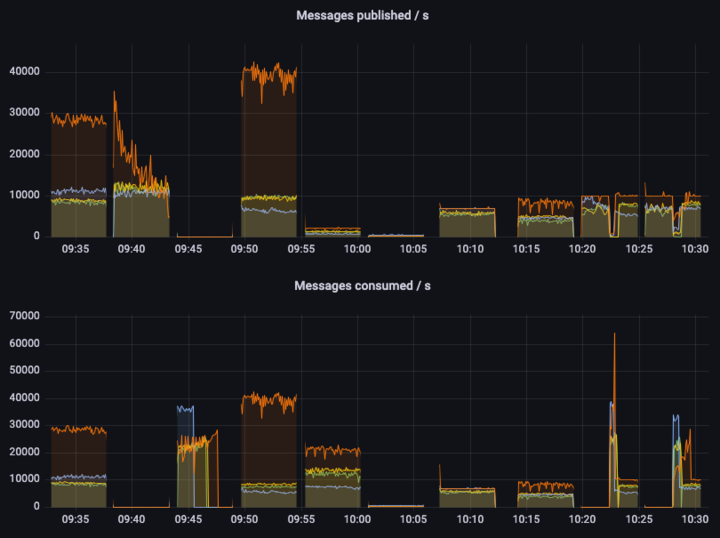

Quorum Queues are a superior replacement for Classic Mirrored Queues
that were introduced in RabbitMQ version 3.8. And there are two
complementary reasons why you would need to migrate. 

First of all, Classic Mirrored Queues were deprecated in 3.9, with [a
formal announcement posted on August 21, 2021](/blog/2021/08/21/4.0-deprecation-announcements). They will be removed
entirely in 4.0

But also they are more reliable and predictable, faster for most
workloads and require less maintenance - so you shouldn't feel that
your hand is being forced without no apparent reason.

Quorum Queues are better in all regards, but they are not
100%-compatible feature-wise with Mirrored Queues. Thus the migration
can look like a daunting task.

After a sneak peek into the future performance improvements, this post outlines a few possible migration strategies and includes guidance on how to deal with incompatible features.
The [Migrate your RabbitMQ Mirrored Classic Queues to Quorum Queues documentation](/docs/3.13/migrate-mcq-to-qq) is also available to help you through the migration process.

<!-- truncate -->

## Performance improvements

In [RabbitMQ 3.10 Performance
Improvements](/blog/2022/05/16/rabbitmq-3.10-performance-improvements)
blog post, performance benefits of Quorum Queues were already discussed in some detail.

And on the following graph you can see what new levels of performance
one can expect from yet-to-be-released RabbitMQ 3.12:



This graph shows throughput under different workloads, using 1kB messages.
Higher is better, although in some tests the maximum throughput is capped (in such tests we look at the latency and/or whether the throughput is stable).

The colors are as follows:
- orange - quorum queues
- green - mirrored classic queues v1 (non-lazy)
- yellow - mirrored classic queues v1 (lazy)
- blue - mirrored classic queues v2

Without digging into too much detail, we can see that quorum queues
offer a significantly higher throughput in almost all cases. For
example, the first test is a single queue, single publisher, single
consumer test. A quorum queue can sustain a 30000 msg/s throughput
(again, using 1kb messages), while offering high levels of data safety
and replicating data to all 3 nodes in the cluster. Meanwhile, classic
mirrored queues offer only a third of that throughput, yet providing
way lower data safety guarantees. In some tests we can see quorum
queues (orange line) completely flat, meaning they can sustain the
workload and still have some capacity left (otherwise they performance
would start fluctuating), while mirrored queues offer lower and less
stable throughput.

The astute reader can notice that in the second test quorum
queues initially provide very high publisher throughput but quickly
degrade. This is something we are working on right now and we hope
to improve very soon. This is only a corner case when there are no
consumers, and the queue quickly becomes very long (millions of
messages).

## Compatibility considerations

The RabbitMQ documentation has a dedicated page on [Quorum Queues](/docs/quorum-queues).
Specifically in this document there is a
[feature matrix](/docs/quorum-queues#feature-matrix) which provides a
list with all differences between Mirrored Classic Queues and Mirrored
Queues. These differences can require a different amount of work for a
successful migration. Some of [them](#trivial-changes) can be trivial
to change, while [others](#breaking-changes) can require changes in
the way an application interacts with RabbitMQ. All of them are
thoroughly documented further.

And it goes without saying that migrated applications should be
thoroughly tested against quorum queues, as behaviour can be somewhat
different under the load and in edge cases.

There are 2 migration strategies described in this post:

- [First one](#new-vhost-migration) involves creating a new vhost, and
  migrating with minimal loss of uptime with the help of
  federation. If all incompatible features are cleaned up or moved to
  policies, this is also the happy path migration - the existing code
  will be able to work both with mirrored and quorum queues by only changing
  connection parameters.
- [Another one](#in-place-migration) trades uptime for re-using the
  same virtual host, and requires the ability to stop all the
  consumers and producers for a given queue.

## General requirements
1. There should be at least 3 nodes in the cluster - there is no sense
   in using quorum queues with a smaller amount of replicas.
2. Management plugin should be running on at least one node - it's
   being used for exporting/importing definitions for a single host,
   which can greatly simplify definitions cleanup. (And
   `rabbitmqadmin` CLI command is also using the plugin behind the
   scenes).
3. Shovel plugin should be enabled.

## Finding the queues and features being used

All mirrored classic queues have `ha-mode` in their effective policy
definition. The policies that apply it can be found via the following script:

```bash
#!/bin/sh
printf "%s\t%s\t%s\t%s\t%s\t%s\n" vhost policy_name pattern apply_to definition priority
for vhost in $(rabbitmqctl -q list_vhosts | tail -n +2) ; do
  rabbitmqctl -q list_policies -p "$vhost" |
    grep 'ha-mode'
done
```

But it can be easier to just list the queues that are actually
mirrored on the running system. That way there is no need to guess
whether HA-policies are actually applied:

```bash
#!/bin/sh
printf "%s\t%s\t%s\n" vhost queue_name mirrors
for vhost in $(rabbitmqctl -q list_vhosts | tail -n +2) ; do
  rabbitmqctl -q list_queues -p "$vhost" name durable policy effective_policy_definition arguments mirror_pids type |
	sed -n '/\t\[[^\t]\+\tclassic$/{s/\t\[[^\t]\+\tclassic$//; p}' |
	xargs -x -r -L1 -d '\n' printf "%s\t%s\n" "$vhost"
done
```

Note that the above command uses `effective_policy_definition` argument,
which is only available since 3.10.13/3.11.5. If it's not available,
it's possible to either use `rabbitmqctl` from a fresh version of
RabbitMQ, or manually match policy name to its definition.

## Breaking changes {#breaking-changes}

When one or more of the following features are being used,
straightforward migration to quorum queues is not possible. The way
that application interacts with a broker needs to be changed.

This section outlines how to find whether some of these features are
being used in a running system, and what changes need to be made for
easier migration.

### Priority queues

Classic mirrored queues actually create a separate queue for every
priority behind the scenes. For migration it’s necessary for the
applications to explicitly handle creation of those queues, and also
publishing/consuming to and from them. 

This feature can be detected by the presence of `x-max-priority` in
the queue list output from above. The same exact string can be
searched for in the source code. Priority queues can’t be created via
policy, so no policy changes are involved.

### Overflow dead lettering

Overflow mode
[`reject-publish-dlx`](/docs/maxlength#overflow-behaviour) is not
supported by quorum queues. The code needs to be updated to use
publisher confirms and to do dead lettering by itself.

This feature can be detected by the presence of `reject-publish-dlx`
in the queue list output from above. The same exact string can be
searched for in the source code.

### Global QoS for consumers

[Global QoS for
consumers](/docs/quorum-queues#global-qos) is not
supported for quorum queues. A decision needs to be made about how
necessary results can be achieved using alternative means, e.g. by
using a lower per-consumer QoS that can give approximately the same
results (given the known application load pattern).

To detect whether this feature is used, the following command can be
executed agains a running system and checked for a non-empty output:

```bash
rabbitmqctl list_channels pid name global_prefetch_count | sed -n '/\t0$/!p'
```

It will give a list of channel PIDs that have global QoS enabled,
which then can be mapped to a queue name and checked for being a
mirrored queue:

```bash
rabbitmqctl list_consumers queue_name channel_pid
```


### `x-cancel-on-ha-failover` for consumers

Mirrored queues consumers can be [automatically
cancelled](/docs/3.13/ha#cancellation) when a queue
leader fails over. This can cause a loss of information about which
messages were sent to which consumer, and redelivery of such messages.

Quorum queues are less exposed to such behaviour - the only case when
it still can happen is when a whole node goes down. For other leader
changes (e.g. caused by rebalancing), there will be no redeliveries.

And redeliveries can also happen for inflight messages when the
consumer is cancelled or the channel is closed. So application needs
to be prepared for redeliveries anyway, without specifically asking
for such information.

## Trivial changes {#trivial-changes}

These features don't do anything when quorum queues are being
used. The best way to handle them is to remove them from the source
code completely, or move them to a policy instead.

### Lazy queues

Classic queue can optionally operate in [lazy
mode](/docs/lazy-queues), but for quorum
queues this is the only way of operation. The best way to handle this
for migration is to move `x-queue-mode` from source code to a policy.

### Non-durable queues

Non-durable queues will be deleted on a node/cluster boot. Having
extra durability guarantees that mirroring provides is a bit
pointless.

Non-durable queues concept is also going away in the future releases:
the only option for ephemeral queues will be exclusive queues. This
affects only durability of queue definitions, messages can still be marked
transient.

For such queues a decision have to be made one way or another: is this
queue content important enough to get availability guarantees of
quorum queues, or it's better to downgrade it to a classic (but
durable) queue.

### Exclusive queues

Exclusive queues are not mirrored even if the policy says so. But
attempt to declare an exclusive quorum queue will result in an
error. This is clearly one of the cases where migration is not needed,
but care must be taken as to avoid exclusive queue declarations with
an explicit `x-queue-type: quorum` argument.

## Migrate the Queues One Virtual Host at a Time {#new-vhost-migration}

The procedure to migrate from classic mirrored queues to quorum queues
is similar to a [blue-green cluster upgrade](/docs/blue-green-upgrade),
except that migration can happen to a new virtual host on the same
RabbitMQ cluster. [Federation Plugin](/docs/federation) is then being
used to seamlessly migrate from the old to the new one.

One important aspect of this migration path is that it's possible to
specify the default queue type for a new virtual host. Setting it to
`quorum` makes all the queues without explicit type created as
quorum queues (except for exclusive, non-durable or auto-delete queues).

If all incompatible features were cleaned up from the source code (and
there is no explicit `x-queue-type` arguments in the source code), then
it'll be possible to use exactly the same code to work both to the old
virtual host with classical mirrored queues, and with a new virtual
host with quorum queues - only the virtual host in the connection
parameters needs to be changed.

### Create destination virtual host

Special attention needs to be paid that the new virtual host is
created with proper default queue type. It should be selected from the
queue type dropdown when new virtual host is being added via
management UI. It can also be created using CLI interface, specifying
the default queue type, and adding some permissions:

```bash
rabbitmqctl add_vhost NEW_VHOST --default-queue-type quorum
rabbitmqctl set_permissions -p NEW_VHOST USERNAME '.*' '.*' '.*'
```

### Create federation upstream

A new federation upstream should be created for the NEW\_VHOST, with
URI pointing to the OLD\_VHOST: `amqp:///OLD_VHOST`. (Note that
default vhost URI is `amqp:///%2f`).

The upstream can be created via management UI, or via CLI:
```bash
rabbitmqctl set_parameter federation-upstream quorum-migration-upstream \
    --vhost NEW_VHOST \
    '{"uri":"amqp:///OLD_VHOST", "trust-user-id":true}'
```

When this form of URI, with an empty hostname is used, there is no
need to specify credentials, but connection is only possible within
bounds of a single cluster.

If `user-id` in messages is being used for any purpose, it can also be
preserved as shown in the CLI example above.

### Moving definitions

Export definitions of the source virtual host to a file. This is
available on the "Overview" page of the management UI (don't forget to
select a single virtual host). Or use the following CLI command:

```bash
rabbitmqadmin export -V OLD_VHOST OLD_VHOST.json
```

The following changes needs to be made to this file before loading it back into a NEW_VHOST:

1. Remove `x-queue-type` declarations for queues that you want to have
   as classic ones in the old virtual host, and as quorum ones in the
   new virtual host.
2. Other changes that need to be applied to queue definitions:
   - Remove `x-max-priority` argument
   - Change `x-overlow` argument when it is set to `reject-publish-dlx`
   - Remove `x-queue-mode` argument
   - Change `durable` attribute to `true`
3. Change the following keys in policies:
   - Remove everything starting with `ha-`: `ha-mode`, `ha-params`,
     `ha-sync-mode`, `ha-sync-batch-size`, `ha-promote-on-shutdown`,
     `ha-promote-on-failure`
   - Remove `queue-mode`
   - Change `overflow` when it is set to `reject-publish-dlx`
4. Policies that ended empty after the previous step should be dropped.
5. Federation with the old vhost should be added to any remaining
   policies, pointing to the federation upstream created earlier:
   `"federation-upstream-set":"quorum-migration-upstream"`
6. If there is no catch-all policy (applying to queues with pattern
   `.*`), it needs to be created and also point to the federation
   upstream. This ensures that every queue in the old vhost will be
   federated.
7. Policies that apply federation rules to exchanges need to be
   removed for the period of the migration, to avoid duplicate
   messages.


Now the modified schema can be loaded into the new virtual host from
UI or using CLI tools:

```bash
# Import definitions for a single virtual host using rabbitmqadmin.
# See https://www.rabbitmq.com/docs/definitions to learn more.
rabbitmqadmin import -V NEW_VHOST NEW_VHOST.json
```

### Point consumers to the new vhost

At this point it should be possible to point consumers to the new
virtual host by only updating the connection parameters.

### Point producers to the new vhost

Producers can now be also pointed to the new virtual host.

The time when consumers are stopped is also the time where federated
exchanges should be disabled in the old vhost, and enabled in the new
one.

Under sufficient system load messages from the old virtual host will
not be picked up. If message ordering is important, than this should
be done in steps: stop producers, shovel remaining messages to the new
virtual host, start consumers on the new virtual host.

### Shovel remaining messages to the new vhost

For every non-empty queue in the old host a shovel needs to be configured:

```bash
rabbitmqctl set_parameter shovel migrate-QUEUE_TO_MIGRATE \
  '{"src-protocol": "amqp091", "src-uri": "amqp:///OLD_VHOST", "src-queue": "QUEUE_TO_MIGRATE",
    "dest-protocol": "amqp091", "dest-uri": "amqp:///NEW_VHOST", "dest-queue": "QUEUE_TO_MIGRATE"}'
```

After the queue has been drained, the shovel can be deleted:
```bash
rabbitmqctl clear_parameter shovel migrate-QUEUE_TO_MIGRATE
```

### Ensure future queue declarations succeed

Many applications declare queues before they use them, in multiple places. When it comes to
migrating away from classic mirrored queues, this presents a channel: if clients declare queues
without explicitly providing a queue type, after the [Moving Definitions](#moving-definitions)
step, all future declaration attempts would hit a `PRECONDITION_FAILURE` channel error
when an existing queue is re-declared.

To avoid this scenario, there are three options:

1. Add the `x-queue-type` declarations back to all clients using quorum queues.
2. set the default queue type node-wide using `default_queue_type`, a `rabbitmq.conf`
   setting that is available [in RabbitMQ `3.13.3`](https://github.com/rabbitmq/rabbitmq-server/releases/tag/v3.13.3)
   and later versions
3. Set `quorum_queue.property_equivalence.relaxed_checks_on_redeclaration = true`, a `rabbitmq.conf`
   setting available since [RabbitMQ `3.11.16`](https://github.com/rabbitmq/rabbitmq-server/releases/tag/v3.11.16)

The third option, `quorum_queue.property_equivalence.relaxed_checks_on_redeclaration` set to `true`,
can be adopted at any time during the migration process.

## Migrate in place {#in-place-migration}

In this version of the process, we trade uptime for the ability to
perform the migration in an existing virtual host and cluster.

For each queue (or some group of queues) being migrated, it should be
possible to stop all the consumers and producers for the time of the
migration.

### Preparing producers and consumers

All incompatible features should be cleaned up. In addition to that,
in every place where queues are being declared, it'd be nice to make
`x-queue-type` argument configurable without changing application code.

### Migration steps

1. First, the consumers and producers will need to be stopped.
2. The messages should be shoveled to a new, temporary queue.
3. The old queue should be deleted.
4. A new quorum queue with the same name as the original queue should be created.
5. The contents of the temporary queue should now be shoveled over to the new quorum queue.
6. The consumers can now be reconfigured to use `x-queue-type` of `quorum` and started.

## Conclusion

Hopefully this blog post has shown that with a proper preparation the
migration can be fruitful and a relatively simple endeavour.

The migration has a lot of benefits. But one should also keep in mind
that Classic Mirrored Queues have been deprecated for more than a year
and are going to be removed entirely in an upcoming release. So even
if you don't plan to do the migration right now, doing these
preparations beforehand can be a good idea.

And we've tried to provide you the comprehesive guide for this
purpose. Maybe it's time to do something now?
