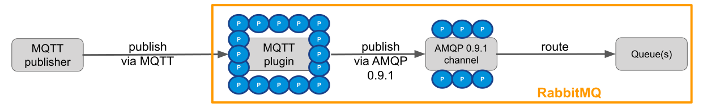
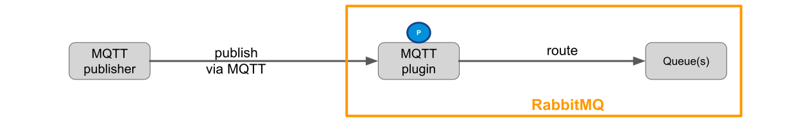
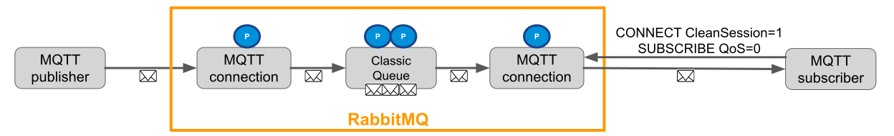
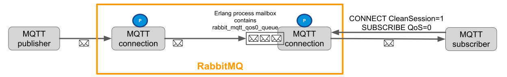
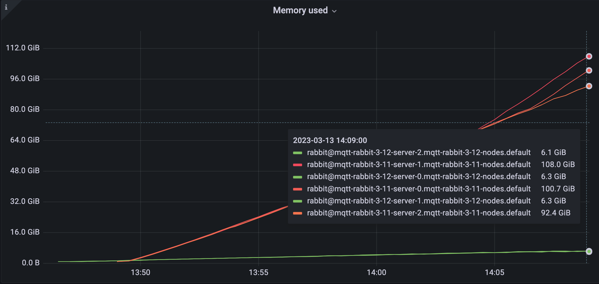
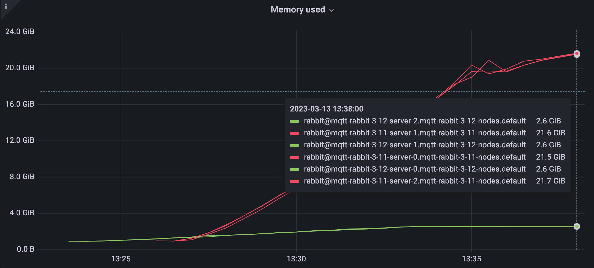
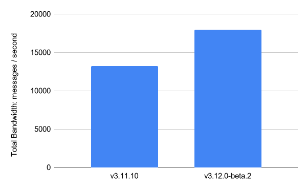
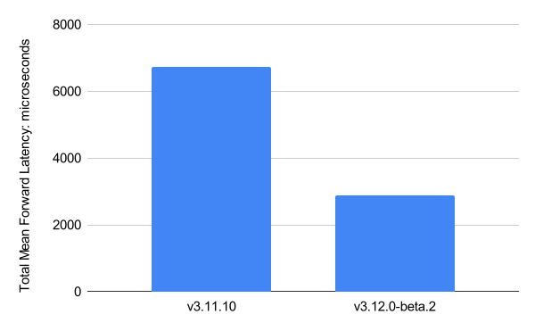

RabbitMQ's core protocol has been AMQP 0.9.1.
To support MQTT, STOMP, and AMQP 1.0, the broker transparently proxies via its core protocol.
While this is a simple way to extend RabbitMQ with support for more messaging protocols,
it degrades scalability and performance.

In the last 9 months, we re-wrote the [MQTT plugin](/docs/mqtt) to not proxy via AMQP 0.9.1 anymore.
Instead, the MQTT plugin parses MQTT messages and sends them directly to queues.
This is what we call **Native MQTT**.

The results are spectacular:
1. Memory usage drops by up to 95% and hundreds of GBs with many connections.
1. For the first time ever, RabbitMQ is able to handle millions of connections.
1. End-to-end latency drops by 50% - 70%.
1. Throughput increases by 30% - 40%.

Native MQTT turns RabbitMQ into an MQTT broker opening the door for a broader set of IoT use cases.

Native MQTT ships in RabbitMQ 3.12.

<!-- truncate -->

## Overview

As depicted in Figure 1, up to RabbitMQ 3.11 the MQTT plugin worked by parsing MQTT messages and forwarding them via the AMQP 0.9.1 protocol to the [channel](/docs/channels) which in turn routes messages to [queues](/docs/queues).
Each blue dot in Figure 1 represents an [Erlang process](https://www.erlang.org/doc/reference_manual/processes.html#processes).
A total of 22 Erlang processes are created for each incoming MQTT connection.



16 Erlang processes per MQTT connection are created in the MQTT plugin (that is Erlang application [`rabbitmq_mqtt`](https://github.com/rabbitmq/rabbitmq-server/tree/main/deps/rabbitmq_mqtt)) including one process that is responsible for [MQTT Keep Alive](https://docs.oasis-open.org/mqtt/mqtt/v3.1.1/os/mqtt-v3.1.1-os.html#_Keep_Alive) and a bunch of processes that act as an AMQP 0.9.1 client.

6 Erlang processes per MQTT connection are created in the Erlang application [`rabbit`](https://github.com/rabbitmq/rabbitmq-server/tree/main/deps/rabbit).
They implement the per-client part of the core AMQP 0.9.1 server.

Figure 2 shows that Native MQTT requires a single Erlang process per incoming MQTT connection.



That single Erlang process is responsible for parsing MQTT messages, respecting MQTT Keep Alive, performing [authentication and authorization](/docs/access-control), and routing messages to queues.

A usual MQTT workload consists of many Internet of Things (IoT) devices sending data periodically to an MQTT broker.
For example, there could be hundreds of thousands or even millions of devices that each send a status update every few seconds or minutes.

We learnt in last year's RabbitMQ Summit talk [RabbitMQ Performance Improvements](https://youtu.be/CRDmKZhYmxw) that creating Erlang processes is cheap.
(An Erlang process is much more lightweight than a Java thread. An Erlang process might be compared with a [Goroutine](https://go.dev/tour/concurrency/1) in Golang.)
However, for 1 million incoming MQTT client connections, it makes a big scalability difference whether RabbitMQ creates 22 million Erlang processes (up to RabbitMQ 3.11) or just 1 million Erlang processes (RabbitMQ 3.12).
This difference is analysed in sections [Memory Usage](#memory-usage) and [Latency and Throughput](#latency-and-throughput).

Not only was the `rabbitmq_mqtt` plugin re-written, but also the [rabbitmq_web_mqtt](/docs/web-mqtt) plugin.
This means, starting in 3.12, there will also be a single Erlang process per incoming [MQTT over WebSocket](https://docs.oasis-open.org/mqtt/mqtt/v3.1.1/os/mqtt-v3.1.1-os.html#_Toc398718127) connection.
Therefore, all performance improvements outlined in this blog post also apply to MQTT over WebSockets.

The term "Native MQTT" is not an official term of the MQTT specification.
"Native MQTT" refers to the new RabbitMQ 3.12 implementation where RabbitMQ supports MQTT "natively", i.e. where MQTT traffic is not proxied via AMQP 0.9.1 anymore.

## New MQTT QoS 0 Queue Type

Native MQTT ships with a new RabbitMQ queue type called `rabbit_mqtt_qos0_queue`.
To have the MQTT plugin create queues of that new queue type, the 3.12 [feature flag](/docs/feature-flags) with the same name `rabbit_mqtt_qos0_queue` must be enabled.
(Remember that feature flags are not meant to be used as a form of cluster configuration.
After a successful rolling upgrade, you should enable all feature flags.
Each feature flag will become mandatory in a future RabbitMQ version.)

Before explaining the new queue type, we should first understand how queues relate to MQTT subscribers.

In all RabbitMQ versions, the MQTT plugin creates a dedicated queue per MQTT subscriber.
To be more precise, there could be 0, 1, or 2 queues per MQTT connection:
* There are 0 queues for an MQTT connection if the MQTT client never sends a [SUBSCRIBE](https://docs.oasis-open.org/mqtt/mqtt/v3.1.1/os/mqtt-v3.1.1-os.html#_Toc398718063) packet. The MQTT client is only publishing messages.
* There is 1 queue for an MQTT connection if the MQTT client creates one or multiple subscriptions with the same [Quality of Service (QoS) level](https://docs.oasis-open.org/mqtt/mqtt/v3.1.1/os/mqtt-v3.1.1-os.html#_Toc398718099).
* There are 2 queues for an MQTT connection if the MQTT client creates one or multiple subscriptions with both [QoS 0 (at most once)](https://docs.oasis-open.org/mqtt/mqtt/v3.1.1/os/mqtt-v3.1.1-os.html#_Toc398718100) and [QoS 1 (at least once)](https://docs.oasis-open.org/mqtt/mqtt/v3.1.1/os/mqtt-v3.1.1-os.html#_Toc398718101).

When listing queues you will observe the queue naming pattern `mqtt-subscription-<MQTT client ID>qos[0|1]`
where `<MQTT client ID>` is the [MQTT client identifier](https://docs.oasis-open.org/mqtt/mqtt/v3.1.1/os/mqtt-v3.1.1-os.html#_Toc385349242) and `[0|1]` is either `0` for a QoS 0 subscription or `1` for a QoS 1 subscription.
Having a separate queue per MQTT subscriber makes sense because every MQTT subscriber receives its own copy of the application message.

By default, the MQTT plugin creates classic queues.

The MQTT plugin creates queues transparently for MQTT subscribing clients.
The MQTT specification does not define the concept of queues, and MQTT clients are not aware that these queues exist.
A queue is an implementation detail of how RabbitMQ implements the MQTT protocol.

Figure 3 shows an MQTT subscriber that connects with `CleanSession=1` and subscribes with QoS 0.
[Clean session](https://docs.oasis-open.org/mqtt/mqtt/v3.1.1/os/mqtt-v3.1.1-os.html#_Ref362965194) means that the MQTT session lasts only as long as the network connection between client and server.
When the session ends, all session state in the server is deleted, which implies the queue gets auto deleted.

As seen in Figure 3, each classic queue results in two additional Erlang processes: one [supervisor](https://www.erlang.org/doc/design_principles/des_princ.html#supervision-trees) process, and one worker process.



The new queue type optimisation works as follows: If
1. feature flag `rabbit_mqtt_qos0_queue` is enabled, and
2. an MQTT client connects with `CleanSession=1`, and
3. the MQTT client subscribes with QoS 0

then, the MQTT plugin will create a queue of type `rabbit_mqtt_qos0_queue` instead of a classic queue.

Figure 4 shows that the new queue type is a "pseudo" queue or "virtual" queue:
It is very different from the queue types you know (classic queues, [quorum queues](/docs/quorum-queues), and [streams](/docs/streams)) in the sense that this new queue type is neither a separate Erlang process nor does it store messages on disk.
Instead, this queue type is a subset of the Erlang process mailbox.
MQTT messages are directly sent to the MQTT connection process of the subscribing client.
In other words, MQTT messages are sent to any "online" MQTT subscribers.

It is more accurate to think of the queue being skipped (as indicated in the last line `no queue at all? 🤔` in [this slide from the RabbitMQ summit 2022 talk](https://youtu.be/CRDmKZhYmxw?t=596)).
The fact that sending messages directly to the MQTT connection process is implemented as a queue type is to simplify routing of messages and protocol interoperability, such that messages
can not only be sent from the MQTT publishing connection process, but also from the channel process.
The latter enables sending messages from an AMQP 0.9.1, AMQP 1.0 or STOMP client directly to the MQTT subscriber connection process skipping a dedicated queue process.



We now understand that this new queue type skips the queue process.
However, what are the advantages of doing so in the context of MQTT?
MQTT workloads are characterised by many devices sending data to and receiving data from the broker.
Here are four reasons in decreasing importance how the new queue type provides optimisations:

### Benefit 1: large fan-outs

Enable large fan-outs sending a message from the "cloud" (MQTT broker) to all devices.

For classic queues and quorum queues, each queue client (i.e. the channel process or MQTT connection process) keeps state for all destination queues for the purpose of flow control.
For example, the channel process holds the number of credits from each destination queue in its [process dictionary](https://www.erlang.org/doc/reference_manual/processes.html#process-dictionary).
(Read [our blog post about credit-based flow control](//blog.rabbitmq.com/blog/2020/05/04/quorum-queues-and-flow-control-the-concepts#credit-based-flow-control) to learn more.)

* If there is 1 channel process that sends to 3 million MQTT devices, 3 million entries (hundreds of MBs of memory) are kept in the channel process dictionary.
* If there are 100 channel processes each sending to 3 million devices, there are in total 300 million entries in the process dictionaries (better not try this).
* If there are a few thousand channels or MQTT connection processes each sending a message to 3 million devices, RabbitMQ will run out of memory and crash.

Even if these huge fan-outs happen extremely rarely, e.g. once a day, the state from the sending Erlang process to all destination queues is always kept in memory (until the destination queue gets deleted).

The most important characteristic of the new queue type is that its queue type client is stateless.
This means that the MQTT connection or channel process can send a message ("fire & forget") to 3 million MQTT connection processes (which still temporarily requires significant amount of memory) without
keeping any state to the destination queues. Once garbage collection kicked in, the queue client process memory usage drops to 0 MB.

### Benefit 2: lower memory usage

Not only for large fan-outs, but also in 1:1 topologies (where each publisher sends to exactly one subscriber), the new queue type `rabbit_mqtt_qos0_queue` saves substantial amount of memory by skipping queue processes.

Even with Native MQTT in 3.12, with feature flag `rabbit_mqtt_qos0_queue` disabled, 3 million MQTT devices subscribing with QoS 0 results in 9 million Erlang processes.
With feature flag `rabbit_mqtt_qos0_queue` enabled, the same workload results in only 3 million Erlang processes because the additional queue supervisor and queue worker processes per MQTT subscriber are skipped saving several GBs of process memory.

### Benefit 3: lower publisher confirm latency

Despite an MQTT client subscribing with QoS 0, another MQTT client can still send messages with QoS 1 (or equivalently the channel from an AMQP 0.9.1 sending client can be put in confirm mode).
In that case, the publishing client requires a publisher confirmation from the broker.

The new queue type's client (part of the MQTT publisher connection process or channel process) auto-confirms directly on behalf of the "queue server process" because the at-most-once QoS 0 message might be lost anyway on the way from broker to MQTT subscriber.
This results in lower publisher confirm latency.

In RabbitMQ a message is only confirmed back to the publishing client once **all** destination queues confirmed they received the message.
Therefore, even more importantly, the publishing process only awaits confirmation from queues that potentially have at-least-once consumers.
With the new queue type the publishing process is not blocked on sending the confirmation back to the publishing client in a scenario where one message is routed to an important quorum queue as well as to one million MQTT QoS 0 subscribers while a single out of the million MQTT connection processes is overloaded (and would therefore reply very slowly).

### Benefit 4: lower end-to-end latency

Because the queue process is skipped, there is one fewer message hop resulting in lower end-to-end latency.

### Overload protection

Because the new queue type has no flow control, MQTT messages might arrive faster in the MQTT connection process mailbox than they can be delivered to the MQTT subscribing client from the MQTT connection process.
This can happen when the network connection between MQTT subscribing client and RabbitMQ is poor or in a large fan-in scenario where many publishers overload a single MQTT subscribing client.

To protect against high memory usage due to MQTT QoS 0 messages piling up in the MQTT connection process mailbox, RabbitMQ intentionally drops QoS 0 messages from the `rabbit_mqtt_qos0_queue` if both conditions are true:

1. the number of messages in the MQTT connection process mailbox exceeds the setting `mqtt.mailbox_soft_limit` (defaults to 200), and
1. the socket sending to the MQTT client is busy (not sending fast enough).

Note that there can be other messages in the process mailbox (e.g. applications messages sent from the MQTT subscribing client to RabbitMQ or confirmations from another queue type to the MQTT connection process) which are obviously not dropped.
However, these other messages also contribute to the `mqtt.mailbox_soft_limit`.

Setting `mqtt.mailbox_soft_limit` to 0 disables the overload protection mechanism meaning QoS 0 messages are never dropped intentionally by RabbitMQ.
Setting `mqtt.mailbox_soft_limit` to a very high value decreases the likelihood of intentionally dropping QoS 0 messages while increasing the risk of causing a cluster wide [memory alarm](/docs/memory) (especially if the message payloads are large or if there are many overloaded queues of type `rabbit_mqtt_qos0_queue`).

The `mqtt.mailbox_soft_limit` can be thought of a [queue length limit](/docs/maxlength) although not precisely because, as mentioned previously, the Erlang process mailbox can contain other messages than MQTT application messages.
This is why the configuration key `mqtt.mailbox_soft_limit` contains the word `soft`.
The described overload protection mechanism corresponds roughly to overflow behaviour `drop-head` that you already know from classic queues and quorum queues.

### Queue type naming

Do not rely on the name of this new queue type.
The name of the feature flag `rabbit_mqtt_qos0_queue` will not change.
However, we might change the name of queue type `rabbit_mqtt_qos0_queue` in the future in case we decide to reuse part of its design in other RabbitMQ use cases (such as [Direct Reply-to](/docs/direct-reply-to)).

In fact, neither MQTT client applications nor RabbitMQ core (the Erlang application `rabbit`) are aware of the new queue type.
End users will not be aware of the new queue type either except when listing queues in the Management UI or via `rabbitmqctl`.

Given that we now understand the architecture of Native MQTT and the intent of the MQTT QoS 0 queue type, we can move on with performance benchmarks.

## Memory Usage

This section compares memory usage of MQTT in RabbitMQ 3.11 and Native MQTT in RabbitMQ 3.12.
The complete test setup can be found in [ansd/rabbitmq-mqtt](https://github.com/ansd/rabbitmq-mqtt/tree/blog-post-native-mqtt).

The two tests in this section were done against a 3-node cluster with the following subset of RabbitMQ configuration:
```
mqtt.tcp_listen_options.sndbuf = 1024
mqtt.tcp_listen_options.recbuf = 1024
mqtt.tcp_listen_options.buffer = 1024
management_agent.disable_metrics_collector = true
```

TCP buffer sizes are configured to be small such that they do not cause high binary memory usage.

Metrics collection is disabled in the `rabbitmq_management` plugin.
For production use cases, Prometheus should be used.
The `rabbitmq_management` plugin is not designed to handle a high number of stats emitting objects such as queues and connections.

### 1 million MQTT connections

The first test uses 1,000,000 MQTT connections that send only MQTT Keep Alives after connection establishment.
No MQTT application messages are sent or received.

As shown in Figure 5, the 3-node cluster requires 108.0 + 100.7 + 92.4 = 301.1 GiB in 3.11 and only 6.1 + 6.3 + 6.3 = 18.7 GiB of memory in 3.12.
Therefore 3.11 requires 16 times (or 282 GiB) more memory than 3.12.
Native MQTT reduces memory usage by 94%.



The biggest part contributing to memory usage in 3.11 is **process** memory.
As explained in the [Overview](#overview) section, Native MQTT in 3.12 uses 1 Erlang process per MQTT connection while 3.11 uses 22 Erlang processes per MQTT connection.
Some of the 3.11 processes keep large states causing high memory usage.

Native MQTT's low memory usage is not only achieved by using a single Erlang process, but also by reducing the state of that single Erlang process.
Numerous memory optimisations are implemented in PR [#5895](https://github.com/rabbitmq/rabbitmq-server/pull/5895) such as removing long lists and unnecessary function references from the process state.

Further tests on development environments show that Native MQTT requires around 56 GB of memory per node in a 3-node cluster for a total of 9 million MQTT connections.

### 100k publishers, 100k subscribers

The second test uses 100,000 publishers and 100,000 subscribers.
They send and receive in a 1:1 topology meaning each publisher sends a QoS 0 application message every 2 minutes to exactly one QoS 0 subscriber.

As shown in Figure 6, the 3-node cluster requires 21.6 + 21.5 + 21.7 = 64.8 GiB in 3.11 and only 2.6 + 2.6 + 2.6 = 7.8 GiB of memory in 3.12.



Further tests on development environments show that Native MQTT requires around 47 GB of memory per node in a 3-node cluster for the following scenario:
* 3 million MQTT connections in total
* 1:1 topology
* 1.5 million publishers sending QoS 1 messages with 64 bytes of payload every 3 minutes
* 1.5 million QoS 1 subscribers (i.e. 1.5 million classic queues [version 2](/docs/persistence-conf#queue-version))

PR [#6684](https://github.com/rabbitmq/rabbitmq-server/pull/6684) that shipped in RabbitMQ 3.11.6 substantially reduces memory usage of many classic queues benefitting the use case
of many MQTT QoS 1 or `CleanSession=0` subscribers.

## Latency and Throughput

To compare latency between MQTT in 3.11 and Native MQTT in 3.12 we use [mqtt-bm-latency](https://github.com/ansd/mqtt-bm-latency/tree/blog-post-native-mqtt).

The following latency benchmarks were executed on a physical Ubuntu 22.04 box with 8 CPUs and 32 GB of RAM.
Clients and single node RabbitMQ server run on the same machine.

In the root directory of [rabbitmq-server](https://github.com/rabbitmq/rabbitmq-server) start the server with 4 scheduler threads:
```bash
make run-broker PLUGINS="rabbitmq_mqtt" RABBITMQ_CONFIG_FILE="rabbitmq.conf" RABBITMQ_SERVER_ADDITIONAL_ERL_ARGS="+S 4"
```

The server runs with the following `rabbitmq.conf`:
```ini
mqtt.mailbox_soft_limit = 0
mqtt.tcp_listen_options.nodelay = true
mqtt.tcp_listen_options.backlog = 128
mqtt.tcp_listen_options.sndbuf = 87380
mqtt.tcp_listen_options.recbuf = 87380
mqtt.tcp_listen_options.buffer = 87380
classic_queue.default_version = 2
```
The first line is only used in RabbitMQ 3.12 and disables overload protection ensuring all QoS 0 messages are delivered to the subscribers.

The 3.11 benchmarks use Git tag `v3.11.10`.
The 3.12 benchmarks use Git tag `v3.12.0-beta.2`.

### Latency and Throughput QoS 1

The first benchmark compares latency and throughput of QoS 1 messages sent to QoS 1 subscribers.

```bash
./mqtt-bm-latency -clients 100 -count 10000 -pubqos 1 -subqos 1 -size 100 -keepalive 120 -topic t
```

This benchmark uses 100 MQTT client "pairs" sending in a 1:1 topology.
In other words, there are a total of 200 MQTT clients: 100 publishers and 100 subscribers.
Each publisher sends 10,000 messages to a single subscriber.

All MQTT clients run concurrently.
However, application messages are sent synchronously from publishing client to RabbitMQ:
Each publisher sends a QoS 1 message and waits until it receives the [PUBACK](https://docs.oasis-open.org/mqtt/mqtt/v3.1.1/os/mqtt-v3.1.1-os.html#_Toc398718043) from RabbitMQ before sending the next one.

The subscribing client also replies with a PUBACK packet for each [PUBLISH](https://docs.oasis-open.org/mqtt/mqtt/v3.1.1/os/mqtt-v3.1.1-os.html#_Toc398718037) packet it receives.

The topic `t` in above command is just a topic prefix.
Each publishing client publishes to a different topic by appending its index to the given topic (e.g. the first publisher publishes to topic `t-0`, the second to `t-1`, etc.).

Results for 3.11:
```
================= TOTAL PUBLISHER (100) =================
Total Publish Success Ratio:   100.000% (1000000/1000000)
Total Runtime (sec):           75.835
Average Runtime (sec):         75.488
Pub time min (ms):             0.167
Pub time max (ms):             101.331
Pub time mean mean (ms):       7.532
Pub time mean std (ms):        0.037
Average Bandwidth (msg/sec):   132.475
Total Bandwidth (msg/sec):     13247.470

================= TOTAL SUBSCRIBER (100) =================
Total Forward Success Ratio:      100.000% (1000000/1000000)
Forward latency min (ms):         0.177
Forward latency max (ms):         94.045
Forward latency mean std (ms):    0.032
Total Mean forward latency (ms):  6.737
```

Results for 3.12:
```
================= TOTAL PUBLISHER (100) =================
Total Publish Success Ratio:   100.000% (1000000/1000000)
Total Runtime (sec):           55.955
Average Runtime (sec):         55.570
Pub time min (ms):             0.175
Pub time max (ms):             96.725
Pub time mean mean (ms):       5.550
Pub time mean std (ms):        0.031
Average Bandwidth (msg/sec):   179.959
Total Bandwidth (msg/sec):     17995.888

================= TOTAL SUBSCRIBER (100) =================
Total Forward Success Ratio:      100.000% (1000000/1000000)
Forward latency min (ms):         0.108
Forward latency max (ms):         51.421
Forward latency mean std (ms):    0.028
Total Mean forward latency (ms):  2.880
```

`Total Publish Success Ratio` and `Total Forward Success Ratio` validate that a total of `100 publishers * 10,000 messages = 1,000,000 messages` were processed by RabbitMQ.

`Total Runtime` and `Average Runtime` show the first huge performance difference:
With Native MQTT each publisher receives all 10,000 publisher confirmations (PUBACKs) from the server within 55 seconds.
MQTT in 3.11 requires 75 seconds.

`Pub time mean mean` demonstrates that the average publisher confirm latency drops from 7.532 milliseconds in 3.11 by 1.982 milliseconds or 26% to 5.550 milliseconds in 3.12.

As depicted in Figure 7, the throughput of 100 concurrent clients each synchronously publishing MQTT QoS 1 messages to RabbitMQ increases from 13,247 messages per second in 3.11 by 4,748 messages per second or 36% to 17,995 messages per second in 3.12.



The `forward latency` statistics represent the end-to-end latency, i.e. how long it takes from publishing the message to receiving the message in the clients.
It is measured by having the publisher include a timestamp in each message payload.

Figure 8 illustrates that the `Total mean forward latency` drops from 6.737 milliseconds in 3.11 by 3.857 milliseconds or 57% to 2.880 milliseconds in 3.12.



### Latency QoS 0

The second latency benchmark looks very similar to the first but uses QoS 0 for messages being published and QoS 0 for subscriptions.

```bash
./mqtt-bm-latency -clients 100 -count 10000 -pubqos 0 -subqos 0 -size 100 -keepalive 120 -topic t
```

Since clients connect with `CleanSession=1` RabbitMQ creates one `rabbit_mqtt_qos0_queue` per subscriber.
The queue process is therefore skipped.

Publisher results are omitted here for 3.11 and 3.12 because they are very low (`Pub time mean mean` is 5 microseconds).
Publishing clients send ("fire & forget") all 1 million messages to the server at once without waiting for a PUBACK response.

Results for 3.11:
```
================= TOTAL SUBSCRIBER (100) =================
Total Forward Success Ratio:      100.000% (1000000/1000000)
Forward latency min (ms):         3.907
Forward latency max (ms):         12855.600
Forward latency mean std (ms):    883.343
Total Mean forward latency (ms):  7260.071
```

Results for 3.12:
```
================= TOTAL SUBSCRIBER (100) =================
Total Forward Success Ratio:      100.000% (1000000/1000000)
Forward latency min (ms):         0.461
Forward latency max (ms):         5003.936
Forward latency mean std (ms):    596.133
Total Mean forward latency (ms):  2426.867
```

The `Total mean forward latency` drops from 7,260.071 milliseconds in 3.11 by 4,833.204 milliseconds or 66% to 2,426.867 milliseconds in 3.12.

Compared to the QoS 1 benchmarks, the end-to-end latency of 7.2 seconds in 3.11 and 2.4 seconds in 3.12 is very high, because the broker is temporarily flooded with all 1 million MQTT messages at once.

Disabling credit flow (by setting `{credit_flow_default_credit, {0, 0}}` in `advanced.config`) does not improve latency in 3.11.

An exercise left for the interested reader is to run the same benchmark against 3.12 with feature flag `rabbit_mqtt_qos0_queue` disabled to see the latency difference of skipping the queue process.

## What else improves with Native MQTT in 3.12?

The following list contains miscellaneous items that change with Native MQTT in 3.12:
* The MQTT 3.1.1 feature of allowing the [SUBACK](https://docs.oasis-open.org/mqtt/mqtt/v3.1.1/os/mqtt-v3.1.1-os.html#_Toc398718068) packet to include a failure return code (0x80) is implemented.
* The AMQP 0.9.1 header `x-mqtt-dup` is removed because its usage within the MQTT plugin was wrong up to 3.11. This is a breaking change if your AMQP 0.9.1 clients depend on this header.
* All queues created by the MQTT plugin are durable. This is done to ease the transition to [Khepri](https://github.com/rabbitmq/khepri) in a future RabbitMQ version.
* The MQTT plugin creates [exclusive](/docs/queues#exclusive-queues) (instead of [auto-delete](/docs/queues#temporary-queues)) queues for clean sessions.
* MQTT client ID tracking (to terminate an existing MQTT connection if a new client connects with the same client ID) is implemented in [pg](https://www.erlang.org/doc/man/pg.html). The previous [Ra](https://github.com/rabbitmq/ra) cluster that used to track MQTT client IDs is deleted when feature flag `delete_ra_cluster_mqtt_node` gets enabled. The old Ra cluster required a lot of memory and became a bottleneck when disconnecting too many clients at once.
* Prometheus metrics are implemented using [global counters](https://github.com/rabbitmq/rabbitmq-server/blob/main/deps/rabbitmq_prometheus/metrics.md#global-counters). The protocol label has the value `mqtt310` or `mqtt311`. An example of such a metric is: `rabbitmq_global_messages_routed_total{protocol="mqtt311"} 10`.
* The MQTT parser got optimised.
* MQTT clients that have never published application messages are not blocked during [memory and disk alarms](/docs/alarms) such that subscribers can continue emptying queues.

## Should I use RabbitMQ as an MQTT broker?

Native MQTT enables many new use cases as it allows an order of magnitude more IoT devices to connect to RabbitMQ.
The set of use cases is broad.

RabbitMQ is only one MQTT broker on the market.
There are other good MQTT brokers out there and some will be able to handle even more MQTT client connections than RabbitMQ because other brokers are specialised in MQTT only.

The strength of RabbitMQ is that it is more than just an MQTT broker.
It is a general-purpose multi-protocol broker.
The real power of RabbitMQ is protocol interoperability in combination with flexible routing and choice of queue types.

To provide an example: As a payment processing company, you could connect hundreds of thousands or a few million cash terminals distributed all over the world to a central RabbitMQ cluster where each cash
terminal sends MQTT QoS 1 messages every few minutes to RabbitMQ (whenever a customer does a payment).

These MQTT messages containing payment data are of high importance to your business.
Under no circumstances (node failure, disk failure, network partitions) are the messages allowed to be lost.
They also need to be processed by one or more microservices.

One solution is to bind a few quorum queues to the topic exchange where each quorum queue binds with a different routing key such that load is spread across the queues.
Each quorum queue is replicated across 3 or 5 RabbitMQ nodes providing high data safety by using the Raft consensus algorithm underneath.
The messages within each quorum queue can be processed by different microservices using more specialised messaging protocols than MQTT, such as AMQP 0.9.1 or AMQP 1.0.

Alternatively, the MQTT plugin could forward the MQTT payment messages to a [super stream](//blog.rabbitmq.com/blog/2022/07/13/rabbitmq-3-11-feature-preview-super-streams) that is replicated across multiple RabbitMQ nodes.
Other clients can then do different forms of data analytics by consuming the same messages from the streams multiple times using the [RabbitMQ Streams protocol](https://github.com/rabbitmq/rabbitmq-server/blob/v3.12.0-beta.2/deps/rabbitmq_stream/docs/PROTOCOL.adoc).

The flexibility that RabbitMQ offers is almost endless, and there is no other message broker on the market that provides such a wide range of protocol interoperability, data safety, fault tolerance, scalability, and performance.

## Future Work
Native MQTT shipping in 3.12 is a crucial step for RabbitMQ to be used as an MQTT broker.
However, the MQTT journey does not end here.
In the future, we plan (no promises!) to add the following MQTT improvements:

* Add support for [MQTT 5.0 (v5)](https://docs.oasis-open.org/mqtt/mqtt/v5.0/mqtt-v5.0.html) - a feature that is highly asked for by the community. You can track the current progress in PR [#7263](https://github.com/rabbitmq/rabbitmq-server/pull/7263). As of 3.12, RabbitMQ supports only [MQTT 3.1.1 (v4)](https://docs.oasis-open.org/mqtt/mqtt/v3.1.1/os/mqtt-v3.1.1-os.html) and [MQTT 3.1.0 (v3)](https://public.dhe.ibm.com/software/dw/webservices/ws-mqtt/mqtt-v3r1.html). Native MQTT has been a prerequisite to develop support for MQTT 5.0.
* Improve resiliency when upgrading RabbitMQ nodes that handle millions of MQTT connections and improve resiliency of mass client disconnections (e.g. due to a load balancer crash).
* Support huge fan-outs for QoS 1 sending a message at-least-once to all devices. The new queue type `rabbit_mqtt_qos0_queue` improves large fan-outs by not keeping any state in sending and receiving Erlang processes. However, as of today, sending a message that requires queue confirmations (QoS 1 in MQTT or publisher confirms in AMQP 0.9.1) to millions of queues should be done with extreme care: always use the same publisher and do so very rarely (every few minutes). Note that 1:1 topologies and large fan-ins are not problematic for RabbitMQ.

## Wrapping up

Although RabbitMQ has supported MQTT in 3.11, scalability with regards to the number of client connections has been poor and memory usage has been excessive.

Native MQTT shipping in 3.12 turns RabbitMQ into an MQTT broker.
It allows connecting millions of clients to RabbitMQ.
Even if you do not plan to connect that many clients, by upgrading your MQTT workload to 3.12, you will substantially save infrastructure costs because memory usage drops by up to 95%.

As next step, we plan to add support for MQTT 5.0.
