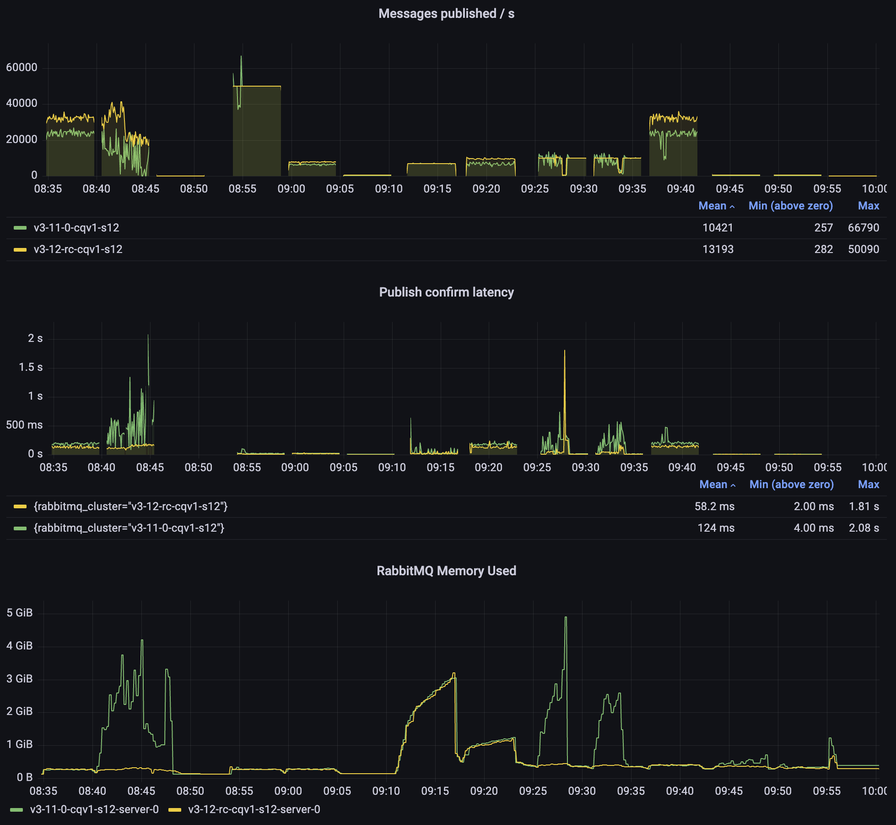
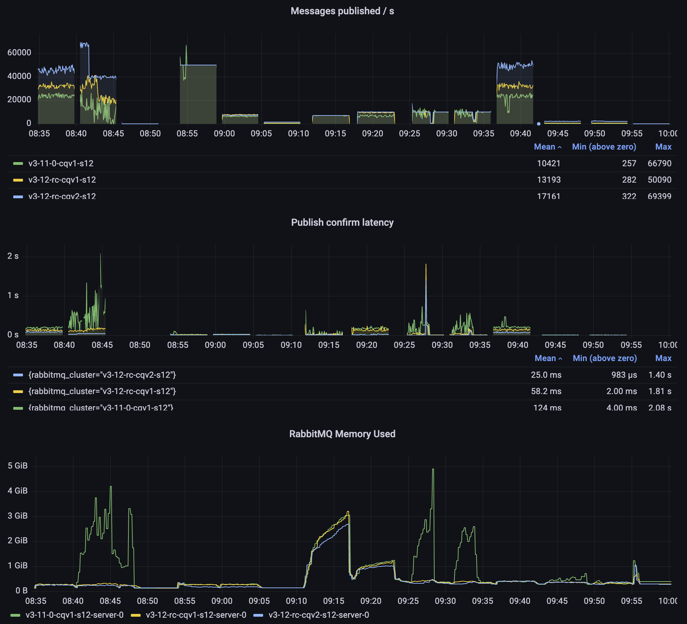
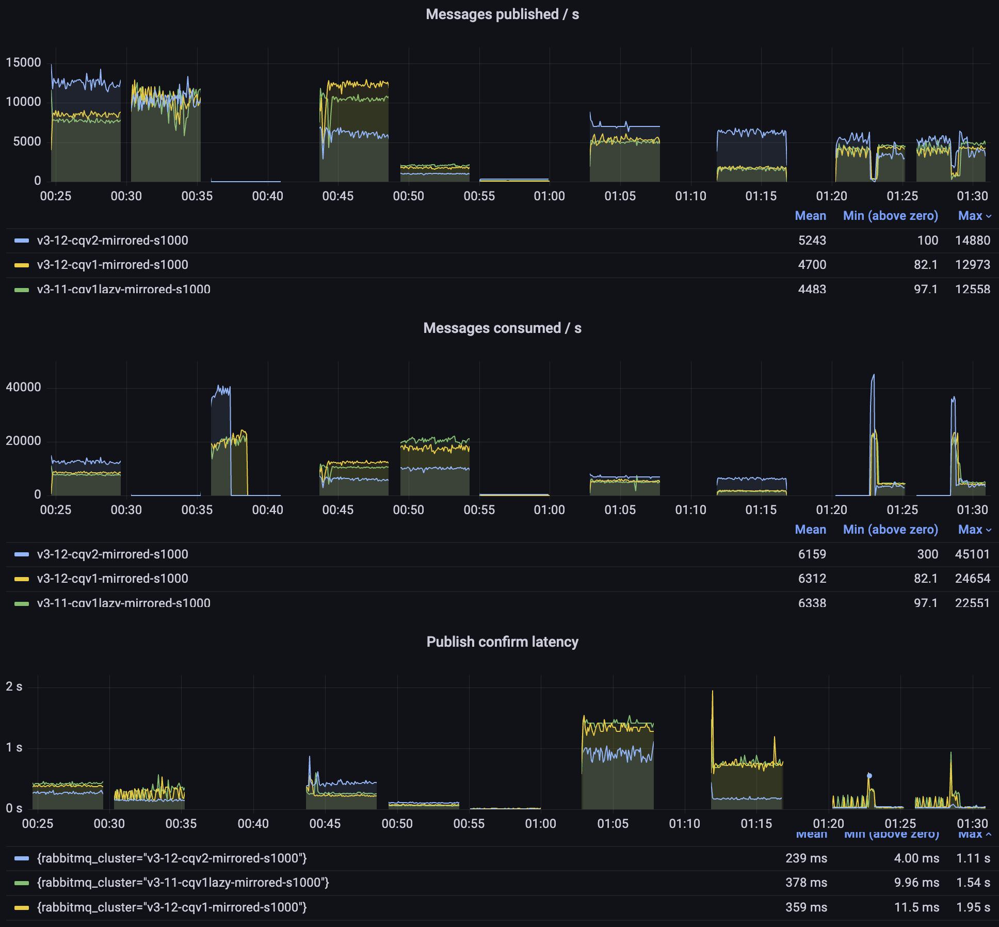
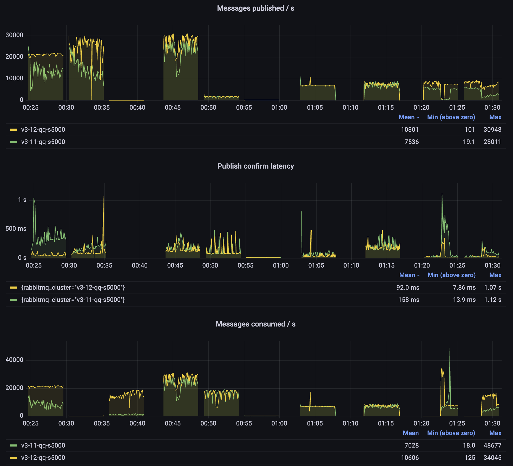
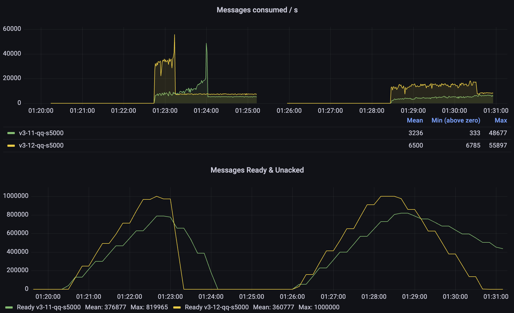
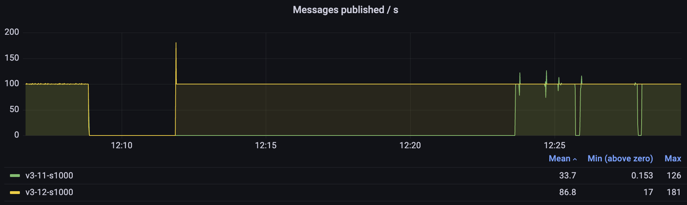

RabbitMQ 3.12 will be released soon with many new features and improvements.
This blog post focuses on the the performance-related differences.
The most important change is that the `lazy` mode for classic queues is now the standard behavior (more on this below).
The new implementation should be even more memory efficient
while proving higher throughput and lower latency than both `lazy` or `non-lazy` implementations did in earlier versions.

For even better performance, we highly recommend switching to classic queues version 2 (CQv2).

<!-- truncate -->

## Overview

Let's quickly go through the most important performance-related improvements in RabbitMQ 3.12.

###  Classic Queues: Changes to the Lazy Mode

Starting with 3.12, the `x-queue-mode=lazy` argument is ignored. All classic queues will now behave similarly to the way lazy queues behaved previously.
That is, messages tend to be written to disk and only a small subset is kept in memory. The number of messages in memory depends on the consumption rate.
This change affects all users of classic queues. Based on our testing, for the vast majority of them,
the new implementation should bring significant improvements in performance and should lower the memory usage. Keep reading for some benchmark results,
but also make sure to test your system [using PerfTest](https://rabbitmq.github.io/rabbitmq-perf-test/stable/htmlsingle/) before upgrading.

### Classic Queues: Massively Improved Classic Queues v2 (CQv2)

:::note
This paragraph was updated to reflect the changes to the roadmap. Classic queues version 2 will become the
default and only option in RabbitMQ 4.0 (perviously we planned to make it the default in 3.13).
:::

Since RabbitMQ 3.10, we have had [two implementation of classic queues](/docs/persistence-conf#queue-version): the original
one (CQv1) and a new one (CQv2). The difference between them is mostly around on-disk storage.

Most users still use CQv1, but starting with 3.12 we highly recommend switching to,
or at least evaluating, CQv2. Version 2 will become the the only implementation available in RabbitMQ 4.0.

The migration process is easy: add a new policy key or an optional queue argument, `x-queue-version=2`, when declaring the queue.
To switch to CQv2 globally, set `classic_queue.default_version` to `2` in the config file:

```
classic_queue.default_version = 2
```

It is possible to go back by setting the version back to 1. Every time the value changes, RabbitMQ will convert the on-disk representation of the queue.
For mostly empty queues, the process is instantaneous. For reasonable backlogs, it can take a few seconds.

In many use cases, switching to CQv2 will result in a 20-40% throughput improvement
and lower memory usage at the same time. Those who still use classic queue mirroring ([you shouldn't, it'll be removed soon!](/blog/2023/03/02/quorum-queues-migration)),
need to test your system more thoroughly as there are a few cases where version 1 works better with mirrored classic queues,
but there are also many scenarios where version 2 is much better, despite not having any mirroring-specific code optimizations.

### New MQTT implementation: Significant Memory Savings Per Connection, Supports Millions of Connections per Node

The [MQTT plugin](/docs/mqtt) has been completely reworked and provides much lower memory usage,
lower latency and can handle many more connections than before.

We've published [a separate blog post about the MQTT-related improvements](/blog/2023/03/21/native-mqtt).

### Significant improvements to quorum queues

The work on making quorum queues more efficient continues. RabbitMQ 3.12 brings a number of improvements so all quorum queue users should see better performance.
The biggest change will be observed in the environments with long quorum queues.
Previously, as the queue got longer, its throughput decreased. This should no longer be a problem.

### Nodes Should Stop and Start Faster

RabbitMQ nodes with many classic queues (tens of thousands or more) should stop and start faster. That means shorter node unavailability during an upgrade
and other maintenance operations.

## Benchmarking Setup

All the data present below compares 3.11.7 and 3.12-rc.2. Some, mostly smaller, optimizations have been backported to more recent 3.11 patch releases,
which is why this comparison does not use the latest 3.11 patch release.

## Benchmark Tests

At the moment of writing, Team RabbitMQ's standard performance test suite contains 14 tests. Each test runs for 5 minutes.
Separate environments go through the same tests at the same time with different message sizes,
so that it is easy to see the impact of the message size and/or to compare different queue types or versions under the same workload.

Here is a list of the tests, in the order they appear in the Grafana dashboard:

1. One publisher publishes as fast as it can, while one consumer consumes as fast as it can
2. Two publishers and no consumers (performance as the queue gets longer)
3. One consumer consumes a long queue from the previous test (performance of consumers unaffected by publishers)
4. Five queues, each has 1 publisher publishing at 10k messages/s and 1 consumer (the total expected throughput is 50k/s, we look at the latency)
5. Fanout to 10 queues - 1 publishers and 10 consumers, a fanout exchange
6. One publisher, one consumer, but only 1 unconfirmed message (the publisher waits for the confirmation of the previous message before sending the next one)
7. Fan-in: 7000 publishers publishing 1 message per second, to a single queue
8. 1000 publishers publish 10 messages/s, each to a different queue; each queue has a consumer as well (total expected throughput: 10k/s)
9. One publisher without consumers creates a backlog of messages, then 10 consumers join to drain the queue
10. Similar to the previous one, but 50 consumers join, but a single-active-consumer is set (so only one starts draining the queue)
11. Similar to the first test, but multi-ack of 1000 is used on the consumer-side
12. Messages with TTL are published and expire quickly (they never get consumed)
13. Messages get published to be negatively acknowledged later (this is just a setup for the next test)
14. Messages from the previous test are negatively acknowledged

The last few tests are less interesting. They were introduced to look for issues in some specific areas.

### The Environment

These tests were conducted using the following environment:

* A GKE cluster with e2-standard-16 nodes
* RabbitMQ clusters deployed using [our Kubernetes Operator](/kubernetes/operator/operator-overview) with the following resources and configuration

```yaml
apiVersion: rabbitmq.com/v1beta1
kind: RabbitmqCluster
metadata:
  name: ...
spec:
  replicas: 1 # or 3 for mirrored and quorum queues
  image: rabbitmq:3.11.7-management # or rabbitmq:3.12.0-rc.2-management
  resources:
    requests:
      cpu: 14
      memory: 12Gi
    limits:
      cpu: 14
      memory: 12Gi
  persistence:
    storageClassName: premium-rwo
    storage: "150Gi"
  rabbitmq:
    advancedConfig: |
      [
      {rabbit, [
          {credit_flow_default_credit,{0,0}}
      ]}
      ].
```

Some notes on the environment:

1. For many tests (or even production workloads), these resource settings are excessive. This is simply a configuration we happen to use for performance testing, it is not a recommendation
2. You should be able to reach higher values with better hardware. `e2-standard-16` is far from the best hardware money can buy/rent
3. The credit flow was disabled because otherwise a single fast publisher will be throttled (to prevent overload and to give a fair chance to other publishers);
   flow control is important in systems with many users/connections, but usually not something we want when benchmarking


## Test Results

### New Lazy-like Default Behavior of Classic Queues and Classic Queues v2

Initial version of RabbitMQ was released in 2007. Back then, disk access was very slow compared to any other operation.
However, as the storage technology evolved over the years, there was less and less need to avoid writing data to disk. In version 3.6.0, back in 2015,
[lazy queues](/docs/lazy-queues) were added as an option. Lazy queues store all messages on disk to save memory, which is particularly important for queues that can become long.
These days, writing messages to disk is a pretty cheap operation (unless you perform `fsync` to guarantee high data safety, as quorum queues do).
By storing messages on disk, we can use much less memory. That means lower costs, fewer memory alarms and fewer headaches caused by sudden memory spikes in your cluster.
We've therefore made this the only option for classic queues going forward.

#### 3.11 non-lazy vs 3.12

Let's start by looking at what we expect to happen for users that currently use non-lazy classic queues version 1 (CQv1), after the upgrade.
The screenshot was taken from 12 bytes message sizes test.



As you can see, 3.12 performs better in every single test: higher throughput, lower latency, less variability (fewer spikes in rates).
At the same time, 3.12 has a much lower memory usage (similar to lazy queues). On the last panel you can see 3.11 memory spikes whenever the queues get longer,
while 3.12 only exceeds 1GB memory usage in the tests that involve many connections (it's the connections that use the memory, not the queues).

#### 3.12 CQv1 vs CQv2

Above, we saw some of the benefits that most users should get after upgrading to RabbitMQ 3.12, but we are just getting started! Let's add classic queues version 2
to the comparison:



With CQv2, we observe even higher throughput and even lower latency. Especially in the second test when the queue gets long, version 2 doesn't exceed 50ms latency,
while 3.11 can spike into multiple seconds.

Please do not hesitate to give classic queues version 2 a try. All you need to do is set the `x-queue-version=2` policy key.
To switch to CQv2 globally, set `classic_queue.default_version` to `2` in the config file:

```
classic_queue.default_version = 2
```

Version 2 will become the default version starting with RabbitMQ 3.13.

### Classic Mirrored Queues

As mentioned above, classic queues version 1 contain a few optimizations specifically implemented to improve the behaviour when a queue is mirrored.
As we prepare to [remove the mirroring feature](https://blog.rabbitmq.com/blog/2023/03/21/quorum-queues-migration), version 2 no longer performs any special mirroring tricks.
Therefore, the results are mixed, but version 2 is so efficient that even without special considerations, it can outperform version 1 in most scenarios, even with mirroring.



You can see whether version 2 works better for you but more importantly, please [start migrating to quorum queues](https://blog.rabbitmq.com/blog/2023/03/21/quorum-queues-migration)
and [streams](/docs/streams) ASAP.

### Quorum Queues

[Quorum queues](/docs/quorum-queues) have offered much better performance and data safety than queue mirroring for several years now,
and they only get better.

The biggest improvement in 3.12 is in how quorum queues handle long backlogs.



#### Publishing to a Long Quorum Queue

Prior to RabbitMQ 3.12, if a quorum queue had a long backlog, publishing latency could increase significantly, lowering throughput.
Starting with 3.12, the length of the queue should no longer matter much for latency and throughput.

You can see this in the second test: while both versions start at about 25k messages/s,
3.11 quickly degrades to 10k/s or so. Meanwhile, 3.12 remains above 20k/s.

The 3.12 performance is not as smooth as we wish it was, but it's
much better already and could be improved further. It's also important to remember that in these tests, we are effectively overloading
the queues: the messages keep flowing in as fast as possible and therefore any garbage collection or periodic operation (eg. Raft write-ahead log
roll-over) will be observable as a latency spike.

#### Consumption Throughput

Consuming messages from quorum queues is also much faster than it used to be. In particular, consuming messages from a very long queue can up to 10 times faster in our tests.
Queues are still meant to be kept relatively short (you can use [streams](/docs/streams) if you need to store a lot of messages),
but with these improvements, quorum queues should cope well with all kinds of message backlogs.

Take a look at the third test on the last panel (Messages consumed / s). 3.12 starts at over 15k messages/s and gets even faster as the queue
gets shorter. Meanwhile, 3.11 can hardly exceed 1000 messages per second. In this test, we are consuming a queue with a backlog of 5 million messages,
so you have hopefully never seen quorum queues struggle like this, but the good news is: even in these situations,
quorum queues should now perform better and more predictably.

A more likely scenario is a situation where the consumers were unavailable for some time and need to catch up. Let's focus on these tests:



In the first phase of each test, consumers are off and a backlog of messages is created. Then the consumers start. In the first test 10 of them,
in the second test 50, but only one is active (as a [Single Active Consumer](/docs/consumers#single-active-consumer)).
In both cases, 3.12 offers a significantly higher consumption
rate and the queue is drained much more quickly. In the case of 3.11, we can see that it gets progressively faster as the queue backlog gets shorter.

### Faster Node Restarts

This one shouldn't affect most users, but should be very good news for users with many classic queues (eg. MQTT users with many subscriptions).
In our test, we started a node, imported 100,000 classic queues version 2 and then restarted the node. 3.12 was up and running within 3 minutes,
while 3.11 needed 15 minutes to start serving clients again. 3.11 hit a memory alarm on startup, which made the boot
process particularly slow. There was a client running just to see when it loses the connection and can establish it again.



### No More Periodic Resource Usage Spikes With Many Idle Queues

You may have noticed on the screenshot above, that 3.11 not only took much longer to restart, but also that the publishing rate was spiky, even
though it was a very light workload (just 100 messages a second). The spikes are caused by an internal process which checks the health of the queues
to prevent stale queue metrics being emitted. Before 3.12, it'd query each queue for its status to decide if the queue is healthy. However,
idle classic queues hibernate (their Erlang process is stopped and its memory compacted) and need to be awaken just to reply that they are healthy.
Starting with 3.12, hibernated queues are considered healthy without waking them up, so CPU and memory usage should be lower and more consistent,
even on nodes with many queues.

## Conclusion

RabbitMQ 3.12 should improve the performance for virtually all users, often significantly. As always, we wholeheartedly recommend
testing release candidates and new versions before you upgrade. We are also always interested in learning how people use RabbitMQ
in [GitHub Discussions](https://github.com/rabbitmq/rabbitmq-server/discussions) and our [community Discord server](https://www.rabbitmq.com/discord).

If you can share information about your workload, [ideally as a perf-test command](https://perftest.rabbitmq.com/), it will help
us make RabbitMQ better for you.
