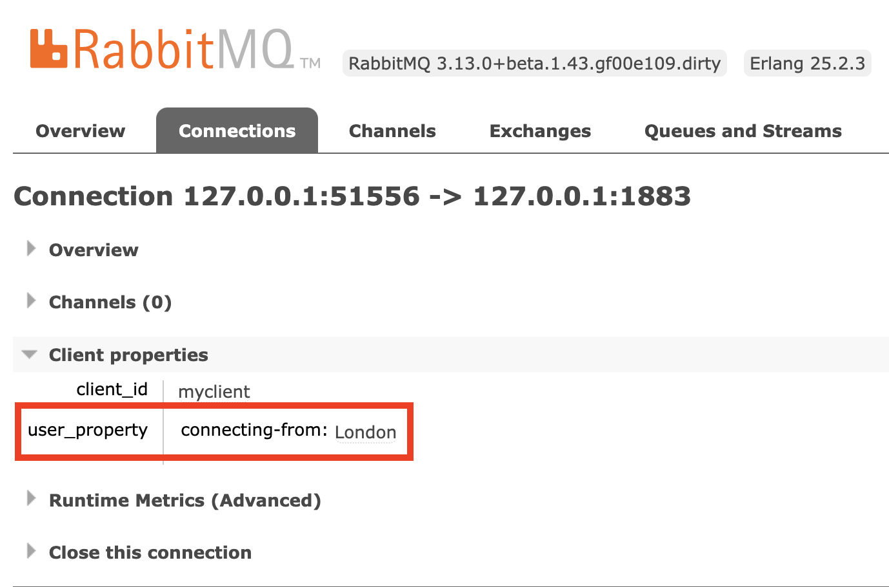

[Native MQTT](/blog/2023/03/21/native-mqtt) released in RabbitMQ 3.12 has delivered substantial scalability and performance improvements for IoT use cases.

RabbitMQ 3.13 will support [MQTT 5.0](https://docs.oasis-open.org/mqtt/mqtt/v5.0/os/mqtt-v5.0-os.html) and will therefore be the next big step in our journey to make RabbitMQ one of the leading MQTT brokers.

This blog post explains how the new MQTT 5.0 features are used in RabbitMQ.

<!-- truncate -->

## MQTT Overview

MQTT is the standard protocol for the Internet of Things (IoT).

IoT remote devices can have a poor network quality when connecting to the broker.
Therefore, MQTT is lightweight: MQTT protocol headers are small to save network bandwidth.

Since IoT devices might often disconnect and reconnect - imagine a car driving through a tunnel - MQTT is also efficient: Clients are connected and authenticated with a handshake that is shorter compared to other messaging protocols.

The MQTT protocol has been around for many years.
As shown in the following table, the latest MQTT protocol version is 5.0.

| MQTT version | Protocol version in CONNECT packet | MQTT spec release year | RabbitMQ support since year (version) |
| --- | --- | --- | --- |
| [3.1](https://public.dhe.ibm.com/software/dw/webservices/ws-mqtt/mqtt-v3r1.html) | 3 | 2010 | 2012 (3.0) |
| [3.1.1](https://docs.oasis-open.org/mqtt/mqtt/v3.1.1/os/mqtt-v3.1.1-os.html) | 4 | 2014 | 2014 (3.3) |
| [5.0](https://docs.oasis-open.org/mqtt/mqtt/v5.0/os/mqtt-v5.0-os.html) | [5](https://docs.oasis-open.org/mqtt/mqtt/v5.0/os/mqtt-v5.0-os.html#_Toc3901037) | 2019 | 2024 (3.13) |

It is worth mentioning that there is a difference between the user facing protocol version and the "internal" protocol version (also known as the protocol level).
The latter is sent from client to server in the [CONNECT](https://docs.oasis-open.org/mqtt/mqtt/v5.0/os/mqtt-v5.0-os.html#_Toc3901033) packet.
Because user facing protocol version 3.1.1 maps to internal protocol version 4, to avoid further confusion, the MQTT committee decided to skip user facing version 4.0 such that user facing version 5.0 maps to internal protocol version 5.

## MQTT 5.0 Features

[Appendix C. Summary of new features in MQTT v5.0](https://docs.oasis-open.org/mqtt/mqtt/v5.0/os/mqtt-v5.0-os.html#_Toc3901293) provides a complete list of new MQTT 5.0 features.

Since you find great MQTT 5.0 resources including illustrative diagrams and usage patterns on the web, this blog post focuses solely on RabbitMQ specifics.
This section explains the most significant features implemented in PR [#7263](https://github.com/rabbitmq/rabbitmq-server/pull/7263).
For each feature, we provide an example how it is used with RabbitMQ or outline a high level description of how it is implemented in RabbitMQ.

To run the examples by yourself, start RabbitMQ server 3.13,
for example, using [this Docker image tag](https://hub.docker.com/layers/library/rabbitmq/3.13.0-management/images/sha256-ba26f50715029bb709cbe8831cfd07a5473da00557a0720269fa69c1fb66c6d6?context=explore):

```bash
docker run -it --rm --name rabbitmq -p 1883:1883 -p 15672:15672 -p 15692:15692 rabbitmq:3.13.0-management
```

In another terminal window, enable the [MQTT plugin](/docs/mqtt):
```bash
docker exec rabbitmq rabbitmq-plugins enable rabbitmq_mqtt
```

Since the MQTT plugin got enabled dynamically, [feature flags defined by the MQTT plugin](/docs/feature-flags#rabbitmq_mqtt-feature-flags) are disabled.
Enable all feature flags including feature flag `mqtt_v5`:
```bash
docker exec rabbitmq rabbitmqctl enable_feature_flag all
```
Listing the feature flags should now show that all feature flags are enabled:
```bash
docker exec rabbitmq rabbitmqctl list_feature_flags --formatter=pretty_table
```

Below examples use [MQTTX CLI](https://mqttx.app/cli) version 1.9.4.
We use a CLI rather than a graphical UI so that you can easily run the examples by copy pasting the commands.

All new features also apply to the [RabbitMQ Web MQTT Plugin](/docs/web-mqtt).

Here is the list of MQTT 5.0 features covered in this blog post:
* [Feature 1: Message Expiry](#feature-1-message-expiry)
* [Feature 2: Subscription Identifier](#feature-2-subscription-identifier)
* [Feature 3: Subscription Options](#feature-3-subscription-options)
* [Feature 4: Reason code on all ACKs](#feature-4-reason-code-on-all-acks)
* [Feature 5: User properties](#feature-5-user-properties)
* [Feature 6: Payload Format and Content Type](#feature-6-payload-format-and-content-type)
* [Feature 7: Request / Response](#feature-7-request--response)
* [Feature 8: Assigned Client Identifier](#feature-8-assigned-client-identifier)
* [Feature 9: Topic Alias](#feature-9-topic-alias)
* [Feature 10: Flow control](#feature-10-flow-control)
* [Feature 11: Maximum Packet Size](#feature-11-maximum-packet-size)
* [Feature 12: Server initiated DISCONNECT](#feature-12-server-initiated-disconnect)
* [Feature 13: Session Expiry](#feature-13-session-expiry)
* [Feature 14: Will delay](#feature-14-will-delay)
* [Feature 15: Optional Server feature availability](#feature-15-optional-server-feature-availability)

### Feature 1: [Message Expiry](https://docs.oasis-open.org/mqtt/mqtt/v5.0/os/mqtt-v5.0-os.html#_Toc3901112)

#### Description
An expiry interval in seconds can be set for each message being published to the broker.
If the message is not consumed within that expiry interval, the message is discarded or dead lettered.
#### Example
Create a subscription for topic `t/1`.
This creates a queue in RabbitMQ.
Disconnect the client by typing `Ctrl+C` in the terminal.
Since we use a [Session Expiry Interval](https://docs.oasis-open.org/mqtt/mqtt/v5.0/os/mqtt-v5.0-os.html#_Toc3901048) of 600 seconds, this queue will exist for 10 more minutes.
```bash
mqttx sub --client-id sub-1 --topic t/1 --session-expiry-interval 600 --qos 1
…  Connecting...
✔  Connected
…  Subscribing to t/1...
✔  Subscribed to t/1
^C
```

Publish a message to the same topic with a message expiry interval of 30 seconds:
```bash
mqttx pub --topic t/1 --message m1 --message-expiry-interval 30 --qos 1
…  Connecting...
✔  Connected
…  Message publishing...
✔  Message published
```

Within the next 30 seconds, list the queues:
```bash
docker exec rabbitmq rabbitmqctl --quiet --formatter=pretty_table list_queues name type messages
┌─────────────────────────────┬─────────┬──────────┐
│ name                        │ type    │ messages │
├─────────────────────────────┼─────────┼──────────┤
│ mqtt-subscription-sub-1qos1 │ classic │ 1        │
└─────────────────────────────┴─────────┴──────────┘
```

Wait for 30 seconds, and list the queues again:
```bash
docker exec rabbitmq rabbitmqctl --quiet --formatter=pretty_table list_queues
┌─────────────────────────────┬─────────┬──────────┐
│ name                        │ type    │ messages │
├─────────────────────────────┼─────────┼──────────┤
│ mqtt-subscription-sub-1qos1 │ classic │ 0        │
└─────────────────────────────┴─────────┴──────────┘
```

The message expired since client `sub-1` has not connected to the broker to consume the message.
If a [dead lettering](/docs/dlx) policy is set up, the message will be dead lettered to an exchange.
In our case, dead lettering is disabled.
Querying the Prometheus endpoint proves that 1 message expired from a classic queue.
```bash
curl --silent localhost:15692/metrics | grep rabbitmq_global_messages_dead_lettered_expired_total
# TYPE rabbitmq_global_messages_dead_lettered_expired_total counter
# HELP rabbitmq_global_messages_dead_lettered_expired_total Total number of messages dead-lettered due to message TTL exceeded
rabbitmq_global_messages_dead_lettered_expired_total{queue_type="rabbit_classic_queue",dead_letter_strategy="at_most_once"} 0
rabbitmq_global_messages_dead_lettered_expired_total{queue_type="rabbit_classic_queue",dead_letter_strategy="disabled"} 1
rabbitmq_global_messages_dead_lettered_expired_total{queue_type="rabbit_quorum_queue",dead_letter_strategy="at_least_once"} 0
rabbitmq_global_messages_dead_lettered_expired_total{queue_type="rabbit_quorum_queue",dead_letter_strategy="at_most_once"} 0
rabbitmq_global_messages_dead_lettered_expired_total{queue_type="rabbit_quorum_queue",dead_letter_strategy="disabled"} 0
```

Another interesting feature is the following requirement:
> The PUBLISH packet sent to a Client by the Server MUST contain a Message Expiry Interval set to the received value minus the time that the Application Message has been waiting in the Server.

Send a second message to the broker with a Message Expiry Interval of 60 seconds:
```bash
mqttx pub --topic t/1 --message m2 --message-expiry-interval 60 --qos 1
```

Wait for 20 seconds before reconnecting the subscribing client:
```bash
mqttx sub --client-id sub-1 --topic t/1 --no-clean --session-expiry-interval 0  --qos 1 --output-mode clean
{
  "topic": "t/1",
  "payload": "m2",
  "packet": {
    ...
    "properties": {
      "messageExpiryInterval": 40
    }
  }
}
```
As mandated by the MQTT 5.0 protocol specification, the client receives the second message with a Message Expiry Interval set to 40 seconds:
60 seconds as received by the broker minus the 20 seconds the message has been waiting in the broker.

#### Implementation
MQTT 5.0 Message Expiry is implemented in RabbitMQ using [per-message TTL](/docs/ttl#per-message-ttl-in-publishers) similar to the `expiration` field in AMQP 0.9.1 publishers.

### Feature 2: [Subscription Identifier](https://docs.oasis-open.org/mqtt/mqtt/v5.0/os/mqtt-v5.0-os.html#_Toc3901166)

#### Description
A client can set a subscription identifier in a [SUBSCRIBE](https://docs.oasis-open.org/mqtt/mqtt/v5.0/os/mqtt-v5.0-os.html#_Toc3901161) packet.
If the client is being sent a message due to that subscription, the broker will include that subscription identifier into the [PUBLISH](https://docs.oasis-open.org/mqtt/mqtt/v5.0/os/mqtt-v5.0-os.html#_Toc3901100) packet.

Use cases for subscription identifiers are listed in section [SUBSCRIBE Actions](https://docs.oasis-open.org/mqtt/mqtt/v5.0/os/mqtt-v5.0-os.html#_Toc3901170).

#### Example
Send 3 separate SUBSCRIBE packets from the same client to the server, each with a different topic filter and different subscription identifier:
```bash
mqttx sub --client-id sub-2 --topic t/1 --subscription-identifier 1 --session-expiry-interval 600
^C
mqttx sub --client-id sub-2 --topic t/2 --subscription-identifier 2 --session-expiry-interval 600 --no-clean
^C
mqttx sub --client-id sub-2 --topic "t/#" --subscription-identifier 3 --session-expiry-interval 0 --no-clean --output-mode clean
```

In a 2nd terminal window, we see 3 bindings from the same queue to the same topic exchange, each with a different routing key:
```bash
docker exec rabbitmq rabbitmqctl --quiet --formatter=pretty_table list_bindings \
    source_name source_kind destination_name destination_kind routing_key
┌─────────────┬─────────────┬─────────────────────────────┬──────────────────┬─────────────────────────────┐
│ source_name │ source_kind │ destination_name            │ destination_kind │ routing_key                 │
├─────────────┼─────────────┼─────────────────────────────┼──────────────────┼─────────────────────────────┤
│             │ exchange    │ mqtt-subscription-sub-2qos0 │ queue            │ mqtt-subscription-sub-2qos0 │
├─────────────┼─────────────┼─────────────────────────────┼──────────────────┼─────────────────────────────┤
│ amq.topic   │ exchange    │ mqtt-subscription-sub-2qos0 │ queue            │ t.#                         │
├─────────────┼─────────────┼─────────────────────────────┼──────────────────┼─────────────────────────────┤
│ amq.topic   │ exchange    │ mqtt-subscription-sub-2qos0 │ queue            │ t.1                         │
├─────────────┼─────────────┼─────────────────────────────┼──────────────────┼─────────────────────────────┤
│ amq.topic   │ exchange    │ mqtt-subscription-sub-2qos0 │ queue            │ t.2                         │
└─────────────┴─────────────┴─────────────────────────────┴──────────────────┴─────────────────────────────┘
```
The first entry is the implicit binding to the default exchange.

Each MQTT subscription with its MQTT topic filter corresponds to one AMQP 0.9.1 binding with a binding key.
To be precise, table column `routing_key` is misnamed: It should be called `binding_key` instead.
The topic level separator in MQTT is the "`/`" character whereas the topic level separator in AMQP 0.9.1 topic exchanges is the "`.`" character.

Again in the 2nd terminal window, send a message to topic `t/1`:
```bash
mqttx pub --topic t/1 --message m1
```

The 1st terminal window (of the subscribing client) receives the following PUBLISH packet:
```bash
{
  "topic": "t/1",
  "payload": "m1",
  "packet": {
    ...
    "properties": {
      "subscriptionIdentifier": [
        1,
        3
      ]
    }
  }
}
```
It contains subscription identifiers 1 and 3 because both topic filters `t/1` and `t/#` match topic `t/1`.

Likewise, if you send a 2nd message to topic `t/2`, the subscribing client will receive a PUBLISH packet containing subscription identifiers 2 and 3.

#### Implementation
Subscription identifiers are part of the MQTT session state.
Therefore, subscription identifiers must be persisted in the server's database while the client is disconnected and until the MQTT session ends.
RabbitMQ stores the subscription identifiers in the binding arguments:
```bash
docker exec rabbitmq rabbitmqctl --quiet --formatter=pretty_table list_bindings routing_key arguments
┌─────────────────────────────┬───────────────────────────────────────────────────────────────────────────────────┐
│ routing_key                 │ arguments                                                                         │
├─────────────────────────────┼───────────────────────────────────────────────────────────────────────────────────┤
│ mqtt-subscription-sub-2qos0 │                                                                                   │
├─────────────────────────────┼───────────────────────────────────────────────────────────────────────────────────┤
│ t.#                         │ {mqtt_subscription_opts,0,false,false,0,3}{<<"x-binding-key">>,longstr,<<"t.#">>} │
├─────────────────────────────┼───────────────────────────────────────────────────────────────────────────────────┤
│ t.1                         │ {mqtt_subscription_opts,0,false,false,0,1}{<<"x-binding-key">>,longstr,<<"t.1">>} │
├─────────────────────────────┼───────────────────────────────────────────────────────────────────────────────────┤
│ t.2                         │ {mqtt_subscription_opts,0,false,false,0,2}{<<"x-binding-key">>,longstr,<<"t.2">>} │
└─────────────────────────────┴───────────────────────────────────────────────────────────────────────────────────┘
```
The exact structure of the binding arguments is not important and will likely change in a future RabbitMQ version.
However, you can see integers 1, 2, and 3 in the binding arguments which correspond to the subscription identifiers.

When the topic exchange routes a message, the publishing Erlang process will include all matched binding keys into the message.
The Erlang process of the subscribing MQTT client compares the matched binding keys with the MQTT topic filters it knows about and includes the subscription identifiers into the PUBLISH packet sent to the MQTT client.

The publishing Erlang process can be an MQTT connection process or a AMQP 0.9.1 channel process.
As always, RabbitMQ excels in cross protocol interoperability: When an AMQP 0.9.1 (or STOMP or AMQP 1.0) client sends a message to the topic exchange,
the correct subscription identifier will be included in the PUBLISH packet sent to the MQTT client.

### Feature 3: [Subscription Options](https://docs.oasis-open.org/mqtt/mqtt/v5.0/os/mqtt-v5.0-os.html#_Toc3901169)
#### Description
MQTT 5.0 comes with 3 new subscription options:
1. No Local
2. Retain as Published
3. Retain Handling

All subscription options are implemented by RabbitMQ.
Here, we focus only on the Retain Handling option:
> This option specifies whether retained messages are sent when the subscription is established.  
The values are:  
0 = Send retained messages at the time of the subscribe  
1 = Send retained messages at subscribe only if the subscription does not currently exist  
2 = Do not send retained messages at the time of the subscribe  

#### Example

Send a retained message:
```bash
mqttx pub --topic mytopic --message m --retain
```

Retain Handling value 0 will receive the retained message while value 2 will not:
```bash
mqttx sub --topic mytopic --retain-handling 0
…  Connecting...
✔  Connected
…  Subscribing to mytopic...
✔  Subscribed to mytopic
payload: m
retain: true
^C

mqttx sub --topic mytopic --retain-handling 2
…  Connecting...
✔  Connected
…  Subscribing to mytopic...
✔  Subscribed to mytopic
```

### Feature 4: Reason code on all ACKs

#### Description
Packets CONNACK, PUBACK, SUBACK, UNSUBACK, and DISCONNECT contain a reason code.

#### Implementation
One implementation example is that RabbitMQ will reply with a reason code `No matching subscribers` in the PUBACK packet if the message is not routed to any queues.
MQTT 5.0 reason code `No matching subscribers` corresponds conceptually to the [mandatory](/docs/publishers#unroutable) message property and `BasicReturn` handler in AMQP 0.9.1.

### Feature 5: User properties

#### Description
Most MQTT packets can contain user properties.
The meaning of user properties is not defined by the MQTT specification.

#### Example PUBLISH packet
User properties in the PUBLISH packet are defined by client applications and forwarded unaltered by the server.

Subscribe in the 1st terminal window:
```bash
mqttx sub --topic t/5
```

Publish a message with user properties in the 2nd terminal window:
```bash
mqttx pub --topic t/5 --message m --user-properties "key1: value1"
```

The 1st terminal window will receive the user properties unaltered:
```bash
payload: m
userProperties: [ { key: 'key1', value: 'value1' } ]
```

User properties in an MQTT 5.0 PUBLISH packet are similar to the `headers` message property in AMQP 0.9.1.

#### Example CONNECT packet

Connect with a user property:
```bash
mqttx conn --client-id myclient --user-properties "connecting-from: London"
```

Open the Management UI [http://localhost:15672/#/connections](http://localhost:15672/#/connections) in your browser (both username and password is `guest`) and click on the MQTT connection:



RabbitMQ will display the user property from the CONNECT packet in the Management UI.

### Feature 6: [Payload Format](https://docs.oasis-open.org/mqtt/mqtt/v5.0/os/mqtt-v5.0-os.html#_Toc3901111) and [Content Type](https://docs.oasis-open.org/mqtt/mqtt/v5.0/os/mqtt-v5.0-os.html#_Toc3901118)

#### Description
The publisher can specify a MIME content type.
It can also set a payload format indicator indicating whether the payload consists of UTF-8 encoded character data or unspecified binary data.

#### Example

In the 1st terminal window, subscribe to a topic:
```bash
mqttx sub --topic t/6 --output-mode clean
```

In the 2nd terminal window, send a message with a content type and payload format indicator:
```bash
mqttx pub --topic t/6 --message "my UTF-8 encoded data 🙂" --content-type text/plain --payload-format-indicator
```

The 1st terminal window will receive the content type and payload format indicator unaltered:
```bash
{
  "topic": "t/6",
  "payload": "my UTF-8 encoded data 🙂",
  "packet": {
    ...
    "properties": {
      "payloadFormatIndicator": true,
      "contentType": "text/plain"
    }
  }
}
```


### Feature 7: [Request / Response](https://docs.oasis-open.org/mqtt/mqtt/v5.0/os/mqtt-v5.0-os.html#_Toc3901253)

#### Description
MQTT 5.0 formalizes the Request / Response pattern.

Before publishing a message, an MQTT client (the requester) subscribes to a response topic.
The requester includes the response topic and some correlation data into the request message.

Another MQTT client (the responder) receives the request message, takes some action, and publishes a response message with the same correlation data to the response topic.

The MQTT 5.0 Request / Response feature corresponds to [Remote Procedure Calls in AMQP 0.9.1](/tutorials/tutorial-six-go).
However, in AMQP 0.9.1 the requester will include the name of a callback queue in the AMQP 0.9.1 message property `reply_to`.
The MQTT protocol does not define the concept of queues. Therefore, in MQTT the "address" being replied to is a topic name.

Despite the incompatibilities between the protocol specifications, RabbitMQ shines at protocol interoperability:
Request / Response interactions are therefore supported by RabbitMQ across protocols.

For example an MQTT client can include a response topic and correlation data in the request message.
If an AMQP 0.9.1 client created a queue bound to the topic exchange `amq.topic` with a binding key matching the topic of the request message, it will receive an AMQP 0.9.1 message with property `correlation_id` set to the
correlation data sent by the MQTT client and a header called `x-opt-reply-to-topic`.
The AMQP 0.9.1 client can then respond to the MQTT 5.0 client by using the same `correlation_id` and publishing the response message to the topic exchange `amq.topic` with the topic that was present in the `x-opt-reply-to-topic` header.

#### Example

This example focuses solely on MQTT clients.

In the 1st terminal window, the responding MQTT client subscribes to topic `t/7`;

```bash
mqttx sub --client-id responder --topic t/7 --session-expiry-interval 600 --output-mode clean --qos 1
```

In the 2nd terminal window, the requesting MQTT client subscribes to a topic called `my/response/topic`:
```bash
mqttx sub --client-id requester --topic my/response/topic --session-expiry-interval 600 --qos 1
…  Connecting...
✔  Connected
…  Subscribing to my/response/topic...
✔  Subscribed to my/response/topic
^C
```

In the 2nd terminal window, the requester then publishes a request message:
```bash
mqttx pub --client-id requester --topic t/7 --message "my request" \
    --correlation-data abc-123 --response-topic my/response/topic \
    --session-expiry-interval 600 --no-clean
```

In the 1st terminal window, the responder receives the request message:
```bash
{
  "topic": "t/7",
  "payload": "my request",
  "packet": {
    ...
    "properties": {
      "responseTopic": "my/response/topic",
      "correlationData": {
        "type": "Buffer",
        "data": [
          97,
          98,
          99,
          45,
          49,
          50,
          51
        ]
      }
    }
  }
}
^C
```

In the 1st terminal window, the responder responds to the requester by copying the correlation data and publishing to the response topic:
```bash
mqttx pub --client-id responder --topic my/response/topic --message "my response" --correlation-data abc-123
```

In the 2nd terminal window, the requester receives the response.
```bash
mqttx sub --client-id requester --topic my/response/topic --no-clean --qos 1 --output-mode clean
{
  "topic": "my/response/topic",
  "payload": "my response",
  "packet": {
    ...
    "properties": {
      "correlationData": {
        "type": "Buffer",
        "data": [
          97,
          98,
          99,
          45,
          49,
          50,
          51
        ]
      }
    }
  }
}
```
The correlation data is useful to correlate the response to the request.
The requester usually picks unique correlation data per request it publishes.

### Feature 8: [Assigned Client Identifier](https://docs.oasis-open.org/mqtt/mqtt/v5.0/os/mqtt-v5.0-os.html#_Toc3901087)

#### Description

> If the Client connects using a zero length Client Identifier, the Server MUST respond with a CONNACK containing an Assigned Client Identifier.

Compared to MQTT 3.1.1 this lifts the restriction that server assigned client IDs can only be used with `Clean Session = 1` connections.

#### Implementation

RabbitMQ will generate some random client ID (for example `dcGB2kSwS0JlXnaBa1A6QA`) and return it in the CONNACK packet.

### Feature 9: [Topic Alias](https://docs.oasis-open.org/mqtt/mqtt/v5.0/os/mqtt-v5.0-os.html#_Toc3901113)

#### Description

> A Topic Alias is an integer value that is used to identify the Topic instead of using the Topic Name.
This reduces the size of the PUBLISH packet, and is useful when the Topic Names are long and the same Topic Names are used repetitively within a Network Connection.

#### Implementation

The default [Topic Alias Maximum](https://docs.oasis-open.org/mqtt/mqtt/v5.0/os/mqtt-v5.0-os.html#_Toc3901088) in RabbitMQ is 16.
You can configure this value in `rabbitmq.conf`, for example:
```ini
mqtt.topic_alias_maximum = 32
```
This configured value maps to the Topic Alias Maximum in the CONNACK packet sent from RabbitMQ to the client.
It limits the number of topic aliases in either direction, that is from client to RabbitMQ and RabbitMQ to client.
Setting a higher value will require more memory usage in RabbitMQ if clients send to or receive from many different topics.

A RabbitMQ operator can disallow the usage of Topic Aliases by setting:
```ini
mqtt.topic_alias_maximum = 0
```

### Feature 10: [Flow control](https://docs.oasis-open.org/mqtt/mqtt/v5.0/os/mqtt-v5.0-os.html#_Toc3901251)

#### Description

The MQTT 5.0 property Receive Maximum defines an upper limit of unacknowledged QoS 1 PUBLISH packets.

#### Implementation

The maximum number of unacknowledged QoS 1 PUBLISH packets sent from RabbitMQ to the client is determined by the minimum value of
the Receive Maximum sent from client to RabbitMQ in the CONNECT packet and the configured `mqtt.prefetch` value:
```ini
mqtt.prefetch = 10
```
The default value of `mqtt.prefetch` is 10.

The `mqtt.prefetch` value has already existed before RabbitMQ 3.13 for MQTT 3.1 and 3.1.1.
It maps to [consumer prefetch](/docs/consumer-prefetch) in RabbitMQ.
In other words, it defines how many in-flight messages the queue sends to its MQTT connection process.

### Feature 11: Maximum Packet Size

#### Description

Client and server can independently specify the maximum packet size they support.

#### Example

This example demonstrates how to limit the maximum MQTT packet size sent from a client to RabbitMQ.

Let's assume that after successful authentication a RabbitMQ operator does not want RabbitMQ to accept any MQTT packets larger than 1 KiB.
Write the following configuration to [rabbitmq.conf](/docs/configure#config-file) (in your current working directory):
```ini
mqtt.max_packet_size_authenticated = 1024
```
After stopping RabbitMQ server, start RabbitMQ server with the new configuration being applied:
```bash
docker run -it --rm --name rabbitmq -p 1883:1883 -p 15672:15672 -p 15692:15692 \
    --mount type=bind,source="$(pwd)"/rabbitmq.conf,target=/etc/rabbitmq/conf.d/11-blog-post.conf \
    rabbitmq:3.13.0-beta.2-management
docker exec rabbitmq rabbitmq-plugins enable rabbitmq_mqtt
docker exec rabbitmq rabbitmqctl enable_feature_flag all
```

In the 1st terminal window, subscribe to a topic:
```bash
mqttx sub --topic t/11
```

In the 2nd terminal window, send a message with a payload of 3 bytes to that topic:
```bash
payload=$(head --bytes 3 < /dev/zero | tr '\0' x)
mqttx pub --topic t/11 -m "$payload"
```

The first line reads 3 bytes (3 null characters) from the special file `/dev/zero`, translates each null character to ASCII character `x` and saves the result `xxx` in the variable `payload`.

The 1st terminal window will receive that message:
```bash
payload: xxx
```

Next, in the 2nd terminal window, send a message with a payload of 2,000 bytes:
```bash
payload=$(head --bytes 2000 < /dev/zero | tr '\0' x)
mqttx pub --topic t/11 -m "$payload"
```

This time, the 1st terminal window does not receive the message because the PUBLISH packet sent from client to RabbitMQ is larger than the configured maximum packet size of 1024 bytes.

Instead, RabbitMQ logs a descriptive error message:
```
[error] <0.836.0> MQTT packet size (2007 bytes, type 3) exceeds mqtt.max_packet_size_authenticated (1024 bytes)
```
The log message states 2,007 bytes because 7 bytes are needed for the fixed and variable headers of the PUBLISH packet (out of which 4 bytes are needed for the topic name `t/11`).

### Feature 12: Server initiated [DISCONNECT](https://docs.oasis-open.org/mqtt/mqtt/v5.0/os/mqtt-v5.0-os.html#_Toc3901205)

#### Description
In MQTT 5.0, the DISCONNECT packet can not only be sent from client to server, but also from server to client.

#### Implementation
Prior to terminating the connection, RabbitMQ will send a DISCONNECT packet to the client in the following situations:

| DISCONNECT Reason Code Name | Situation |
| --- | --- |
| Session taken over | Another client connected with the same client ID. |
| Server shutting down | RabbitMQ enters [maintenance mode](/docs/upgrade#maintenance-mode). |
| Keep Alive timeout | The Client fails to communicate within the [Keep Alive](https://docs.oasis-open.org/mqtt/mqtt/v5.0/os/mqtt-v5.0-os.html#_Toc3901045) time. |
| Packet too large | RabbitMQ receives a packet whose size exceeds `mqtt.max_packet_size_authenticated` |

### Feature 13: [Session Expiry](https://docs.oasis-open.org/mqtt/mqtt/v5.0/os/mqtt-v5.0-os.html#_Toc3901048)

#### Description

In MQTT 5.0, the client can suggest a Session Expiry Interval to the server in the CONNECT packet.
The server can accept the proposed Session Expiry Interval or mandate a different one in the CONNACK packet.

> The session can continue across a sequence of Network Connections. It lasts as long as the latest Network Connection plus the Session Expiry Interval.

When the Session Expiry Interval expires, both client and server will delete any session state.

#### Implementation

Client and server keep session state for as long as the session lasts.

Session state in the server includes messages that have been sent to the client but not yet acknowledged, messages that are pending to be sent to the client, and a client's subscriptions.
RabbitMQ models this MQTT session state in the form of queues and bindings.

Therefore, Session Expiry Interval maps to [queue TTL](/docs/ttl#queue-ttl) in RabbitMQ.
When an MQTT session expires, the queue and therefore its messages and bindings will be deleted.

#### Example
By default the maximum session expiry interval allowed by the server is 1 day.
If an MQTT client does not reconnect within 1 day, its session state will be deleted in RabbitMQ.

This value is configurable.
For the purpose of this example, let's set a very low Session Expiry Interval of 1 minute in `rabbitmq.conf`:
```ini
mqtt.max_session_expiry_interval_seconds = 60
```
The setting name contains the prefix `max` because an MQTT 5.0 client can choose a lower value by sending a Session Expiry Interval in the CONNECT packet.
As done in the [example of Maximum Packet Size](#example-5) restart the RabbitMQ node such that the new setting gets applied.

Connect to RabbitMQ with a Session Expiry Interval of 20 seconds and create a subscription:
```bash
mqttx sub --client-id sub-13 --topic t/13 --session-expiry-interval 20 --qos 1
…  Connecting...
✔  Connected
…  Subscribing to t/13...
✔  Subscribed to t/13
^C
```
Type `Ctrl+C` into the terminal to disconnect the client.

Within the next 20 seconds, list queues and bindings:
```bash
docker exec rabbitmq rabbitmqctl list_queues name
Timeout: 60.0 seconds ...
Listing queues for vhost / ...
name
mqtt-subscription-sub-13qos1

docker exec rabbitmq rabbitmqctl list_bindings source_name destination_name routing_key --formatter=pretty_table
Listing bindings for vhost /...
┌─────────────┬──────────────────────────────┬──────────────────────────────┐
│ source_name │ destination_name             │ routing_key                  │
├─────────────┼──────────────────────────────┼──────────────────────────────┤
│             │ mqtt-subscription-sub-13qos1 │ mqtt-subscription-sub-13qos1 │
├─────────────┼──────────────────────────────┼──────────────────────────────┤
│ amq.topic   │ mqtt-subscription-sub-13qos1 │ t.13                         │
└─────────────┴──────────────────────────────┴──────────────────────────────┘
```

After 20 seconds, list queues and bindings again:
```bash
docker exec rabbitmq rabbitmqctl list_queues name
Timeout: 60.0 seconds ...
Listing queues for vhost / ...

docker exec rabbitmq rabbitmqctl list_bindings source_name destination_name routing_key --formatter=pretty_table
Listing bindings for vhost /...
```
The queue and its bindings were deleted by RabbitMQ because our client did not connect to RabbitMQ with `Clean Session = 0` within the Session Expiry Interval of 20 seconds.

Next, do the same test, but with a high Session Expiry Interval, e.g. 1 hour:
```bash
mqttx sub --client-id sub-13 --topic t/13 --session-expiry-interval 3600 --qos 1
…  Connecting...
✔  Connected
…  Subscribing to t/13...
✔  Subscribed to t/13
^C
```
You should observe that the queue and its bindings will be deleted after 1 minute because the effective Session Expiry Interval
is the minimum of what the client requested (1 hour) and the value of `mqtt.max_session_expiry_interval_seconds` configured in RabbitMQ (1 minute).

### Feature 14: [Will delay](https://docs.oasis-open.org/mqtt/mqtt/v5.0/os/mqtt-v5.0-os.html#_Toc3901062)

#### Description

The client can define a Will Delay Interval in the CONNECT packet.

> The Server delays publishing the Client’s Will Message until the Will Delay Interval has passed or the Session ends, whichever happens first.
If a new Network Connection to this Session is made before the Will Delay Interval has passed, the Server MUST NOT send the Will Message.
One use of this is to avoid publishing Will Messages if there is a temporary network disconnection and the Client succeeds in reconnecting and continuing its Session before the Will Message is published.

Another use case of Will Delay Interval is to notify about session expiry:
> The Client can arrange for the Will Message to notify that Session Expiry has occurred by setting the Will Delay Interval to be longer than the Session Expiry Interval and sending DISCONNECT with Reason Code 0x04 (Disconnect with Will Message).

#### Implementation

Although the will message payload is usually small, the MQTT specification allows a will message payload size of up to 64 KiB.

To avoid storing large binary data in [Khepri](//rabbitmq.github.io/khepri/) (RabbitMQ's future meta data store), RabbitMQ creates a classic queue containing this single will message.
We call this queue the Will queue.
This message has a [per-message TTL](/docs/ttl#per-message-ttl-in-publishers) set which is defined in milliseconds and corresponds to the Will Delay Interval in seconds.
Additionally, the Will queue has a [queue TTL](/docs/ttl#queue-ttl) set which is defined in milliseconds and corresponds to the Session Expiry Interval in seconds.
The effective per-message TTL is at least a few milliseconds lower than the queue TTL such that the message will be published shortly before the queue (session) expires.

The Will queue also defines `amq.topic` (the default topic exchange used by the MQTT plugin) to be the [dead letter exchange](/docs/dlx) and the [will topic](https://docs.oasis-open.org/mqtt/mqtt/v5.0/os/mqtt-v5.0-os.html#_Toc3901069)
to be the [dead letter routing key](/docs/dlx#routing).

If the MQTT client does not reconnect within its Will Delay Interval, the message in the Will queue will be dead lettered to the topic exchange.

Let's illustrate this with an example.

#### Example

In the 1st terminal window, create a subscription that will consume the will message:
```bash
mqttx sub --client-id sub-14 --topic t/14
```

In the 2nd terminal window, create a connection with a Will Delay Interval of 20 seconds:
```bash
mqttx conn --client-id conn-14 --will-topic t/14 --will-message my-will-message --will-delay-interval 20 --session-expiry-interval 40
```

In the 3rd terminal window, we see that so far a single queue got created by the subscribing MQTT client:
```bash
docker exec rabbitmq rabbitmqctl --quiet --formatter=pretty_table list_queues name type messages arguments
┌──────────────────────────────┬────────────┬──────────┬───────────┐
│ name                         │ type       │ messages │ arguments │
├──────────────────────────────┼────────────┼──────────┼───────────┤
│ mqtt-subscription-sub-14qos0 │ MQTT QoS 0 │ 0        │           │
└──────────────────────────────┴────────────┴──────────┴───────────┘
```

In the 2nd terminal window, type `Ctrl+C` to disconnect the MQTT connection with client ID `conn-14`.

This time, listing the queues shows that the Will queue got created:
```bash
docker exec rabbitmq rabbitmqctl --quiet --formatter=pretty_table list_queues name type messages arguments
┌──────────────────────────────┬────────────┬──────────┬────────────────────────────────────────────────────────────┐
│ name                         │ type       │ messages │ arguments                                                  │
├──────────────────────────────┼────────────┼──────────┼────────────────────────────────────────────────────────────┤
│ mqtt-subscription-sub-14qos0 │ MQTT QoS 0 │ 0        │                                                            │
├──────────────────────────────┼────────────┼──────────┼────────────────────────────────────────────────────────────┤
│ mqtt-will-conn-14            │ classic    │ 1        │ {<<"x-expires">>,long,40000}                               │
│                              │            │          │ {<<"x-dead-letter-exchange">>,longstr,<<"amq.topic">>}     │
│                              │            │          │ {<<"x-dead-letter-routing-key">>,longstr,<<"t.14">>}       │
└──────────────────────────────┴────────────┴──────────┴────────────────────────────────────────────────────────────┘
```

The Will queue has the naming pattern `mqtt-will-<MQTT Client ID>`.
It contains a single message: the will message.

As explained in the previous section, the queue TTL (`x-expires`) is 40,000 ms and therefore matches the 40 seconds Session Expiry Interval from our command above.
If you wait for 20 seconds, your 1st terminal window should receive the will message because our client did not reconnect within the Will Delay Interval:
```bash
› payload: my-will-message
```

### Feature 15: Optional Server feature availability

#### Description

> Define a set of features which the Server does not allow and provide a mechanism for the Server to specify this to the Client.
The features which can be specified in this way are:
* Maximum QoS
* Retain Available
* Wildcard Subscription Available
* Subscription Identifier Available
* Shared Subscription Available

> It is an error for the Client to use features that the Server has declared are not available.

#### Implementation

RabbitMQ 3.13 includes [Maximum QoS](https://docs.oasis-open.org/mqtt/mqtt/v5.0/os/mqtt-v5.0-os.html#_Toc3901084) = 1 and [Shared Subscription Available](https://docs.oasis-open.org/mqtt/mqtt/v5.0/os/mqtt-v5.0-os.html#_Toc3901093) = 0 in the [CONNACK properties](https://docs.oasis-open.org/mqtt/mqtt/v5.0/os/mqtt-v5.0-os.html#_Toc3901080).

[QoS 2](https://docs.oasis-open.org/mqtt/mqtt/v5.0/os/mqtt-v5.0-os.html#_Toc3901237) has not been supported by RabbitMQ.

As described in the next section, [shared subscriptions](https://docs.oasis-open.org/mqtt/mqtt/v5.0/os/mqtt-v5.0-os.html#_Toc3901250) will be supported in a future RabbitMQ release.

## Limitations

This section lists limitations of the RabbitMQ MQTT implementation.

### MQTT 5.0 specific limitations

#### Shared Subscriptions
[Shared subscriptions](https://docs.oasis-open.org/mqtt/mqtt/v5.0/os/mqtt-v5.0-os.html#_Toc3901250) will be added in a future RabbitMQ release.
Although this feature maps nicely to a queue in RabbitMQ, shared subscriptions are part of the session state and some RabbitMQ database migrations are necessary to efficiently query shared subscriptions for a given MQTT client ID.

#### Delayed and retained Will Message
A Will Message that is both [delayed](https://docs.oasis-open.org/mqtt/mqtt/v5.0/os/mqtt-v5.0-os.html#_Toc3901062) and [retained](https://docs.oasis-open.org/mqtt/mqtt/v5.0/os/mqtt-v5.0-os.html#_Toc3901042) will not be retained.
This is because the delayed will message will be dead lettered to the topic exchange, but the retainer process does currently not consume from a queue.
This limitation can be resolved in the future with a new store for retained messages.

### Non-MQTT 5.0 specific limitations

For completeness, this section lists limitations that have existed before supporting MQTT 5.0 in RabbitMQ 3.13 and before Native MQTT shipped in RabbitMQ 3.12.

#### Retained messages
The feature of retained messages is [limited](/docs/mqtt#retained) in RabbitMQ.

Retained messages are stored and queried only node local.

An example that works is the following:
An MQTT Client publishes a retained message to node A with topic `topic/1`. Thereafter another client subscribes with topic filter `topic/1` on node A. The new subscriber will receive the retained message.

However, if the topic filter contains wildcards (the multi-level wildcard character "`#`" or the single-level wildcard character "`+`"), no retained messages are sent (issue [#8824](https://github.com/rabbitmq/rabbitmq-server/issues/8824)).

Furthermore, if a client publishes a retained message on node A and another client subsequently subscribes on node B, that subscribing client will not receive any retained message stored on node A (issue [#8096](https://github.com/rabbitmq/rabbitmq-server/issues/8096)).

A future RabbitMQ release will replicate retained messages in the cluster and also send retained messages matching topic filters containing wildcards.

## Wrapping Up

To sum up, RabbitMQ
* is the leading AMQP 0.9.1 broker
* is a [streaming](/docs/streams) broker
* excels in cross-protocol interoperability
* is becoming one of the leading MQTT brokers thanks to support for MQTT 5.0 released in 3.13 and [Native MQTT](/blog/2023/03/21/native-mqtt) released in 3.12

Our journey to turn RabbitMQ into a full-fledged IoT broker is not yet finished and more development efforts are planned to be done in the upcoming months and years.
Stay tuned!
