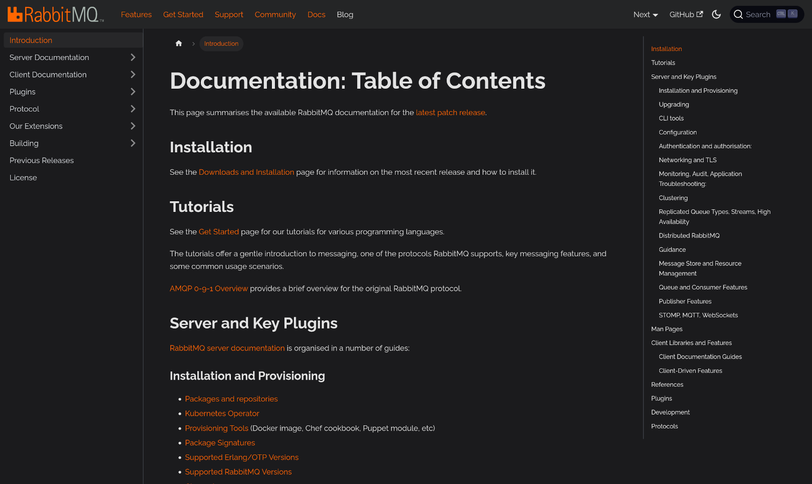

import ThemedImage from '@theme/ThemedImage';
import useBaseUrl from '@docusaurus/useBaseUrl';

We have been working for several weeks on a new website for RabbitMQ. We plan
to release this significant upgrade shortly after RabbitMQ 3.13.0 is released!
At this point, we would love **you to [visit the new
website](/)** and tell us what you think :-)

In this blog post, I will go over the reasons we are doing this and what
improvements it will bring to you.

<figure>

<figcaption>Screenshot of the new homepage</figcaption>
</figure>

<!-- truncate -->

## Limitations of the current website

### Only the latest RabbitMQ version is documented

As of this writing, the www.rabbitmq.com website contains the documentation of
the RabbitMQ server, some AMQP clients and it offers tutorials to get started
with RabbitMQ.

The documentation covers the latest version of RabbitMQ only ‑ currently
3.12.x. That was ok-ish so far because new releases series usually come with
new additions. However, with the upcoming RabbitMQ 4.0.x, significant
deprecated features will be removed! If we continue like this, it means the
documentation for these dropped features will go away. This is a real problem
for people who will still be running RabbitMQ 3.12.x for some time.

This is the first and main reason we want to upgrade the website: we want the
documentation to cover many versions of RabbitMQ: old, current and upcoming.

We could take a snapshot of the website and publish it somewhere else, like
[previous.rabbitmq.com](https://previous.rabbitmq.com) in the past. But the Git
repository/workflow and the home-grown framework don't make this easy, that's
why we stopped keeping snapshots of older versions. We would make a better job
if the workflow and the tooling had room for maintaining several versions
easily and all of them would be published to www.rabbitmq.com in a way that it
is easy for users to switch to whatever version they are running.

This brings me to the second reason behind the big upgrade.

### In-house framework

The website is statically generated and published to a Cloudflare worker. The
static generator we used was developed by the RabbitMQ team a decade ago and
barely evolved ever since.

Making or maintaining a website framework is definitely not the best way to
invest our time. There is still plenty of work on RabbitMQ itself :-) So
instead of adding multiple versions support to it, we looked at existing FOSS
static website generators that had this feature built-in and evaluated a few of
them.

We chose [Docusaurus](https://docusaurus.io/). It supports multiple versions ‑
our primary criteria ‑ and it uses Markdown as the markup language, thus we
don't have to rewrite anything. This would make the conversion easier.

## “What's in it for me?”

With Docusaurus, we, the RabbitMQ team, make our life easier, yay \o/ But “are
there any benefits for you”, you may ask?

### Multiple versions documented

Of course, you will be able to read documentation of past and new versions of
RabbitMQ, even the future one while it is being worked on.

<figure>

<figcaption>Screenshot of the version selection drop-down menu</figcaption>
</figure>

Initially, it will only cover RabbitMQ 3.13.x because we didn't convert
previous versions to Docusaurus. A snapshot of RabbitMQ 3.12.x documentation
will be published on previous.rabbitmq.com instead.

We plan to keep all supported RabbitMQ versions docs on the new website. When
an old release series reaches end-of-life, its documentation will also move to
previous.rabbitmq.com. This is to avoid that the version dropdown becomes too
cluttered or that the search feature brings too many results which are less
relevant.

Speaking of search...

### Integrated search feature

Docusaurus integrates several solutions to provide an internal search feature.
We picked Algolia because it is very efficient and works well with multiple
versions.

<figure>

<figcaption>Screenshot of the search popup</figcaption>
</figure>

The entire website, including the blog, will be indexed and searchable. In the
example above, I searched "MQTT" and Algolia returns blog posts and
documentation pages in the results.

What is not obvious on the screenshot however is that it only returned docs
from the current version I'm browsing! So if I selected an hypothetical
RabbitMQ 5.2.x in the dropdown version menu, I would only get results relevant
to that version.

### Integrated blog

As mentionned above, Docusaurus provides a blog. We will switch to it and stop
using blog.rabbitmq.com. This way, all RabbitMQ-related content will be in a
single place:
* It will be easier for you to browse and move between blog posts and docs.
* As said, the internal search will consider both docs and blog posts.
* For content writers, it will be easier to cross-reference between blog posts
  and docs.

### Mobile version and dark mode

Docusaurus being *slightly* more modern than our in-house framework, the new
website should be browsable comfortably on a small screen and on mobile
devices.

It also comes with a dark mode!

<figure>

<figcaption>Screenshot of the dark mode</figcaption>
</figure>

## Conclusion

We are very excited with this move to Docusaurus and everything that the new
website will bring to you! Beside the conversion to a new framework, we also
plan many improvements to the content itself! Things like... No, let's talk
about this in a future blog post on the new website once we have something to
show :-)

Meanwhile, we would love your feedback! We know there are some rough edges
after the conversion, some parts we couldn't map easily to Docusaurus
alternatives. So, do you find the new website comfortable? Anything you lose
that you love on the old one?

Here are a couple links to help you with this:
* [The new website](/)
* [The pull request to share comments and feedback](https://github.com/rabbitmq/rabbitmq-website/pull/1783)

Thank you so much for any constructive positive or negative comments you might
share!
